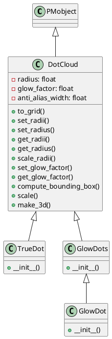
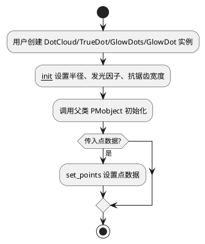
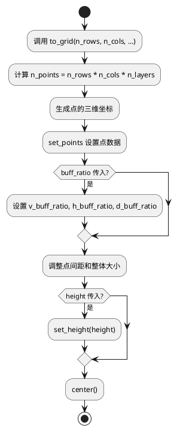

## 关键类说明
2. DotCloud
   - 继承自：PMobject
   - 作用：用于表示一组点（点云），每个点有自己的半径、颜色、透明度等属性。支持点的网格排列、半径调整、发光效果等。
     - 主要属性：
       - shader_folder：着色器文件夹名
       - render_primitive：渲染类型（OpenGL POINTS）
       - data_dtype：点数据结构（位置、半径、颜色）
       - radius：点的半径
       - glow_factor：发光因子
       - anti_alias_width：抗锯齿宽度
     - 主要方法：
       - ：初始化点云
       - to_grid：将点排列为网格
       - set_radii/set_radius/get_radii/get_radius/scale_radii：设置/获取/缩放点半径
       - set_glow_factor/get_glow_factor：设置/获取发光因子
       - compute_bounding_box：计算包围盒
       - scale：缩放点云
       - make_3d：设置3D效果
2. TrueDot
   - 继承自：DotCloud
   - 作用：单个点的特殊实现，默认在原点。
   - 主要方法： ：只包含一个点，位置可指定
3. GlowDots
   - 继承自：DotCloud
   - 作用：一组发光点，默认颜色为黄色，半径和发光因子更大。
   - 主要方法： ：初始化发光点云
4. GlowDot
   - 继承自：GlowDots
   - 作用：单个发光点，默认在原点。
   - 主要方法：只包含一个发光点

## 关键流程详细说明
1. 点云的创建与初始化
   用户创建 DotCloud 或其子类实例时，传入点的位置、颜色、半径等参数。
   构造函数会设置半径、发光因子、抗锯齿宽度，并调用父类初始化。
   如果传入了点的位置，则设置点数据。
2. 点云排列为网格
   调用 to_grid 方法，指定行、列、层数等参数。
   计算每个点的三维坐标，设置点数据。
   根据半径和缓冲比例调整点间距和整体大小。
   可设置整体高度并居中。
3. 点半径与发光因子的调整
   通过 set_radius、set_radii、scale_radii 等方法调整所有点或单个点的半径。
   通过 set_glow_factor 方法调整发光效果。
4. 渲染相关
   init_uniforms 方法设置着色器参数（如发光因子、抗锯齿宽度）。
   compute_bounding_box 计算点云的包围盒，考虑半径扩展。

1. 点云创建与初始化流程

2. 点云排列为网格流程

