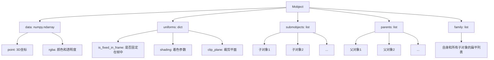
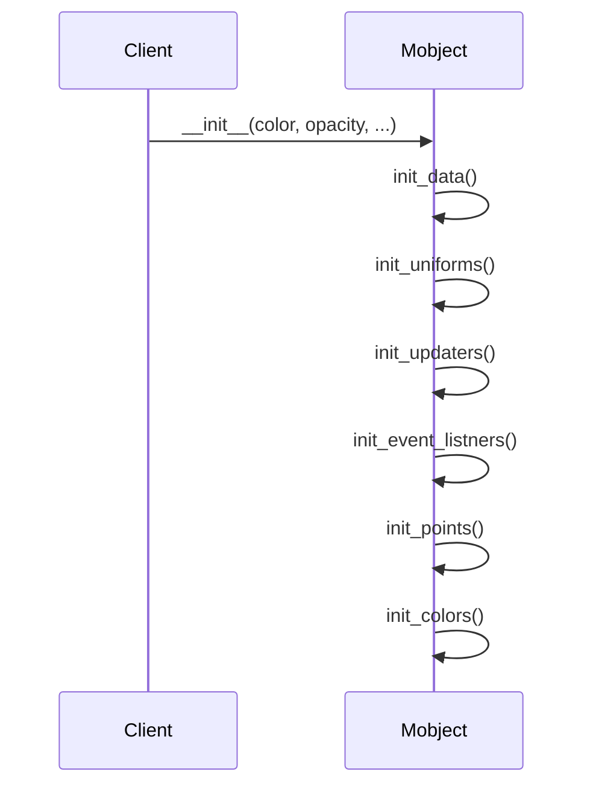
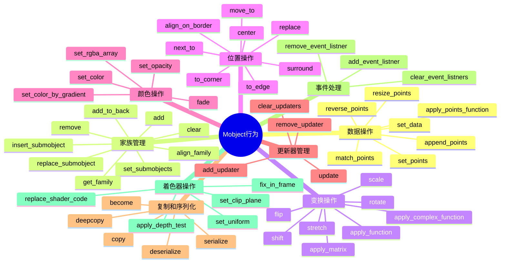
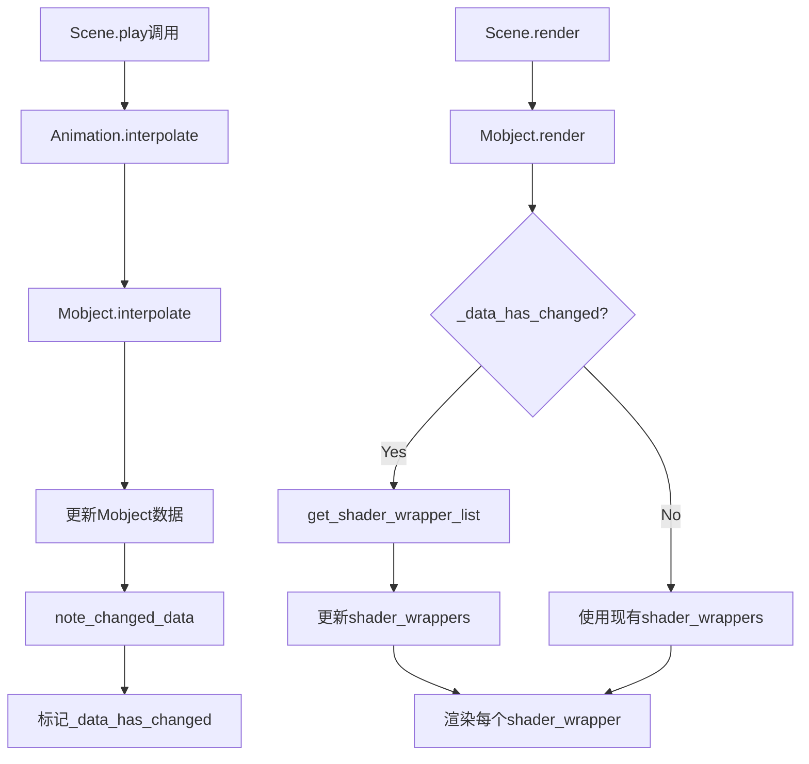
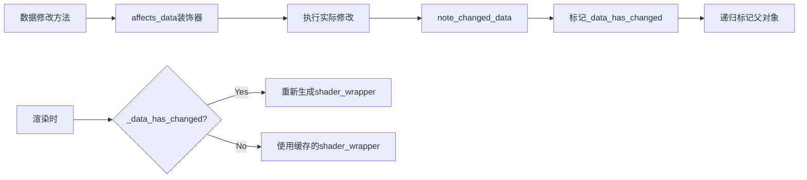
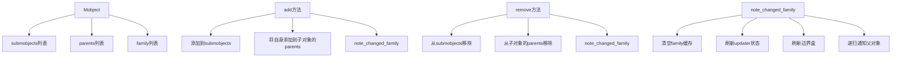
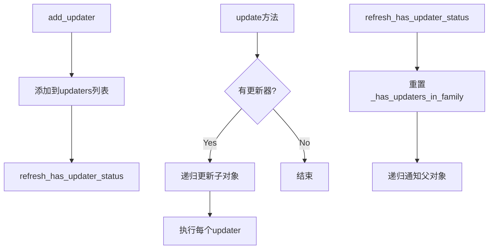
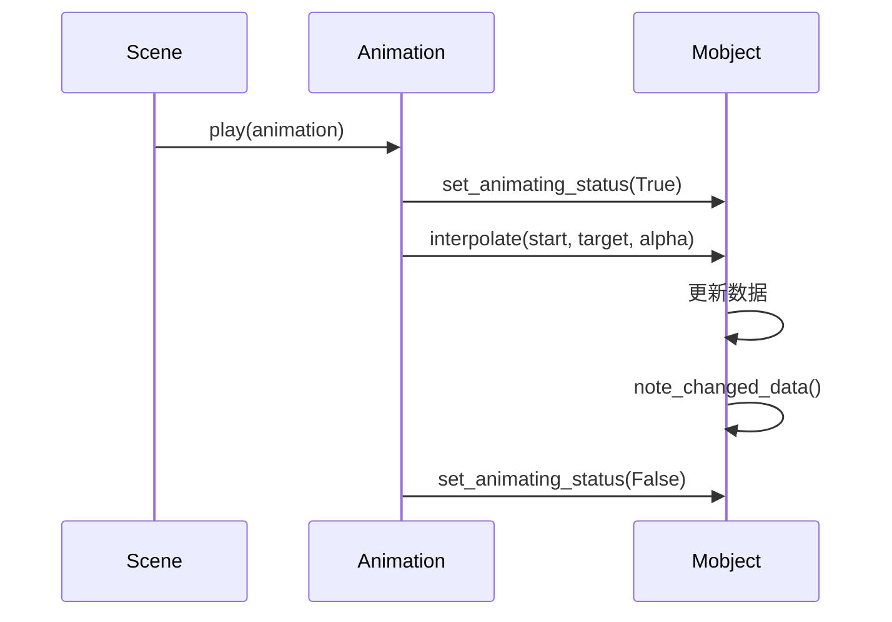
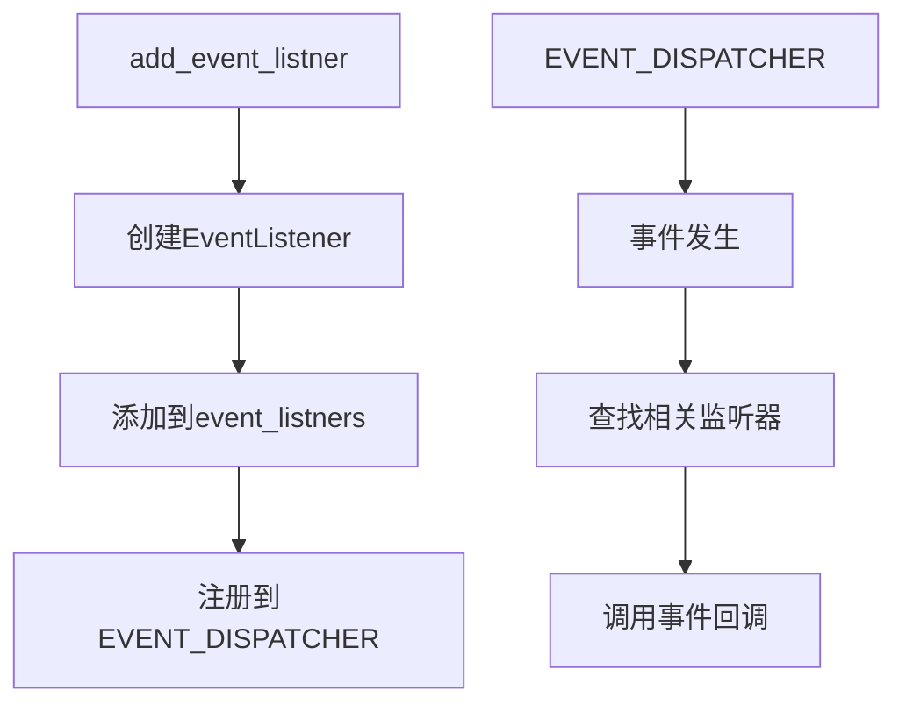

# Mobject 源码深度解析

本文档对 Manim 中的核心类 `Mobject` 进行深度解析，包括其关键属性、关键行为、核心源代码的逻辑架构、运行架构和数据架构。

## 关键属性

```
    class Mobject {
        +dim: int
        +shader_folder: str
        +render_primitive: int
        +data_dtype: np.dtype
        +aligned_data_keys: list
        +pointlike_data_keys: list
        +color: ManimColor
        +opacity: float
        +shading: Tuple[float, float, float]
        +texture_paths: dict
        +depth_test: bool
        +z_index: int
        +submobjects: list[Mobject]
        +parents: list[Mobject]
        +family: list[Mobject]
        +locked_data_keys: set[str]
        +const_data_keys: set[str]
        +locked_uniform_keys: set[str]
        +saved_state: Mobject
        +target: Mobject
        +bounding_box: Vect3Array
        +shader_wrapper: ShaderWrapper
        +_is_animating: bool
        +_needs_new_bounding_box: bool
        +_data_has_changed: bool
        +shader_code_replacements: dict[str, str]
        +data: np.ndarray
        +uniforms: dict
        +updaters: list
        +_has_updaters_in_family: bool
        +updating_suspended: bool
        +event_listners: list[EventListener]
    }
```

### 属性详细解释

| 属性名 | 类型 | 解释 |
|-------|------|------|
| `dim` | int | 对象的维度，默认为3（三维空间） |
| `shader_folder` | str | 着色器文件夹路径，存放渲染对象所需的着色器代码 |
| `render_primitive` | int | 渲染图元类型，默认为三角形条带(TRIANGLE_STRIP)，决定了如何解释顶点数据 |
| `data_dtype` | np.dtype | 数据类型定义，包含点坐标和颜色信息的结构化数组类型 |
| `aligned_data_keys` | list | 需要对齐的数据键列表，在插值和变形时保持一致 |
| `pointlike_data_keys` | list | 类似点的数据键列表，这些数据会被视为空间中的点进行变换 |
| `color` | ManimColor | 对象的颜色，可以是RGB、RGBA或颜色名称 |
| `opacity` | float | 对象的不透明度，范围从0（完全透明）到1（完全不透明） |
| `shading` | Tuple[float, float, float] | 着色参数，包含反射率、光泽度和阴影三个参数 |
| `texture_paths` | dict | 纹理路径字典，用于存储纹理图像的文件路径 |
| `depth_test` | bool | 是否启用深度测试，决定了渲染时是否考虑对象的深度关系 |
| `z_index` | int | Z轴索引，用于确定渲染顺序，值越大越靠前显示 |
| `submobjects` | list[Mobject] | 子对象列表，构成对象的层次结构 |
| `parents` | list[Mobject] | 父对象列表，记录所有包含此对象的父对象 |
| `family` | list[Mobject] | 包含自身和所有子对象的扁平列表，用于快速遍历整个对象树 |
| `locked_data_keys` | set[str] | 锁定的数据键集合，这些键在动画过程中不会被修改，提高性能 |
| `const_data_keys` | set[str] | 常量数据键集合，这些键的值在对象内部是常量 |
| `locked_uniform_keys` | set[str] | 锁定的uniform键集合，这些着色器变量在动画中不会变化 |
| `saved_state` | Mobject | 保存的状态，用于恢复对象到之前的状态 |
| `target` | Mobject | 目标状态，用于动画中的目标形态 |
| `bounding_box` | Vect3Array | 边界框，包含最小点、中心点和最大点，用于碰撞检测和定位 |
| `shader_wrapper` | ShaderWrapper | 着色器包装器，封装了渲染对象所需的着色器程序和数据 |
| `_is_animating` | bool | 是否正在动画中，用于避免在动画过程中进行不必要的计算 |
| `_needs_new_bounding_box` | bool | 是否需要重新计算边界框，数据变化时会设为True |
| `_data_has_changed` | bool | 数据是否已更改，用于决定是否需要更新着色器数据 |
| `shader_code_replacements` | dict[str, str] | 着色器代码替换字典，用于自定义着色器行为 |
| `data` | np.ndarray | 存储点坐标和颜色等数据的numpy结构化数组，核心数据结构 |
| `uniforms` | dict | 着色器uniform变量字典，传递给GPU的全局参数 |
| `updaters` | list | 更新器列表，包含在每一帧自动执行的函数 |
| `_has_updaters_in_family` | bool | 家族中是否有更新器，用于优化更新过程 |
| `updating_suspended` | bool | 是否暂停更新，可以临时禁用更新器 |
| `event_listners` | list[EventListener] | 事件监听器列表，用于响应用户交互事件 |


Manim 中的 Mobject 类添加了详细的属性解释，包括：
- 基本属性：
  - dim：对象的维度，默认为3（三维空间） 
  - color：对象的颜色 
  - opacity：对象的不透明度 
  - z_index：Z轴索引，用于确定渲染顺序
- 渲染相关属性：
  - shader_folder：着色器文件夹路径 
  - render_primitive：渲染图元类型 
  - shader_wrapper：着色器包装器 
  - depth_test：是否启用深度测试 
  - texture_paths：纹理路径字典 
  - shading：着色参数，包含反射率、光泽度和阴影
- 数据结构属性： 
  - data_dtype：数据类型定义 
  - data：存储点坐标和颜色等数据的numpy数组 
  - uniforms：着色器uniform变量字典 
  - aligned_data_keys：需要对齐的数据键列表 
  - pointlike_data_keys：类似点的数据键列表
- 层次结构属性：
  - submobjects：子对象列表
  - parents：父对象列表
  - family：包含自身和所有子对象的扁平列表
- 优化相关属性：
  - locked_data_keys：锁定的数据键集合
  - const_data_keys：常量数据键集合
  - locked_uniform_keys：锁定的uniform键集合
  - _needs_new_bounding_box：是否需要重新计算边界框
  - _data_has_changed：数据是否已更改
  - bounding_box：边界框
- 动画相关属性：
  - saved_state：保存的状态
  - target：目标状态
  - _is_animating：是否正在动画中
- 更新器和事件属性：
  - updaters：更新器列表
  - _has_updaters_in_family：家族中是否有更新器
  - updating_suspended：是否暂停更新
  - event_listners：事件监听器列表

## 数据架构



## 初始化流程



## 核心行为



## 渲染流程



## 数据变更机制



## 家族关系管理



## 更新器系统



## 动画系统集成



## 事件系统


