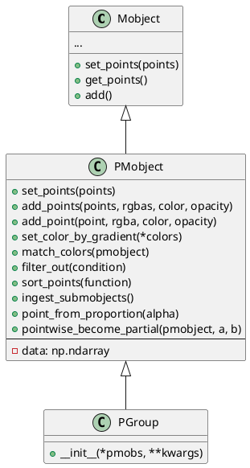
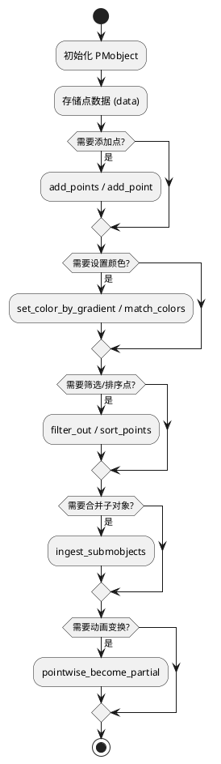

# 概述
PMobject 是 Manim 库中用于表示“点云对象”（Point Cloud Mobject）的类。它继承自 Mobject，是所有基于点的可视化对象的基础类。其含义和作用如下：
- 含义
P 代表 Point（点），PMobject 即 Point Cloud Mobject，意为“点云对象”。
它是所有由一组点（point cloud）组成的对象的基类，比如 DotCloud、VMobject（矢量图形对象）等。
- 作用
  - 管理点数据：PMobject 主要负责存储和操作一组三维点（通常是 N×3 的 numpy 数组），以及与每个点相关的颜色（rgba）等属性。
  - 点的增删改查：提供了如 set_points、add_points、add_point 等方法，方便地设置、添加、操作点。
  - 颜色与透明度控制：可以通过 set_color_by_gradient、match_colors 等方法为点设置渐变色或匹配其他对象的颜色。
  - 点的排序与筛选：如 sort_points、filter_out 方法，可以根据自定义函数对点进行排序或筛选。
  - 子对象合并：ingest_submobjects 方法可以将所有子 PMobject 的点合并到当前对象中。
  - 动画支持：如 pointwise_become_partial 支持动画中部分点的变换。
- 典型应用
  - 任何需要以“点”为基本单元进行动画或可视化的对象，都可以基于 PMobject 实现。例如，绘制散点图、粒子动画、路径采样等。

## 类图

说明
- Mobject 是所有可视化对象的基类，PMobject 继承自它。
- PMobject 主要增加了点云相关的属性和方法，核心是 data 属性（存储点和颜色等信息）。
- PGroup 是 PMobject 的子类，用于管理一组 PMobject。

## 核心流程
