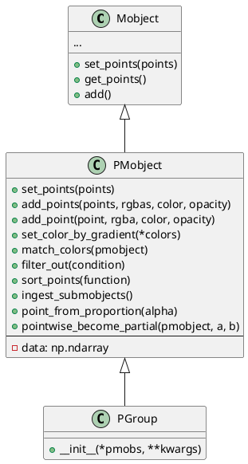
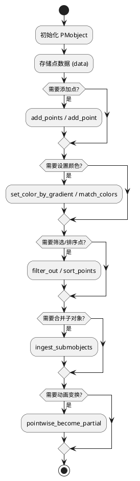

# 概述
PMobject 是 Manim 库中用于表示“点云对象”（Point Cloud Mobject）的类。它继承自 Mobject，是所有基于点的可视化对象的基础类。其含义和作用如下：
- 含义
P 代表 Point（点），PMobject 即 Point Cloud Mobject，意为“点云对象”。
它是所有由一组点（point cloud）组成的对象的基类，比如 DotCloud、VMobject（矢量图形对象）等。
- 作用
  - 管理点数据：PMobject 主要负责存储和操作一组三维点（通常是 N×3 的 numpy 数组），以及与每个点相关的颜色（rgba）等属性。
  - 点的增删改查：提供了如 set_points、add_points、add_point 等方法，方便地设置、添加、操作点。
  - 颜色与透明度控制：可以通过 set_color_by_gradient、match_colors 等方法为点设置渐变色或匹配其他对象的颜色。
  - 点的排序与筛选：如 sort_points、filter_out 方法，可以根据自定义函数对点进行排序或筛选。
  - 子对象合并：ingest_submobjects 方法可以将所有子 PMobject 的点合并到当前对象中。
  - 动画支持：如 pointwise_become_partial 支持动画中部分点的变换。
- 典型应用
  - 任何需要以“点”为基本单元进行动画或可视化的对象，都可以基于 PMobject 实现。例如，绘制散点图、粒子动画、路径采样等。

## 类图

说明
- Mobject 是所有可视化对象的基类，PMobject 继承自它。
- PMobject 主要增加了点云相关的属性和方法，核心是 data 属性（存储点和颜色等信息）。
- PGroup 是 PMobject 的子类，用于管理一组 PMobject。

## 核心流程



---

## PMobject 的使用方法

### 1. 基本用法

PMobject 通常不直接实例化，而是作为子类（如 DotCloud、VMobject 等）的基类使用。你可以通过其子类来创建点云对象。

#### 示例：自定义点云对象

````python
from manimlib.imports import *

class CustomPointCloud(PMobject):
def __init__(self, points, color=WHITE, **kwargs):
super().__init__(**kwargs)
self.set_points(points)
self.set_color(color)

class PointCloudDemo(Scene):
def construct(self):
points = [
[0, 0, 0],
[1, 0, 0],
[0, 1, 0],
[1, 1, 0]
]
cloud = CustomPointCloud(points, color=YELLOW)
self.add(cloud)
self.wait(1)
````

### 2. 常用方法

- `set_points(points)`：设置点云的所有点。
- `add_points(points)`：向点云中添加多个点。
- `add_point(point)`：添加单个点。
- `set_color_by_gradient(*colors)`：为点云设置渐变色。
- `filter_out(condition)`：根据条件函数筛选点。
- `sort_points(function)`：根据函数对点排序。
- `ingest_submobjects()`：合并所有子 PMobject 的点。

### 3. 典型场景示例

#### 3.1 渐变色点云

````python
class GradientPointCloudDemo(Scene):
def construct(self):
points = [
[x, 0, 0] for x in np.linspace(-3, 3, 50)
]
cloud = CustomPointCloud(points)
cloud.set_color_by_gradient(RED, YELLOW, GREEN)
self.add(cloud)
self.wait(1)
````

#### 3.2 点的筛选与排序

````python
class FilterSortDemo(Scene):
def construct(self):
points = np.random.uniform(-2, 2, (100, 3))
cloud = CustomPointCloud(points)
# 只保留 x>0 的点
cloud.filter_out(lambda p: p[0] <= 0)
# 按 y 坐标排序
cloud.sort_points(lambda p: p[1])
self.add(cloud)
self.wait(1)
````

#### 3.3 动画中的点云变换

````python
class PointwisePartialDemo(Scene):
def construct(self):
points1 = np.random.uniform(-2, 2, (50, 3))
points2 = np.random.uniform(-2, 2, (50, 3))
cloud1 = CustomPointCloud(points1, color=BLUE)
cloud2 = CustomPointCloud(points2, color=GREEN)
self.add(cloud1)
self.wait(0.5)
# 只变换前 30% 的点
cloud1.pointwise_become_partial(cloud2, 0, 0.3)
self.wait(1)
````

---

通过上述方法，PMobject 及其子类可以灵活地实现点云的创建、操作、着色、筛选、排序和动画变换，适用于各种基于点的可视化和动画场景。