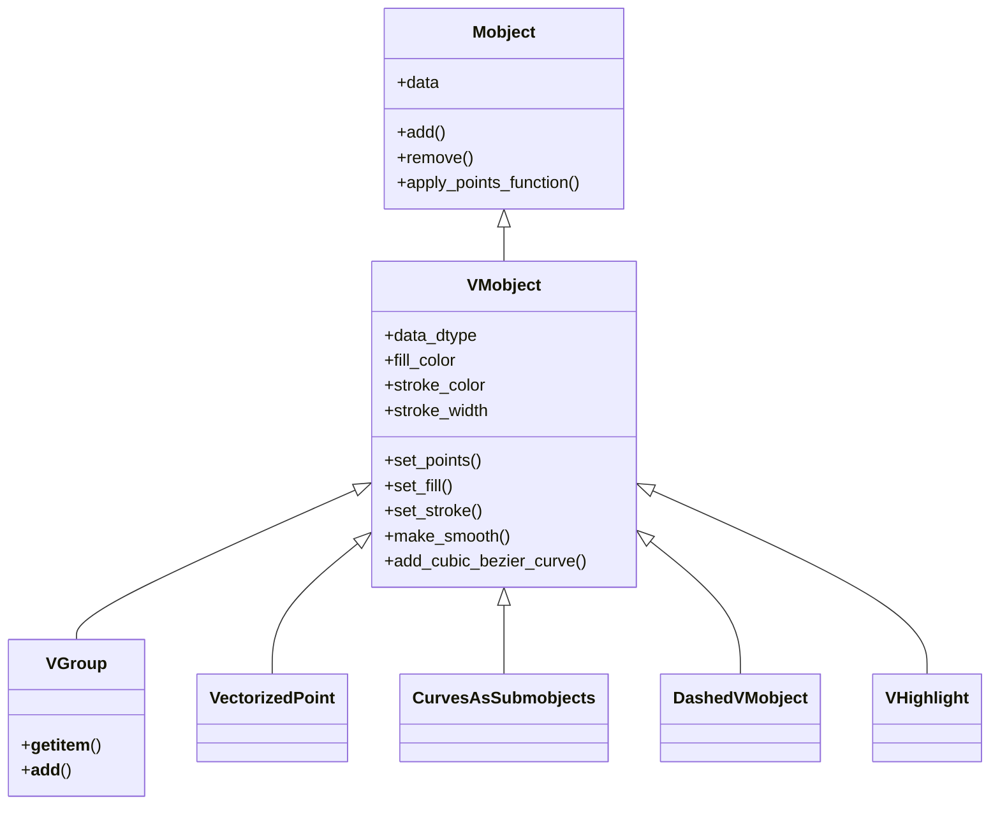
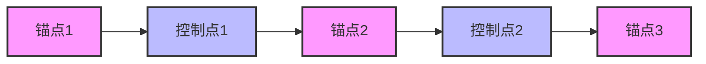
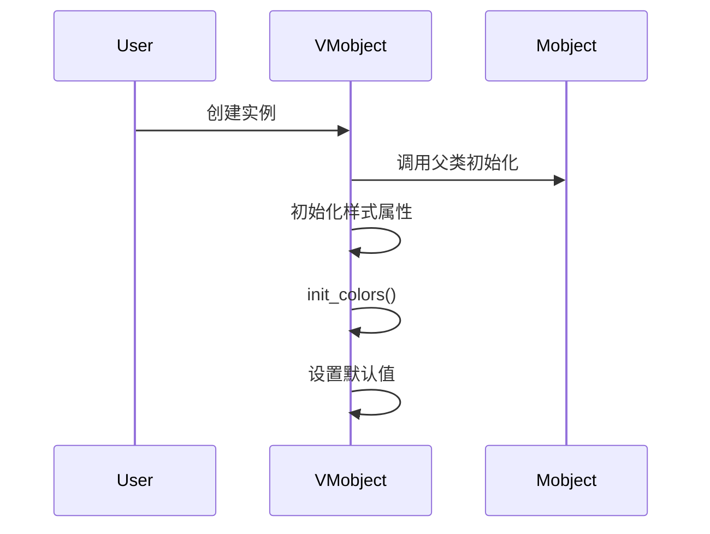
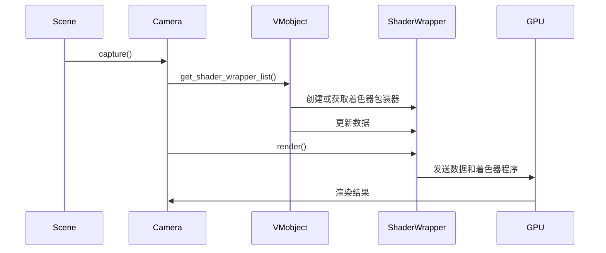

# VMobject深度解析

VMobject（Vectorized Mobject）是Manim中最核心的图形对象类之一，它是所有矢量化图形对象的基类。本文将从逻辑架构、运行架构、数据架构和关键算法实现等方面深入解析VMobject的设计与实现。

## 1. 逻辑架构

VMobject继承自Mobject类，是Manim中所有矢量化图形对象的基类。它通过贝塞尔曲线来表示图形，支持填充、描边、平滑处理等功能。



### 1.1 核心概念

VMobject的核心概念包括：

1. **点集合**：每个VMobject由一系列点组成，这些点定义了贝塞尔曲线的锚点和控制点。
2. **贝塞尔曲线**：VMobject使用二次贝塞尔曲线来表示图形的轮廓。
3. **子路径**：一个VMobject可以包含多个子路径，每个子路径是一个闭合或开放的曲线。
4. **样式属性**：包括填充颜色、描边颜色、描边宽度等。
5. **着色器交互**：VMobject通过着色器渲染，支持GPU加速。

### 1.2 继承关系

- **Mobject**：所有图形对象的基类，提供基本的变换、组合和动画功能。
- **VMobject**：矢量化的Mobject，使用贝塞尔曲线表示图形。
- **VGroup**：VMobject的容器，用于组织和管理多个VMobject。
- **VectorizedPoint**：表示单个点的VMobject。
- **CurvesAsSubmobjects**：将一个VMobject的每条曲线转换为独立的VMobject。
- **DashedVMobject**：创建虚线效果的VMobject。
- **VHighlight**：创建高亮效果的VMobject。

## 2. 数据架构

VMobject的数据结构是其设计的核心，它决定了如何存储和操作图形数据。

### 2.1 数据类型定义

```python
data_dtype: np.dtype = np.dtype([
    ('point', np.float32, (3,)),
    ('stroke_rgba', np.float32, (4,)),
    ('stroke_width', np.float32, (1,)),
    ('joint_angle', np.float32, (1,)),
    ('fill_rgba', np.float32, (4,)),
    ('base_normal', np.float32, (3,)),  # Base points and unit normal vectors are interleaved in this array
    ('fill_border_width', np.float32, (1,)),
])
```

这个数据类型定义了VMobject的每个点所包含的属性：

- **point**：3D空间中的点坐标 (x, y, z)
- **stroke_rgba**：描边颜色的RGBA值
- **stroke_width**：描边宽度
- **joint_angle**：关节角度，用于控制曲线的连接方式
- **fill_rgba**：填充颜色的RGBA值
- **base_normal**：基准法向量，用于3D渲染
- **fill_border_width**：填充边界宽度

### 2.2 点的组织方式



VMobject中的点按照特定的模式组织：
- 锚点（Anchor）：曲线经过的实际点
- 控制点（Handle）：控制曲线形状的点

对于一个包含n个锚点的曲线，总共有2n-1个点，其中：
- 锚点位于索引0, 2, 4, ..., 2(n-1)
- 控制点位于索引1, 3, 5, ..., 2n-3

### 2.3 子路径的表示

VMobject可以包含多个子路径，每个子路径是一个独立的曲线。子路径的结束由一个特殊的标记表示：控制点与前一个锚点重合。

```python
def get_subpath_end_indices_from_points(self, points: Vect3Array) -> np.ndarray:
    atol = 1e-4  # TODO, this is too unsystematic
    a0, h, a1 = points[0:-1:2], points[1::2], points[2::2]
    # An anchor point is considered the end of a path
    # if its following handle is sitting on top of it.
    # To disambiguate this from cases with many null
    # curves in a row, we also check that the following
    # anchor is genuinely distinct
    is_end = (a0 == h).all(1) & (abs(h - a1) > atol).any(1)
    end_indices = (2 * n for n, end in enumerate(is_end) if end)
    return np.array([*end_indices, len(points) - 1])
```

## 3. 运行架构

VMobject的运行架构主要涉及其如何与Manim的渲染系统交互，以及如何处理变换和动画。

### 3.1 初始化流程



VMobject的初始化过程包括：
1. 调用父类Mobject的初始化方法
2. 初始化样式属性（填充颜色、描边颜色、描边宽度等）
3. 初始化颜色（设置填充和描边的颜色和透明度）
4. 设置其他属性的默认值

### 3.2 渲染流程



VMobject的渲染流程：
1. Scene调用Camera的capture方法
2. Camera向每个VMobject请求着色器包装器列表
3. VMobject创建或获取着色器包装器，并更新数据
4. Camera调用着色器包装器的render方法
5. 着色器包装器将数据和着色器程序发送到GPU
6. GPU渲染结果并返回给Camera

### 3.3 着色器交互

VMobject通过VShaderWrapper与着色器系统交互：

```python
def init_shader_wrapper(self, ctx: Context):
    self.shader_wrapper = VShaderWrapper(
        ctx=ctx,
        vert_data=self.data,
        mobject_uniforms=self.uniforms,
        code_replacements=self.shader_code_replacements,
        stroke_behind=self.stroke_behind,
        depth_test=self.depth_test
    )
```

VShaderWrapper负责：
1. 管理顶点缓冲对象（VBO）
2. 创建顶点数组对象（VAO）
3. 设置着色器程序
4. 处理描边和填充的渲染

## 4. 关键算法实现

### 4.1 贝塞尔曲线操作

VMobject使用二次贝塞尔曲线来表示图形。以下是一些关键的贝塞尔曲线操作：

#### 4.1.1 添加贝塞尔曲线

```python
def add_cubic_bezier_curve(
    self,
    anchor1: Vect3,
    handle1: Vect3,
    handle2: Vect3,
    anchor2: Vect3
) -> Self:
    self.start_new_path(anchor1)
    self.add_cubic_bezier_curve_to(handle1, handle2, anchor2)
    return self

def add_cubic_bezier_curve_to(
    self,
    handle1: Vect3,
    handle2: Vect3,
    anchor: Vect3,
) -> Self:
    """
    Add cubic bezier curve to the path.
    """
    self.throw_error_if_no_points()
    last = self.get_last_point()
    # Note, this assumes all points are on the xy-plane
    v1 = handle1 - last
    v2 = anchor - handle2
    angle = angle_between_vectors(v1, v2)
    if self.use_simple_quadratic_approx and angle < 45 * DEG:
        quad_approx = [last, find_intersection(last, v1, anchor, -v2), anchor]
    else:
        quad_approx = get_quadratic_approximation_of_cubic(
            last, handle1, handle2, anchor
        )
    if self.consider_points_equal(quad_approx[1], last):
        # This is to prevent subpaths from accidentally being marked closed
        quad_approx[1] = midpoint(*quad_approx[1:3])
    self.append_points(quad_approx[1:])
    return self
```

这段代码展示了如何添加三次贝塞尔曲线，并将其转换为二次贝塞尔曲线的近似表示。

#### 4.1.2 平滑处理

```python
def make_smooth(self, approx=True, recurse=True) -> Self:
    """
    Edits the path so as to pass smoothly through all
    the current anchor points.

    If approx is False, this may increase the total
    number of points.
    """
    mode = "approx_smooth" if approx else "true_smooth"
    for submob in self.get_family(recurse):
        if submob.is_smooth():
            continue
        submob.change_anchor_mode(mode)
    return self
```

平滑处理算法通过调整控制点的位置，使曲线在锚点处平滑过渡。

### 4.2 路径操作

#### 4.2.1 获取子路径

```python
def get_subpaths_from_points(self, points: Vect3Array) -> list[Vect3Array]:
    if len(points) == 0:
        return []
    end_indices = self.get_subpath_end_indices_from_points(points)
    start_indices = [0, *(end_indices[:-1] + 2)]
    return [points[i1:i2 + 1] for i1, i2 in zip(start_indices, end_indices)]
```

这个方法将点集合分解为多个子路径，每个子路径是一个独立的曲线。

#### 4.2.2 闭合路径

```python
def close_path(self, smooth: bool = False) -> Self:
    if self.is_closed():
        return self
    ends = self.get_subpath_end_indices()
    last_path_start = self.get_points()[0 if len(ends) == 1 else ends[-2] + 2]
    if smooth:
        self.add_smooth_curve_to(last_path_start)
    else:
        self.add_line_to(last_path_start)
    return self
```

闭合路径算法通过添加一条连接最后一个点和第一个点的曲线来实现。

### 4.3 样式操作

#### 4.3.1 设置填充

```python
def set_fill(
    self,
    color: ManimColor | Iterable[ManimColor] = None,
    opacity: float | Iterable[float] | None = None,
    border_width: float | None = None,
    recurse: bool = True
) -> Self:
    self.set_rgba_array_by_color(color, opacity, 'fill_rgba', recurse)
    if border_width is not None:
        self.border_width = border_width
        for mob in self.get_family(recurse):
            data = mob.data if mob.has_points() > 0 else mob._data_defaults
            data["fill_border_width"] = border_width
    return self
```

设置填充颜色和透明度，并可选地设置边界宽度。

#### 4.3.2 设置描边

```python
def set_stroke(
    self,
    color: ManimColor | Iterable[ManimColor] = None,
    width: float | Iterable[float] | None = None,
    opacity: float | Iterable[float] | None = None,
    behind: bool | None = None,
    flat: bool | None = None,
    recurse: bool = True
) -> Self:
    self.set_rgba_array_by_color(color, opacity, 'stroke_rgba', recurse)

    if width is not None:
        for mob in self.get_family(recurse):
            data = mob.data if mob.get_num_points() > 0 else mob._data_defaults
            if isinstance(width, (float, int)):
                data['stroke_width'][:, 0] = width
            else:
                data['stroke_width'][:, 0] = resize_with_interpolation(
                    np.array(width), len(data)
                ).flatten()

    if behind is not None:
        for mob in self.get_family(recurse):
            if mob.stroke_behind != behind:
                mob.stroke_behind = behind
                mob.refresh_shader_wrapper_id()

    if flat is not None:
        self.set_flat_stroke(flat)

    return self
```

设置描边颜色、宽度和透明度，并可选地设置描边是否在填充后面以及是否使用平面描边。

### 4.4 几何计算

#### 4.4.1 计算关节角度

```python
def get_joint_angles(self, refresh: bool = False) -> np.ndarray:
    """
    The 'joint product' is a 4-vector holding the cross and dot
    product between tangent vectors at a joint
    """
    if not self.needs_new_joint_angles and not refresh:
        return self.data["joint_angle"][:, 0]

    if "joint_angle" in self.locked_data_keys:
        return self.data["joint_angle"][:, 0]

    self.needs_new_joint_angles = False
    self._data_has_changed = True

    # Rotate points such that positive z direction is the normal
    points = self.get_points() @ rotation_between_vectors(OUT, self.get_unit_normal())

    if len(points) < 3:
        return self.data["joint_angle"][:, 0]

    # Find all the unit tangent vectors at each joint
    a0, h, a1 = points[0:-1:2], points[1::2], points[2::2]
    a0_to_h = h - a0
    h_to_a1 = a1 - h

    # Tangent vectors into each vertex
    v_in = np.zeros(points.shape)
    # Tangent vectors out of each vertex
    v_out = np.zeros(points.shape)

    v_in[1::2] = a0_to_h
    v_in[2::2] = h_to_a1
    v_out[0:-1:2] = a0_to_h
    v_out[1::2] = h_to_a1

    # Joint up closed loops, or mark unclosed paths as such
    ends = self.get_subpath_end_indices()
    starts = [0, *(e + 2 for e in ends[:-1])]
    for start, end in zip(starts, ends):
        if start == end:
            continue
        if (points[start] == points[end]).all():
            v_in[start] = v_out[end - 1]
            v_out[end] = v_in[start + 1]
        else:
            v_in[start] = v_out[start]
            v_out[end] = v_in[end]

    # Find the angles between vectors into each vertex, and out of it
    angles_in = np.arctan2(v_in[:, 1], v_in[:, 0])
    angles_out = np.arctan2(v_out[:, 1], v_out[:, 0])
    angle_diffs = angles_out - angles_in
    angle_diffs[angle_diffs < -PI] += TAU
    angle_diffs[angle_diffs > PI] -= TAU
    self.data["joint_angle"][:, 0] = angle_diffs
    return self.data["joint_angle"][:, 0]
```

这个方法计算每个点的关节角度，用于控制曲线的连接方式。

#### 4.4.2 计算法向量

```python
def get_unit_normal(self, refresh: bool = False) -> Vect3:
    if self.get_num_points() < 3:
        return OUT

    if not self.needs_new_unit_normal and not refresh:
        return self.data["base_normal"][1, :]

    area_vect = self.get_area_vector()
    area = get_norm(area_vect)
    if area > 0:
        normal = area_vect / area
    else:
        p = self.get_points()
        normal = get_unit_normal(p[1] - p[0], p[2] - p[1])
    self.data["base_normal"][1::2] = normal
    self.needs_new_unit_normal = False
    return normal
```

计算单位法向量，用于3D渲染和确定图形的朝向。

### 4.5 三角剖分

```python
def get_triangulation(self) -> np.ndarray:
    # Figure out how to triangulate the interior to know
    # how to send the points as to the vertex shader.
    # First triangles come directly from the points
    points = self.get_points()

    if len(points) <= 1:
        return np.zeros(0, dtype='i4')

    normal_vector = self.get_unit_normal()

    # Rotate points such that unit normal vector is OUT
    if not np.isclose(normal_vector, OUT).all():
        points = np.dot(points, z_to_vector(normal_vector))

    v01s = points[1::2] - points[0:-1:2]
    v12s = points[2::2] - points[1::2]
    curve_orientations = np.sign(cross2d(v01s, v12s))

    concave_parts = curve_orientations < 0

    # These are the vertices to which we'll apply a polygon triangulation
    indices = np.arange(len(points), dtype=int)
    inner_vert_indices = np.hstack([
        indices[0::2],
        indices[1::2][concave_parts],
    ])
    inner_vert_indices.sort()
    # Even indices correspond to anchors, and `end_indices // 2`
    # shows which anchors are considered end points
    end_indices = self.get_subpath_end_indices()
    counts = np.arange(1, len(inner_vert_indices) + 1)
    rings = counts[inner_vert_indices % 2 == 0][end_indices // 2]

    # Triangulate
    inner_verts = points[inner_vert_indices]
    inner_tri_indices = inner_vert_indices[
        earclip_triangulation(inner_verts, rings)
    ]
    # Remove null triangles, coming from adjascent points
    iti = inner_tri_indices
    null1 = (iti[0::3] + 1 == iti[1::3]) & (iti[0::3] + 2 == iti[2::3])
    null2 = (iti[0::3] - 1 == iti[1::3]) & (iti[0::3] - 2 == iti[2::3])
    inner_tri_indices = iti[~(null1 | null2).repeat(3)]

    ovi = self.get_outer_vert_indices()
    tri_indices = np.hstack([ovi, inner_tri_indices])
    return tri_indices
```

三角剖分算法将VMobject的内部区域分解为三角形，用于填充渲染。

## 5. 总结

VMobject是Manim中最核心的图形对象类之一，它通过贝塞尔曲线表示图形，支持填充、描边、平滑处理等功能。其设计充分考虑了性能和灵活性，通过与着色器系统的紧密集成，实现了高效的GPU加速渲染。

VMobject的数据结构设计精巧，通过特定的点组织方式和子路径表示方法，能够表示复杂的矢量图形。其提供的丰富的路径操作和样式设置方法，使得用户可以方便地创建和操作各种图形。

通过深入理解VMobject的设计和实现，我们可以更好地利用Manim创建复杂的数学动画，也可以为Manim的进一步发展提供参考。