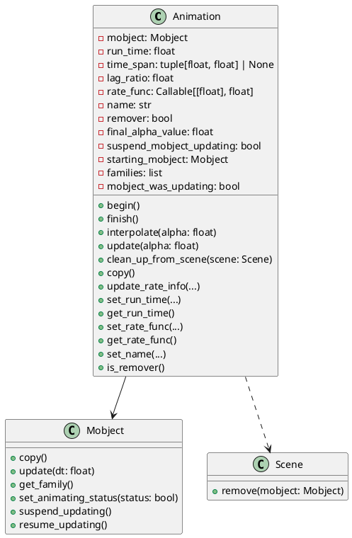
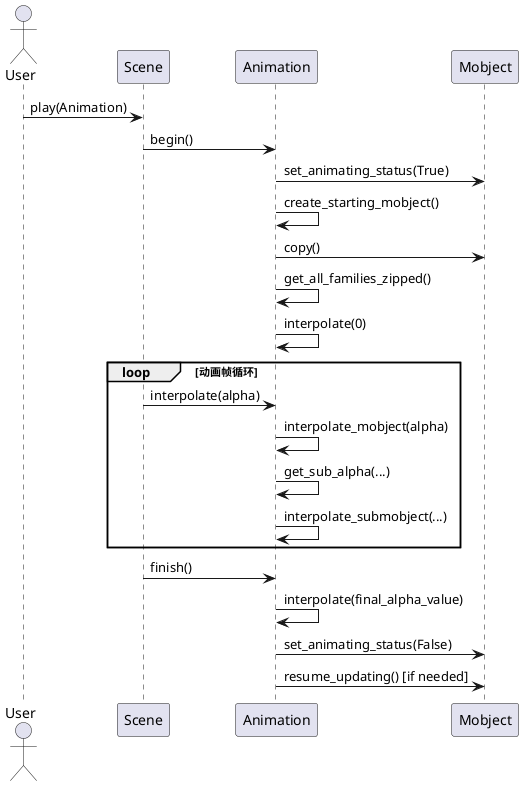

# Animation类详解（manimlib/animation/animation.py）

## 1. 类结构与关键属性（PlantUML类图）



### 关键属性说明
- **mobject**: 被动画操作的对象，必须为Mobject实例。
- **run_time**: 动画持续时间，单位为秒。
- **time_span**: 动画实际作用的时间区间（可选）。
- **lag_ratio**: 子对象动画的延迟比例，0为同步，1为依次，(0,1)为部分重叠。
- **rate_func**: 控制动画进度的插值函数，默认`smooth`。
- **name**: 动画名称。
- **remover**: 动画是否在结束后移除mobject。
- **final_alpha_value**: 动画结束时插值的alpha值。
- **suspend_mobject_updating**: 是否在动画期间暂停mobject的updater。

## 2. 关键方法与算法（PlantUML时序图）

### 动画播放流程



#### 关键算法说明
- **interpolate(alpha)**: 根据alpha（0~1）插值，驱动mobject的状态变化。
- **get_sub_alpha(alpha, i, n)**: 计算第i个子对象的插值进度，考虑lag_ratio。
- **interpolate_submobject**: 子类实现，定义具体的插值逻辑。
- **begin/finish**: 动画生命周期的起止，负责状态初始化与收尾。

## 3. 使用方法与示例

```python
from manimlib import Scene, Animation, Mobject
from manimlib.mobject.geometry import Square
from manimlib.utils.rate_functions import linear

class MyAnimation(Animation):
    def interpolate_submobject(self, submobject, starting_submobject, alpha):
        # 线性插值示例：平移
        submobject.move_to(starting_submobject.get_center() + alpha * [2, 0, 0])

class DemoScene(Scene):
    def construct(self):
        square = Square()
        self.add(square)
        anim = MyAnimation(square, run_time=2, rate_func=linear)
        self.play(anim)
```

- 支持自定义Animation子类，实现`interpolate_submobject`以定义动画效果。
- 通过`Scene.play(Animation)`驱动动画。
- 可通过`lag_ratio`、`rate_func`等参数实现复杂的分步与插值控制。

## 4. 总结与建议

### 类定义与作用
- **Animation**：Manim动画系统的基类，负责描述mobject的插值变化过程。
- **Mobject**：所有可动画对象的基类。
- **Scene**：动画场景，管理动画的播放与mobject的生命周期。

### 使用场景
- 需要自定义动画效果时，继承Animation并实现插值逻辑。
- 通过`lag_ratio`实现多子对象的错峰动画。
- 结合`rate_func`实现非线性动画节奏。

### 特性与注意事项
- Animation本身不直接渲染，而是驱动mobject状态变化。
- 子类必须实现`interpolate_submobject`。
- 动画期间可选择暂停mobject的updater，避免冲突。
- `prepare_animation`辅助函数支持_AnimationBuilder与Animation的自动转换。
- 动画结束后如需移除对象，设置`remover=True`。

### 建议
- 合理选择rate_func与lag_ratio，提升动画表现力。
- 动画涉及大量mobject时注意性能，避免不必要的深拷贝。
- 动画与updater并用时，注意生命周期管理，避免状态错乱。
