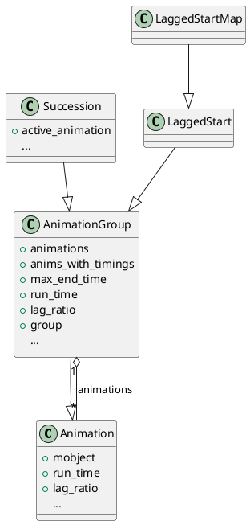
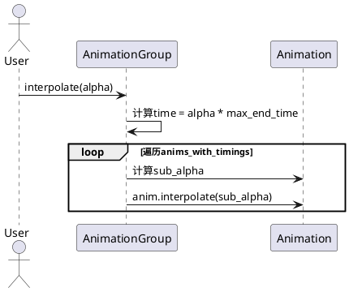
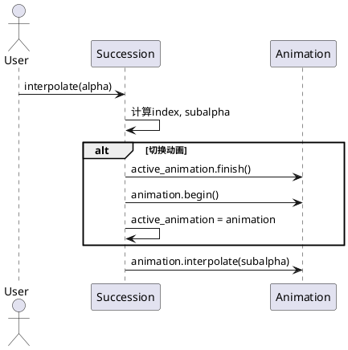

# composition.py 类详解（manimlib/animation/composition.py）

## 1. 类结构与关键属性（PlantUML类图）



### 关键属性说明

- **AnimationGroup**
  - `animations`：动画对象列表，所有子动画。
  - `anims_with_timings`：[(动画, 开始时间, 结束时间)]三元组列表，描述每个动画的时序。
  - `max_end_time`：所有动画的最大结束时间。
  - `run_time`：总运行时长。
  - `lag_ratio`：动画之间的延迟比例。
  - `group`：所有动画涉及的mobject的组合体（Group/VGroup）。

- **Succession**
  - `active_animation`：当前激活的动画。

- **LaggedStart**
  - 继承自AnimationGroup，主要区别是默认`lag_ratio`不为0。

- **LaggedStartMap**
  - 通过函数将一组mobject映射为动画，并以LaggedStart方式播放。

---

## 2. 关键方法与算法（PlantUML时序图）

### AnimationGroup的动画调度核心

- `build_animations_with_timings(lag_ratio)`
- `interpolate(alpha)`



**关键步骤说明：**
- `interpolate(alpha)`会根据整体进度`alpha`，计算每个子动画的当前进度`sub_alpha`，并分别调用其`interpolate`方法，实现动画组的同步或错峰播放。

### Succession的动画切换



---

## 3. 使用方法与高质量代码示例

### AnimationGroup 示例

```python
from manimlib import *
class AnimationGroupDemo(Scene):
    def construct(self):
        c1 = Circle().shift(LEFT)
        c2 = Square().shift(RIGHT)
        anim1 = FadeIn(c1)
        anim2 = FadeIn(c2)
        self.play(AnimationGroup(anim1, anim2, lag_ratio=0.5))
        self.wait()
```

### Succession 示例

```python
class SuccessionDemo(Scene):
    def construct(self):
        c = Circle()
        self.play(Succession(FadeIn(c), FadeOut(c)))
        self.wait()
```

### LaggedStart 示例

```python
class LaggedStartDemo(Scene):
    def construct(self):
        dots = VGroup(*[Dot().shift(RIGHT * i) for i in range(5)])
        self.play(LaggedStart(*[FadeIn(dot) for dot in dots], lag_ratio=0.2))
        self.wait()
```

### LaggedStartMap 示例

```python
class LaggedStartMapDemo(Scene):
    def construct(self):
        dots = VGroup(*[Dot().shift(RIGHT * i) for i in range(5)])
        self.play(LaggedStartMap(FadeIn, dots, lag_ratio=0.2))
        self.wait()
```

---

## 4. 总结与建议

### 各类定义与作用

- **AnimationGroup**：将多个动画组合为一个整体，可并行或错峰播放。适合需要多个动画协同展示的场景。
- **Succession**：动画顺序串行播放，适合需要严格先后顺序的动画流程。
- **LaggedStart**：动画组错峰启动，常用于群体对象的波浪式动画。
- **LaggedStartMap**：对一组对象应用同一动画函数并错峰播放，简化批量动画代码。

### 使用建议与注意事项

- `lag_ratio`控制动画间的延迟，0为同步，1为完全串行，介于0-1为部分重叠。
- `run_time`为负时，自动取所有子动画的总时长。
- `group`属性自动推断为Group/VGroup，除非手动指定。
- Succession/LaggedStartMap等为AnimationGroup的常用变体，便于实现常见动画编排模式。
