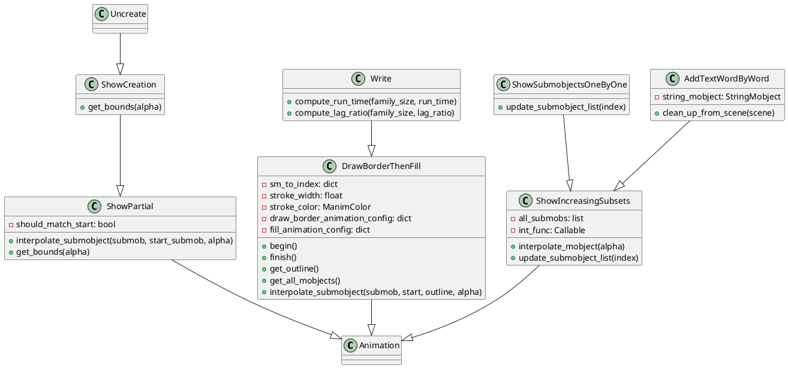
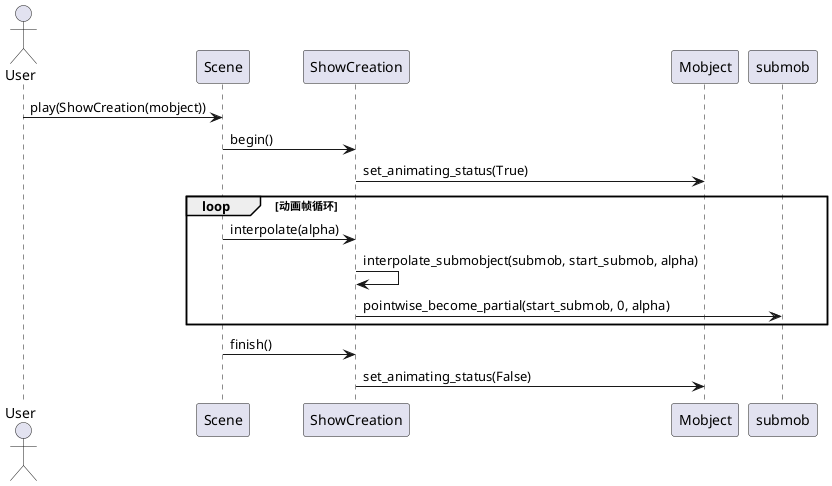
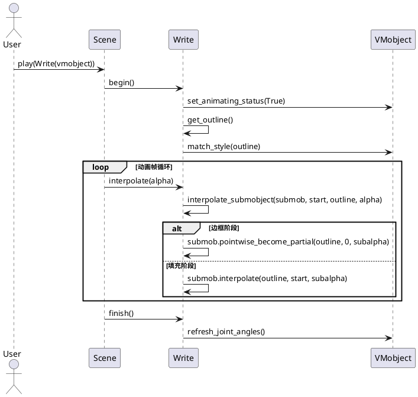
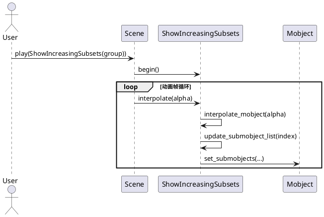

# creation.py 类详解（manimlib/animation/creation.py）

## 1. 类结构与关键属性（PlantUML类图）



### 关键属性说明
- **should_match_start**: 是否在动画开始时对齐起始状态（ShowPartial及其子类）。
- **sm_to_index**: 子对象哈希到索引的映射，用于边框与填充动画的状态管理（DrawBorderThenFill）。
- **stroke_width/stroke_color**: 边框宽度与颜色（DrawBorderThenFill/Write）。
- **draw_border_animation_config/fill_animation_config**: 边框与填充动画的配置（DrawBorderThenFill）。
- **all_submobs**: 记录所有子对象（ShowIncreasingSubsets及其子类）。
- **int_func**: 子对象插值的整数函数（ShowIncreasingSubsets及其子类）。
- **string_mobject**: 原始文本对象（AddTextWordByWord）。

---

## 2. 关键方法与算法（PlantUML时序图）

### ShowCreation/Uncreate 动画流程



### DrawBorderThenFill/Write 动画流程



### ShowIncreasingSubsets/ShowSubmobjectsOneByOne/AddTextWordByWord 动画流程



---

## 3. 使用方法与高质量代码示例

### ShowCreation/Uncreate 示例
```python
from manimlib import *
class ShowCreationDemo(Scene):
    def construct(self):
        circle = Circle()
        self.play(ShowCreation(circle))
        self.wait()

class UncreateDemo(Scene):
    def construct(self):
        square = Square()
        self.add(square)
        self.play(Uncreate(square))
        self.wait()
```

### Write/DrawBorderThenFill 示例
```python
class WriteDemo(Scene):
    def construct(self):
        text = Text("Hello, Manim!")
        self.play(Write(text))
        self.wait()

class DrawBorderThenFillDemo(Scene):
    def construct(self):
        rect = Rectangle()
        self.play(DrawBorderThenFill(rect, stroke_color=BLUE, stroke_width=4))
        self.wait()
```

### ShowIncreasingSubsets/ShowSubmobjectsOneByOne/AddTextWordByWord 示例
```python
class ShowIncreasingSubsetsDemo(Scene):
    def construct(self):
        dots = VGroup(*[Dot().shift(RIGHT * i) for i in range(5)])
        self.play(ShowIncreasingSubsets(dots))
        self.wait()

class ShowSubmobjectsOneByOneDemo(Scene):
    def construct(self):
        dots = VGroup(*[Dot().shift(RIGHT * i) for i in range(5)])
        self.play(ShowSubmobjectsOneByOne(dots))
        self.wait()

class AddTextWordByWordDemo(Scene):
    def construct(self):
        text = Text("Hello world from Manim")
        self.play(AddTextWordByWord(text))
        self.wait()
```

---

## 4. 总结与建议

### 各类定义与作用
- **ShowPartial/ShowCreation/Uncreate**：用于路径/线条的逐步绘制与消除，适合展示图形生成与消失的过程。
- **DrawBorderThenFill/Write**：先描边后填充，常用于文本、复杂图形的书写与显现。
- **ShowIncreasingSubsets/ShowSubmobjectsOneByOne/AddTextWordByWord**：用于子对象/单词/字符的逐步显现，适合分步展示、教学演示等场景。

### 使用场景
- 需要路径、线条、文本等逐步显现或消失的动画。
- 需要分步展示群体对象、文本内容。
- 需要自定义边框、填充动画效果。

### 特性与注意事项
- `ShowPartial`为抽象基类，需子类实现`get_bounds`。
- `Write`会自动根据对象复杂度调整动画时长和延迟。
- `ShowIncreasingSubsets`及其子类通过`int_func`灵活控制子对象显现节奏。
- `AddTextWordByWord`适合逐词显现，需配合`StringMobject`。
- 动画对象需为`VMobject`或其子类，部分动画对mobject类型有要求。

### 建议
- 合理选择动画类型与参数，提升视觉表现力。
- 复杂对象建议使用`Write`或`DrawBorderThenFill`，文本推荐`AddTextWordByWord`。
- 注意动画期间对象的updater与状态同步，避免冲突。
- 充分利用`lag_ratio`、`rate_func`等参数实现丰富的动画节奏。
