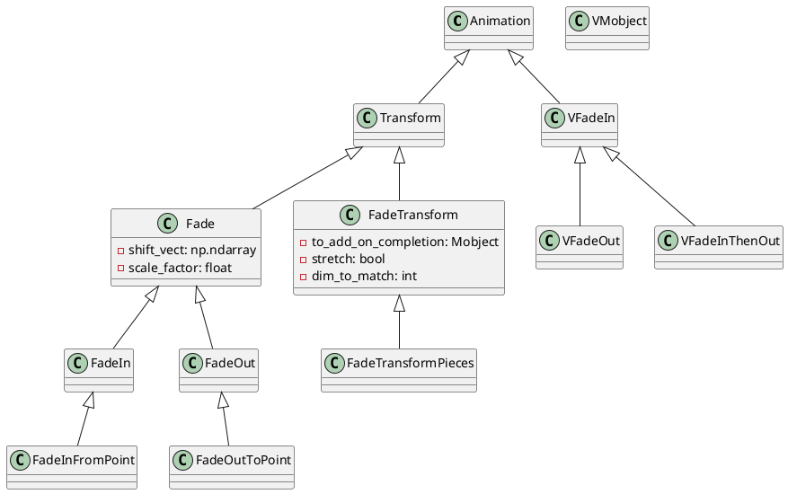
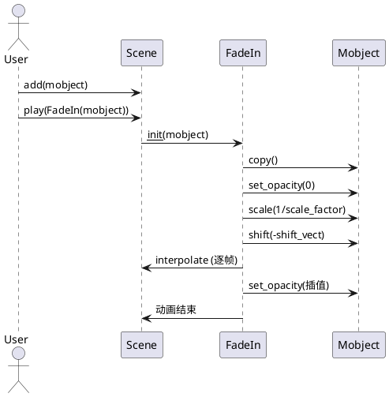
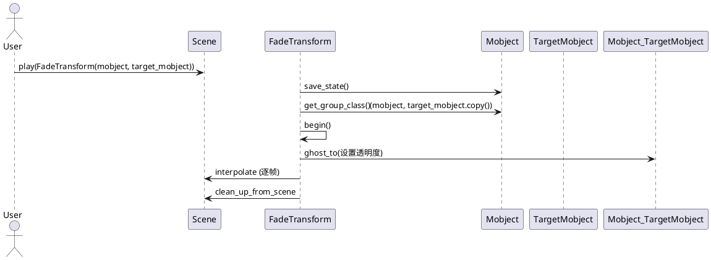

# fading.py 动画类详解

## 1. 类及关键属性介绍

### 主要类关系PlantUML类图



### 关键属性说明

- `Fade`
  - `shift_vect`: 渐变时的平移向量
  - `scale_factor`: 渐变时的缩放因子

- `FadeOut`
  - `remover`: 动画结束后是否移除对象
  - `final_alpha_value`: 动画结束时透明度

- `FadeTransform`
  - `to_add_on_completion`: 动画完成后要添加到场景的目标对象
  - `stretch`: 是否拉伸以适配目标
  - `dim_to_match`: 匹配的维度

- `VFadeIn`/`VFadeOut`/`VFadeInThenOut`
  - 主要针对`VMobject`，通过透明度插值实现渐变

---

## 2. 关键方法与算法详解

### 典型方法与时序图

#### FadeIn/FadeOut/FadeInFromPoint/FadeOutToPoint

- `FadeIn.create_starting_mobject()`
  - 关键步骤：设置初始透明度、缩放、平移
- `FadeOut.create_target()`
  - 关键步骤：设置目标透明度、缩放、平移

#### FadeTransform

- `begin()`
  - 关键步骤：保存初始状态，生成起止mobject，调用`ghost_to`设置透明度
- `ghost_to(source, target)`
  - 关键步骤：用目标替换源，设置透明度为0

#### VFadeIn/VFadeOut

- `interpolate_submobject(submob, start, alpha)`
  - 关键步骤：对每个子对象插值设置透明度

##### 典型FadeIn动画时序图



##### 典型FadeTransform动画时序图



---

## 3. 使用方法与高质量示例

### FadeIn/FadeOut

```python
from manimlib import *

class FadeInOutScene(Scene):
    def construct(self):
        square = Square()
        self.add(square)
        self.play(FadeOut(square, shift=UP, scale=0.5))
        self.wait()
        self.play(FadeIn(square, shift=DOWN, scale=2))
        self.wait()
```

### FadeInFromPoint/FadeOutToPoint

```python
class FadeFromPointScene(Scene):
    def construct(self):
        dot = Dot()
        point = LEFT * 3
        self.play(FadeInFromPoint(dot, point=point))
        self.wait()
        self.play(FadeOutToPoint(dot, point=RIGHT * 3))
        self.wait()
```

### FadeTransform/FadeTransformPieces

```python
class FadeTransformScene(Scene):
    def construct(self):
        text1 = Text("Hello")
        text2 = Text("World")
        self.add(text1)
        self.play(FadeTransform(text1, text2))
        self.wait()
```

### VFadeIn/VFadeOut/VFadeInThenOut

```python
class VFadeScene(Scene):
    def construct(self):
        vmob = VMobject()  # 需替换为具体矢量对象
        self.play(VFadeIn(vmob))
        self.wait()
        self.play(VFadeOut(vmob))
        self.wait()
        self.play(VFadeInThenOut(vmob))
        self.wait()
```

---

## 4. 总结与建议

### 各类定义与作用

- **Fade/FadeIn/FadeOut**：基础渐变动画，支持平移、缩放、透明度变化，适用于大多数对象的淡入淡出。
- **FadeInFromPoint/FadeOutToPoint**：从指定点渐变出现/消失，适合强调空间感。
- **FadeTransform/FadeTransformPieces**：将一个对象渐变为另一个对象，支持分片处理，适合复杂变换。
- **VFadeIn/VFadeOut/VFadeInThenOut**：专为`VMobject`设计，支持矢量对象的渐变，适合需要精细控制透明度的场景。

### 使用建议与注意事项

- `FadeIn`/`FadeOut`的`shift`和`scale`参数可用于实现更丰富的视觉效果。
- `FadeTransform`适合对象结构相似时的渐变变换，结构差异大时建议用`FadeTransformPieces`。
- `VFadeIn`等仅适用于`VMobject`，普通`Mobject`请用`FadeIn`等。
- 渐变动画常用于引入/移除对象、强调、过渡等场景，注意与场景节奏配合。
