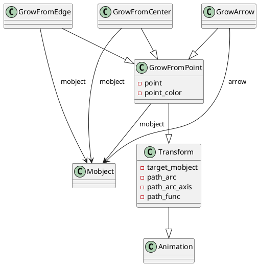
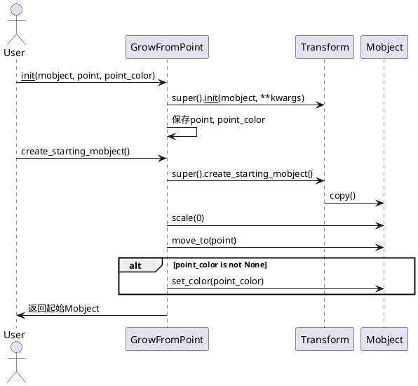

# Growing 动画类详解

## 1. 类及关键属性介绍（PlantUML类图）

### 涉及类
- `GrowFromPoint`
- `GrowFromCenter`
- `GrowFromEdge`
- `GrowArrow`
- 继承自：`Transform`（间接依赖`Animation`）
- 关键依赖：`Mobject`（所有动画的目标对象）

### 关键属性说明
- `GrowFromPoint`
  - `point`: 动画起始点，`np.ndarray`，决定对象从哪里生长。
  - `point_color`: 可选，生长起点的颜色。
- `GrowFromCenter`/`GrowFromEdge`/`GrowArrow`
  - 主要通过构造函数自动计算`point`，分别为中心、边缘、箭头起点。

#### PlantUML类图


---

## 2. 关键实现方法与算法（PlantUML时序图）

### GrowFromPoint 动画流程
- `__init__`: 记录起点、颜色，调用父类初始化。
- `create_target`: 返回目标对象的副本。
- `create_starting_mobject`: 生成动画起始对象（缩放为0，移动到起点，设置颜色）。

#### PlantUML时序图


---

## 3. 类的使用方法（高质量Python代码示例）

```python
from manimlib import *
import numpy as np

class GrowFromPointDemo(Scene):
    def construct(self):
        # 创建一个圆
        circle = Circle(radius=1, color=BLUE)
        # 指定生长起点
        start_point = np.array([2, 2, 0])
        # 使用GrowFromPoint动画
        self.play(GrowFromPoint(circle, start_point, point_color=YELLOW))
        self.wait()

class GrowFromCenterDemo(Scene):
    def construct(self):
        square = Square(side_length=2, color=GREEN)
        # GrowFromCenter自动以对象中心为起点
        self.play(GrowFromCenter(square))
        self.wait()

class GrowFromEdgeDemo(Scene):
    def construct(self):
        triangle = Triangle(color=RED)
        # 以右侧边缘为起点
        self.play(GrowFromEdge(triangle, edge=RIGHT))
        self.wait()

class GrowArrowDemo(Scene):
    def construct(self):
        arrow = Arrow(LEFT, RIGHT, color=WHITE)
        # GrowArrow自动以箭头起点为生长点
        self.play(GrowArrow(arrow))
        self.wait()
```

---

## 4. 总结与建议

### 各类定义与作用
- `GrowFromPoint`：对象从指定点“生长”出来，适合强调某一空间位置的生成效果。
- `GrowFromCenter`：对象从自身中心生长，常用于强调对象本身的出现。
- `GrowFromEdge`：对象从边缘生长，适合表现对象从某一方向进入。
- `GrowArrow`：专为箭头设计，从箭头起点生长，突出方向性。

### 使用场景
- 需要突出对象出现的空间位置或方向性时。
- 制作引导、强调、动态生成等动画效果。

### 使用特性与注意事项
- `point_color`可为空，若指定则起始对象会有该颜色，适合做视觉引导。
- `GrowFromEdge`的`edge`参数需为方向向量（如`RIGHT`、`UP`等）。
- 适用于所有`Mobject`子类对象。
- 动画起始对象会被缩放到0，动画过程中逐渐恢复原始大小和位置。

### 建议
- 合理选择生长点，避免动画突兀。
- 若对象较大，建议适当调整动画持续时间。
- 可结合`FadeIn`、`Transform`等动画实现更丰富的效果。
