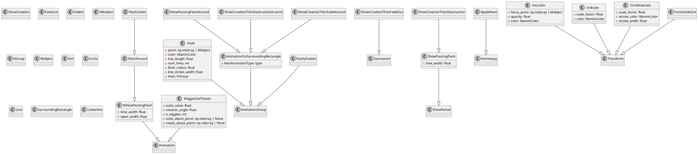
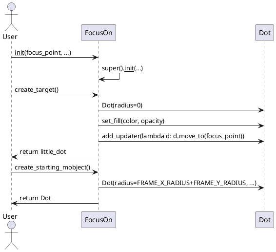
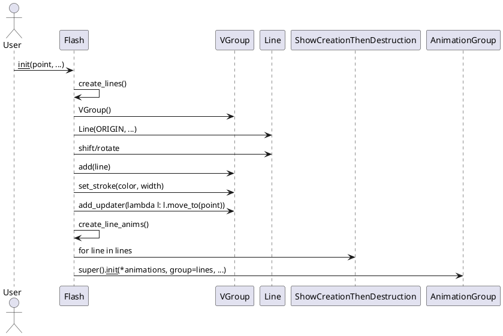
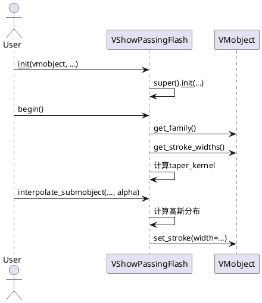

# manimlib.animation.indication 模块详解

---

## 1. 类结构与关键属性（PlantUML 类图）



---

## 2. 关键方法与算法实现（PlantUML 时序图）

### 2.1 FocusOn 动画流程


### 2.2 Flash 动画流程


### 2.3 VShowPassingFlash 动画流程


---

## 3. 典型用法示例

```python
from manimlib import *

class IndicationDemo(Scene):
    def construct(self):
        dot = Dot()
        self.add(dot)
        # 1. FocusOn
        self.play(FocusOn(dot))
        self.wait(0.5)
        # 2. Indicate
        self.play(Indicate(dot, scale_factor=1.5, color=BLUE))
        self.wait(0.5)
        # 3. Flash
        self.play(Flash(dot, color=RED, num_lines=8))
        self.wait(0.5)
        # 4. CircleIndicate
        self.play(CircleIndicate(dot, scale_factor=1.3, stroke_color=GREEN))
        self.wait(0.5)
        # 5. ShowPassingFlash
        line = Line(LEFT, RIGHT)
        self.add(line)
        self.play(ShowPassingFlash(line, time_width=0.2))
        self.wait(0.5)
        # 6. FlashAround
        square = Square()
        self.add(square)
        self.play(FlashAround(square, color=YELLOW))
        self.wait(0.5)
        # 7. WiggleOutThenIn
        self.play(WiggleOutThenIn(square, scale_value=1.2, n_wiggles=4))
        self.wait(0.5)
        # 8. TurnInsideOut
        self.play(TurnInsideOut(square))
        self.wait(0.5)
```

---

## 4. 总结与建议

### 类定义与作用
- **FocusOn**：用于聚焦某点或对象，常用于引导观众注意力。
- **Indicate**：对目标对象进行缩放和变色突出，适合强调。
- **Flash**：以放射状线条突出某点，常用于“闪烁”效果。
- **CircleIndicate**：用圆环突出对象，常用于强调。
- **ShowPassingFlash/VShowPassingFlash**：沿路径或轮廓快速闪现，适合高亮曲线或边界。
- **FlashAround/FlashUnder**：环绕或下划线方式闪现，适合高亮区域或下划线。
- **ShowCreationThenDestruction/ShowCreationThenFadeOut**：对象创建后立即消失或淡出，适合临时高亮。
- **AnimationOnSurroundingRectangle**及其子类：在对象周围矩形上应用动画，适合高亮区域。
- **ApplyWave**：波浪形变换，适合动态强调。
- **WiggleOutThenIn**：抖动动画，适合吸引注意。
- **TurnInsideOut**：对象翻转，适合特殊强调。
- **FlashyFadeIn**：结合闪现和淡入，适合炫酷入场。

### 使用建议与注意事项
- 这些动画多用于“强调”、“高亮”、“吸引注意”等场景。
- 参数如`scale_factor`、`color`、`time_width`等可灵活调整以适应不同视觉需求。
- 组合使用可获得更丰富的视觉效果。
- 注意动画的remover参数，决定动画结束后对象是否保留。
- 某些动画（如Flash）对点/对象的定位依赖updater，需保证对象在动画期间未被意外移除。
- 复杂动画建议分步调试，避免视觉混乱。

---

