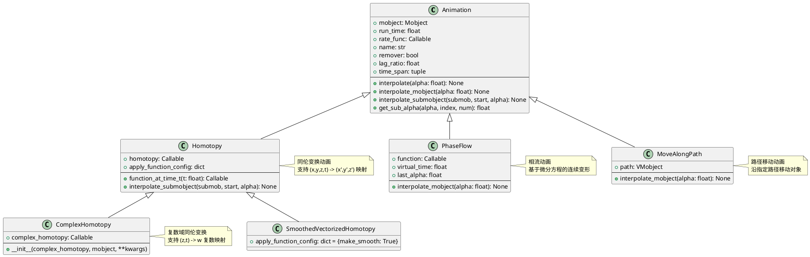
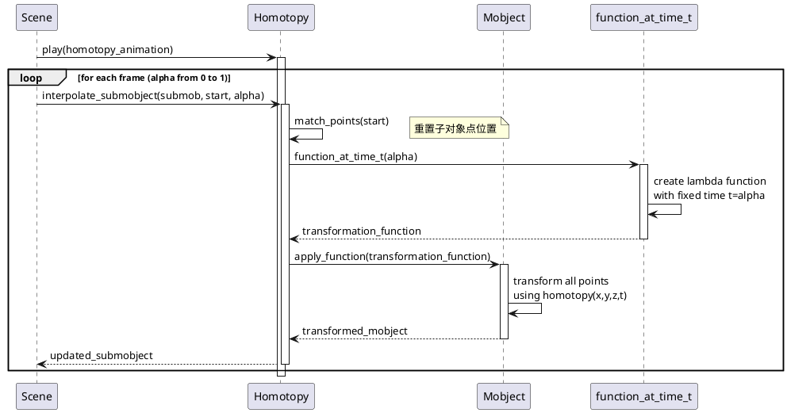
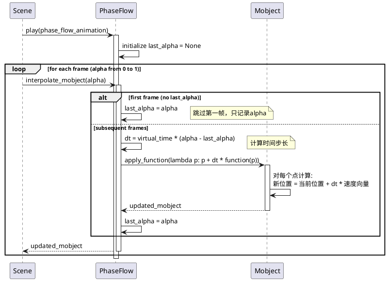
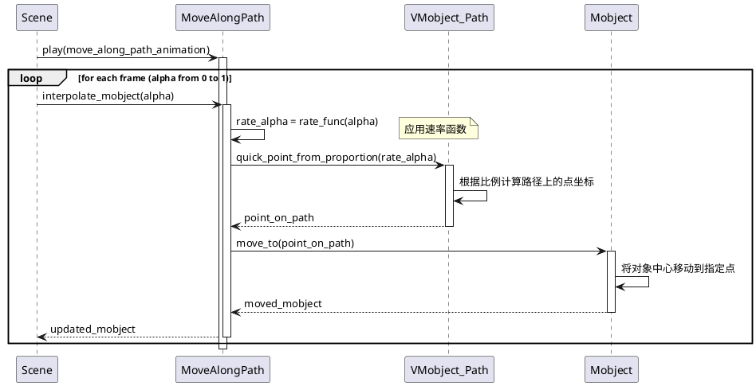

# Movement 动画模块详细分析

## 概述

`movement.py` 模块包含了 Manim 中用于处理对象移动和变形的核心动画类。该模块提供了四个主要的动画类：`Homotopy`、`SmoothedVectorizedHomotopy`、`ComplexHomotopy`、`PhaseFlow` 和 `MoveAlongPath`，它们都继承自基础的 `Animation` 类。

## 1. 类结构图



## 2. 关键属性说明

### Homotopy 类
- **homotopy**: `Callable[[float, float, float, float], Sequence[float]]` - 同伦函数，接受 (x, y, z, t) 参数，返回变换后的坐标
- **apply_function_config**: `dict` - 应用函数时的配置参数

### SmoothedVectorizedHomotopy 类
- **apply_function_config**: `dict` - 默认设置 `make_smooth=True`，用于平滑化向量化对象

### ComplexHomotopy 类
- **complex_homotopy**: `Callable[[complex, float], complex]` - 复数同伦函数，接受复数和时间参数

### PhaseFlow 类
- **function**: `Callable[[np.ndarray], np.ndarray]` - 向量场函数，定义每点的速度向量
- **virtual_time**: `float` - 虚拟时间，控制相流的时间尺度
- **last_alpha**: `float` - 上一次的 alpha 值，用于计算时间差

### MoveAlongPath 类
- **path**: `VMobject` - 移动路径，必须是向量化对象

## 3. 关键实现方法及算法

### 3.1 Homotopy 动画时序图



### 3.2 PhaseFlow 动画时序图



### 3.3 MoveAlongPath 动画时序图



## 4. 使用方法和代码示例

### 4.1 Homotopy 使用示例

```python
from manimlib import *

class HomotopyExample(Scene):
    def construct(self):
        # 创建一个正方形
        square = Square(color=BLUE)
        self.add(square)
        
        # 定义同伦函数：将正方形扭曲成波浪形
        def wave_homotopy(x, y, z, t):
            # t 从 0 到 1，逐渐增加波浪效果
            wave_amplitude = 0.5 * t
            new_y = y + wave_amplitude * np.sin(2 * PI * x)
            return [x, new_y, z]
        
        # 创建同伦动画
        wave_animation = Homotopy(
            homotopy=wave_homotopy,
            mobject=square,
            run_time=3.0
        )
        
        self.play(wave_animation)
        self.wait()

class ComplexHomotopyExample(Scene):
    def construct(self):
        # 创建复平面上的点集
        dots = VGroup(*[
            Dot([x, y, 0]) 
            for x in np.linspace(-2, 2, 20)
            for y in np.linspace(-2, 2, 20)
        ])
        self.add(dots)
        
        # 定义复数同伦：从恒等映射到平方映射
        def complex_transform(z, t):
            # t=0: z -> z (恒等)
            # t=1: z -> z^2 (平方)
            return z * (1 - t) + (z ** 2) * t
        
        # 创建复数同伦动画
        complex_anim = ComplexHomotopy(
            complex_homotopy=complex_transform,
            mobject=dots,
            run_time=4.0
        )
        
        self.play(complex_anim)
        self.wait()
```

### 4.2 PhaseFlow 使用示例

```python
class PhaseFlowExample(Scene):
    def construct(self):
        # 创建粒子系统
        particles = VGroup(*[
            Dot([x, y, 0], radius=0.05, color=YELLOW)
            for x in np.linspace(-3, 3, 15)
            for y in np.linspace(-2, 2, 10)
        ])
        self.add(particles)
        
        # 定义向量场：螺旋流
        def spiral_field(point):
            x, y, z = point
            r = np.sqrt(x**2 + y**2)
            if r == 0:
                return np.array([0, 0, 0])
            
            # 螺旋向量场
            vx = -y + 0.1 * x * (1 - r**2)
            vy = x + 0.1 * y * (1 - r**2)
            return np.array([vx, vy, 0])
        
        # 创建相流动画
        flow_animation = PhaseFlow(
            function=spiral_field,
            mobject=particles,
            virtual_time=2.0,
            run_time=5.0
        )
        
        self.play(flow_animation)
        self.wait()
```

### 4.3 MoveAlongPath 使用示例

```python
class MoveAlongPathExample(Scene):
    def construct(self):
        # 创建移动对象
        moving_dot = Dot(color=RED, radius=0.1)
        
        # 创建路径：心形曲线
        def heart_curve(t):
            x = 16 * np.sin(t)**3
            y = 13 * np.cos(t) - 5 * np.cos(2*t) - 2 * np.cos(3*t) - np.cos(4*t)
            return np.array([x/8, y/8, 0])
        
        # 创建参数化路径
        heart_path = ParametricFunction(
            heart_curve,
            t_range=[0, 2*PI],
            color=PINK
        )
        
        self.add(heart_path, moving_dot)
        
        # 沿路径移动动画
        move_animation = MoveAlongPath(
            mobject=moving_dot,
            path=heart_path,
            run_time=4.0,
            rate_func=linear
        )
        
        self.play(move_animation)
        self.wait()
```

### 4.4 SmoothedVectorizedHomotopy 使用示例

```python
class SmoothedHomotopyExample(Scene):
    def construct(self):
        # 创建文本对象
        text = Text("MANIM", font_size=72, color=BLUE)
        self.add(text)
        
        # 定义平滑变形函数
        def smooth_transform(x, y, z, t):
            # 创建波浪效果，但会自动平滑化
            amplitude = 0.8 * t
            frequency = 2
            new_y = y + amplitude * np.sin(frequency * PI * x)
            new_x = x * (1 + 0.2 * t * np.cos(PI * y))
            return [new_x, new_y, z]
        
        # 使用平滑化同伦动画
        smooth_anim = SmoothedVectorizedHomotopy(
            homotopy=smooth_transform,
            mobject=text,
            run_time=3.0
        )
        
        self.play(smooth_anim)
        self.wait()
```

## 5. 类的总结与使用建议

### 5.1 各类定义与作用

| 类名 | 定义 | 主要作用 |
|------|------|----------|
| **Homotopy** | 同伦变换动画基类 | 通过连续变形函数实现对象的平滑变换 |
| **SmoothedVectorizedHomotopy** | 平滑化同伦动画 | 对向量化对象进行平滑的同伦变换 |
| **ComplexHomotopy** | 复数域同伦动画 | 在复平面上进行数学变换动画 |
| **PhaseFlow** | 相流动画 | 基于向量场的连续流动效果 |
| **MoveAlongPath** | 路径移动动画 | 让对象沿预定义路径移动 |

### 5.2 使用场景

- **Homotopy**: 适用于需要自定义复杂变形的场景，如数学函数可视化、几何变换演示
- **SmoothedVectorizedHomotopy**: 适用于文本、SVG等向量化对象的平滑变形
- **ComplexHomotopy**: 适用于复分析、复函数可视化等数学教学场景
- **PhaseFlow**: 适用于物理仿真、流体动力学可视化、粒子系统动画
- **MoveAlongPath**: 适用于需要精确控制移动轨迹的动画场景

### 5.3 使用特性

#### 优势特性
1. **高度可定制**: 所有类都支持自定义变换函数
2. **数学精确性**: 基于严格的数学定义实现动画
3. **性能优化**: 继承自Animation基类，享受框架级优化
4. **组合能力**: 可与其他动画类组合使用

#### 性能特性
- **Homotopy**: 计算复杂度取决于同伦函数的复杂度
- **PhaseFlow**: 适合大量粒子的实时计算
- **MoveAlongPath**: 路径计算高效，适合复杂轨迹

### 5.4 注意事项与建议

#### 使用注意事项
1. **函数连续性**: 确保同伦函数在定义域内连续，避免突变
2. **性能考虑**: 复杂的变换函数可能影响渲染性能
3. **边界处理**: 注意处理变换后可能超出屏幕边界的情况
4. **时间参数**: PhaseFlow的virtual_time需要根据实际需求调整

#### 最佳实践建议
1. **渐进式设计**: 从简单的变换开始，逐步增加复杂度
2. **参数调优**: 合理设置run_time和rate_func以获得最佳视觉效果
3. **组合使用**: 结合多个动画类创建复合效果
4. **测试验证**: 在复杂场景中充分测试动画效果

#### 常见问题解决
- **变形不平滑**: 使用SmoothedVectorizedHomotopy或调整rate_func
- **性能问题**: 简化变换函数或减少对象数量
- **路径不准确**: 检查路径对象的参数化是否正确
- **复数变换异常**: 确保复数函数在整个定义域内有效

### 5.6 扩展建议

1. **自定义rate_func**: 创建特定的速率函数以获得独特的动画节奏
2. **组合动画**: 将movement动画与其他类型动画结合
3. **交互式参数**: 在教学场景中允许实时调整变换参数
4. **批量处理**: 对多个对象同时应用相同的变换逻辑