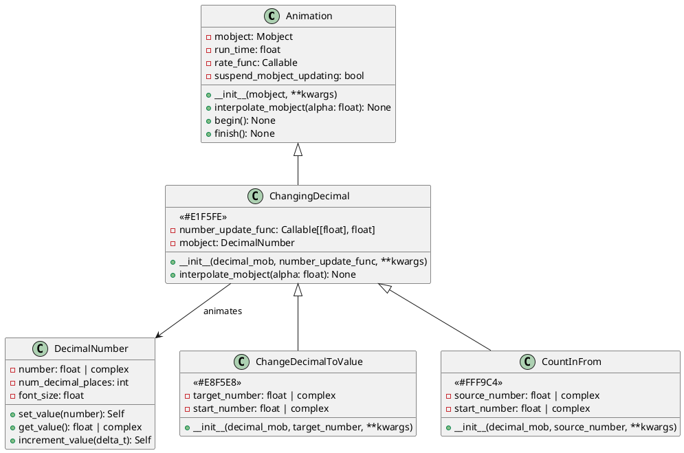
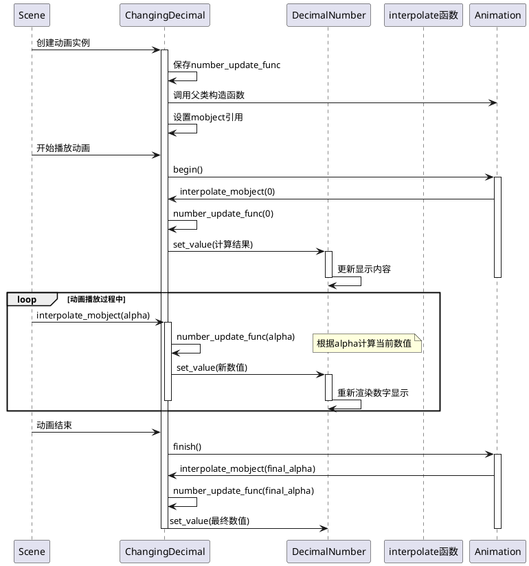
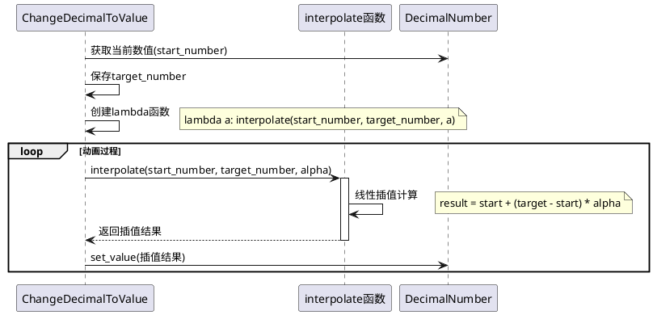
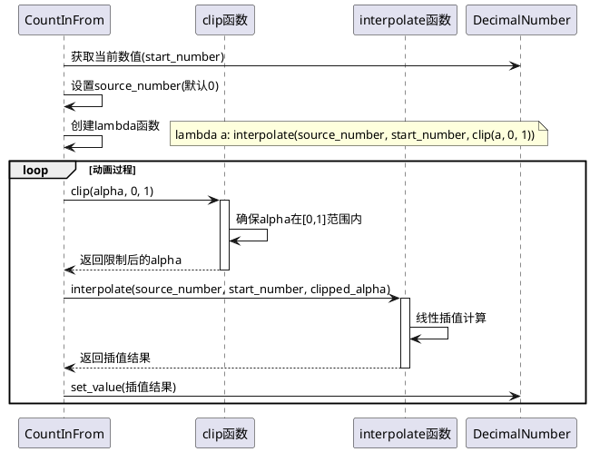

# Numbers Animation 模块分析

## 概述

`manimlib/animation/numbers.py` 模块提供了专门用于数字动画的类，主要用于创建数字变化的动画效果。该模块包含三个核心类：`ChangingDecimal`、`ChangeDecimalToValue` 和 `CountInFrom`，它们都继承自基础的 `Animation` 类。

## 1. 类结构分析

### 1.1 类图



### 1.2 关键属性说明

#### ChangingDecimal 类
- **number_update_func**: `Callable[[float], float]` - 数字更新函数，接收动画进度alpha(0-1)，返回当前应显示的数值
- **mobject**: `DecimalNumber` - 被动画化的数字对象，必须是DecimalNumber类型
- **suspend_mobject_updating**: `bool` - 是否暂停mobject的内部更新器，默认为False

#### ChangeDecimalToValue 类
- **target_number**: `float | complex` - 目标数值，动画结束时数字将变为此值
- **start_number**: `float | complex` - 起始数值，从DecimalNumber对象当前值获取

#### CountInFrom 类
- **source_number**: `float | complex` - 源数值，动画开始时的数值，默认为0
- **start_number**: `float | complex` - 目标数值，从DecimalNumber对象当前值获取

## 2. 关键实现方法与算法

### 2.1 核心算法时序图



### 2.2 ChangeDecimalToValue 算法流程



### 2.3 CountInFrom 算法流程



## 3. 使用方法与代码示例

### 3.1 基础使用示例

```python
from manimlib import *

class NumberAnimationExample(Scene):
    def construct(self):
        # 创建数字对象
        decimal = DecimalNumber(0, num_decimal_places=2)
        decimal.scale(2).move_to(ORIGIN)
        self.add(decimal)
        
        # 示例1: 使用ChangingDecimal创建自定义数字变化
        def custom_func(alpha):
            return alpha ** 2 * 100  # 平方增长到100
        
        changing_anim = ChangingDecimal(
            decimal, 
            custom_func,
            run_time=3
        )
        self.play(changing_anim)
        self.wait()
        
        # 示例2: 使用ChangeDecimalToValue改变到特定值
        change_to_anim = ChangeDecimalToValue(
            decimal,
            target_number=50.75,
            run_time=2
        )
        self.play(change_to_anim)
        self.wait()
        
        # 示例3: 使用CountInFrom从0开始计数
        decimal.set_value(25.5)  # 设置目标值
        count_in_anim = CountInFrom(
            decimal,
            source_number=0,
            run_time=2
        )
        self.play(count_in_anim)
        self.wait()
```

### 3.2 高级使用示例

```python
class AdvancedNumberAnimations(Scene):
    def construct(self):
        # 创建多个数字对象
        numbers = VGroup(*[
            DecimalNumber(0, num_decimal_places=1).scale(1.5)
            for _ in range(3)
        ])
        numbers.arrange(RIGHT, buff=2)
        self.add(numbers)
        
        # 同时播放不同类型的数字动画
        animations = [
            # 线性增长
            ChangeDecimalToValue(numbers[0], 10.0, run_time=3),
            # 指数增长
            ChangingDecimal(
                numbers[1], 
                lambda a: a ** 3 * 20,
                run_time=3
            ),
            # 正弦波动画
            ChangingDecimal(
                numbers[2],
                lambda a: 10 * np.sin(2 * PI * a),
                run_time=3
            )
        ]
        
        self.play(*animations)
        self.wait()
        
        # 创建计数器效果
        counter = DecimalNumber(100, num_decimal_places=0)
        counter.scale(2).move_to(DOWN * 2)
        self.add(counter)
        
        # 倒计时动画
        countdown = ChangingDecimal(
            counter,
            lambda a: 100 * (1 - a),  # 从100倒数到0
            run_time=5
        )
        self.play(countdown)
        self.wait()
```

### 3.3 复杂数字动画示例

```python
class ComplexNumberAnimations(Scene):
    def construct(self):
        # 创建复数显示
        complex_num = DecimalNumber(0+0j, num_decimal_places=2)
        complex_num.scale(1.5).move_to(ORIGIN)
        self.add(complex_num)
        
        # 复数动画：在复平面上画圆
        def complex_circle(alpha):
            angle = 2 * PI * alpha
            return 3 * (np.cos(angle) + 1j * np.sin(angle))
        
        complex_anim = ChangingDecimal(
            complex_num,
            complex_circle,
            run_time=4
        )
        self.play(complex_anim)
        self.wait()
        
        # 创建带单位的数字
        percentage = DecimalNumber(0, num_decimal_places=1, unit="%")
        percentage.scale(2).move_to(UP * 2)
        self.add(percentage)
        
        # 百分比增长动画
        percent_anim = ChangeDecimalToValue(
            percentage,
            target_number=100,
            run_time=3
        )
        self.play(percent_anim)
        self.wait()
        
        # 创建多阶段动画
        multi_stage_num = DecimalNumber(0, num_decimal_places=2)
        multi_stage_num.scale(2).move_to(DOWN * 2)
        self.add(multi_stage_num)
        
        # 分段函数动画
        def piecewise_func(alpha):
            if alpha < 0.3:
                return alpha * 10 / 0.3  # 快速增长到10
            elif alpha < 0.7:
                return 10  # 保持在10
            else:
                return 10 - (alpha - 0.7) * 10 / 0.3  # 快速下降到0
        
        piecewise_anim = ChangingDecimal(
            multi_stage_num,
            piecewise_func,
            run_time=6
        )
        self.play(piecewise_anim)
        self.wait()
```

## 4. 类的总结与使用建议

### 4.1 类的定义与作用

#### ChangingDecimal
- **定义**: 基础数字动画类，通过自定义函数控制数字变化
- **作用**: 提供最大的灵活性，可以实现任意数学函数的数字动画
- **使用场景**: 需要复杂数字变化规律的场景，如数学函数可视化、物理模拟等

#### ChangeDecimalToValue
- **定义**: 数字值变化动画类，从当前值线性变化到目标值
- **作用**: 实现简单直观的数字变化效果
- **使用场景**: 计数器、进度条、数值更新等常见场景

#### CountInFrom
- **定义**: 计数动画类，从指定源值计数到当前值
- **作用**: 创建计数效果，常用于数字揭示动画
- **使用场景**: 统计数据展示、成绩揭晓、倒计时等

### 4.2 使用特性

1. **继承关系清晰**: 所有类都基于Animation基类，保证了动画系统的一致性
2. **类型安全**: 严格要求mobject必须是DecimalNumber类型
3. **函数式设计**: 通过函数参数控制动画行为，提供高度的可定制性
4. **插值算法**: 使用线性插值实现平滑的数字变化
5. **复数支持**: 支持复数动画，适用于复平面可视化

### 4.3 建议与注意事项

#### 使用建议
1. **选择合适的类**: 
   - 简单数值变化使用`ChangeDecimalToValue`
   - 复杂变化规律使用`ChangingDecimal`
   - 计数效果使用`CountInFrom`

2. **性能优化**:
   - 避免在`number_update_func`中进行复杂计算
   - 合理设置`num_decimal_places`以平衡精度和性能
   - 使用`suspend_mobject_updating=True`避免不必要的更新

3. **视觉效果**:
   - 配合适当的`rate_func`增强动画效果
   - 考虑数字变化的视觉连续性
   - 合理设置动画时长，避免变化过快或过慢

#### 注意事项
1. **类型检查**: 确保传入的mobject是DecimalNumber类型，否则会抛出断言错误
2. **数值范围**: 注意数字显示的范围和精度限制
3. **内存管理**: 长时间运行的数字动画可能会消耗较多内存
4. **同步问题**: 多个数字动画同时运行时注意同步和协调

#### 扩展建议
1. **自定义缓动函数**: 结合不同的rate_func创建更丰富的动画效果
2. **组合动画**: 将数字动画与其他动画类型组合使用
3. **交互式动画**: 结合用户输入创建交互式数字动画
4. **数据驱动**: 从外部数据源驱动数字动画的变化

### 4.4 常见问题解决

1. **数字跳跃**: 如果数字变化不够平滑，检查`number_update_func`的连续性
2. **性能问题**: 减少小数位数或优化更新函数的计算复杂度
3. **显示异常**: 确保DecimalNumber的配置参数正确设置
4. **动画不同步**: 检查各个动画的`run_time`和`rate_func`设置

通过合理使用这些数字动画类，可以创建出生动、专业的数学和科学可视化内容。