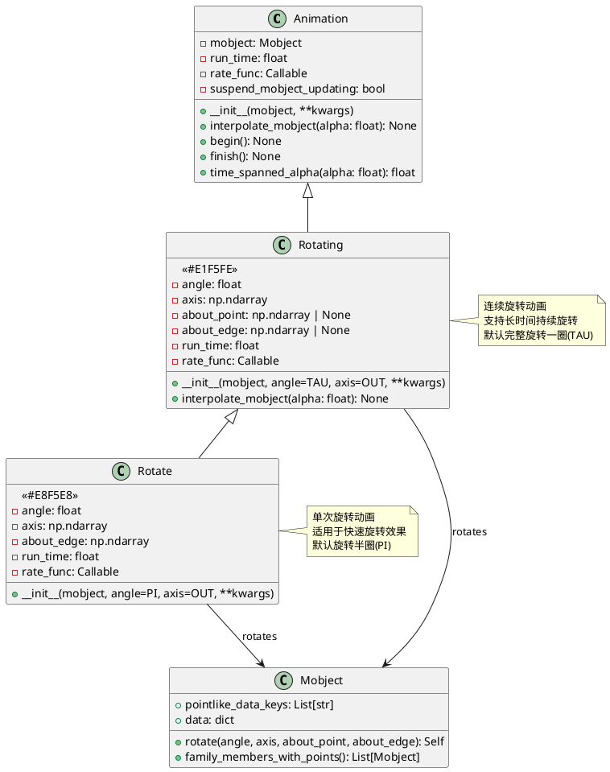
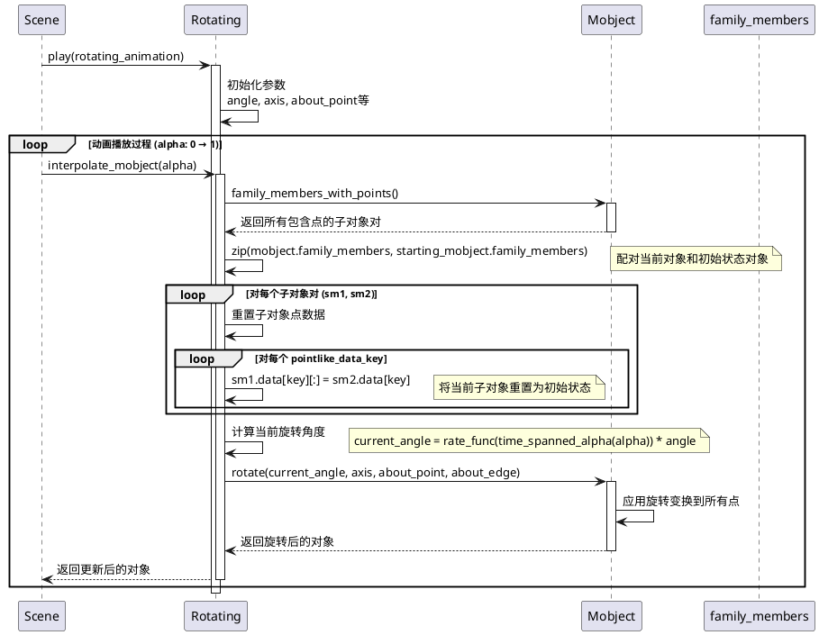
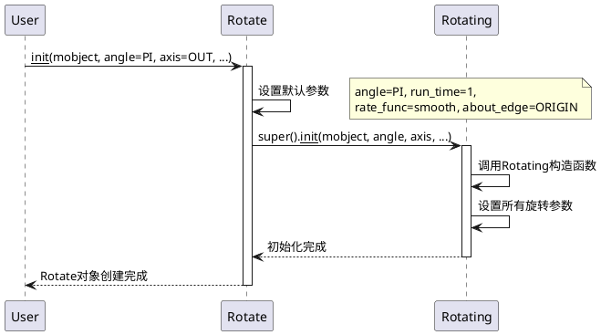

# Rotation 动画模块详细分析

## 概述

`manimlib/animation/rotation.py` 模块提供了专门用于旋转动画的类，是Manim中处理对象旋转效果的核心模块。该模块包含两个主要的动画类：`Rotating`（连续旋转动画）和 `Rotate`（单次旋转动画），它们都继承自基础的 `Animation` 类。

## 1. 类结构和关键属性

### 1.1 类图（PlantUML）



### 1.2 关键属性说明

#### Rotating 类
- **angle**: `float` - 总旋转角度，默认为 `TAU` (2π，完整一圈)
- **axis**: `np.ndarray` - 旋转轴向量，默认为 `OUT` (z轴方向)
- **about_point**: `np.ndarray | None` - 旋转中心点，如果指定则围绕此点旋转
- **about_edge**: `np.ndarray | None` - 旋转边界参考，与 `about_point` 互斥
- **run_time**: `float` - 动画运行时间，默认为 5.0 秒
- **rate_func**: `Callable[[float], float]` - 速率函数，默认为 `linear` (匀速旋转)
- **suspend_mobject_updating**: `bool` - 是否暂停对象内部更新器

#### Rotate 类  
- **angle**: `float` - 旋转角度，默认为 `PI` (π，半圈)
- **axis**: `np.ndarray` - 旋转轴向量，默认为 `OUT` (z轴方向)
- **about_edge**: `np.ndarray` - 旋转参考边，默认为 `ORIGIN` (原点)
- **run_time**: `float` - 动画运行时间，默认为 1.0 秒
- **rate_func**: `Callable[[float], float]` - 速率函数，默认为 `smooth` (平滑加速减速)

## 2. 关键实现方法及算法

### 2.1 Rotating 动画时序图



### 2.2 关键算法解析

#### 2.2.1 点重置算法
```python
# 伪代码展示核心算法
for sm1, sm2 in zip(mobject.family_members_with_points(), 
                    starting_mobject.family_members_with_points()):
    for key in sm1.pointlike_data_keys:
        sm1.data[key][:] = sm2.data[key]  # 重置到初始状态
```

#### 2.2.2 旋转角度计算
```python
# 考虑速率函数和时间跨度的角度计算
current_angle = rate_func(time_spanned_alpha(alpha)) * total_angle
```

#### 2.2.3 增量旋转 vs 绝对旋转
- **Rotating**: 使用绝对旋转 - 每帧都重置到初始状态然后应用总角度
- **优势**: 避免累积误差，确保最终状态准确
- **适用场景**: 连续长时间旋转，需要精确控制最终角度

### 2.3 Rotate 初始化时序图



## 3. 使用方法和代码示例

### 3.1 基础旋转动画示例

```python
from manimlib import *

class BasicRotationDemo(Scene):
    def construct(self):
        # 创建几何对象
        square = Square(color=BLUE, side_length=2)
        triangle = Triangle(color=RED).shift(LEFT * 3)
        circle = Circle(color=GREEN).shift(RIGHT * 3)
        
        self.add(square, triangle, circle)
        self.wait()
        
        # 基础Rotate动画 - 快速旋转半圈
        self.play(
            Rotate(square, angle=PI, axis=OUT),
            run_time=1
        )
        self.wait()
        
        # 自定义角度旋转
        self.play(
            Rotate(triangle, angle=PI/3, axis=OUT),  # 旋转60度
            run_time=0.5
        )
        self.wait()
        
        # 连续完整旋转
        self.play(
            Rotating(circle, angle=TAU, axis=OUT),
            run_time=3
        )
        self.wait()
```

### 3.2 高级旋转技巧示例

```python
class AdvancedRotationDemo(Scene):
    def construct(self):
        # 创建复合对象
        logo = VGroup(
            Text("MANIM", font_size=48, color=BLUE),
            Circle(radius=0.5, color=YELLOW).shift(UP * 0.8)
        )
        self.add(logo)
        
        # 围绕特定点旋转
        rotation_point = DOWN * 2
        dot = Dot(rotation_point, color=RED, radius=0.1)
        self.add(dot)
        
        self.play(
            Rotate(
                logo,
                angle=PI,
                about_point=rotation_point,  # 围绕红点旋转
                run_time=2,
                rate_func=smooth
            )
        )
        self.wait()
        
        # 3D旋转 - 围绕Y轴
        cube = Cube(side_length=1.5, color=PURPLE)
        self.add(cube)
        
        self.play(
            Rotating(
                cube,
                angle=2*TAU,  # 旋转两圈
                axis=UP,      # Y轴旋转
                run_time=4,
                rate_func=linear
            )
        )
        self.wait()
        
        # 多轴同时旋转
        multi_cube = Cube(side_length=1, color=ORANGE).shift(LEFT * 3)
        self.add(multi_cube)
        
        # 组合多个旋转动画
        self.play(
            AnimationGroup(
                Rotating(multi_cube, angle=TAU, axis=RIGHT, run_time=3),
                Rotating(multi_cube, angle=TAU/2, axis=UP, run_time=3),
                lag_ratio=0
            )
        )
        self.wait()
```

### 3.3 动态旋转和交互式示例

```python
class DynamicRotationDemo(Scene):
    def construct(self):
        # 创建旋转对象群组
        objects = VGroup()
        colors = [RED, BLUE, GREEN, YELLOW, PURPLE]
        
        for i, color in enumerate(colors):
            obj = RegularPolygon(n=i+3, color=color, radius=0.5)
            obj.shift(RIGHT * (i-2) * 1.5)
            objects.add(obj)
        
        self.add(objects)
        
        # 波浪式旋转效果
        animations = []
        for i, obj in enumerate(objects):
            # 每个对象延迟启动，形成波浪效果
            rotation = Rotating(
                obj,
                angle=2*TAU,
                run_time=4,
                rate_func=smooth
            )
            animations.append(rotation)
        
        # 使用lag_ratio创建连锁效果
        self.play(
            AnimationGroup(*animations, lag_ratio=0.2)
        )
        self.wait()
        
        # 震荡旋转效果
        pendulum = Line(ORIGIN, DOWN*2, color=WHITE, stroke_width=3)
        bob = Circle(radius=0.2, color=GOLD).move_to(pendulum.get_end())
        pendulum_group = VGroup(pendulum, bob)
        
        self.add(pendulum_group)
        
        # 模拟钟摆运动
        def pendulum_func(alpha):
            # 创建阻尼震荡效果
            decay = np.exp(-alpha * 2)
            oscillation = np.sin(alpha * 8 * PI)
            return decay * oscillation * 0.3  # 最大摆角30度
        
        # 自定义旋转函数
        class PendulumRotation(Rotating):
            def interpolate_mobject(self, alpha):
                angle = pendulum_func(alpha)
                # 重置到初始状态
                pairs = zip(
                    self.mobject.family_members_with_points(),
                    self.starting_mobject.family_members_with_points(),
                )
                for sm1, sm2 in pairs:
                    for key in sm1.pointlike_data_keys:
                        sm1.data[key][:] = sm2.data[key]
                # 应用当前角度
                self.mobject.rotate(angle, axis=OUT, about_point=ORIGIN)
        
        self.play(
            PendulumRotation(pendulum_group, run_time=5)
        )
        self.wait()
```

### 3.4 性能优化示例

```python
class OptimizedRotationDemo(Scene):
    def construct(self):
        # 大量对象的高效旋转
        NUM_PARTICLES = 100
        particles = VGroup()
        
        for i in range(NUM_PARTICLES):
            angle = i * TAU / NUM_PARTICLES
            radius = 3
            x = radius * np.cos(angle)
            y = radius * np.sin(angle)
            
            particle = Dot(
                point=[x, y, 0],
                radius=0.05,
                color=interpolate_color(RED, BLUE, i/NUM_PARTICLES)
            )
            particles.add(particle)
        
        self.add(particles)
        
        # 整体旋转 - 比单独旋转每个粒子更高效
        self.play(
            Rotating(
                particles,
                angle=2*TAU,
                run_time=6,
                rate_func=linear
            )
        )
        self.wait()
        
        # 分层旋转系统
        inner_ring = Circle(radius=1, color=WHITE)
        middle_ring = Circle(radius=2, color=GRAY)
        outer_ring = Circle(radius=3, color=DARK_GRAY)
        
        rings = VGroup(outer_ring, middle_ring, inner_ring)
        self.add(rings)
        
        # 不同速度的同心圆旋转
        self.play(
            Rotating(outer_ring, angle=TAU, run_time=6, rate_func=linear),
            Rotating(middle_ring, angle=2*TAU, run_time=6, rate_func=linear),
            Rotating(inner_ring, angle=3*TAU, run_time=6, rate_func=linear)
        )
        self.wait()
```

## 4. 总结

### 4.1 类的定义和作用

#### Rotating 类
- **定义**: 连续旋转动画类，用于创建长时间持续的旋转效果
- **作用**: 提供平滑、连续的旋转动画，支持多圈旋转
- **特点**: 
  - 默认完整旋转一圈(TAU=2π)
  - 较长的默认运行时间(5秒)
  - 使用线性速率函数(匀速旋转)

#### Rotate 类
- **定义**: 单次旋转动画类，继承自Rotating，用于快速旋转效果
- **作用**: 提供短时间内的旋转动画，适合强调和转场效果
- **特点**:
  - 默认旋转半圈(PI=π)
  - 较短的默认运行时间(1秒)
  - 使用平滑速率函数(ease-in-out)

### 4.2 使用场景

#### Rotating 适用场景
- 🔄 **持续旋转效果**: 如风车、齿轮、loading动画
- 🎯 **演示旋转对称性**: 展示几何图形的旋转对称特性
- 🌊 **背景动态元素**: 为场景添加动态背景效果
- 📐 **角度概念演示**: 教学中演示角度和圆周角概念

#### Rotate 适用场景
- ⚡ **快速强调效果**: 突出显示特定元素
- 🔄 **状态转换**: 表示对象状态的改变
- 📱 **UI转场动画**: 界面元素的出现和消失
- 🎨 **艺术效果**: 创造性的视觉呈现

### 4.3 使用特性和注意事项

#### 优势特性
1. **精确控制**: 支持任意角度、轴向和旋转中心
2. **无累积误差**: 每帧重置避免了数值累积误差
3. **高度可定制**: 丰富的参数选项满足各种需求
4. **性能优化**: 批量处理子对象，提高动画性能

#### 注意事项
1. **旋转中心选择**:
   ```python
   # 优先级: about_point > about_edge > 对象中心
   Rotate(obj, about_point=custom_point)  # 推荐
   ```

2. **轴向量规范化**:
   ```python
   # 确保轴向量为单位向量
   axis = normalize(np.array([1, 1, 0]))
   Rotate(obj, axis=axis)
   ```

3. **性能优化建议**:
   ```python
   # 优选：整体旋转VGroup
   group = VGroup(*objects)
   Rotating(group)
   
   # 避免：单独旋转每个对象
   # for obj in objects: Rotating(obj)  # 低效
   ```

4. **角度单位**:
   ```python
   # 使用弧度制，常用角度常量
   PI/6     # 30度
   PI/4     # 45度  
   PI/3     # 60度
   PI/2     # 90度
   PI       # 180度
   TAU      # 360度(2π)
   ```

#### 建议和最佳实践

1. **选择合适的类**:
   - 短暂旋转 → `Rotate`
   - 持续旋转 → `Rotating`

2. **合理设置运行时间**:
   - 快速效果: 0.5-1秒
   - 正常动画: 1-3秒
   - 演示动画: 3-6秒

3. **组合使用不同速率函数**:
   ```python
   # 突然开始，逐渐停止
   rate_func=ease_out_cubic
   
   # 逐渐加速，突然停止  
   rate_func=ease_in_cubic
   
   # 平滑加速减速
   rate_func=smooth
   ```

4. **3D旋转考虑相机角度**:
   ```python
   # 3D场景中使用ThreeDScene
   self.move_camera(phi=75*DEGREES, theta=30*DEGREES)
   ```

这个模块为Manim提供了强大而灵活的旋转动画功能，是创建动态几何演示和视觉效果的重要工具。通过合理使用`Rotating`和`Rotate`类，可以实现从简单的对象旋转到复杂的多层旋转系统等各种效果。