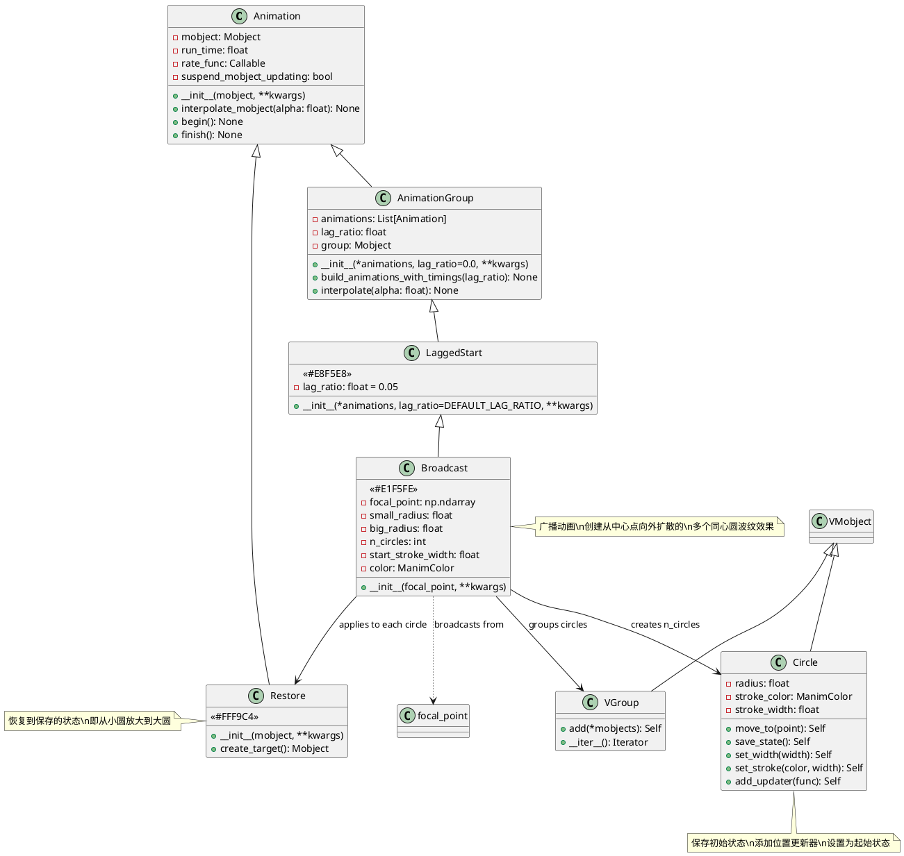
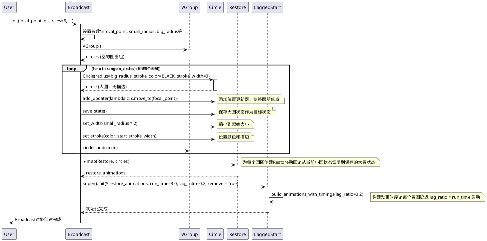
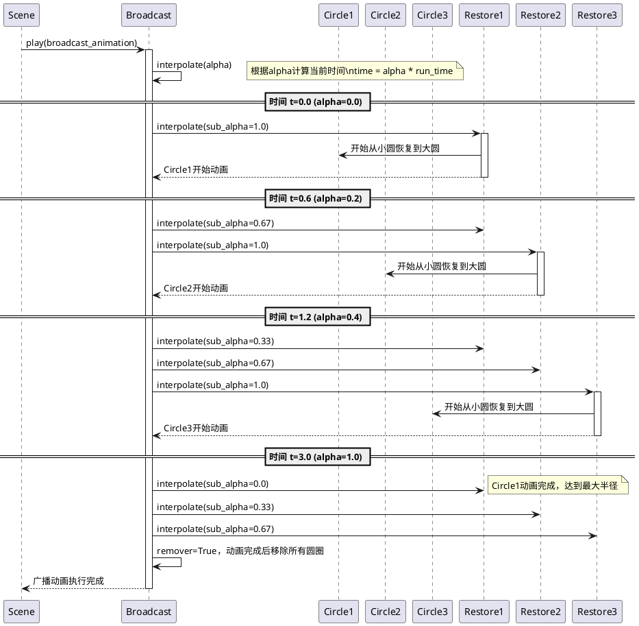

# Specialized Animation 模块详细分析

## 概述

`manimlib/animation/specialized.py` 模块提供了专门的特殊效果动画类，目前包含一个核心类：`Broadcast`（广播动画）。该类继承自 `LaggedStart`，用于创建类似波纹传播或广播信号的视觉效果，通过多个同心圆的依次展开来模拟从中心点向外传播的效果。

## 1. 类结构和关键属性

### 1.1 类图（PlantUML）



### 1.2 关键属性说明

#### Broadcast 类
- **focal_point**: `np.ndarray` - 广播的焦点/中心点，波纹从此点向外传播
- **small_radius**: `float` - 起始半径，每个圆圈开始时的大小，默认为 0.0
- **big_radius**: `float` - 结束半径，每个圆圈最终展开到的大小，默认为 5.0
- **n_circles**: `int` - 圆圈数量，决定波纹的层数，默认为 5 个
- **start_stroke_width**: `float` - 起始描边宽度，影响圆圈的粗细，默认为 8.0
- **color**: `ManimColor` - 圆圈颜色，默认为白色 (WHITE)
- **run_time**: `float` - 动画总运行时间，默认为 3.0 秒
- **lag_ratio**: `float` - 延迟比例，控制各圆圈之间的启动延迟，默认为 0.2
- **remover**: `bool` - 动画完成后是否自动移除对象，默认为 True

#### 继承属性 (来自 LaggedStart)
- **animations**: `List[Animation]` - 包含的子动画列表（每个圆的Restore动画）
- **anims_with_timings**: `List[Tuple]` - 带时间信息的动画列表

## 2. 关键实现方法及算法

### 2.1 Broadcast 动画构建时序图



### 2.2 Broadcast 动画执行时序图



### 2.3 核心算法解析

#### 2.3.1 圆圈状态管理算法
```python
# 伪代码展示核心状态管理逻辑
for x in range(n_circles):
    circle = Circle(radius=big_radius, stroke_color=BLACK, stroke_width=0)
    
    # 1. 添加位置跟踪器 - 确保圆圈始终以focal_point为中心
    circle.add_updater(lambda c: c.move_to(focal_point))
    
    # 2. 保存目标状态（大圆状态）
    circle.save_state()  # saved_state = 大圆 + 无描边
    
    # 3. 设置起始状态（小圆状态）
    circle.set_width(small_radius * 2)  # 缩小为起始大小
    circle.set_stroke(color, start_stroke_width)  # 添加可见描边
```

#### 2.3.2 延迟启动算法
```python
# LaggedStart的延迟计算逻辑
def build_animations_with_timings(self, lag_ratio):
    curr_time = 0
    for anim in self.animations:  # 每个Restore动画
        start_time = curr_time
        end_time = start_time + anim.get_run_time()
        
        # 下一个动画的启动时间 = 当前动画的 lag_ratio 进度点
        curr_time = start_time + lag_ratio * (end_time - start_time)
        
        # lag_ratio=0.2 意味着当前动画进行到20%时，下个动画开始
```

#### 2.3.3 视觉效果原理
- **波纹效果**: 通过 `small_radius=0` 到 `big_radius=5` 的放大实现
- **传播效果**: 通过 `lag_ratio=0.2` 的延迟启动实现
- **消散效果**: 通过 `stroke_width` 在放大过程中的视觉变化实现
- **定位效果**: 通过 `add_updater` 确保所有圆圈始终以焦点为中心

## 3. 使用方法和代码示例

### 3.1 基础广播动画示例

```python
from manimlib import *

class BasicBroadcastDemo(Scene):
    def construct(self):
        # 基础广播动画 - 从屏幕中心发出
        center_point = ORIGIN
        
        self.play(
            Broadcast(
                focal_point=center_point,
                small_radius=0.1,
                big_radius=4.0,
                n_circles=5,
                color=BLUE,
                run_time=3.0
            )
        )
        self.wait(1)
        
        # 多点同时广播
        points = [LEFT*2 + UP, RIGHT*2 + UP, DOWN*2]
        colors = [RED, GREEN, YELLOW]
        
        broadcasts = []
        for point, color in zip(points, colors):
            broadcasts.append(
                Broadcast(
                    focal_point=point,
                    small_radius=0.0,
                    big_radius=2.5,
                    n_circles=4,
                    color=color,
                    run_time=2.5
                )
            )
        
        self.play(*broadcasts)
        self.wait()
```

### 3.2 交互式广播效果示例

```python
class InteractiveBroadcastDemo(Scene):
    def construct(self):
        # 创建可点击的触发点
        trigger_points = [
            LEFT*3, RIGHT*3, UP*2, DOWN*2, ORIGIN
        ]
        
        # 显示触发点
        dots = VGroup(*[
            Dot(point, color=WHITE, radius=0.1) 
            for point in trigger_points
        ])
        self.add(dots)
        
        # 依次在每个点触发广播
        for i, point in enumerate(trigger_points):
            # 高亮当前触发点
            self.play(
                dots[i].animate.set_color(YELLOW).scale(1.5),
                run_time=0.3
            )
            
            # 从该点发出广播
            self.play(
                Broadcast(
                    focal_point=point,
                    small_radius=0.05,
                    big_radius=3.0,
                    n_circles=6,
                    color=interpolate_color(BLUE, RED, i/len(trigger_points)),
                    start_stroke_width=6,
                    run_time=2.0,
                    lag_ratio=0.15
                ),
                dots[i].animate.set_color(WHITE).scale(1/1.5),  # 恢复原状
                run_time=2.0
            )
            self.wait(0.5)
```

### 3.3 自定义广播效果示例

```python
class CustomBroadcastDemo(Scene):
    def construct(self):
        # 雷达扫描效果 - 快速小范围广播
        radar_center = ORIGIN
        self.play(
            Broadcast(
                focal_point=radar_center,
                small_radius=0.2,
                big_radius=2.0,
                n_circles=8,
                color=GREEN,
                start_stroke_width=4,
                run_time=1.5,
                lag_ratio=0.1  # 快速连续
            )
        )
        self.wait()
        
        # 冲击波效果 - 慢速大范围广播
        impact_point = UP * 1.5
        self.play(
            Broadcast(
                focal_point=impact_point,
                small_radius=0.0,
                big_radius=6.0,
                n_circles=3,
                color=RED,
                start_stroke_width=12,
                run_time=4.0,
                lag_ratio=0.4  # 间隔较大
            )
        )
        self.wait()
        
        # 涟漪效果 - 精细多层广播
        water_point = DOWN * 1.5
        self.play(
            Broadcast(
                focal_point=water_point,
                small_radius=0.1,
                big_radius=4.5,
                n_circles=10,
                color=BLUE,
                start_stroke_width=3,
                run_time=5.0,
                lag_ratio=0.08  # 密集波纹
            )
        )
        self.wait()
```

### 3.4 动态焦点广播示例

```python
class DynamicBroadcastDemo(Scene):
    def construct(self):
        # 移动的广播源
        source = Dot(LEFT*3, color=YELLOW, radius=0.15)
        self.add(source)
        
        # 创建路径
        path = Line(LEFT*3, RIGHT*3, stroke_color=GRAY, stroke_width=2)
        self.add(path)
        
        # 沿路径移动并持续发出广播
        broadcasts = []
        
        # 在移动过程中的几个关键点发出广播
        positions = np.linspace(LEFT*3, RIGHT*3, 6)
        
        for i, pos in enumerate(positions):
            broadcasts.append(
                Broadcast(
                    focal_point=pos,
                    small_radius=0.0,
                    big_radius=2.0,
                    n_circles=4,
                    color=interpolate_color(PURPLE, ORANGE, i/len(positions)),
                    run_time=1.8,
                    lag_ratio=0.2
                )
            )
        
        # 同时移动源点和播放广播
        self.play(
            source.animate.move_to(RIGHT*3),
            AnimationGroup(*broadcasts, lag_ratio=0.3),
            run_time=6.0
        )
        self.wait()
        
        # 最终大型广播
        self.play(
            Broadcast(
                focal_point=RIGHT*3,
                small_radius=0.0,
                big_radius=8.0,
                n_circles=8,
                color=WHITE,
                start_stroke_width=10,
                run_time=3.5,
                lag_ratio=0.12
            )
        )
        self.wait()
```

### 3.5 科学演示应用示例

```python
class ScientificBroadcastDemo(Scene):
    def construct(self):
        # 标题
        title = Text("电磁波传播演示", font_size=48, color=WHITE).to_edge(UP)
        self.add(title)
        
        # 发射器
        transmitter = VGroup(
            Rectangle(width=0.3, height=0.6, color=GRAY),
            Line(UP*0.3, UP*0.8, stroke_width=4, color=YELLOW)
        )
        transmitter.move_to(LEFT*4)
        self.add(transmitter)
        
        # 接收器
        receiver = VGroup(
            Rectangle(width=0.3, height=0.6, color=GRAY),
            Line(UP*0.3, UP*0.8, stroke_width=4, color=BLUE)
        )
        receiver.move_to(RIGHT*4)
        self.add(receiver)
        
        # 发射电磁波 - 模拟不同频率
        frequencies = [
            {"n_circles": 4, "big_radius": 6.0, "color": RED, "name": "低频"},
            {"n_circles": 6, "big_radius": 5.0, "color": ORANGE, "name": "中频"},
            {"n_circles": 8, "big_radius": 4.0, "color": YELLOW, "name": "高频"}
        ]
        
        for i, freq_config in enumerate(frequencies):
            # 显示当前频率标签
            label = Text(
                f"发射{freq_config['name']}电磁波", 
                font_size=24, 
                color=freq_config['color']
            ).to_edge(DOWN)
            
            if i > 0:
                self.play(Transform(current_label, label))
            else:
                current_label = label
                self.add(current_label)
            
            # 发射波动
            self.play(
                Broadcast(
                    focal_point=transmitter.get_center(),
                    small_radius=0.1,
                    big_radius=freq_config["big_radius"],
                    n_circles=freq_config["n_circles"],
                    color=freq_config["color"],
                    start_stroke_width=5,
                    run_time=3.0,
                    lag_ratio=0.15
                )
            )
            
            # 接收器响应
            self.play(
                receiver[1].animate.set_color(freq_config["color"]).scale(1.2),
                run_time=0.5
            )
            self.play(
                receiver[1].animate.set_color(BLUE).scale(1/1.2),
                run_time=0.5
            )
            self.wait(1)
        
        self.remove(current_label)
        self.wait()
```

## 4. 类的定义、作用和使用特性总结

### 4.1 类定义和核心作用

#### Broadcast 类
- **定义**: 广播动画类，专门用于创建从中心点向外扩散的波纹/涟漪效果
- **核心作用**: 
  - 模拟物理现象（声波、水波、电磁波传播）
  - 创建视觉焦点和注意力引导效果
  - 提供动态的背景装饰效果
  - 表现数据传播或信息扩散过程

### 4.2 使用场景分析

#### 🌊 物理科学演示
- **声波传播**: 展示声音在介质中的传播过程
- **地震波**: 模拟地震震源的能量传播
- **电磁波**: 演示无线信号的发射和传播
- **水波涟漪**: 展示水面波动的物理现象

#### 📱 用户界面动效
- **按钮点击反馈**: 提供直观的交互反馈
- **加载状态指示**: 表现数据加载或处理过程
- **通知提醒**: 吸引用户注意力到特定区域
- **转场动画**: 在界面切换时提供平滑过渡

#### 📊 数据可视化
- **网络传播**: 展示信息在网络节点间的传播
- **影响力扩散**: 显示某个事件的影响范围扩展
- **市场渗透**: 表现产品或理念的市场扩散过程
- **社交传播**: 模拟社交媒体信息的传播过程

#### 🎨 艺术创作
- **节奏可视化**: 配合音乐节拍的视觉效果
- **背景装饰**: 为场景添加动态美感
- **主题强化**: 强化"传播"、"扩散"、"影响"等主题

### 4.3 使用特性和优势

#### ✅ 优势特性
1. **简单易用**: 只需指定焦点和少数参数即可创建复杂效果
2. **高度可定制**: 丰富的参数选项满足多样化需求
3. **性能优化**: 基于LaggedStart的高效时间管理
4. **自动清理**: remover=True自动管理对象生命周期
5. **视觉吸引力**: 天然的注意力引导效果

#### 📋 关键参数配置指南

| 参数 | 建议值范围 | 用途说明 |
|-----|-----------|----------|
| `small_radius` | 0.0 - 0.5 | 0.0产生从点扩散效果，>0产生环形扩散 |
| `big_radius` | 2.0 - 8.0 | 根据场景大小调整，过大可能超出视野 |
| `n_circles` | 3 - 10 | 3-5适合快速效果，6-10适合细腻效果 |
| `start_stroke_width` | 3 - 15 | 影响线条粗细，需考虑圆圈大小 |
| `run_time` | 1.5 - 5.0 | 短时间适合UI反馈，长时间适合科学演示 |
| `lag_ratio` | 0.05 - 0.4 | 小值产生连续效果，大值产生间断效果 |

### 4.4 注意事项和最佳实践

#### ⚠️ 使用注意事项

1. **性能考虑**:
   ```python
   # 避免同时创建过多广播动画
   # 不推荐
   for i in range(20):
       self.play(Broadcast(...))  # 可能造成性能问题
   
   # 推荐
   broadcasts = [Broadcast(...) for i in range(5)]
   self.play(AnimationGroup(*broadcasts, lag_ratio=0.1))
   ```

2. **焦点定位**:
   ```python
   # 确保焦点在合理范围内
   focal_point = np.clip(point, [-7, -4, 0], [7, 4, 0])  # 限制在屏幕范围内
   ```

3. **半径设置**:
   ```python
   # 避免半径设置不当导致的视觉问题
   if big_radius > 10:
       print("警告：大半径可能超出屏幕范围")
   if small_radius >= big_radius:
       raise ValueError("小半径必须小于大半径")
   ```

#### 🎯 最佳实践建议

1. **场景布局优化**:
   ```python
   # 为广播动画预留足够空间
   content = SomeObject().scale(0.7)  # 缩小主要内容
   broadcast_space = big_radius * 2   # 计算所需空间
   ```

2. **颜色搭配建议**:
   ```python
   # 根据背景选择合适的颜色
   bg_color = self.camera.background_color
   if bg_color == BLACK:
       broadcast_color = WHITE  # 黑底白波纹
   else:
       broadcast_color = BLUE   # 亮底蓝波纹
   ```

3. **时机控制**:
   ```python
   # 在关键时刻使用广播增强效果
   def emphasize_point(self, point, content):
       self.play(Write(content))  # 先显示内容
       self.play(                 # 再用广播强调
           Broadcast(focal_point=point, color=YELLOW),
           content.animate.set_color(YELLOW)
       )
   ```

4. **组合动画**:
   ```python
   # 与其他动画结合使用
   self.play(
       Broadcast(focal_point=origin),
       FadeOut(old_content),
       FadeIn(new_content),
       run_time=3.0
   )
   ```

### 4.5 扩展建议

1. **自定义变体**: 可以继承Broadcast类创建特殊效果，如椭圆波、方形波等
2. **音频同步**: 结合音频信号创建音乐可视化效果
3. **交互响应**: 与鼠标或键盘事件结合创建交互式广播
4. **参数动画**: 在动画过程中动态改变广播参数创建复杂效果

`Broadcast`类作为Manim中的专用特效工具，为数学、物理、编程等各类教育内容提供了强大的视觉表现力。通过合理的参数配置和创意的使用方式，可以极大地增强动画的表现力和观众的理解效果。