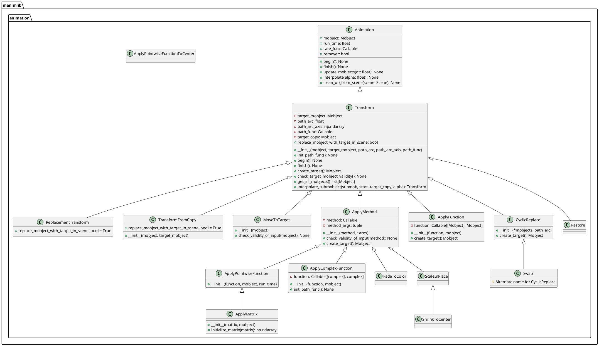
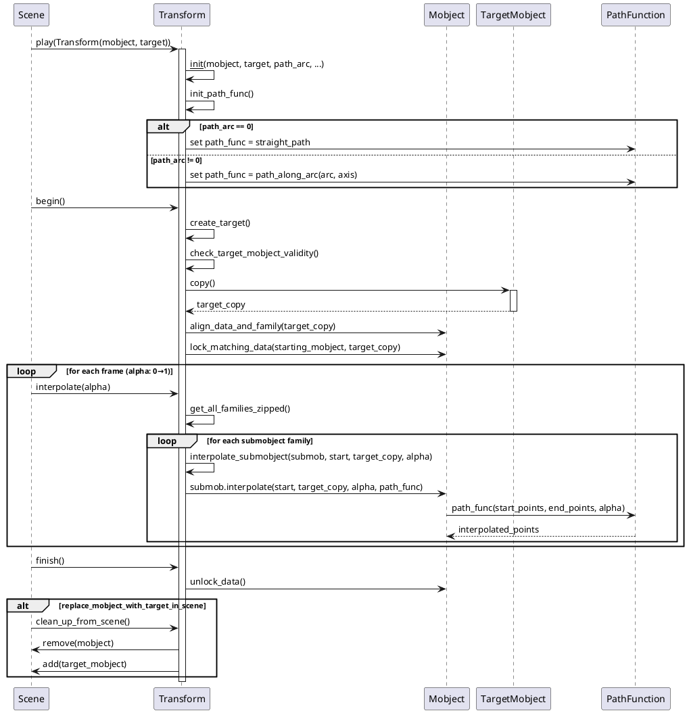

# Transform 动画类分析文档

## 概述

`transform.py` 文件包含了 Manim 中最重要的变换动画类，这些类负责处理对象从一个状态到另一个状态的平滑过渡。该文件实现了多种变换模式，从基础的形状变换到复杂的函数应用。

## 1. 类结构与关键属性

### 1.1 PlantUML 类图



### 1.2 关键属性说明

#### Transform 类核心属性：

- **target_mobject**: 变换的目标对象，定义了动画结束时对象应该变成的样子
- **path_arc**: 变换路径的弧度角，0表示直线路径，非0值创建弧形路径
- **path_arc_axis**: 弧形路径的旋转轴，默认为 OUT (z轴)
- **path_func**: 路径函数，定义从起始点到目标点的插值方式
- **target_copy**: 目标对象的副本，用于数据对齐而不影响原始目标
- **replace_mobject_with_target_in_scene**: 布尔值，决定是否在场景中用目标对象替换原对象

## 2. 关键实现方法与算法

### 2.1 Transform 核心流程时序图



### 2.2 核心算法详解

#### 2.2.1 路径插值算法

**直线路径 (straight_path)**:
```python
def straight_path(start_points, end_points, alpha):
    return interpolate(start_points, end_points, alpha)  # 线性插值
```

**弧形路径 (path_along_arc)**:
1. 计算起始点到终点的向量
2. 找到弧的圆心（考虑弧度角和旋转轴）
3. 通过旋转矩阵实现沿弧的插值

#### 2.2.2 数据对齐算法

Transform 使用 `align_data_and_family` 确保起始和目标对象具有兼容的数据结构：
- 统一点的数量
- 匹配子对象结构
- 保证平滑插值的可能性

## 3. 类的使用方法与代码示例

### 3.1 基础 Transform 使用

```python
from manimlib import *

class BasicTransformExample(Scene):
    def construct(self):
        # 创建起始和目标对象
        circle = Circle(color=BLUE, radius=1)
        square = Square(color=RED, side_length=2)
        
        self.play(ShowCreation(circle))
        self.wait(1)
        
        # 基础变换：圆变成正方形
        self.play(Transform(circle, square))
        self.wait(1)
        
        # 带弧形路径的变换
        triangle = Triangle(color=GREEN)
        triangle.move_to(RIGHT * 3)
        self.play(Transform(circle, triangle, path_arc=PI/2))
        self.wait(2)
```

### 3.2 ReplacementTransform 示例

```python
class ReplacementTransformExample(Scene):
    def construct(self):
        text1 = Text("Hello", color=BLUE)
        text2 = Text("World", color=RED).next_to(text1, RIGHT)
        
        self.play(Write(text1))
        self.wait(1)
        
        # 使用 ReplacementTransform，text1 会被 text2 替换
        self.play(ReplacementTransform(text1, text2))
        self.wait(1)
        
        # 此时场景中只有 text2，text1 已被移除
        self.play(FadeOut(text2))
```

### 3.3 ApplyMethod 系列示例

```python
class ApplyMethodExample(Scene):
    def construct(self):
        # 创建多个对象
        shapes = VGroup(
            Circle(radius=0.5, color=BLUE),
            Square(side_length=1, color=RED),
            Triangle(color=GREEN)
        ).arrange(RIGHT, buff=1)
        
        self.play(ShowCreation(shapes))
        self.wait(1)
        
        # ApplyMethod: 缩放
        self.play(ApplyMethod(shapes.scale, 1.5))
        self.wait(1)
        
        # ApplyMethod: 旋转
        self.play(ApplyMethod(shapes.rotate, PI/4))
        self.wait(1)
        
        # FadeToColor: 改变颜色
        self.play(FadeToColor(shapes, YELLOW))
        self.wait(1)
        
        # ScaleInPlace: 原地缩放
        self.play(ScaleInPlace(shapes, 0.8))
        self.wait(2)
```

### 3.4 ApplyFunction 高级示例

```python
class ApplyFunctionExample(Scene):
    def construct(self):
        # 创建网格
        grid = NumberPlane(
            x_range=[-4, 4], y_range=[-3, 3],
            background_line_style={"stroke_width": 1}
        )
        
        # 创建一个复杂形状
        mobject = VGroup(
            Circle(radius=1, color=BLUE),
            Square(side_length=1.5, color=RED).shift(RIGHT * 2),
            Text("Transform").scale(0.5).shift(DOWN * 2)
        )
        
        self.play(ShowCreation(grid), ShowCreation(mobject))
        self.wait(1)
        
        # 定义复杂变换函数
        def wave_function(mob):
            mob_copy = mob.copy()
            # 应用波浪变换
            for submob in mob_copy.get_family():
                if hasattr(submob, 'points'):
                    points = submob.points
                    points[:, 1] += 0.5 * np.sin(2 * points[:, 0])
            return mob_copy
        
        # 应用自定义函数
        self.play(ApplyFunction(wave_function, mobject))
        self.wait(2)
        
        # 恢复原状（如果之前保存了状态）
        mobject.save_state()  # 保存当前状态
        self.play(ApplyMethod(mobject.shift, UP * 2))
        self.wait(1)
        self.play(Restore(mobject))  # 恢复到保存的状态
        self.wait(2)
```

### 3.5 ApplyMatrix 和 ApplyComplexFunction 示例

```python
class AdvancedTransformExample(Scene):
    def construct(self):
        # 创建复数坐标系
        plane = ComplexPlane(
            x_range=[-3, 3], y_range=[-3, 3]
        )
        
        # 创建要变换的对象
        shape = Square(side_length=2, color=BLUE)
        shape.move_to(1 + 1j)  # 复数位置
        
        self.play(ShowCreation(plane), ShowCreation(shape))
        self.wait(1)
        
        # 矩阵变换：旋转和缩放
        rotation_matrix = [[np.cos(PI/4), -np.sin(PI/4)],
                          [np.sin(PI/4), np.cos(PI/4)]]
        
        self.play(ApplyMatrix(rotation_matrix, shape))
        self.wait(1)
        
        # 复数函数变换：f(z) = z^2
        def complex_square(z):
            return z**2
        
        shape2 = Circle(radius=0.5, color=RED)
        self.play(ShowCreation(shape2))
        self.wait(1)
        
        self.play(ApplyComplexFunction(complex_square, shape2))
        self.wait(2)
```

### 3.6 CyclicReplace 和 MoveToTarget 示例

```python
class CyclicReplaceExample(Scene):
    def construct(self):
        # 创建多个对象用于循环替换
        objects = VGroup(
            Circle(color=RED).move_to(LEFT * 2 + UP),
            Square(color=GREEN).move_to(RIGHT * 2 + UP),
            Triangle(color=BLUE).move_to(DOWN * 2)
        )
        
        self.play(ShowCreation(objects))
        self.wait(1)
        
        # 循环替换（每个对象移动到下一个对象的位置）
        self.play(CyclicReplace(*objects, path_arc=90*DEGREES))
        self.wait(1)
        
        # 再次循环替换
        self.play(Swap(*objects))  # Swap 是 CyclicReplace 的别名
        self.wait(2)
        
        # MoveToTarget 示例
        movable = Circle(color=YELLOW)
        movable.target = movable.copy().move_to(RIGHT * 3).scale(2)
        
        self.play(ShowCreation(movable))
        self.wait(1)
        
        self.play(MoveToTarget(movable))
        self.wait(2)
```

## 4. 类的总结与使用建议

### 4.1 各类定义与作用

| 类名 | 定义 | 主要作用 | 使用场景 |
|------|------|----------|----------|
| **Transform** | 基础变换类 | 将一个对象变换为另一个对象 | 形状变化、基础动画 |
| **ReplacementTransform** | 替换式变换 | 变换后用目标对象替换原对象 | 对象完全替换 |
| **TransformFromCopy** | 从副本变换 | 从原对象副本变换到目标 | 保留原对象的变换 |
| **MoveToTarget** | 移动到目标 | 移动到预设的 target 位置 | 对象位置动画 |
| **ApplyMethod** | 应用方法 | 对对象应用指定方法 | 标准对象操作 |
| **ApplyFunction** | 应用函数 | 对整个对象应用自定义函数 | 复杂自定义变换 |
| **ApplyMatrix** | 应用矩阵 | 线性矩阵变换 | 几何变换（旋转、缩放、投影） |
| **ApplyComplexFunction** | 复数函数变换 | 复数域的函数变换 | 数学可视化 |
| **CyclicReplace** | 循环替换 | 多个对象循环换位 | 排列变化动画 |

### 4.2 使用特性

#### 4.2.1 路径控制
- `path_arc=0`: 直线路径（默认）
- `path_arc=PI/2`: 90度弧形路径
- `path_arc=PI`: 半圆路径
- 自定义 `path_func`: 完全自定义路径

#### 4.2.2 对象处理策略
- **Transform**: 原对象保留，视觉上变换
- **ReplacementTransform**: 原对象被替换
- **TransformFromCopy**: 保留原对象，从副本开始变换

#### 4.2.3 数据对齐
所有 Transform 类都自动处理数据对齐，确保起始和目标对象可以平滑插值。

### 4.3 建议与注意事项

#### 4.3.1 性能建议
1. **选择合适的变换类型**：
   - 简单位置移动使用 `MoveToTarget`
   - 标准操作使用 `ApplyMethod`
   - 复杂变换使用 `ApplyFunction`

2. **避免过度复杂的路径**：
   - 大的 `path_arc` 值可能导致不自然的动画
   - 复杂的自定义路径函数会影响性能

#### 4.3.2 使用陷阱
1. **数据不兼容**：
   ```python
   # 错误：点数量差异过大
   line = Line(LEFT, RIGHT)  # 2个点
   circle = Circle()         # 很多点
   # 可能导致不理想的变换效果
   ```

2. **忘记保存状态**：
   ```python
   # 使用 Restore 前必须先保存状态
   mobject.save_state()
   # ... 进行变换 ...
   self.play(Restore(mobject))
   ```

3. **目标对象未定义**：
   ```python
   # MoveToTarget 要求对象有 target 属性
   circle = Circle()
   circle.target = circle.copy().shift(RIGHT)  # 必须设置
   self.play(MoveToTarget(circle))
   ```

#### 4.3.3 最佳实践
1. **合理使用弧形路径**：
   ```python
   # 旋转类变换适用弧形路径
   self.play(Transform(circle, square, path_arc=PI/4))
   ```

2. **组合使用不同变换**：
   ```python
   # 链式变换
   self.play(
       ApplyMethod(obj.scale, 1.5),
       ApplyMethod(obj.rotate, PI/4),
       run_time=2
   )
   ```

3. **保持对象引用的清晰性**：
   ```python
   # 清楚地了解哪些对象在场景中
   original = Circle()
   target = Square()
   
   # Transform: original 留在场景中，视觉变为 target
   self.play(Transform(original, target))
   
   # ReplacementTransform: original 被 target 替换
   self.play(ReplacementTransform(original, target))
   ```

通过合理使用这些变换类，可以创造出丰富多样、视觉震撼的动画效果，是 Manim 动画系统的核心组成部分。