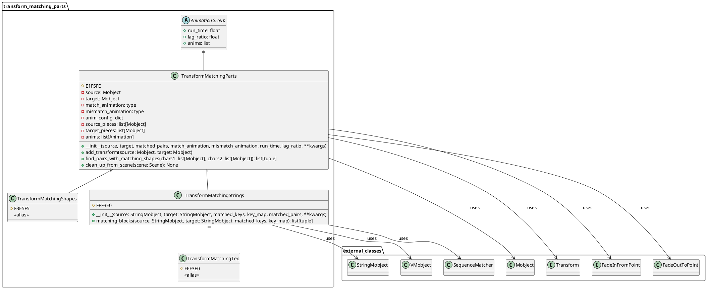
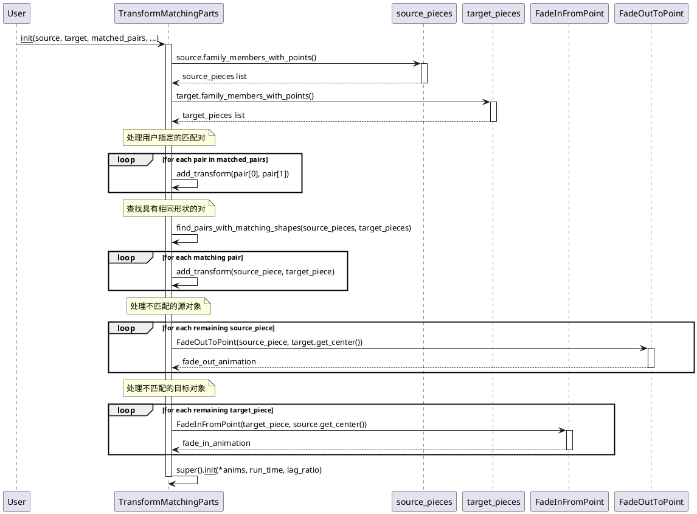
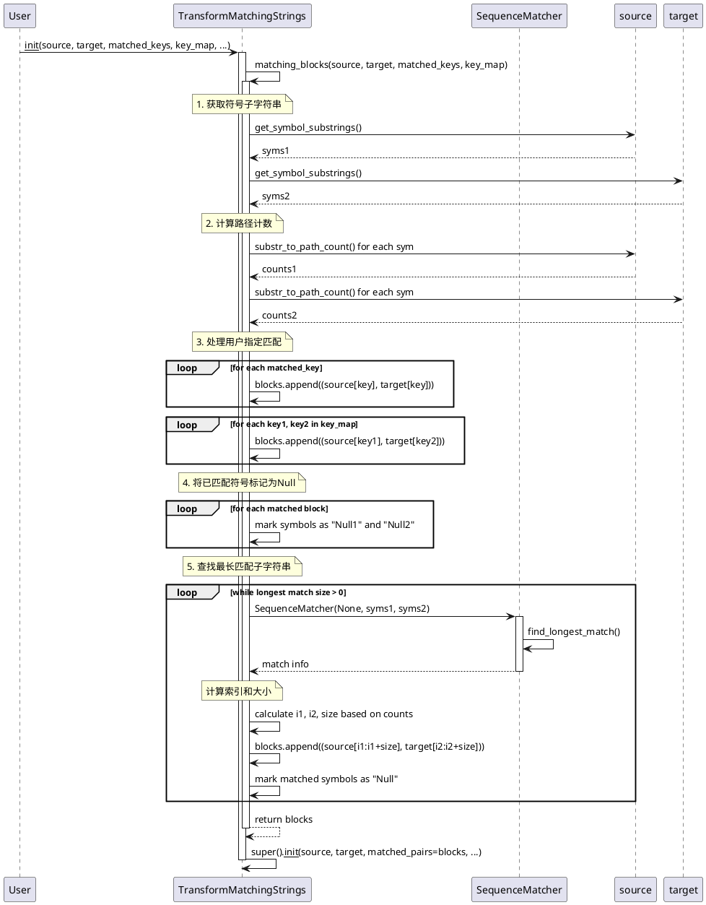

# Transform Matching Parts 动画模块

本文档详细介绍了 `manimlib/animation/transform_matching_parts.py` 文件中的类和方法，这些类用于实现部分匹配的变换动画。

## 1. 类结构图



### 关键属性说明

#### TransformMatchingParts 类属性
- **source**: Mobject - 源对象，作为变换的起始对象
- **target**: Mobject - 目标对象，作为变换的终点对象
- **match_animation**: type - 匹配部分使用的动画类型，默认为Transform
- **mismatch_animation**: type - 不匹配部分使用的动画类型，默认为Transform
- **anim_config**: dict - 动画配置参数字典
- **source_pieces**: list[Mobject] - 源对象的所有具有点的家族成员列表
- **target_pieces**: list[Mobject] - 目标对象的所有具有点的家族成员列表
- **anims**: list[Animation] - 所有子动画的列表

#### TransformMatchingStrings 类属性
- **matched_keys**: Iterable[str] - 用户指定的匹配键列表
- **key_map**: dict[str, str] - 源键到目标键的映射字典
- **matched_pairs**: Iterable[tuple] - 已匹配的对象对列表

## 2. 关键实现方法时序图

### TransformMatchingParts 初始化流程



### TransformMatchingStrings 匹配算法流程



## 3. 使用方法和代码示例

### 3.1 TransformMatchingParts 基本使用

```python
from manimlib import *

class TransformMatchingPartsExample(Scene):
    def construct(self):
        # 创建源对象和目标对象
        source = VGroup(
            Circle(radius=0.5, color=BLUE).shift(LEFT * 2),
            Square(side_length=1, color=RED).shift(LEFT * 0.5),
            Triangle(color=GREEN).shift(RIGHT * 1)
        )
        
        target = VGroup(
            Circle(radius=0.8, color=BLUE).shift(RIGHT * 2),
            Square(side_length=1.2, color=RED).shift(RIGHT * 0.5),
            RegularPolygon(5, color=YELLOW).shift(LEFT * 1)
        )
        
        # 添加到场景
        self.add(source)
        self.wait(1)
        
        # 执行部分匹配变换
        # Circle 和 Square 会被识别为相同形状并执行Transform
        # Triangle 会淡出，RegularPolygon 会淡入
        self.play(
            TransformMatchingParts(
                source, target,
                match_animation=Transform,        # 匹配部分的动画
                mismatch_animation=Transform,    # 不匹配部分的动画
                run_time=3,
                lag_ratio=0.1
            )
        )
        
        self.wait(2)
```

### 3.2 TransformMatchingStrings 高级使用

```python
from manimlib import *

class TransformMatchingStringsExample(Scene):
    def construct(self):
        # 创建源数学公式
        source_tex = TexMobject(
            "x^2", "+", "y^2", "=", "z^2"
        ).scale(1.5).shift(UP * 2)
        
        # 创建目标数学公式
        target_tex = TexMobject(
            "a^2", "+", "b^2", "=", "c^2"
        ).scale(1.5).shift(DOWN * 2)
        
        self.add(source_tex)
        self.wait(1)
        
        # 方法1: 使用 matched_keys 指定完全匹配的部分
        self.play(
            TransformMatchingStrings(
                source_tex, target_tex,
                matched_keys=["+", "="],  # 运算符保持不变
                run_time=2
            )
        )
        
        self.clear()
        self.wait(0.5)
        
        # 方法2: 使用 key_map 指定映射关系
        source_tex2 = TexMobject("\\sin", "(", "x", ")", "+", "\\cos", "(", "y", ")")
        target_tex2 = TexMobject("\\cos", "(", "a", ")", "+", "\\sin", "(", "b", ")")
        
        self.add(source_tex2)
        self.wait(1)
        
        self.play(
            TransformMatchingStrings(
                source_tex2, target_tex2,
                key_map={
                    "\\sin": "\\cos",  # sin 变为 cos
                    "\\cos": "\\sin",  # cos 变为 sin
                    "x": "a",          # x 变为 a
                    "y": "b"           # y 变为 b
                },
                matched_keys=["(", ")", "+"],  # 括号和加号保持不变
                run_time=3,
                lag_ratio=0.05
            )
        )
        
        self.wait(2)
```

### 3.3 自定义匹配对使用

```python
from manimlib import *

class CustomMatchingExample(Scene):
    def construct(self):
        # 创建复杂的源对象
        source = VGroup(
            TextMobject("Hello").shift(LEFT * 3),
            Circle(radius=0.5).shift(LEFT * 1),
            Square(side_length=0.8).shift(UP * 1),
            Triangle().shift(RIGHT * 1),
            TextMobject("World").shift(RIGHT * 3)
        )
        
        # 创建目标对象
        target = VGroup(
            TextMobject("Hi").shift(LEFT * 3),
            Circle(radius=0.8).shift(LEFT * 1),
            RegularPolygon(6, radius=0.5).shift(UP * 1),
            Square(side_length=0.6).shift(RIGHT * 1),
            TextMobject("Universe").shift(RIGHT * 3)
        )
        
        self.add(source)
        self.wait(1)
        
        # 自定义匹配对
        custom_pairs = [
            (source[0], target[0]),  # "Hello" -> "Hi"
            (source[3], target[3]),  # Triangle -> Square
            (source[4], target[4])   # "World" -> "Universe"
        ]
        
        self.play(
            TransformMatchingParts(
                source, target,
                matched_pairs=custom_pairs,
                match_animation=ReplacementTransform,
                mismatch_animation=Transform,
                run_time=4,
                lag_ratio=0.2
            )
        )
        
        self.wait(2)
```

### 3.4 字符串匹配的高级特性

```python
from manimlib import *

class AdvancedStringMatchingExample(Scene):
    def construct(self):
        # 创建复杂的数学表达式
        source_equation = TexMobject(
            "\\frac{d}{dx}",           # 0
            "\\left(",                 # 1
            "x^2",                     # 2
            "+",                       # 3
            "3x",                      # 4
            "+",                       # 5
            "2",                       # 6
            "\\right)",                # 7
            "=",                       # 8
            "2x",                      # 9
            "+",                       # 10
            "3"                        # 11
        )
        
        target_equation = TexMobject(
            "\\frac{d}{dx}",           # 0
            "\\left(",                 # 1
            "x^3",                     # 2
            "+",                       # 3
            "2x^2",                    # 4
            "+",                       # 5
            "x",                       # 6
            "\\right)",                # 7
            "=",                       # 8
            "3x^2",                    # 9
            "+",                       # 10
            "4x",                      # 11
            "+",                       # 12
            "1"                        # 13
        )
        
        self.add(source_equation)
        self.wait(1)
        
        # 使用智能匹配算法
        self.play(
            TransformMatchingTex(  # 等价于 TransformMatchingStrings
                source_equation, target_equation,
                matched_keys=[
                    "\\frac{d}{dx}",   # 导数符号保持不变
                    "\\left(",         # 左括号保持不变
                    "\\right)",        # 右括号保持不变
                    "=",               # 等号保持不变
                    "+"                # 加号会自动匹配
                ],
                run_time=3,
                lag_ratio=0.1
            )
        )
        
        self.wait(2)
        
        # 展示渐进式变换效果
        self.play(
            TransformMatchingTex(
                target_equation, source_equation,
                run_time=2,
                lag_ratio=0.15  # 较大的lag_ratio产生波浪效果
            )
        )
        
        self.wait(2)
```

## 4. 类总结与使用建议

### 4.1 类定义和作用

#### TransformMatchingParts
- **定义**: 基础的部分匹配变换类，继承自 AnimationGroup
- **作用**: 智能地识别源对象和目标对象中相似的部分，对相似部分执行变换动画，对不匹配部分执行淡入淡出动画
- **使用场景**: 
  - 几何图形的渐进变换
  - 复杂对象的结构化动画
  - 需要保持部分元素不变的场景

#### TransformMatchingStrings
- **定义**: 专门用于字符串对象的匹配变换类
- **作用**: 使用字符串匹配算法（基于SequenceMatcher）智能匹配文本或数学公式中的相同部分
- **使用场景**:
  - 数学公式的逐步推导
  - 文本内容的平滑过渡
  - 代码片段的重构动画

#### TransformMatchingShapes / TransformMatchingTex
- **定义**: 分别是 TransformMatchingParts 和 TransformMatchingStrings 的别名
- **作用**: 提供更直观的命名以便于理解和使用

### 4.2 使用特性

1. **智能匹配**: 自动识别相同形状或相同内容的部分
2. **灵活配置**: 支持用户指定匹配对和映射关系
3. **分离动画**: 对匹配和不匹配部分使用不同的动画类型
4. **渐进效果**: 通过lag_ratio参数控制动画的时间间隔

### 4.3 建议和注意事项

#### 性能优化建议
1. **预处理对象**: 在动画开始前确保源对象和目标对象已正确构建
2. **合理使用lag_ratio**: 较小值产生同步效果，较大值产生波浪效果
3. **选择合适的动画类型**: 
   - 使用 `Transform` 进行standard变换
   - 使用 `ReplacementTransform` 进行替换变换
   - 使用 `FadeTransform` 进行淡入淡出变换

#### 常见陷阱和解决方案
1. **空对象问题**: 确保源对象和目标对象都有 `family_members_with_points()`
2. **匹配失败**: 当自动匹配效果不理想时，使用 `matched_pairs` 参数手动指定匹配关系
3. **字符串索引错误**: 使用 `TransformMatchingStrings` 时，确保 `matched_keys` 和 `key_map` 中的键存在于源对象中

#### 最佳实践
1. **分层设计**: 对于复杂动画，先用简单对象测试，再应用到实际场景
2. **渐进调试**: 使用较大的 `run_time` 和 `lag_ratio` 来观察动画细节
3. **组合使用**: 结合其他动画类型创建更丰富的效果

#### 扩展建议
1. **自定义匹配算法**: 继承这些类并重写 `find_pairs_with_matching_shapes` 方法
2. **添加预处理**: 在 `__init__` 方法中添加对象预处理逻辑
3. **集成其他库**: 结合其他几何或文本处理库提高匹配精度

这些类为Manim提供了强大的智能变换能力，特别适合制作教学动画和演示文稿中需要逐步展示变化过程的场景。通过合理使用这些工具，可以创建出专业且引人注目的数学和科学动画。