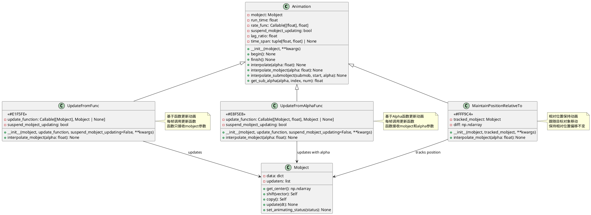
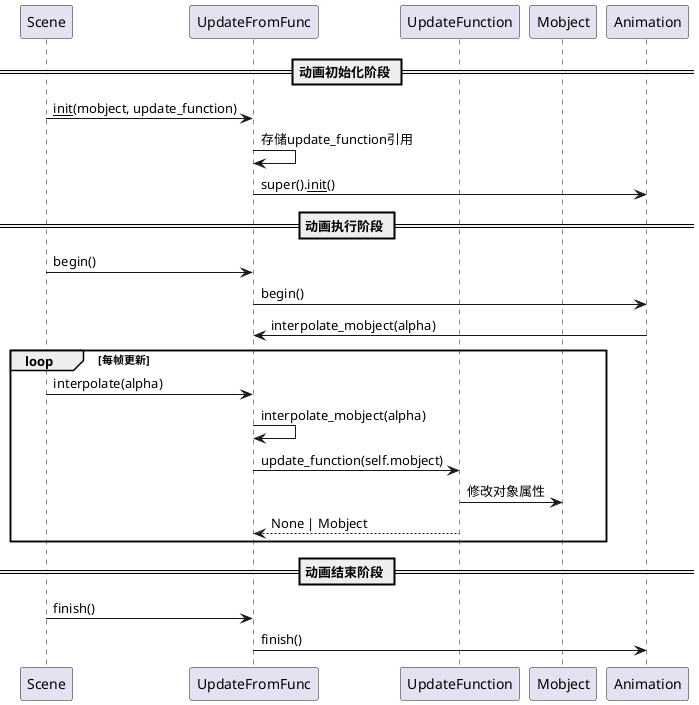
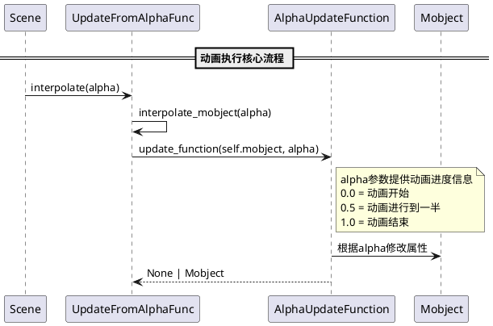
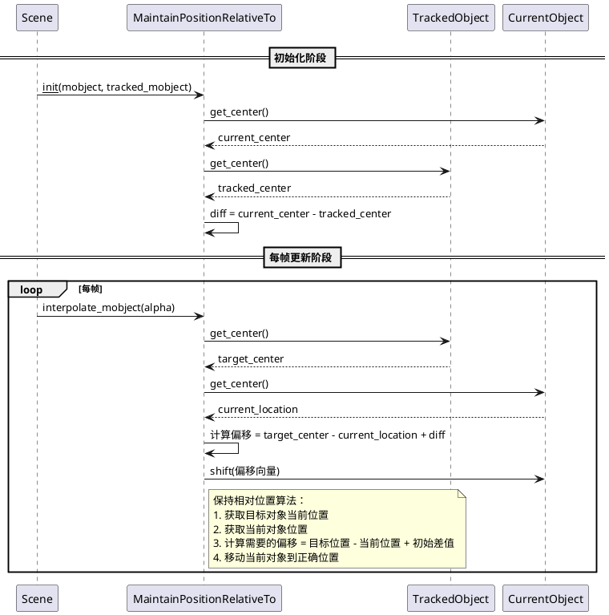

# Update 动画模块详细分析

## 概述

`manimlib/animation/update.py` 模块提供了基于函数更新的动画类，用于创建依赖于时间或其他对象状态的动态效果。该模块包含三个核心类：`UpdateFromFunc`、`UpdateFromAlphaFunc` 和 `MaintainPositionRelativeTo`，它们都继承自基础的 `Animation` 类。这些类特别适用于创建实时响应、跟随动画和基于函数的动态效果。

## 1. 类结构和关键属性

### 1.1 类图（PlantUML）



### 1.2 关键属性说明

#### UpdateFromFunc 类
- **update_function**: `Callable[[Mobject], Mobject | None]` - 更新函数，每帧调用，接收mobject作为参数，可修改对象状态
- **suspend_mobject_updating**: `bool` - 是否暂停对象内部更新器，默认为False

#### UpdateFromAlphaFunc 类  
- **update_function**: `Callable[[Mobject, float], Mobject | None]` - 更新函数，接收mobject和alpha(0-1)参数，可基于动画进度更新对象
- **suspend_mobject_updating**: `bool` - 是否暂停对象内部更新器，默认为False

#### MaintainPositionRelativeTo 类
- **tracked_mobject**: `Mobject` - 被跟踪的目标对象，当前对象将保持与此对象的相对位置
- **diff**: `np.ndarray` - 初始位置差向量，计算为当前对象中心与目标对象中心的差值

## 2. 关键实现方法与算法

### 2.1 核心算法时序图（PlantUML）



### 2.2 UpdateFromAlphaFunc 算法时序图



### 2.3 MaintainPositionRelativeTo 算法时序图



### 2.4 核心算法详解

#### UpdateFromFunc 算法核心
```python
def interpolate_mobject(self, alpha: float) -> None:
    self.update_function(self.mobject)
```
- **特点**: 忽略alpha参数，每帧都调用更新函数
- **适用场景**: 基于外部状态或实时计算的动画效果
- **性能考虑**: 更新函数会在每帧调用，需要保证高效执行

#### UpdateFromAlphaFunc 算法核心  
```python
def interpolate_mobject(self, alpha: float) -> None:
    self.update_function(self.mobject, alpha)
```
- **特点**: 将动画进度alpha传递给更新函数
- **适用场景**: 基于动画进度的渐变效果
- **数学应用**: 适合实现自定义缓动函数和复杂的数学变换

#### MaintainPositionRelativeTo 算法核心
```python
def interpolate_mobject(self, alpha: float) -> None:
    target = self.tracked_mobject.get_center()
    location = self.mobject.get_center()
    self.mobject.shift(target - location + self.diff)
```
- **特点**: 实时计算位置差值并调整
- **数学原理**: 向量运算保持相对位置
- **性能优化**: 只计算中心点位置，避免复杂几何运算

## 3. 使用方法和代码示例

### 3.1 UpdateFromFunc 使用示例

```python
from manimlib import *

class UpdateFromFuncExample(Scene):
    def construct(self):
        # 创建一个可变的时间变量
        time_tracker = ValueTracker(0)
        
        # 创建一个圆和文本
        circle = Circle(radius=1, color=BLUE)
        text = Text("Dynamic Circle", font_size=24)
        text.next_to(circle, UP)
        
        # 定义基于时间的更新函数
        def dynamic_update(mob):
            # 获取当前时间
            current_time = time_tracker.get_value()
            # 动态改变半径
            new_radius = 1 + 0.5 * np.sin(2 * current_time)
            mob.set_width(2 * new_radius)
            # 动态改变颜色
            hue = (current_time * 0.1) % 1
            mob.set_color(color=Color(hue=hue, saturation=1, luminance=0.5))
        
        # 创建更新动画
        update_animation = UpdateFromFunc(
            circle,
            dynamic_update,
            run_time=5
        )
        
        # 同时更新时间跟踪器
        time_update = time_tracker.animate.set_value(10)
        
        # 显示对象并执行动画
        self.add(circle, text)
        self.play(update_animation, time_update)

class ComplexUpdateExample(Scene):
    def construct(self):
        # 创建多个对象的复杂更新示例
        dots = VGroup(*[
            Dot(radius=0.1, color=YELLOW) 
            for _ in range(20)
        ])
        
        # 将点排列成圆形
        dots.arrange_in_grid(4, 5, buff=0.5)
        
        def wave_update(mob_group):
            """创建波浪效果"""
            time = self.time  # 获取场景时间
            for i, dot in enumerate(mob_group):
                # 基于索引和时间创建波浪效果
                phase = i * 0.2
                y_offset = 0.3 * np.sin(2 * time + phase)
                # 重置到基础位置然后应用偏移
                base_pos = dot.data["initial_pos"]
                dot.move_to(base_pos + y_offset * UP)
        
        # 存储初始位置
        for dot in dots:
            dot.data["initial_pos"] = dot.get_center()
        
        # 创建波浪动画
        wave_animation = UpdateFromFunc(
            dots, 
            wave_update,
            run_time=8
        )
        
        self.add(dots)
        self.play(wave_animation)
```

### 3.2 UpdateFromAlphaFunc 使用示例

```python
class UpdateFromAlphaFuncExample(Scene):
    def construct(self):
        # 创建一个多边形
        polygon = RegularPolygon(n=6, radius=2, color=GREEN)
        
        def morph_polygon(mob, alpha):
            """基于alpha值变形多边形"""
            # 边数从3变化到10
            n_sides = int(3 + 7 * alpha)
            # 半径变化
            radius = 1 + alpha
            # 旋转角度
            rotation = alpha * TAU
            
            # 重新创建多边形
            new_polygon = RegularPolygon(n=n_sides, radius=radius)
            new_polygon.rotate(rotation)
            new_polygon.set_color(interpolate_color(GREEN, RED, alpha))
            
            # 更新当前对象
            mob.become(new_polygon)
        
        # 创建渐变动画
        morph_animation = UpdateFromAlphaFunc(
            polygon,
            morph_polygon,
            run_time=4
        )
        
        self.add(polygon)
        self.play(morph_animation)

class MathFunctionExample(Scene):
    def construct(self):
        # 创建坐标轴
        axes = Axes(
            x_range=[-3, 3, 1],
            y_range=[-2, 2, 1],
            width=8,
            height=6
        )
        
        # 创建函数图像
        graph = axes.get_graph(lambda x: 0, color=BLUE)
        
        def update_function(mob, alpha):
            """动态更新函数图像"""
            # 参数随alpha变化
            frequency = 1 + 2 * alpha
            amplitude = alpha
            phase = alpha * TAU
            
            # 定义新函数
            def func(x):
                return amplitude * np.sin(frequency * x + phase)
            
            # 更新图像
            new_graph = axes.get_graph(func, color=BLUE)
            mob.become(new_graph)
        
        # 创建函数变化动画
        function_animation = UpdateFromAlphaFunc(
            graph,
            update_function,
            run_time=6
        )
        
        # 添加标签
        title = Text("Dynamic Function: f(x) = A·sin(ω·x + φ)", font_size=32)
        title.to_edge(UP)
        
        self.add(axes, graph, title)
        self.play(function_animation)
```

### 3.3 MaintainPositionRelativeTo 使用示例

```python
class MaintainPositionExample(Scene):
    def construct(self):
        # 创建主对象（被跟踪的对象）
        main_circle = Circle(radius=0.5, color=RED)
        main_circle.move_to(LEFT * 2)
        
        # 创建跟随对象
        satellite1 = Circle(radius=0.2, color=BLUE)
        satellite1.move_to(main_circle.get_center() + UP + RIGHT)
        
        satellite2 = Square(side_length=0.3, color=GREEN)  
        satellite2.move_to(main_circle.get_center() + DOWN * 1.5)
        
        # 创建标签
        label = Text("主对象", font_size=20, color=WHITE)
        label.next_to(main_circle, UP, buff=0.3)
        
        # 创建相对位置保持动画
        maintain_anim1 = MaintainPositionRelativeTo(
            satellite1, 
            main_circle,
            run_time=6
        )
        
        maintain_anim2 = MaintainPositionRelativeTo(
            satellite2,
            main_circle, 
            run_time=6
        )
        
        maintain_label = MaintainPositionRelativeTo(
            label,
            main_circle,
            run_time=6
        )
        
        # 主对象的移动路径动画
        path = [
            RIGHT * 3,
            UP * 2 + RIGHT * 2, 
            UP * 2 + LEFT * 2,
            LEFT * 2
        ]
        
        main_movement = AnimationGroup(
            *[main_circle.animate.move_to(pos) for pos in path],
            lag_ratio=0.8
        )
        
        # 显示所有对象
        self.add(main_circle, satellite1, satellite2, label)
        
        # 同时执行主对象移动和跟随动画
        self.play(
            main_movement,
            maintain_anim1,
            maintain_anim2, 
            maintain_label
        )

class OrbitExample(Scene):
    def construct(self):
        # 创建"太阳"
        sun = Circle(radius=0.4, color=YELLOW, fill_opacity=1)
        
        # 创建"行星"
        planet = Circle(radius=0.15, color=BLUE, fill_opacity=1)
        planet.move_to(sun.get_center() + RIGHT * 2)
        
        # 创建"卫星" 
        moon = Circle(radius=0.08, color=GRAY, fill_opacity=1)
        moon.move_to(planet.get_center() + UP * 0.8)
        
        # 创建标签
        sun_label = Text("太阳", font_size=16).next_to(sun, DOWN)
        planet_label = Text("行星", font_size=14).next_to(planet, DOWN)
        moon_label = Text("卫星", font_size=12).next_to(moon, UP)
        
        # 卫星跟随行星
        moon_orbit = MaintainPositionRelativeTo(
            moon,
            planet, 
            run_time=8
        )
        
        moon_label_follow = MaintainPositionRelativeTo(
            moon_label,
            moon,
            run_time=8  
        )
        
        planet_label_follow = MaintainPositionRelativeTo(
            planet_label,
            planet,
            run_time=8
        )
        
        # 行星围绕太阳公转
        planet_path = Circle(radius=2).move_to(sun.get_center())
        planet_revolution = MoveAlongPath(planet, planet_path, run_time=8)
        
        # 显示对象
        self.add(sun, planet, moon, sun_label, planet_label, moon_label)
        
        # 执行复杂的轨道运动
        self.play(
            planet_revolution,
            moon_orbit,
            moon_label_follow,
            planet_label_follow
        )
```

## 4. 类的定义、作用、使用场景与特性总结

### 4.1 UpdateFromFunc

**定义**: 基于自定义函数更新对象状态的动画类。

**作用**: 提供完全自定义的更新逻辑，每帧调用指定函数修改对象。

**使用场景**:
- 实时响应外部数据的动画（如实时图表）
- 基于物理模拟的动画效果
- 复杂的交互式动画
- 需要访问外部变量或状态的动画

**特性**:
- ✅ 完全自定义的更新逻辑
- ✅ 可以访问外部状态和变量
- ✅ 适合复杂的实时计算
- ⚠️ 每帧都会调用函数，需要注意性能
- ⚠️ 不提供动画进度信息

### 4.2 UpdateFromAlphaFunc

**定义**: 基于动画进度(alpha)和自定义函数更新对象的动画类。

**作用**: 提供基于动画进度的渐变效果，函数接收alpha参数(0-1)。

**使用场景**:
- 自定义缓动效果和过渡动画
- 数学函数可视化
- 复杂的形状变换动画
- 需要精确控制动画进度的场景

**特性**:
- ✅ 提供动画进度信息(alpha)
- ✅ 适合创建平滑的渐变效果
- ✅ 容易实现自定义缓动函数
- ✅ 可以基于数学公式创建动画
- ⚠️ 相比UpdateFromFunc功能稍受限制

### 4.3 MaintainPositionRelativeTo

**定义**: 使一个对象保持与另一个对象的相对位置关系的动画类。

**作用**: 实现跟随动画，确保对象间的相对位置保持不变。

**使用场景**:
- 标签跟随动画对象
- 卫星、行星轨道系统
- UI元素的相对布局保持
- 复合对象的整体移动

**特性**:
- ✅ 自动维护相对位置关系
- ✅ 高效的位置计算
- ✅ 适合复合动画系统
- ✅ 数学计算简单可靠
- ⚠️ 只处理位置关系，不涉及旋转或缩放
- ⚠️ 依赖目标对象的位置变化

## 5. 建议和注意事项

### 5.1 性能优化建议
- **UpdateFromFunc**: 确保更新函数高效执行，避免复杂计算
- **批量更新**: 对多个对象使用VGroup统一更新而非单独动画
- **避免重复计算**: 在更新函数中缓存计算结果

### 5.2 使用最佳实践
- **函数设计**: 更新函数应该是幂等的，避免累积副作用
- **错误处理**: 在更新函数中添加适当的错误处理
- **状态管理**: 使用对象的data属性存储中间状态

### 5.3 常见问题避免
- **内存泄漏**: 避免在更新函数中创建大量临时对象
- **递归依赖**: 注意MaintainPositionRelativeTo的循环依赖问题
- **时机控制**: 确保suspend_mobject_updating参数的正确使用

### 5.4 扩展建议
- 可以继承这些类创建更专用的动画效果
- 结合ValueTracker实现参数化动画
- 配合rate_func实现复杂的时间控制

这些类为Manim提供了强大的动态更新能力，是创建复杂交互式动画的重要工具。