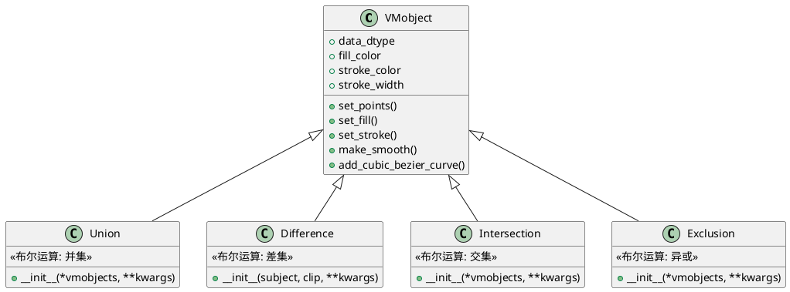
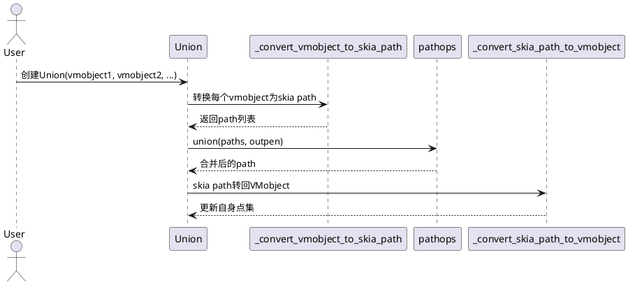

# manimlib.mobject.boolean_ops 源码详解

## 1. 类及关键属性介绍（PlantUML类图）

本文件主要包含以下类：

- `Union`
- `Difference`
- `Intersection`
- `Exclusion`

它们均继承自 `VMobject`，用于实现2D矢量对象的布尔运算。

### 主要类关系与属性说明



#### 关键属性说明
- `data_dtype`：定义矢量对象点的数据结构（详见VMobject文档）。
- `fill_color`、`stroke_color`、`stroke_width`：样式属性，控制填充与描边。
- `Union`、`Difference`、`Intersection`、`Exclusion` 均无新增属性，主要通过构造方法实现布尔运算。


## 2. 关键实现方法与算法（PlantUML时序图）

### 2.1 通用布尔运算流程

以 `Union` 为例，其它布尔类实现类似。



#### 关键步骤说明
1. **VMobject转skia path**：遍历所有子路径，将贝塞尔曲线转换为skia path格式。
2. **调用pathops布尔运算**：使用pathops库的union/difference/intersection/xor方法进行路径布尔运算。
3. **skia path转VMobject**：将布尔结果的skia path重新转换为VMobject的点集。

### 2.2 关键辅助方法
- `_convert_vmobject_to_skia_path(vmobject)`：将VMobject的所有子路径转换为skia path对象。
- `_convert_skia_path_to_vmobject(path, vmobject)`：将skia path对象转换为VMobject的点集。


## 3. 用法示例

以下示例展示如何使用布尔运算类进行2D图形的合成与裁剪。

```python
from manimlib.imports import *
from manimlib.mobject.boolean_ops import Union, Difference, Intersection, Exclusion

class BooleanOpsDemo(Scene):
    def construct(self):
        circle = Circle(radius=1.2, color=BLUE, fill_opacity=0.5)
        square = Square(side_length=2, color=YELLOW, fill_opacity=0.5)
        # 并集
        union = Union(circle, square, color=GREEN, fill_opacity=0.7)
        union.shift(LEFT * 3)
        # 差集
        diff = Difference(square, circle, color=RED, fill_opacity=0.7)
        # 交集
        inter = Intersection(circle, square, color=PURPLE, fill_opacity=0.7)
        inter.shift(RIGHT * 3)
        # 异或
        excl = Exclusion(circle, square, color=ORANGE, fill_opacity=0.7)
        excl.shift(DOWN * 2)
        self.add(union, diff, inter, excl)
        self.wait(2)
```

#### 说明
- `Union`、`Difference`、`Intersection`、`Exclusion` 均可接受任意数量的VMobject作为输入。
- 运算结果为新的VMobject，可直接添加到Scene中。
- 支持所有VMobject的样式设置与动画。


## 4. 总结

manimlib.mobject.boolean_ops.py 提供了对2D矢量对象的高效布尔运算支持，极大丰富了Manim的图形表达能力。其实现基于skia path与pathops库，兼容VMobject的所有特性，适合复杂图形的合成、裁剪与动画。
