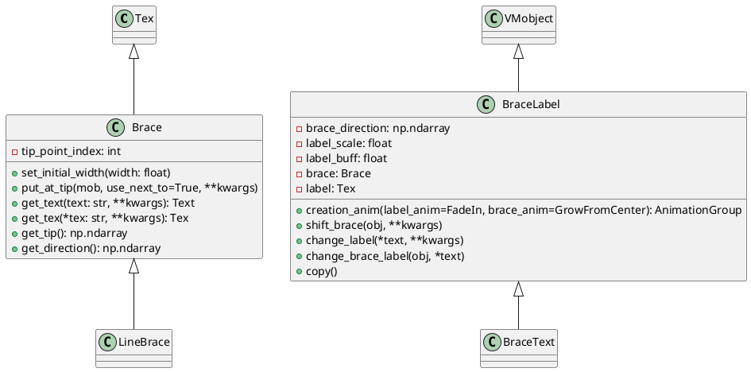
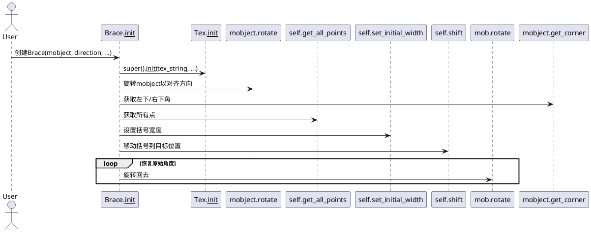
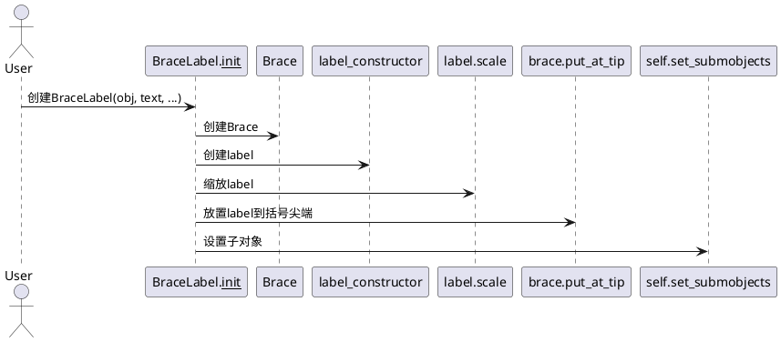
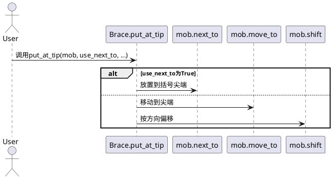

# manimlib.mobject.svg.brace 源码详解

## 1. 类及关键属性介绍（PlantUML类图）

本文件主要包含以下类：

- `Brace`
- `BraceLabel`
- `BraceText`
- `LineBrace`

### 主要类关系与属性说明



#### 关键属性说明

- `Brace`
  - `tip_point_index`: 括号尖端在点集中的索引，用于定位括号的“尖”。
- `BraceLabel`
  - `brace_direction`: 括号朝向（如DOWN、UP等）。
  - `label_scale`: 标签缩放比例。
  - `label_buff`: 标签与括号的间距。
  - `brace`: 关联的`Brace`对象。
  - `label`: 关联的标签对象（如Tex/Text）。
- `BraceText`
  - 继承自`BraceLabel`，其`label_constructor`为`TexText`。
- `LineBrace`
  - 继承自`Brace`，用于与`Line`对象配合，自动适应线段方向。

---

## 2. 关键方法与算法详解（PlantUML时序图）

### Brace的构造与对齐



### BraceLabel的创建与标签放置



### Brace的put_at_tip方法



---

## 3. 使用方法与高质量代码示例

### 示例1：为矩形添加括号与标签

```python
from manimlib import *

class BraceExample(Scene):
    def construct(self):
        rect = Rectangle(width=4, height=2)
        brace = Brace(rect, DOWN)
        label = brace.get_text("宽度")
        self.add(rect, brace, label)
        self.wait()
```

### 示例2：使用BraceLabel自动管理括号与标签

```python
from manimlib import *

class BraceLabelExample(Scene):
    def construct(self):
        rect = Rectangle(width=4, height=2)
        brace_label = BraceLabel(rect, "宽度", brace_direction=DOWN)
        self.add(rect, brace_label)
        self.wait()
```

### 示例3：动态改变括号和标签

```python
from manimlib import *

class DynamicBraceLabel(Scene):
    def construct(self):
        rect1 = Rectangle(width=4, height=2)
        rect2 = Rectangle(width=2, height=2).shift(RIGHT*3)
        brace_label = BraceLabel(rect1, "A", brace_direction=DOWN)
        self.add(rect1, rect2, brace_label)
        self.wait()
        # 改变括号和标签
        self.play(
            Transform(brace_label, brace_label.change_brace_label(rect2, "B"))
        )
        self.wait()
```

### 示例4：LineBrace的用法

```python
from manimlib import *

class LineBraceExample(Scene):
    def construct(self):
        line = Line(LEFT, RIGHT)
        brace = LineBrace(line, UP)
        self.add(line, brace)
        self.wait()
```

---

## 4. 备注

- `Line`、`TexText`等依赖需确保manimlib环境完整。
- 本文档适用于manimlib分支，部分API与社区版manim略有差异。
