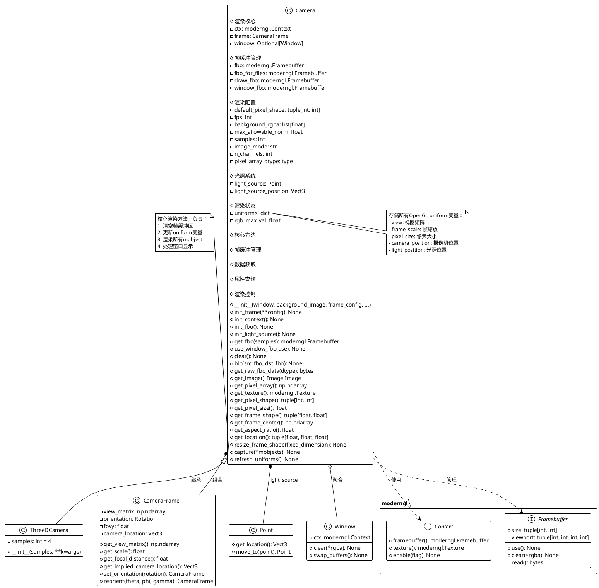
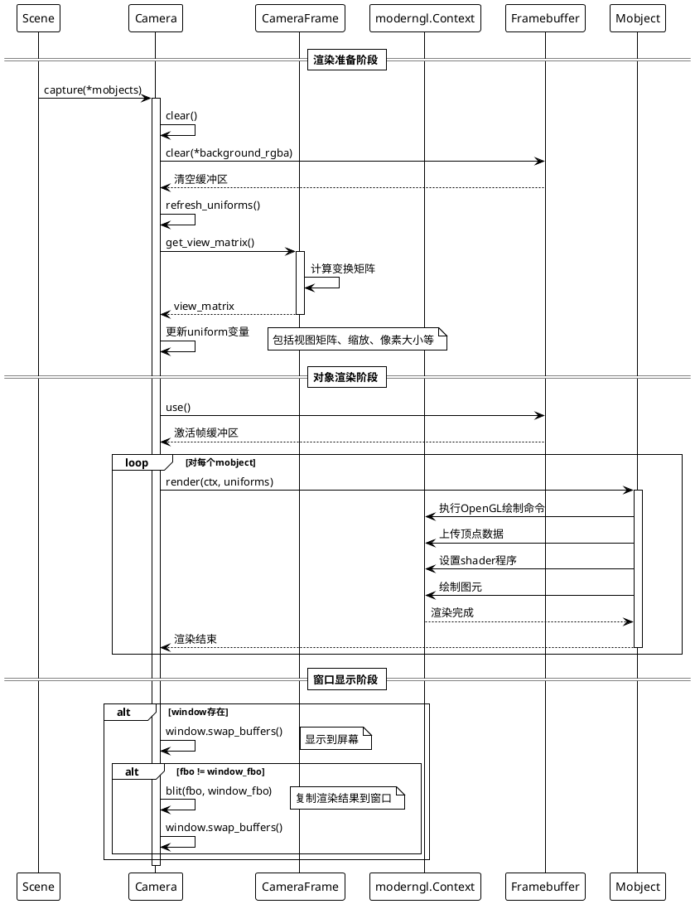
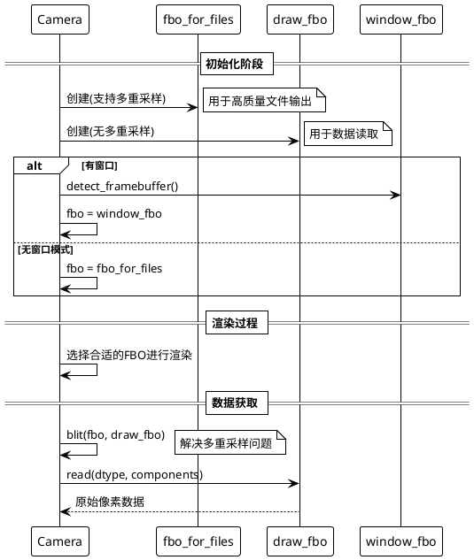

# Camera 类详细分析文档

## 概述

`Camera` 是 ManimGL 框架中负责渲染和图像捕获的核心类。它封装了现代 OpenGL 渲染管线，集成了 ModernGL 库，提供了高性能的 3D 渲染能力。该类负责管理帧缓冲区、纹理、光源以及渲染参数，是整个图形渲染系统的基础。

## 1. 类结构分析及PlantUML类图

### 1.1 类及其关键属性

#### Camera 类核心属性：

- **rendering_context**: `moderngl.Context` - 现代OpenGL上下文，核心渲染引擎
- **frame**: `CameraFrame` - 摄像机框架，控制视角和投影
- **window**: `Optional[Window]` - 显示窗口，用于交互式渲染
- **fbo**: `moderngl.Framebuffer` - 活动帧缓冲区
- **fbo_for_files**: `moderngl.Framebuffer` - 文件输出专用帧缓冲区
- **draw_fbo**: `moderngl.Framebuffer` - 绘制专用帧缓冲区
- **window_fbo**: `moderngl.Framebuffer` - 窗口显示帧缓冲区
- **light_source**: `Point` - 光源位置对象
- **uniforms**: `dict` - OpenGL uniform变量集合

#### 配置属性：
- **default_pixel_shape**: `tuple[int, int]` - 默认像素分辨率
- **fps**: `int` - 帧率，默认30fps
- **background_rgba**: `list[float]` - 背景颜色RGBA值
- **max_allowable_norm**: `float` - 最大允许向量模长
- **samples**: `int` - 多重采样数量，用于抗锯齿

### 1.2 PlantUML类图



## 2. 关键实现方法与算法

### 2.1 Camera初始化流程

Camera的初始化过程是一个精心设计的多阶段流程，确保所有渲染资源正确配置：

1. **配置阶段**: 设置基本参数和默认值
2. **Frame初始化**: 创建CameraFrame对象
3. **上下文初始化**: 建立OpenGL上下文
4. **帧缓冲初始化**: 创建必要的帧缓冲区
5. **光源初始化**: 设置默认光源

### 2.2 渲染流程时序图



### 2.3 帧缓冲管理算法

Camera类实现了智能的帧缓冲管理策略：



### 2.4 Uniform变量更新算法

refresh_uniforms方法负责更新所有OpenGL uniform变量：

1. **视图变换**: 从CameraFrame获取最新的view_matrix
2. **空间变换**: 计算frame_scale和frame_rescale_factors  
3. **位置信息**: 更新摄像机和光源位置
4. **渲染参数**: 设置像素大小等渲染参数

## 3. 使用方法与代码示例

### 3.1 基础Camera使用

```python
from manimlib import Camera, Scene, Circle, Square
from manimlib.window import Window
import numpy as np

class BasicCameraExample:
    """演示Camera的基础使用方法"""
    
    def __init__(self):
        # 创建窗口（可选）
        self.window = Window()
        
        # 创建Camera实例
        self.camera = Camera(
            window=self.window,
            resolution=(1920, 1080),  # 高清分辨率
            fps=60,  # 高帧率
            background_color="#2E3440",  # 深色背景
            samples=4,  # 4x抗锯齿
        )
        
    def render_simple_scene(self):
        """渲染简单场景"""
        # 创建几何对象
        circle = Circle(radius=1.0, color="#5E81AC")
        square = Square(side_length=1.5, color="#BF616A")
        
        # 设置位置
        circle.shift(np.array([-2, 0, 0]))
        square.shift(np.array([2, 0, 0]))
        
        # 渲染到Camera
        self.camera.capture(circle, square)
        
        # 获取渲染结果
        image = self.camera.get_image()
        image.save("simple_scene.png")
        
    def get_pixel_data(self):
        """获取像素数据进行分析"""
        pixel_array = self.camera.get_pixel_array()
        print(f"图像形状: {pixel_array.shape}")
        print(f"数据类型: {pixel_array.dtype}")
        print(f"像素范围: {pixel_array.min()} - {pixel_array.max()}")
        
        return pixel_array

class AdvancedCameraExample:
    """演示Camera的高级功能"""
    
    def __init__(self):
        # 高级配置
        frame_config = {
            "frame_shape": (16.0, 9.0),  # 16:9宽屏比例
            "center_point": np.array([0, 0, 0]),
            "fovy": 60 * np.pi / 180,  # 60度视角
        }
        
        self.camera = Camera(
            resolution=(2560, 1440),  # 2K分辨率
            frame_config=frame_config,
            background_color="#ECEFF4",
            background_opacity=1.0,
            max_allowable_norm=20.0,  # 更大的渲染范围
            light_source_position=np.array([-5, 8, 12]),  # 自定义光源位置
            samples=8,  # 8x超级抗锯齿
        )
        
    def animated_rendering(self, mobjects: list, duration: float = 3.0, fps: int = 60):
        """创建动画序列"""
        frames = []
        total_frames = int(duration * fps)
        
        for frame_num in range(total_frames):
            # 计算动画进度
            alpha = frame_num / (total_frames - 1)
            
            # 更新摄像机角度
            theta = 2 * np.pi * alpha
            self.camera.frame.set_euler_angles(theta=theta)
            
            # 渲染当前帧
            self.camera.capture(*mobjects)
            
            # 获取帧数据
            pixel_array = self.camera.get_pixel_array()
            frames.append(pixel_array)
            
            print(f"渲染进度: {frame_num + 1}/{total_frames}")
            
        return frames
    
    def custom_lighting_demo(self):
        """演示自定义光照效果"""
        # 创建3D对象
        from manimlib.mobject.three_d import Sphere, Cube
        
        sphere = Sphere(radius=1.5, color="#D08770")
        cube = Cube(side_length=2.0, color="#A3BE8C")
        
        sphere.shift(np.array([-2, 0, 0]))
        cube.shift(np.array([2, 0, 1]))
        
        # 不同光源位置的效果
        light_positions = [
            np.array([-10, 10, 10]),   # 左上前
            np.array([10, 10, 10]),    # 右上前
            np.array([0, -10, 10]),    # 下前
            np.array([0, 0, -10]),     # 后方
        ]
        
        for i, light_pos in enumerate(light_positions):
            # 更新光源位置
            self.camera.light_source.move_to(light_pos)
            
            # 渲染场景
            self.camera.capture(sphere, cube)
            
            # 保存结果
            image = self.camera.get_image()
            image.save(f"lighting_demo_{i}.png")

class PerformanceCameraExample:
    """演示Camera性能优化技巧"""
    
    def __init__(self):
        # 性能优化配置
        self.camera = Camera(
            resolution=(1280, 720),  # 适中分辨率
            fps=30,
            samples=0,  # 禁用抗锯齿以提高性能
            pixel_array_dtype=np.uint8,  # 使用uint8节省内存
        )
        
    def batch_rendering(self, mobject_groups: list):
        """批量渲染优化"""
        # 预计算所有uniform变量
        self.camera.refresh_uniforms()
        
        results = []
        for group in mobject_groups:
            # 直接渲染，避免重复的uniform更新
            self.camera.fbo.use()
            self.camera.clear()
            
            for mobject in group:
                mobject.render(self.camera.ctx, self.camera.uniforms)
                
            # 获取结果
            raw_data = self.camera.get_raw_fbo_data()
            results.append(raw_data)
            
        return results
    
    def memory_efficient_capture(self, mobjects: list):
        """内存高效的渲染方式"""
        # 使用生成器避免一次性加载所有数据
        def frame_generator():
            for mobject in mobjects:
                self.camera.capture(mobject)
                yield self.camera.get_raw_fbo_data(dtype='f1')  # 使用单字节
        
        return frame_generator()

# 使用示例
if __name__ == "__main__":
    # 基础使用
    basic_example = BasicCameraExample()
    basic_example.render_simple_scene()
    
    # 高级功能
    advanced_example = AdvancedCameraExample()
    advanced_example.custom_lighting_demo()
    
    # 性能优化
    performance_example = PerformanceCameraExample()
    # performance_example.batch_rendering(some_mobject_groups)
```

### 3.2 与Scene集成使用

```python
from manimlib import Scene, Camera, Text, Transform, FadeIn

class CustomCameraScene(Scene):
    """演示自定义Camera配置的Scene"""
    
    def __init__(self, **kwargs):
        # 自定义camera配置
        camera_config = {
            "resolution": (2048, 2048),  # 方形高分辨率
            "background_color": "#1E1E1E",
            "samples": 6,
            "frame_config": {
                "frame_shape": (8.0, 8.0),  # 方形画布
                "fovy": 45 * np.pi / 180,
            },
            "light_source_position": np.array([0, 0, 20]),
        }
        
        super().__init__(camera_config=camera_config, **kwargs)
    
    def construct(self):
        # 利用高分辨率创建精美文字
        title = Text(
            "高品质渲染", 
            font_size=72,
            font="Arial",
            color="#FFFFFF"
        )
        
        subtitle = Text(
            "Camera类演示",
            font_size=36, 
            color="#888888"
        )
        subtitle.next_to(title, DOWN, buff=0.5)
        
        # 展示Camera的高质量渲染能力
        self.play(FadeIn(title))
        self.wait(1)
        self.play(FadeIn(subtitle))
        self.wait(2)
        
        # 保存高品质截图
        self.camera.get_image().save("high_quality_render.png")
```

## 4. 类总结与使用建议

### 4.1 Camera类定义与作用

**Camera类**是ManimGL渲染系统的核心，主要负责：

1. **渲染管理**: 管理OpenGL渲染上下文和帧缓冲区
2. **图像输出**: 将3D场景渲染为2D图像或像素数据
3. **视角控制**: 通过CameraFrame控制观察角度和投影
4. **性能优化**: 提供多重采样、批量渲染等优化功能

**ThreeDCamera类**是Camera的3D特化版本，默认启用4x抗锯齿，主要用于3D场景渲染。

### 4.2 使用场景

1. **高质量视频制作**: 高分辨率、多重采样的专业渲染
2. **实时交互演示**: 结合Window实现实时预览和交互
3. **批量图像生成**: 自动化生成大量图像或动画帧
4. **自定义渲染管线**: 底层图形处理和特效开发

### 4.3 使用特性

#### 优点：
- **高性能**: 基于ModernGL的现代OpenGL实现
- **灵活配置**: 丰富的参数支持各种渲染需求
- **内存高效**: 智能的帧缓冲管理和数据格式优化
- **质量优秀**: 支持多重采样抗锯齿
- **易于扩展**: 清晰的接口设计便于定制

#### 局限性：
- **硬件依赖**: 需要支持现代OpenGL的图形硬件
- **内存占用**: 高分辨率渲染需要大量显存
- **学习曲线**: 高级功能需要OpenGL基础知识

### 4.4 最佳实践建议

#### 性能优化：
1. **合理设置分辨率**: 根据最终用途选择合适的分辨率
2. **控制抗锯齿**: 仅在需要时使用多重采样
3. **批量处理**: 对于大量对象，使用批量渲染减少状态切换
4. **内存管理**: 及时释放不需要的帧缓冲资源

#### 质量提升：
1. **光源配置**: 合理设置光源位置获得最佳光照效果
2. **背景选择**: 选择合适的背景色提高对比度
3. **视角设定**: 通过CameraFrame优化观察角度

#### 注意事项：
1. **上下文管理**: 确保在正确的OpenGL上下文中操作
2. **帧缓冲同步**: 注意多个帧缓冲之间的数据同步
3. **异常处理**: 妥善处理图形硬件相关的异常
4. **资源清理**: 程序结束时正确释放OpenGL资源

#### 调试技巧：
1. **渐进式配置**: 从基础配置开始，逐步添加高级功能
2. **分辨率调试**: 开发时使用低分辨率，生产时切换到高分辨率
3. **日志记录**: 记录关键渲染参数便于问题排查
4. **性能监控**: 监控帧率和内存使用情况

Camera类作为ManimGL的渲染核心，提供了强大而灵活的图形渲染能力。正确理解和使用其功能，能够创造出高质量的数学动画和可视化内容。