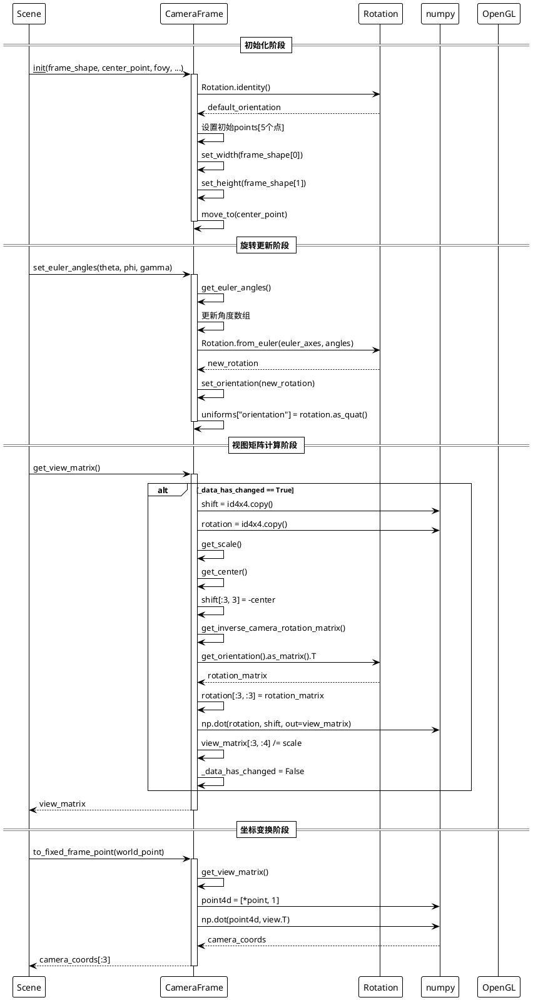
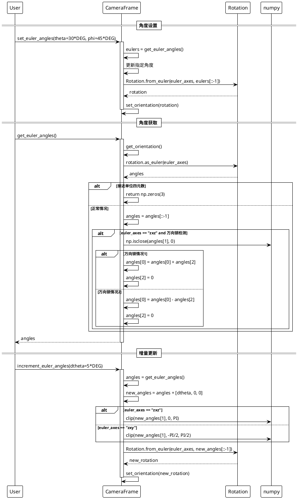

# CameraFrame 摄像机框架类详细分析文档

## 概述

`CameraFrame` 是 ManimGL 框架中用于控制摄像机视角、投影和变换的核心类。它继承自 `Mobject`，使得摄像机框架本身也是一个可操作的数学对象。该类封装了3D空间中的观察变换，包括旋转、缩放、平移以及视野角度的控制，是实现复杂3D视觉效果的基础。

## 1. 类结构分析及PlantUML类图

### 1.1 类及其关键属性

#### CameraFrame 类核心属性：

**空间变换属性**：
- `uniforms["orientation"]`: `np.ndarray` - 四元数格式的旋转信息，控制摄像机朝向
- `uniforms["fovy"]`: `float` - Y方向视野角度(Field of View)，控制透视投影
- `view_matrix`: `np.ndarray` - 4x4视图变换矩阵，将世界坐标转换为摄像机坐标
- `camera_location`: `Vect3` - 摄像机在世界空间中的位置
- `default_orientation`: `Rotation` - 默认旋转状态，用于重置

**配置属性**：
- `frame_shape`: `tuple[float, float]` - 摄像机框架的宽高比例
- `center_point`: `Vect3` - 摄像机观察的中心点
- `fovy`: `float` - 初始视野角度，默认45度
- `euler_axes`: `str` - 欧拉角旋转轴顺序，默认"zxz"
- `z_index`: `int` - 渲染顺序，默认-1确保最先渲染

**辅助属性**：
- `id4x4`: `np.ndarray` - 4x4单位矩阵，用于矩阵计算
- `_data_has_changed`: `bool` - 继承自Mobject，数据变化标记

### 1.2 PlantUML类图

```plantuml
@startuml CameraFrame_ClassDiagram
!theme plain

class Mobject {
    # 基础属性
    - color: ManimColor
    - opacity: float
    - z_index: int
    - depth_test: bool
    - submobjects: list[Mobject]
    - parents: list[Mobject]
    - uniforms: dict
    - _data_has_changed: bool
    
    # 核心方法
    + __init__(...)
    + add(*mobjects): Mobject
    + remove(*mobjects): Mobject
    + set_points(points): Mobject
    + move_to(point): Mobject
    + set_width(width): Mobject
    + set_height(height): Mobject
    + get_width(): float
    + get_height(): float
    + get_center(): np.ndarray
    + get_points(): np.ndarray
    
    # 装饰器
    + @affects_data
    + interpolate(*args, **kwargs)
}

class CameraFrame {
    # 变换状态
    - uniforms["orientation"]: np.ndarray
    - uniforms["fovy"]: float
    - view_matrix: np.ndarray[4x4]
    - camera_location: Vect3
    - default_orientation: Rotation
    
    # 配置参数
    - frame_shape: tuple[float, float]
    - center_point: Vect3
    - fovy: float
    - euler_axes: str
    - id4x4: np.ndarray[4x4]
    
    # 初始化方法
    + __init__(frame_shape, center_point, fovy, euler_axes, ...)
    
    # 旋转控制
    + set_orientation(rotation: Rotation): CameraFrame
    + get_orientation(): Rotation
    + make_orientation_default(): CameraFrame
    + to_default_state(): CameraFrame
    
    # 欧拉角操作
    + get_euler_angles(): np.ndarray
    + set_euler_angles(theta, phi, gamma, units): CameraFrame
    + increment_euler_angles(dtheta, dphi, dgamma, units): CameraFrame
    + set_euler_axes(seq: str): CameraFrame
    
    # 单轴旋转
    + get_theta(): float
    + get_phi(): float
    + get_gamma(): float
    + set_theta(theta): CameraFrame
    + set_phi(phi): CameraFrame
    + set_gamma(gamma): CameraFrame
    + increment_theta(dtheta, units): CameraFrame
    + increment_phi(dphi, units): CameraFrame
    + increment_gamma(dgamma, units): CameraFrame
    
    # 便捷方法
    + reorient(theta_degrees, phi_degrees, gamma_degrees, center, height): CameraFrame
    + rotate(angle, axis, **kwargs): CameraFrame
    + add_ambient_rotation(angular_speed): CameraFrame
    
    # 视野控制
    + set_focal_distance(focal_distance): CameraFrame
    + set_field_of_view(field_of_view): CameraFrame
    + get_focal_distance(): float
    + get_field_of_view(): float
    
    # 几何属性
    + get_shape(): tuple[float, float]
    + get_aspect_ratio(): float
    + get_scale(): float
    + get_implied_camera_location(): np.ndarray
    
    # 坐标变换
    + get_inverse_camera_rotation_matrix(): np.ndarray
    + get_view_matrix(refresh): np.ndarray
    + get_inv_view_matrix(): np.ndarray
    + to_fixed_frame_point(point, relative): np.ndarray
    + from_fixed_frame_point(point, relative): np.ndarray
}

class Rotation {
    + identity(): Rotation
    + from_quat(quat): Rotation
    + from_rotvec(rotvec): Rotation
    + from_euler(seq, angles): Rotation
    + as_quat(): np.ndarray
    + as_matrix(): np.ndarray
    + as_euler(seq): np.ndarray
    + __mul__(other): Rotation
}

package "Constants" {
    class CONSTANTS {
        + FRAME_SHAPE: tuple[float, float]
        + ORIGIN: Vect3
        + LEFT: Vect3
        + RIGHT: Vect3
        + UP: Vect3
        + DOWN: Vect3
        + OUT: Vect3
        + DEG: float
        + RADIANS: float
        + PI: float
    }
}

' 继承关系
CameraFrame --|> Mobject : 继承

' 组合关系
CameraFrame *-- Rotation : default_orientation
CameraFrame ..> Rotation : 使用

' 依赖关系
CameraFrame ..> CONSTANTS : 使用常量

note right of CameraFrame::uniforms
  存储OpenGL uniform变量：
  - orientation: 四元数旋转
  - fovy: Y方向视野角度
  继承自Mobject的uniforms字典
end note

note left of CameraFrame::view_matrix
  4x4变换矩阵，将世界坐标
  转换为摄像机坐标系：
  - 平移：-center
  - 旋转：inverse_rotation
  - 缩放：1/scale
end note

note bottom of CameraFrame::euler_axes
  支持不同的欧拉角约定：
  - "zxz": Z-X-Z约定(默认)
  - "zxy": Z-X-Y约定
  - 其他scipy.spatial.transform支持的约定
end note

@enduml
```

## 2. 关键实现方法与算法

### 2.1 摄像机变换核心算法

CameraFrame的核心算法是将3D空间中的观察变换转换为OpenGL可用的视图矩阵。主要步骤包括：

1. **旋转变换**: 使用四元数存储和计算旋转
2. **平移变换**: 移动到观察中心点
3. **缩放变换**: 根据框架大小调整比例
4. **矩阵组合**: 将变换组合成4x4矩阵

### 2.2 视图矩阵生成时序图



### 2.3 欧拉角处理算法

CameraFrame支持多种欧拉角约定，并处理万向锁问题：



### 2.4 坐标变换算法流程

CameraFrame提供了世界坐标系和摄像机坐标系之间的相互转换：

1. **世界坐标 → 摄像机坐标**: `to_fixed_frame_point()`
2. **摄像机坐标 → 世界坐标**: `from_fixed_frame_point()`

算法核心是应用或逆应用视图矩阵变换。

## 3. 使用方法与代码示例

### 3.1 基础CameraFrame使用

```python
import numpy as np
from manimlib import *

class BasicCameraFrameExample(Scene):
    """演示CameraFrame基础使用方法"""
    
    def construct(self):
        # 创建一些3D对象用于演示
        cube = Cube(side_length=2.0, color=BLUE)
        sphere = Sphere(radius=1.0, color=RED)
        sphere.shift(3 * RIGHT)
        
        # 添加对象到场景
        self.add(cube, sphere)
        
        # 演示不同的摄像机角度
        self.demo_camera_angles()
        
        # 演示视野调整
        self.demo_field_of_view()
        
        # 演示平滑旋转
        self.demo_smooth_rotation()
    
    def demo_camera_angles(self):
        """演示不同摄像机角度"""
        # 设置初始视角
        self.frame.reorient(theta_degrees=0, phi_degrees=0)
        self.wait(1)
        
        # 预设的优美视角
        beautiful_angles = [
            (30, 60, 0),   # 经典3D视角
            (45, 45, 0),   # 等角投影风格
            (0, 90, 0),    # 仰视角度
            (90, 0, 0),    # 侧视角度
            (0, 0, 45),    # 倾斜角度
        ]
        
        for theta, phi, gamma in beautiful_angles:
            self.play(
                self.frame.animate.reorient(
                    theta_degrees=theta,
                    phi_degrees=phi, 
                    gamma_degrees=gamma
                ),
                run_time=2,
                rate_func=smooth
            )
            self.wait(1)
    
    def demo_field_of_view(self):
        """演示视野角度调整效果"""
        # 回到标准角度
        self.frame.reorient(theta_degrees=30, phi_degrees=60)
        
        # 广角效果 (视野变大, 物体变小)
        self.play(
            self.frame.animate.set_field_of_view(60 * DEG),
            run_time=2
        )
        self.wait(1)
        
        # 望远镜效果 (视野变小, 物体变大)
        self.play(
            self.frame.animate.set_field_of_view(20 * DEG),
            run_time=2
        )
        self.wait(1)
        
        # 恢复正常视野
        self.play(
            self.frame.animate.set_field_of_view(45 * DEG),
            run_time=1
        )
    
    def demo_smooth_rotation(self):
        """演示平滑旋转动画"""
        # 连续旋转动画
        self.play(
            Rotate(
                self.frame, 
                angle=2*PI, 
                axis=UP,
                about_point=ORIGIN
            ),
            run_time=4,
            rate_func=linear
        )
        
        # 或者使用increment方法
        def update_rotation(frame, dt):
            frame.increment_theta(30 * DEG * dt)
            
        self.frame.add_updater(update_rotation)
        self.wait(3)
        self.frame.clear_updaters()

class AdvancedCameraFrameExample(Scene):
    """演示CameraFrame高级功能"""
    
    def construct(self):
        # 创建复杂的3D场景
        self.create_complex_scene()
        
        # 演示坐标变换
        self.demo_coordinate_transform()
        
        # 演示动态跟踪
        self.demo_dynamic_tracking()
        
        # 演示相机轨道
        self.demo_camera_orbit()
    
    def create_complex_scene(self):
        """创建复杂的3D场景"""
        # 创建坐标系
        axes = ThreeDAxes(
            x_range=(-5, 5),
            y_range=(-5, 5),
            z_range=(-3, 3),
            axis_config={"color": WHITE, "stroke_width": 2}
        )
        
        # 创建多个几何体
        geometries = VGroup()
        
        # 立方体阵列
        for i in range(-2, 3):
            for j in range(-2, 3):
                cube = Cube(
                    side_length=0.5,
                    color=color_gradient([RED, BLUE], 5)[abs(i) + abs(j)]
                )
                cube.move_to(np.array([i*1.5, j*1.5, 0]))
                geometries.add(cube)
        
        # 旋转球体
        sphere = Sphere(radius=0.8, color=YELLOW)
        sphere.move_to(np.array([0, 0, 2]))
        
        self.add(axes, geometries, sphere)
        self.geometries = geometries
        self.sphere = sphere
    
    def demo_coordinate_transform(self):
        """演示坐标变换功能"""
        # 获取场景中某点的世界坐标
        world_point = np.array([2, 2, 1])
        
        # 创建标记点
        marker = Sphere(radius=0.1, color=GREEN)
        marker.move_to(world_point)
        self.add(marker)
        
        # 转换为摄像机坐标
        camera_point = self.frame.to_fixed_frame_point(world_point)
        
        # 创建标签显示坐标
        coord_label = Text(
            f"世界坐标: {world_point}\n"
            f"摄像机坐标: {camera_point}",
            font_size=24
        )
        coord_label.to_corner(UL)
        self.add_fixed_in_frame_mobjects(coord_label)
        
        # 旋转摄像机，观察坐标变化
        self.play(
            self.frame.animate.increment_theta(45 * DEG),
            run_time=2
        )
        
        # 更新坐标显示
        new_camera_point = self.frame.to_fixed_frame_point(world_point)
        new_coord_label = Text(
            f"世界坐标: {world_point}\n"
            f"新摄像机坐标: {new_camera_point}",
            font_size=24
        )
        new_coord_label.to_corner(UL)
        
        self.play(Transform(coord_label, new_coord_label))
        self.wait(2)
    
    def demo_dynamic_tracking(self):
        """演示动态跟踪效果"""
        # 让摄像机跟踪移动的球体
        def track_sphere(frame, dt):
            # 获取球体当前位置
            sphere_pos = self.sphere.get_center()
            
            # 计算从球体到摄像机的向量
            camera_to_sphere = sphere_pos - frame.get_center()
            
            # 保持一定距离的跟踪
            if get_norm(camera_to_sphere) > 1:
                frame.move_to(
                    frame.get_center() + 0.1 * camera_to_sphere * dt
                )
        
        # 添加跟踪更新器
        self.frame.add_updater(track_sphere)
        
        # 移动球体
        self.play(
            self.sphere.animate.move_to(np.array([3, 3, 3])),
            run_time=3
        )
        
        self.play(
            self.sphere.animate.move_to(np.array([-3, -3, 1])),
            run_time=3
        )
        
        # 移除跟踪
        self.frame.clear_updaters()
        self.wait(1)
    
    def demo_camera_orbit(self):
        """演示摄像机轨道运动"""
        # 设置轨道参数
        orbit_radius = 8
        orbit_height = 3
        orbit_speed = 0.5  # 弧度每秒
        
        # 轨道中心点
        orbit_center = ORIGIN
        
        def orbit_updater(frame, dt):
            # 获取当前时间
            t = self.get_time()
            
            # 计算轨道位置
            x = orbit_center[0] + orbit_radius * np.cos(orbit_speed * t)
            y = orbit_center[1] + orbit_radius * np.sin(orbit_speed * t)
            z = orbit_center[2] + orbit_height
            
            new_position = np.array([x, y, z])
            
            # 移动摄像机到新位置
            frame.move_to(new_position)
            
            # 让摄像机始终朝向轨道中心
            direction = orbit_center - new_position
            # 这里可以添加更复杂的朝向计算
            
        # 添加轨道更新器
        self.frame.add_updater(orbit_updater)
        
        # 运行轨道动画
        self.wait(8)  # 完整轨道一圈
        
        # 清除更新器
        self.frame.clear_updaters()

class InteractiveCameraFrameExample(Scene):
    """演示CameraFrame交互式控制"""
    
    def construct(self):
        # 创建控制界面
        self.create_control_interface()
        
        # 创建演示对象
        self.create_demo_objects()
        
        # 进入交互模式
        self.interact()
    
    def create_control_interface(self):
        """创建控制界面"""
        # 创建控制提示
        controls = VGroup(
            Text("摄像机控制:", font_size=32),
            Text("方向键: 旋转", font_size=24),
            Text("A/D: 左右旋转", font_size=24),
            Text("W/S: 上下旋转", font_size=24),
            Text("Q/E: 视野调整", font_size=24),
            Text("R: 重置视角", font_size=24),
        ).arrange(DOWN, aligned_edge=LEFT, buff=0.3)
        
        controls.to_corner(UL)
        self.add_fixed_in_frame_mobjects(controls)
        
        # 创建实时状态显示
        self.status_display = Text("", font_size=20)
        self.status_display.to_corner(UR)
        self.add_fixed_in_frame_mobjects(self.status_display)
        
        # 添加状态更新器
        self.add_updater(self.update_status_display)
    
    def create_demo_objects(self):
        """创建演示对象"""
        # 创建彩色立方体网格
        cubes = VGroup()
        colors = [RED, GREEN, BLUE, YELLOW, PURPLE, ORANGE]
        
        for i in range(6):
            for j in range(6):
                cube = Cube(side_length=0.4, color=colors[(i+j) % 6])
                cube.move_to(np.array([i-2.5, j-2.5, 0]))
                cubes.add(cube)
        
        # 创建中心球体
        center_sphere = Sphere(radius=0.5, color=WHITE)
        center_sphere.move_to(np.array([0, 0, 1]))
        
        self.add(cubes, center_sphere)
    
    def update_status_display(self, scene):
        """更新状态显示"""
        # 获取当前摄像机状态
        theta, phi, gamma = self.frame.get_euler_angles()
        fovy = self.frame.get_field_of_view()
        scale = self.frame.get_scale()
        
        # 格式化状态信息
        status_text = (
            f"θ: {theta/DEG:.1f}°\n"
            f"φ: {phi/DEG:.1f}°\n"
            f"γ: {gamma/DEG:.1f}°\n"
            f"视野: {fovy/DEG:.1f}°\n"
            f"缩放: {scale:.2f}"
        )
        
        new_status = Text(status_text, font_size=20)
        new_status.to_corner(UR)
        
        # 更新显示
        self.status_display.become(new_status)
    
    def on_key_press(self, symbol, modifiers):
        """处理键盘输入"""
        # 旋转速度
        rotation_speed = 10 * DEG
        
        # 处理不同按键
        if symbol == ord('A'):
            self.frame.increment_theta(-rotation_speed)
        elif symbol == ord('D'):
            self.frame.increment_theta(rotation_speed)
        elif symbol == ord('W'):
            self.frame.increment_phi(-rotation_speed)
        elif symbol == ord('S'):
            self.frame.increment_phi(rotation_speed)
        elif symbol == ord('Q'):
            current_fovy = self.frame.get_field_of_view()
            self.frame.set_field_of_view(current_fovy - 5*DEG)
        elif symbol == ord('E'):
            current_fovy = self.frame.get_field_of_view()
            self.frame.set_field_of_view(current_fovy + 5*DEG)
        elif symbol == ord('R'):
            # 重置到默认状态
            self.frame.to_default_state()
        
        # 调用父类方法
        super().on_key_press(symbol, modifiers)

class PerformanceOptimizedCameraFrame(Scene):
    """演示CameraFrame性能优化技巧"""
    
    def construct(self):
        # 创建大量对象用于性能测试
        self.create_performance_test_scene()
        
        # 演示批量视角更新
        self.demo_batch_angle_updates()
        
        # 演示视图矩阵缓存
        self.demo_view_matrix_caching()
    
    def create_performance_test_scene(self):
        """创建性能测试场景"""
        # 创建1000个小立方体
        cubes = VGroup()
        for i in range(1000):
            x = (i % 10) - 5
            y = (i // 10 % 10) - 5
            z = (i // 100) - 5
            
            cube = Cube(side_length=0.1, color=BLUE)
            cube.move_to(np.array([x*0.5, y*0.5, z*0.5]))
            cubes.add(cube)
        
        self.add(cubes)
        self.cubes = cubes
    
    def demo_batch_angle_updates(self):
        """演示批量角度更新"""
        # 预计算角度序列
        angles = [(i * 2 * PI / 100, i * PI / 100, 0) for i in range(100)]
        
        # 批量更新角度
        for theta, phi, gamma in angles:
            self.frame.set_euler_angles(theta, phi, gamma)
            # 这里可以添加其他批处理操作
            
        self.wait(1)
    
    def demo_view_matrix_caching(self):
        """演示视图矩阵缓存策略"""
        # 获取视图矩阵（首次计算）
        start_time = time.time()
        matrix1 = self.frame.get_view_matrix()
        first_time = time.time() - start_time
        
        # 再次获取（应该使用缓存）
        start_time = time.time()
        matrix2 = self.frame.get_view_matrix()
        second_time = time.time() - start_time
        
        # 显示性能差异
        perf_text = Text(
            f"首次计算: {first_time*1000:.2f}ms\n"
            f"缓存读取: {second_time*1000:.2f}ms\n"
            f"性能提升: {first_time/second_time:.1f}x",
            font_size=24
        )
        perf_text.to_corner(UL)
        self.add_fixed_in_frame_mobjects(perf_text)
        
        self.wait(3)
```

## 4. 类总结与使用建议

### 4.1 CameraFrame类定义与作用

**CameraFrame类**是ManimGL中控制3D视角的核心类，主要功能包括：

1. **视角控制**: 通过欧拉角或四元数控制摄像机朝向
2. **投影管理**: 控制视野角度和透视投影参数
3. **坐标变换**: 提供世界坐标系和摄像机坐标系的转换
4. **动画支持**: 支持平滑的视角动画和实时更新
5. **性能优化**: 智能缓存视图矩阵，减少重复计算

### 4.2 使用场景

1. **3D数学可视化**: 展示立体几何、向量运算、三维函数图像
2. **科学仿真**: 分子结构、物理场景、天体运动模拟
3. **教学演示**: 多角度展示复杂概念，增强理解效果
4. **艺术创作**: 创造动态视觉效果和抽象艺术作品
5. **交互式应用**: 用户可控制的3D场景浏览

### 4.3 使用特性

#### 优点：
- **数学精确性**: 基于四元数的旋转计算，避免万向锁问题
- **灵活性强**: 支持多种欧拉角约定和变换方式
- **性能优化**: 智能缓存和批量处理机制
- **易于使用**: 提供直观的角度控制和便捷方法
- **与Mobject集成**: 继承Mobject，支持动画和变换
- **实时性**: 支持实时交互和动态更新

#### 局限性：
- **学习曲线**: 需要一定的3D数学和欧拉角知识
- **坐标系复杂**: 多个坐标系之间的转换需要理解
- **性能考虑**: 复杂场景下的实时更新可能影响性能

### 4.4 最佳实践建议

#### 角度控制优化：
1. **使用合适的欧拉角约定**: 根据应用场景选择"zxz"或"zxy"
2. **避免极端角度**: 注意万向锁问题，特别是phi接近0或π的情况
3. **平滑过渡**: 使用`increment_euler_angles`进行平滑角度更新
4. **预设视角**: 为常用视角创建预设配置

#### 性能优化策略：
1. **批量更新**: 批量处理多个角度变化，减少单次更新开销
2. **缓存利用**: 避免不必要的视图矩阵重计算
3. **合理精度**: 根据需要选择合适的角度精度
4. **更新器优化**: 谨慎使用实时更新器，避免过度计算

#### 使用技巧：
1. **视野角度**: 
   - 狭窄视野(20-30度)：适合特写和聚焦效果
   - 标准视野(45度)：适合大多数场景
   - 广角视野(60-90度)：适合全景展示
   
2. **旋转动画**: 使用`Rotate`动画类而非直接设置角度
3. **坐标转换**: 理解`to_fixed_frame_point`和`from_fixed_frame_point`的区别
4. **默认状态**: 使用`make_orientation_default`保存常用配置

#### 调试建议：
1. **角度监控**: 实时显示当前欧拉角便于调试
2. **分步调试**: 分别测试theta、phi、gamma的影响
3. **矩阵验证**: 检查视图矩阵的正交性和行列式
4. **坐标一致性**: 验证坐标转换的双向一致性

#### 注意事项：
1. **角度单位**: 注意区分度数和弧度，使用正确的单位转换
2. **万向锁处理**: 理解并正确处理万向锁情况
3. **性能影响**: 大量实时更新可能影响渲染性能
4. **坐标系理解**: 明确世界坐标系、摄像机坐标系的转换关系
5. **继承关系**: 记住CameraFrame继承自Mobject，具有所有Mobject功能

### 4.5 进阶使用建议

1. **自定义欧拉角约定**: 根据特定需求实现自定义旋转约定
2. **插值算法**: 实现四元数插值实现更平滑的旋转动画
3. **多摄像机系统**: 创建多个CameraFrame实现多视角效果
4. **交互控制**: 结合鼠标和键盘输入实现交互式3D导航
5. **性能分析**: 使用性能分析工具优化复杂场景的渲染

CameraFrame作为ManimGL的视角控制核心，为3D可视化提供了强大而灵活的工具。正确理解和使用其功能，能够创造出令人印象深刻的3D动画效果和交互体验。