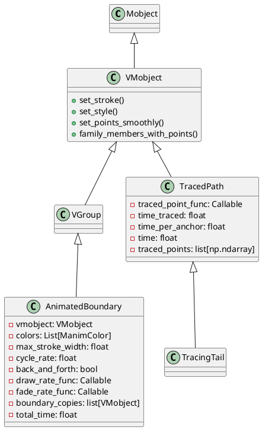
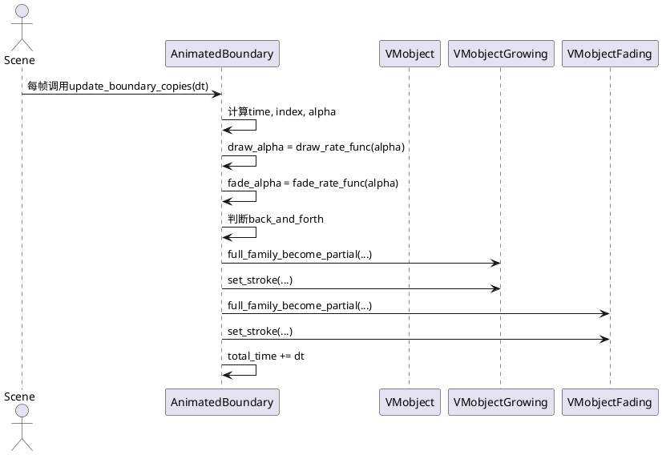
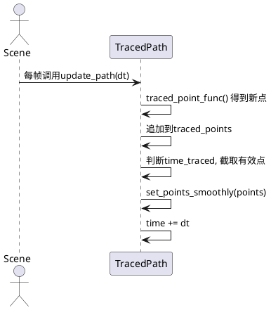

# manimlib/mobject/changing.py 类与用法详解

---

## 1. 类结构与关键属性（PlantUML类图）



### 关键属性说明
- **AnimatedBoundary**
  - `vmobject`: 需要绘制边界动画的VMobject对象。
  - `colors`: 边界动画的颜色序列。
  - `max_stroke_width`: 边界最大描边宽度。
  - `cycle_rate`: 颜色循环速率。
  - `back_and_forth`: 是否往返动画。
  - `draw_rate_func`/`fade_rate_func`: 控制动画进度的速率函数。
  - `boundary_copies`: 两个边界副本用于动画。
  - `total_time`: 累计动画时间。
- **TracedPath**
  - `traced_point_func`: 返回被追踪点坐标的函数。
  - `time_traced`: 追踪的时间长度。
  - `time_per_anchor`: 每个锚点的时间间隔。
  - `traced_points`: 追踪到的点的列表。
- **TracingTail**
  - 继承自TracedPath，主要用于追踪Mobject的中心或自定义函数。

---

## 2. 关键方法与算法（PlantUML时序图）

### 2.1 AnimatedBoundary 动画边界的更新



#### 关键算法说明
- **full_family_become_partial**：对growing和fading两个边界副本，分别根据动画进度设置部分路径的显示，实现边界动画的“生长”和“消退”效果。
- **update_boundary_copies**：根据当前时间、速率函数、颜色序列，动态调整边界副本的显示范围和样式。

### 2.2 TracedPath 路径追踪的更新



#### 关键算法说明
- **update_path**：每帧采样被追踪点，维护一个长度受限的点集，平滑地更新路径，实现“尾迹”或“轨迹”效果。

---

## 3. 用法示例

### 3.1 AnimatedBoundary 示例
```python
from manimlib import *

class AnimatedBoundaryDemo(Scene):
    def construct(self):
        circle = Circle(radius=2, color=BLUE)
        boundary = AnimatedBoundary(circle)
        self.add(circle, boundary)
        self.wait(4)
```

### 3.2 TracedPath 示例
```python
from manimlib import *

class TracedPathDemo(Scene):
    def construct(self):
        dot = Dot().shift(LEFT * 3)
        path = TracedPath(lambda: dot.get_center(), stroke_color=YELLOW)
        self.add(dot, path)
        self.play(dot.animate.shift(RIGHT * 6), run_time=3)
        self.wait()
```

### 3.3 TracingTail 示例
```python
from manimlib import *

class TracingTailDemo(Scene):
    def construct(self):
        dot = Dot().shift(LEFT * 3)
        tail = TracingTail(dot, time_traced=2, stroke_color=RED)
        self.add(dot, tail)
        self.play(dot.animate.shift(RIGHT * 6), run_time=3)
        self.wait()
```

---

## 4. 说明
- 这些类主要用于实现动态边界动画和路径追踪效果，常用于演示物体运动轨迹、突出显示等场景。
- 速率函数如`smooth`可自定义，影响动画的节奏和表现。
