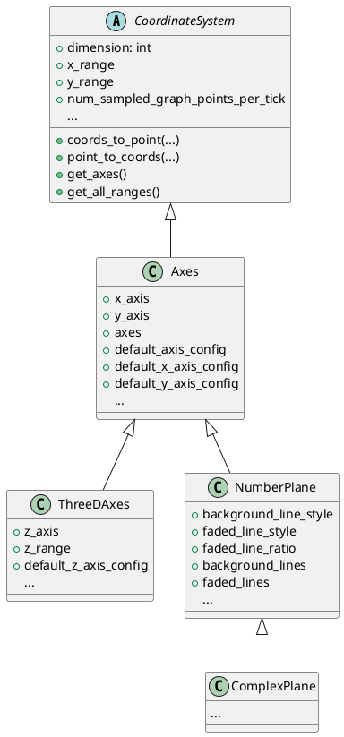
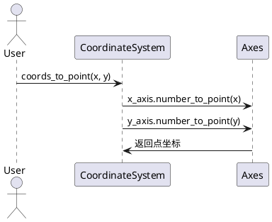
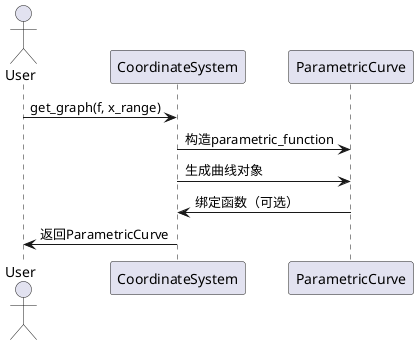
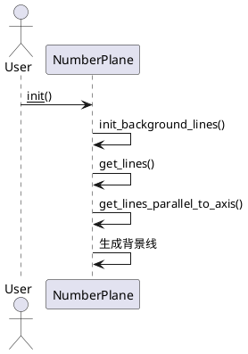

# manimlib/mobject/coordinate_systems.py 详解

---

## 1. 类结构与关键属性（PlantUML类图）



### 关键属性说明
- `dimension`: 维度，CoordinateSystem为2，ThreeDAxes为3。
- `x_range`, `y_range`, `z_range`: 各轴的范围与步长。
- `x_axis`, `y_axis`, `z_axis`: 对应的NumberLine对象。
- `axes`: 所有轴的VGroup集合。
- `background_line_style`, `faded_line_style`, `faded_line_ratio`: NumberPlane背景网格线样式。
- `num_sampled_graph_points_per_tick`: 绘图采样点密度。

---

## 2. 关键方法与算法（PlantUML时序图）

### 2.1 坐标到点的转换（CoordinateSystem.coords_to_point）


### 2.2 绘制函数图像（CoordinateSystem.get_graph）


### 2.3 NumberPlane 背景网格生成


---

## 3. 典型用法示例

### 3.1 二维坐标系与函数绘制
```python
from manimlib import Scene
from manimlib.mobject.coordinate_systems import Axes

class PlotGraph(Scene):
    def construct(self):
        axes = Axes(
            x_range=[-3, 3, 1],
            y_range=[-2, 2, 1],
            width=6,
            height=4
        )
        graph = axes.get_graph(lambda x: x**2, color="#00bfff")
        axes.add_coordinate_labels()
        self.add(axes, graph)
```

### 3.2 三维坐标系与曲面
```python
from manimlib import ThreeDScene
from manimlib.mobject.coordinate_systems import ThreeDAxes

class PlotSurface(ThreeDScene):
    def construct(self):
        axes = ThreeDAxes()
        surface = axes.get_graph(lambda x, y: x**2 - y**2)
        axes.add_axis_labels()
        self.add(axes, surface)
```

### 3.3 复平面与复数点标注
```python
from manimlib import Scene
from manimlib.mobject.coordinate_systems import ComplexPlane

class ComplexDemo(Scene):
    def construct(self):
        plane = ComplexPlane()
        plane.add_coordinate_labels()
        dot = plane.get_vector([1+1j], color="red")
        self.add(plane, dot)
```

---

## 4. 总结
本文件提供了Manim中二维、三维、复数等常用坐标系的抽象与实现，支持灵活的坐标变换、函数绘制、网格生成等功能，是动画数学可视化的基础模块。
