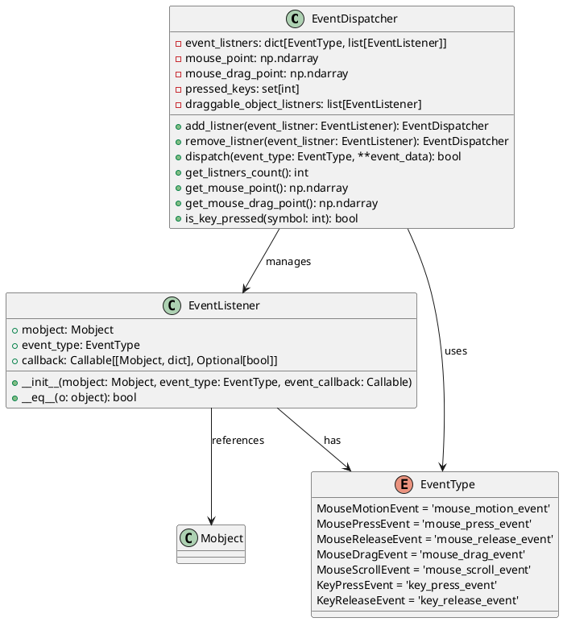
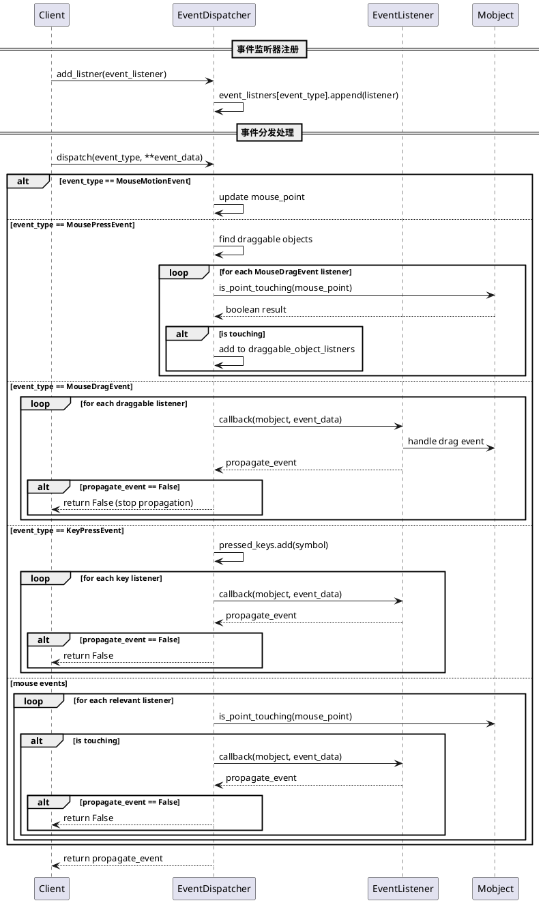

# EventDispatcher 事件分发器详细分析

## 1. 类结构及关键属性分析

### 类图展示



### 关键属性说明

| 属性名 | 类型 | 说明 |
|--------|------|------|
| `event_listners` | `dict[EventType, list[EventListener]]` | 事件监听器字典，按事件类型分组存储所有监听器 |
| `mouse_point` | `np.ndarray` | 当前鼠标位置的3D坐标点 |
| `mouse_drag_point` | `np.ndarray` | 鼠标拖拽时的3D坐标点 |
| `pressed_keys` | `set[int]` | 当前按下的按键符号集合 |
| `draggable_object_listners` | `list[EventListener]` | 当前可拖拽的对象监听器列表 |

## 2. 关键实现方法及算法分析

### 核心方法时序图



### 算法核心逻辑

1. **事件状态管理算法**：
   - 维护鼠标位置、按键状态等全局状态
   - 根据事件类型更新相应状态变量
   - 特殊处理拖拽事件的对象选择逻辑

2. **事件分发算法**：
   - 按事件类型分类处理
   - 鼠标事件需要检查空间碰撞检测
   - 键盘事件直接广播给所有监听器
   - 拖拽事件只分发给选中的可拖拽对象

3. **事件传播控制**：
   - 回调函数可返回False来停止事件传播
   - 支持事件冒泡机制的控制

## 3. 使用方法及代码示例

### 基础使用示例

```python
import numpy as np
from manimlib.event_handler.event_dispatcher import EventDispatcher
from manimlib.event_handler.event_listener import EventListener  
from manimlib.event_handler.event_type import EventType
from manimlib.mobject.geometry import Circle
from manimlib.scene.scene import Scene

class InteractiveScene(Scene):
    def __init__(self, **kwargs):
        super().__init__(**kwargs)
        self.event_dispatcher = EventDispatcher()
        self.setup_interactive_objects()
    
    def setup_interactive_objects(self):
        # 创建交互式圆形对象
        self.circle = Circle(radius=1, color=BLUE)
        self.add(self.circle)
        
        # 鼠标点击事件处理器
        def on_circle_click(mobject, event_data):
            print(f"圆形被点击了！位置: {event_data.get('point', 'Unknown')}")
            mobject.set_color(RED)
            return True  # 继续事件传播
        
        # 鼠标拖拽事件处理器  
        def on_circle_drag(mobject, event_data):
            drag_point = event_data.get('point')
            if drag_point is not None:
                mobject.move_to(drag_point)
                print(f"圆形被拖拽到: {drag_point}")
            return False  # 停止事件传播
        
        # 鼠标悬停事件处理器
        def on_circle_hover(mobject, event_data):
            mobject.set_stroke_width(3)
            return True
        
        # 注册事件监听器
        click_listener = EventListener(
            self.circle, 
            EventType.MousePressEvent, 
            on_circle_click
        )
        
        drag_listener = EventListener(
            self.circle,
            EventType.MouseDragEvent, 
            on_circle_drag
        )
        
        hover_listener = EventListener(
            self.circle,
            EventType.MouseMotionEvent,
            on_circle_hover
        )
        
        # 添加监听器到分发器
        self.event_dispatcher.add_listner(click_listener)
        self.event_dispatcher.add_listner(drag_listener) 
        self.event_dispatcher.add_listner(hover_listener)
        
    def handle_event(self, event_type, **event_data):
        """处理来自窗口系统的事件"""
        # 分发事件到事件分发器
        result = self.event_dispatcher.dispatch(event_type, **event_data)
        return result
```

### 高级使用示例：多对象交互系统

```python
class AdvancedInteractiveScene(Scene):
    def __init__(self, **kwargs):
        super().__init__(**kwargs)
        self.event_dispatcher = EventDispatcher()
        self.selected_objects = []
        self.setup_complex_interactions()
        
    def setup_complex_interactions(self):
        # 创建多个可交互对象
        self.objects = [
            Circle(radius=0.5).shift(LEFT * 2),
            Square(side_length=1).shift(RIGHT * 2),  
            Triangle().shift(UP * 2)
        ]
        
        for obj in self.objects:
            self.add(obj)
            self.setup_object_interactions(obj)
            
        # 设置全局按键事件
        self.setup_global_key_handlers()
        
    def setup_object_interactions(self, mobject):
        """为单个对象设置交互事件"""
        
        def on_object_select(mob, event_data):
            """对象选择处理"""
            if mob not in self.selected_objects:
                self.selected_objects.append(mob)
                mob.set_stroke_color(YELLOW)
                mob.set_stroke_width(3)
                print(f"对象 {type(mob).__name__} 被选中")
            else:
                self.selected_objects.remove(mob)
                mob.set_stroke_color(WHITE)
                mob.set_stroke_width(1)
                print(f"对象 {type(mob).__name__} 取消选中")
            return False  # 防止多选时的事件冲突
            
        def on_object_drag(mob, event_data):
            """拖拽处理 - 同时移动所有选中对象"""
            if mob in self.selected_objects:
                drag_vector = event_data['point'] - self.event_dispatcher.get_mouse_point() 
                for selected_mob in self.selected_objects:
                    current_pos = selected_mob.get_center()
                    selected_mob.move_to(current_pos + drag_vector)
                return False
            return True
            
        def on_object_hover(mob, event_data):
            """悬停效果"""
            if mob not in self.selected_objects:
                mob.set_fill_opacity(0.3)
            return True
            
        # 注册事件监听器
        listeners = [
            EventListener(mobject, EventType.MousePressEvent, on_object_select),
            EventListener(mobject, EventType.MouseDragEvent, on_object_drag), 
            EventListener(mobject, EventType.MouseMotionEvent, on_object_hover)
        ]
        
        for listener in listeners:
            self.event_dispatcher.add_listner(listener)
            
    def setup_global_key_handlers(self):
        """设置全局按键处理"""
        
        def on_delete_key(mob, event_data):
            """删除选中对象"""
            key_symbol = event_data.get('symbol')
            if key_symbol == 127:  # DELETE键
                for obj in self.selected_objects.copy():
                    self.remove(obj)
                    # 移除相关的事件监听器
                    listeners_to_remove = [
                        listener for event_listeners in self.event_dispatcher.event_listners.values()
                        for listener in event_listeners if listener.mobject == obj
                    ]
                    for listener in listeners_to_remove:
                        self.event_dispatcher.remove_listner(listener)
                        
                self.selected_objects.clear()
                print(f"删除了 {len(self.selected_objects)} 个对象")
            return True
            
        def on_escape_key(mob, event_data):
            """取消所有选择"""  
            key_symbol = event_data.get('symbol')
            if key_symbol == 65307:  # ESC键
                for obj in self.selected_objects:
                    obj.set_stroke_color(WHITE)
                    obj.set_stroke_width(1)
                    obj.set_fill_opacity(0)
                self.selected_objects.clear()
                print("取消所有选择")
            return True
        
        # 由于按键事件不依赖特定对象，可以使用场景本身作为mobject
        key_listeners = [
            EventListener(self, EventType.KeyPressEvent, on_delete_key),
            EventListener(self, EventType.KeyPressEvent, on_escape_key)
        ]
        
        for listener in key_listeners:
            self.event_dispatcher.add_listner(listener)
    
    def on_key_press(self, symbol, modifiers):
        """窗口系统的按键事件入口"""
        self.event_dispatcher.dispatch(
            EventType.KeyPressEvent, 
            symbol=symbol, 
            modifiers=modifiers
        )
        
    def on_mouse_press(self, point, button, mods):
        """窗口系统的鼠标按下事件入口"""
        self.event_dispatcher.dispatch(
            EventType.MousePressEvent,
            point=point,
            button=button, 
            mods=mods
        )
        
    def on_mouse_drag(self, point, d_point, buttons, modifiers):
        """窗口系统的鼠标拖拽事件入口"""
        self.event_dispatcher.dispatch(
            EventType.MouseDragEvent,
            point=point,
            d_point=d_point,
            buttons=buttons,
            modifiers=modifiers
        )
        
    def check_interactive_status(self):
        """检查当前交互状态的实用方法"""
        print(f"当前监听器数量: {len(self.event_dispatcher)}")
        print(f"鼠标位置: {self.event_dispatcher.get_mouse_point()}")
        print(f"按下的按键: {self.event_dispatcher.pressed_keys}")
        print(f"选中对象数量: {len(self.selected_objects)}")
```

### 事件监听器的动态管理示例

```python  
class DynamicEventManager:
    """事件监听器的动态管理工具类"""
    
    def __init__(self, event_dispatcher: EventDispatcher):
        self.dispatcher = event_dispatcher
        self.listener_groups = {}  # 按组管理监听器
        
    def create_listener_group(self, group_name: str, mobjects: list, event_configs: list):
        """批量创建监听器组"""
        listeners = []
        
        for mobject in mobjects:
            for config in event_configs:
                event_type = config['event_type']
                callback = config['callback'] 
                
                listener = EventListener(mobject, event_type, callback)
                listeners.append(listener)
                self.dispatcher.add_listner(listener)
                
        self.listener_groups[group_name] = listeners
        return listeners
        
    def enable_listener_group(self, group_name: str):
        """启用监听器组"""
        if group_name in self.listener_groups:
            for listener in self.listener_groups[group_name]:
                self.dispatcher.add_listner(listener)
                
    def disable_listener_group(self, group_name: str):
        """禁用监听器组"""
        if group_name in self.listener_groups:
            for listener in self.listener_groups[group_name]:
                self.dispatcher.remove_listner(listener)
                
    def remove_listener_group(self, group_name: str):
        """彻底移除监听器组"""
        if group_name in self.listener_groups:
            for listener in self.listener_groups[group_name]:
                self.dispatcher.remove_listner(listener)
            del self.listener_groups[group_name]

# 使用示例
scene = AdvancedInteractiveScene()
manager = DynamicEventManager(scene.event_dispatcher)

# 创建按钮组的事件配置
button_configs = [
    {
        'event_type': EventType.MousePressEvent,
        'callback': lambda mob, data: mob.set_color(GREEN)
    },
    {
        'event_type': EventType.MouseReleaseEvent,  
        'callback': lambda mob, data: mob.set_color(BLUE)
    }
]

# 批量创建按钮交互
buttons = [Circle().shift(i*RIGHT) for i in range(5)]
manager.create_listener_group("buttons", buttons, button_configs)

# 可以动态启用/禁用整组交互
manager.disable_listener_group("buttons")  # 禁用所有按钮交互
manager.enable_listener_group("buttons")   # 重新启用按钮交互
```

## 4. 类总结及使用建议

### EventDispatcher 类定义与作用

**定义**: `EventDispatcher` 是一个事件分发器类，负责管理和分发各种用户交互事件到对应的事件监听器。

**核心作用**:
- **事件中心化管理**: 统一管理所有交互事件，避免事件处理逻辑分散
- **状态维护**: 维护鼠标位置、按键状态等全局交互状态  
- **智能分发**: 根据事件类型和空间位置智能分发事件
- **传播控制**: 支持事件传播的精确控制

### 使用场景

1. **交互式动画制作**: 创建可点击、拖拽的数学对象
2. **教育演示工具**: 构建交互式数学概念演示
3. **游戏化学习**: 开发数学游戏和交互式练习
4. **数据可视化**: 创建可交互的图表和图形
5. **GUI组件开发**: 在manim中构建用户界面元素

### 使用特性

**优势**:
- ✅ **类型安全**: 使用类型注解，提供良好的IDE支持
- ✅ **灵活的事件处理**: 支持多种事件类型和自定义回调
- ✅ **空间感知**: 自动处理鼠标-对象的空间碰撞检测
- ✅ **状态管理**: 自动维护交互状态，简化开发
- ✅ **事件传播控制**: 精确控制事件是否继续传播
- ✅ **操作符重载**: 支持`+=`和`-=`操作符，使用更直观

**局限性**:
- ⚠️ **性能考虑**: 大量对象时的碰撞检测可能影响性能
- ⚠️ **3D支持**: 主要为2D交互设计，3D场景支持有限  
- ⚠️ **事件类型**: 目前只支持鼠标和键盘事件

### 建议与注意事项

#### 最佳实践

1. **合理组织监听器**:
```python
# 推荐：按功能对监听器分组管理
ui_listeners = []
animation_listeners = []  
debug_listeners = []
```

2. **控制事件传播**:
```python
def critical_handler(mobject, event_data):
    # 重要事件处理，阻止进一步传播
    return False  

def normal_handler(mobject, event_data):  
    # 普通事件处理，允许继续传播
    return True
```

3. **及时清理监听器**:
```python
# 对象销毁时记得移除相关监听器
def cleanup_object(mobject):
    listeners_to_remove = [
        listener for listeners in dispatcher.event_listners.values()
        for listener in listeners if listener.mobject == mobject
    ]
    for listener in listeners_to_remove:
        dispatcher.remove_listner(listener)
```

4. **性能优化**:
```python
# 对于大量对象，考虑使用空间索引
# 或者限制同时激活的交互对象数量
MAX_INTERACTIVE_OBJECTS = 50

def add_interactive_object(obj):
    if len(active_objects) >= MAX_INTERACTIVE_OBJECTS:
        # 移除最旧的对象或使用其他策略
        remove_oldest_interactive_object()
    active_objects.append(obj)
```

#### 常见陷阱

1. **内存泄漏**: 忘记移除监听器可能导致对象无法被垃圾回收
2. **事件冲突**: 多个监听器处理同一事件时要注意返回值
3. **坐标系统**: 确保鼠标坐标与场景坐标系统一致
4. **线程安全**: 在多线程环境中使用时需要额外注意

#### 扩展建议

```python
# 可以考虑扩展的功能
class EnhancedEventDispatcher(EventDispatcher):
    def __init__(self):
        super().__init__()
        self.event_history = []  # 事件历史记录
        self.performance_monitor = PerformanceMonitor()  # 性能监控
        
    def dispatch_with_history(self, event_type, **event_data):
        # 记录事件到历史
        self.event_history.append((event_type, event_data, time.time()))
        
        # 性能监控
        with self.performance_monitor.measure(f"dispatch_{event_type.value}"):
            return super().dispatch(event_type, **event_data)
            
    def get_event_statistics(self):
        """获取事件统计信息"""
        return {
            'total_events': len(self.event_history),
            'events_by_type': Counter(evt[0] for evt in self.event_history),
            'average_dispatch_time': self.performance_monitor.get_average_time()
        }
```

通过以上分析和示例，`EventDispatcher` 类为manim提供了强大而灵活的事件处理能力，使得创建交互式数学动画变得简单和直观。正确使用这个类可以大大增强动画的交互性和用户体验。