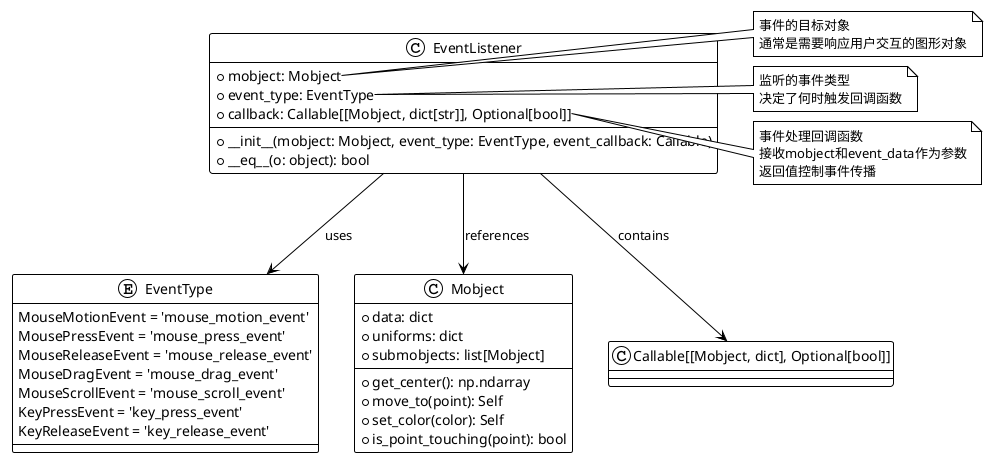
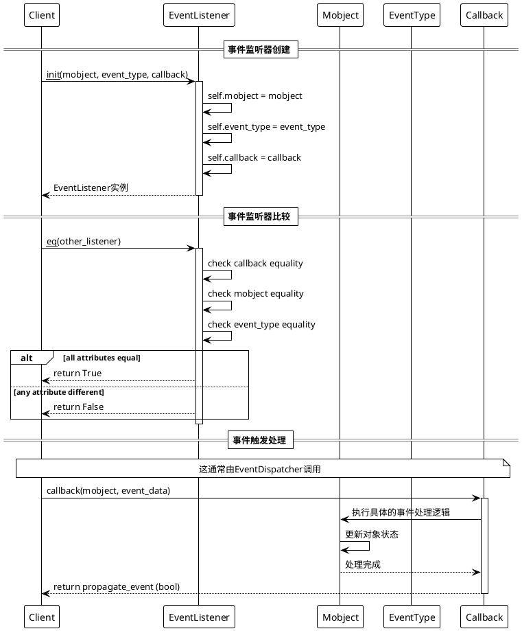

# EventListener 事件监听器详细分析

## 概述

`EventListener` 是 ManimGL 事件处理系统中的核心类，负责封装特定 Mobject 对象的事件处理逻辑。它作为事件分发器（EventDispatcher）和具体事件回调函数之间的桥梁，将事件类型、目标对象和处理函数绑定在一起，实现了事件驱动的交互式动画效果。

## 1. 类结构及关键属性分析

### 1.1 类图展示



### 1.2 关键属性说明

| 属性名 | 类型 | 说明 |
|--------|------|------|
| `mobject` | `Mobject` | 事件的目标对象，通常是需要响应用户交互的图形对象（如Circle、Square等） |
| `event_type` | `EventType` | 监听的事件类型，决定了何时触发回调函数（如鼠标点击、键盘按键等） |
| `callback` | `Callable[[Mobject, dict[str]], Optional[bool]]` | 事件处理回调函数，接收mobject和event_data作为参数，返回值控制事件传播 |

## 2. 关键实现方法及算法分析

### 2.1 核心方法时序图



### 2.2 核心算法分析

#### 2.2.1 初始化算法
```python
def __init__(self, mobject: Mobject, event_type: EventType, event_callback: Callable):
    self.mobject = mobject          # 存储目标对象引用
    self.event_type = event_type    # 存储事件类型
    self.callback = event_callback  # 存储回调函数
```

**算法特点**：
- **简单直接**：直接存储三个核心属性，没有复杂的初始化逻辑
- **类型安全**：使用类型注解确保参数类型正确
- **轻量级**：最小化内存占用，适合大量实例化

#### 2.2.2 相等性比较算法
```python
def __eq__(self, o: object) -> bool:
    return_val = False
    try:
        return_val = self.callback == o.callback \
            and self.mobject == o.mobject \
            and self.event_type == o.event_type
    except:
        pass
    return return_val
```

**算法特点**：
- **三重比较**：比较回调函数、目标对象和事件类型
- **异常安全**：使用try-except确保比较过程不会抛出异常
- **短路求值**：使用布尔运算符的短路特性提高效率

## 3. 使用方法及代码示例

### 3.1 基础使用示例

```python
from manimlib.event_handler.event_listener import EventListener
from manimlib.event_handler.event_type import EventType
from manimlib.mobject.geometry import Circle
from manimlib.constants import BLUE, RED

# 创建一个圆形对象
circle = Circle(radius=1, color=BLUE)

# 定义事件回调函数
def on_circle_click(mobject, event_data):
    """圆形点击处理函数"""
    print(f"圆形被点击了！位置: {event_data.get('point')}")
    mobject.set_color(RED)
    return True  # 返回True表示继续事件传播

# 创建事件监听器
click_listener = EventListener(
    mobject=circle,
    event_type=EventType.MousePressEvent,
    event_callback=on_circle_click
)

print(f"监听器创建成功：{click_listener}")
print(f"目标对象: {click_listener.mobject}")
print(f"事件类型: {click_listener.event_type}")
print(f"回调函数: {click_listener.callback}")
```

### 3.2 多事件监听示例

```python
from manimlib.event_handler.event_listener import EventListener
from manimlib.event_handler.event_type import EventType
from manimlib.mobject.geometry import Square
from manimlib.constants import GREEN, YELLOW, BLUE

class InteractiveSquare:
    """交互式方形类，演示多事件监听"""
    
    def __init__(self, square: Square):
        self.square = square
        self.original_color = square.color
        self.listeners = []
        self.setup_listeners()
    
    def setup_listeners(self):
        """设置多个事件监听器"""
        
        # 鼠标点击事件
        def on_click(mobject, event_data):
            print("方形被点击！")
            mobject.set_color(GREEN)
            return True
        
        # 鼠标悬停事件
        def on_hover(mobject, event_data):
            print("鼠标悬停在方形上")
            mobject.set_fill_opacity(0.3)
            return True
        
        # 鼠标拖拽事件
        def on_drag(mobject, event_data):
            drag_point = event_data.get('point')
            if drag_point is not None:
                mobject.move_to(drag_point)
                print(f"方形被拖拽到: {drag_point}")
            return False  # 停止事件传播，防止其他对象响应
        
        # 鼠标释放事件
        def on_release(mobject, event_data):
            print("鼠标释放")
            mobject.set_color(self.original_color)
            mobject.set_fill_opacity(0)
            return True
        
        # 创建监听器列表
        event_configs = [
            (EventType.MousePressEvent, on_click),
            (EventType.MouseMotionEvent, on_hover),
            (EventType.MouseDragEvent, on_drag),
            (EventType.MouseReleaseEvent, on_release)
        ]
        
        for event_type, callback in event_configs:
            listener = EventListener(
                mobject=self.square,
                event_type=event_type,
                event_callback=callback
            )
            self.listeners.append(listener)
    
    def get_listeners(self):
        """获取所有监听器"""
        return self.listeners

# 使用示例
square = Square(side_length=2, color=BLUE)
interactive_square = InteractiveSquare(square)

# 获取监听器并添加到事件分发器
listeners = interactive_square.get_listeners()
print(f"创建了 {len(listeners)} 个监听器")

for listener in listeners:
    print(f"监听器: {listener.event_type.value} -> {listener.callback.__name__}")
```

### 3.3 监听器管理示例

```python
from manimlib.event_handler.event_listener import EventListener
from manimlib.event_handler.event_type import EventType
from manimlib.mobject.geometry import Circle, Square, Triangle
from manimlib.constants import RED, GREEN, BLUE

class EventListenerManager:
    """事件监听器管理器，演示监听器的添加、移除和比较"""
    
    def __init__(self):
        self.listeners = []
    
    def add_listener(self, listener: EventListener):
        """添加监听器（避免重复）"""
        if listener not in self.listeners:
            self.listeners.append(listener)
            print(f"添加监听器: {listener.event_type.value} for {type(listener.mobject).__name__}")
        else:
            print(f"监听器已存在，跳过添加")
    
    def remove_listener(self, listener: EventListener):
        """移除监听器"""
        if listener in self.listeners:
            self.listeners.remove(listener)
            print(f"移除监听器: {listener.event_type.value} for {type(listener.mobject).__name__}")
        else:
            print("监听器不存在，无法移除")
    
    def find_listeners_by_mobject(self, mobject):
        """根据对象查找监听器"""
        return [listener for listener in self.listeners if listener.mobject == mobject]
    
    def find_listeners_by_event_type(self, event_type):
        """根据事件类型查找监听器"""
        return [listener for listener in self.listeners if listener.event_type == event_type]
    
    def get_statistics(self):
        """获取监听器统计信息"""
        stats = {
            'total_listeners': len(self.listeners),
            'by_event_type': {},
            'by_mobject_type': {}
        }
        
        for listener in self.listeners:
            # 按事件类型统计
            event_type_name = listener.event_type.value
            stats['by_event_type'][event_type_name] = \
                stats['by_event_type'].get(event_type_name, 0) + 1
            
            # 按对象类型统计
            mobject_type_name = type(listener.mobject).__name__
            stats['by_mobject_type'][mobject_type_name] = \
                stats['by_mobject_type'].get(mobject_type_name, 0) + 1
        
        return stats

# 使用示例
manager = EventListenerManager()

# 创建不同的几何对象
circle = Circle(radius=1, color=RED)
square = Square(side_length=1, color=GREEN)
triangle = Triangle(color=BLUE)

# 定义通用的事件处理函数
def generic_click_handler(mobject, event_data):
    print(f"{type(mobject).__name__} 被点击了！")
    return True

def generic_hover_handler(mobject, event_data):
    print(f"鼠标悬停在 {type(mobject).__name__} 上")
    return True

# 批量创建监听器
shapes = [circle, square, triangle]
event_types = [EventType.MousePressEvent, EventType.MouseMotionEvent]
callbacks = [generic_click_handler, generic_hover_handler]

for shape in shapes:
    for event_type, callback in zip(event_types, callbacks):
        listener = EventListener(
            mobject=shape,
            event_type=event_type,
            event_callback=callback
        )
        manager.add_listener(listener)

# 尝试添加重复的监听器
duplicate_listener = EventListener(
    mobject=circle,
    event_type=EventType.MousePressEvent,
    event_callback=generic_click_handler
)
manager.add_listener(duplicate_listener)  # 应该被跳过

# 查看统计信息
stats = manager.get_statistics()
print(f"\n监听器统计信息:")
print(f"总数: {stats['total_listeners']}")
print(f"按事件类型分组: {stats['by_event_type']}")
print(f"按对象类型分组: {stats['by_mobject_type']}")

# 查找特定对象的监听器
circle_listeners = manager.find_listeners_by_mobject(circle)
print(f"\n圆形对象的监听器数量: {len(circle_listeners)}")

# 查找特定事件类型的监听器
click_listeners = manager.find_listeners_by_event_type(EventType.MousePressEvent)
print(f"鼠标点击事件的监听器数量: {len(click_listeners)}")
```

### 3.4 高级功能示例：事件链和回调组合

```python
from manimlib.event_handler.event_listener import EventListener
from manimlib.event_handler.event_type import EventType
from manimlib.mobject.geometry import Circle
from manimlib.constants import RED, GREEN, BLUE, YELLOW

class EventChainDemo:
    """事件链演示：展示如何通过回调返回值控制事件传播"""
    
    def __init__(self):
        self.circle = Circle(radius=1, color=BLUE)
        self.event_log = []
        self.setup_event_chain()
    
    def setup_event_chain(self):
        """设置事件链"""
        
        # 第一个处理器：记录事件
        def log_event(mobject, event_data):
            self.event_log.append(f"事件记录: {event_data}")
            print("第一个处理器：记录事件")
            return True  # 继续传播
        
        # 第二个处理器：安全检查
        def security_check(mobject, event_data):
            # 模拟安全检查
            if event_data.get('safe', True):
                print("第二个处理器：安全检查通过")
                return True  # 继续传播
            else:
                print("第二个处理器：安全检查失败，阻止事件传播")
                return False  # 阻止传播
        
        # 第三个处理器：实际业务逻辑
        def business_logic(mobject, event_data):
            print("第三个处理器：执行业务逻辑")
            mobject.set_color(RED)
            return True  # 理论上不会被阻止的事件才能到达这里
        
        # 创建事件链监听器
        self.chain_listeners = [
            EventListener(self.circle, EventType.MousePressEvent, log_event),
            EventListener(self.circle, EventType.MousePressEvent, security_check),
            EventListener(self.circle, EventType.MousePressEvent, business_logic)
        ]
    
    def simulate_event_dispatch(self, event_data):
        """模拟事件分发过程"""
        print(f"开始分发事件: {event_data}")
        
        for i, listener in enumerate(self.chain_listeners):
            print(f"执行第 {i+1} 个监听器")
            
            # 模拟EventDispatcher的调用
            should_continue = listener.callback(listener.mobject, event_data)
            
            if not should_continue:
                print(f"事件传播被第 {i+1} 个监听器阻止")
                break
            
            print(f"第 {i+1} 个监听器处理完成，继续传播")
        
        print("事件分发完成\n")
    
    def demonstrate_event_propagation(self):
        """演示事件传播控制"""
        print("=== 事件传播控制演示 ===\n")
        
        # 正常事件（会通过所有处理器）
        print("1. 正常事件：")
        self.simulate_event_dispatch({'point': [0, 0, 0], 'safe': True})
        
        # 不安全事件（会被第二个处理器阻止）
        print("2. 不安全事件：")
        self.simulate_event_dispatch({'point': [0, 0, 0], 'safe': False})
        
        print(f"事件日志记录: {len(self.event_log)} 条")

# 运行演示
demo = EventChainDemo()
demo.demonstrate_event_propagation()
```

## 4. 类总结及使用建议

### 4.1 EventListener 类定义与作用

**定义**: `EventListener` 是一个轻量级的事件监听器类，用于封装和管理单个对象的事件处理逻辑。

**核心作用**:
- **事件绑定**: 将特定的事件类型与目标对象和处理函数绑定
- **回调封装**: 提供统一的事件处理接口
- **身份识别**: 通过 `__eq__` 方法支持监听器的比较和去重
- **类型安全**: 使用类型注解确保参数类型正确

### 4.2 使用场景

1. **交互式动画**: 为图形对象添加鼠标点击、拖拽等交互功能
2. **游戏开发**: 实现游戏中的用户输入响应
3. **教育工具**: 创建可交互的数学演示和教学内容
4. **GUI组件**: 在 manim 中构建用户界面元素
5. **数据可视化**: 创建可交互的图表和数据展示

### 4.3 使用特性与优势

**优势**:
- ✅ **轻量级设计**: 最小化内存占用，适合大量实例化
- ✅ **类型安全**: 完整的类型注解支持
- ✅ **简单易用**: API设计简洁，易于理解和使用
- ✅ **灵活性高**: 支持任意回调函数和事件类型组合
- ✅ **异常安全**: 相等性比较使用异常处理确保稳定性
- ✅ **支持链式处理**: 回调函数返回值可控制事件传播

**限制与注意事项**:
- ⚠️ **回调函数要求**: 必须接受 `(mobject, event_data)` 参数
- ⚠️ **内存管理**: 需要注意mobject的生命周期，避免内存泄漏
- ⚠️ **事件传播**: 理解返回值的作用对于事件链处理至关重要

### 4.4 最佳实践建议

#### 4.4.1 回调函数设计

```python
def good_callback(mobject, event_data):
    """良好的回调函数设计示例"""
    try:
        # 1. 验证事件数据
        if not event_data:
            return True
        
        # 2. 执行实际逻辑
        point = event_data.get('point')
        if point is not None:
            mobject.move_to(point)
        
        # 3. 记录日志（可选）
        print(f"处理事件: {event_data}")
        
        # 4. 明确返回值
        return True  # 或 False，根据是否需要继续传播
        
    except Exception as e:
        print(f"回调函数执行错误: {e}")
        return False  # 出错时阻止传播
```

#### 4.4.2 监听器生命周期管理

```python
class ListenerLifecycleManager:
    def __init__(self):
        self.active_listeners = []
        self.cleanup_callbacks = []
    
    def register_listener(self, listener, cleanup_callback=None):
        """注册监听器并可选地注册清理回调"""
        self.active_listeners.append(listener)
        if cleanup_callback:
            self.cleanup_callbacks.append(cleanup_callback)
    
    def cleanup_all(self):
        """清理所有监听器"""
        for callback in self.cleanup_callbacks:
            try:
                callback()
            except Exception as e:
                print(f"清理回调执行错误: {e}")
        
        self.active_listeners.clear()
        self.cleanup_callbacks.clear()
```

#### 4.4.3 事件类型管理

```python
from enum import Enum

class CustomEventType(Enum):
    """自定义事件类型示例"""
    DOUBLE_CLICK = 'double_click'
    LONG_PRESS = 'long_press'
    GESTURE = 'gesture'

# 监听器可以使用自定义事件类型
custom_listener = EventListener(
    mobject=some_object,
    event_type=CustomEventType.DOUBLE_CLICK,
    event_callback=handle_double_click
)
```

#### 4.4.4 性能优化建议

1. **批量操作**: 批量添加/移除监听器而非逐个操作
2. **回调优化**: 保持回调函数简单快速
3. **内存管理**: 及时移除不再需要的监听器
4. **事件过滤**: 在回调函数中早期返回不需要处理的事件

```python
def optimized_callback(mobject, event_data):
    """优化的回调函数示例"""
    # 早期返回不需要处理的事件
    if not should_process(event_data):
        return True
    
    # 批量处理相关操作
    with mobject.batch_update():
        # 批量更新操作
        mobject.set_color(new_color)
        mobject.move_to(new_position)
        mobject.set_opacity(new_opacity)
    
    return True
```

### 4.5 常见问题与解决方案

#### 问题1：监听器重复添加
**解决方案**: 使用集合管理或在添加前检查

```python
# 使用集合避免重复
listeners_set = set()
if listener not in listeners_set:
    listeners_set.add(listener)
```

#### 问题2：回调函数中的异常处理
**解决方案**: 在回调函数中添加异常处理

```python
def safe_callback(mobject, event_data):
    try:
        # 实际处理逻辑
        return True
    except Exception as e:
        print(f"回调函数异常: {e}")
        return False
```

#### 问题3：事件传播控制混乱
**解决方案**: 明确定义事件传播策略

```python
# 明确的事件传播策略
CONTINUE_PROPAGATION = True
STOP_PROPAGATION = False

def clear_callback(mobject, event_data):
    if handle_event_successfully(mobject, event_data):
        return CONTINUE_PROPAGATION
    else:
        return STOP_PROPAGATION
```

通过遵循这些最佳实践，可以有效地使用 `EventListener` 类构建健壮的交互式动画应用。