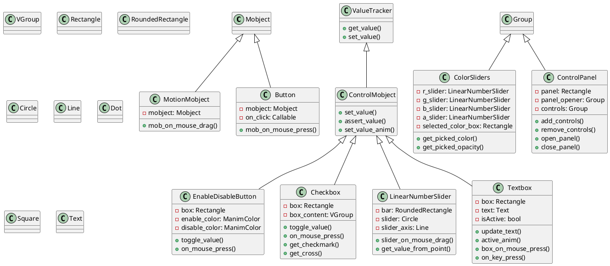
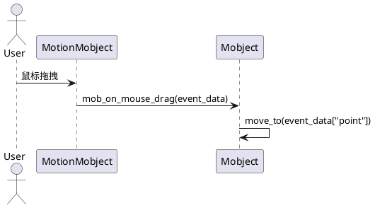
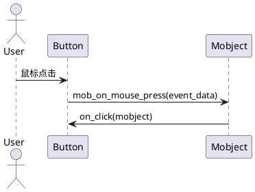
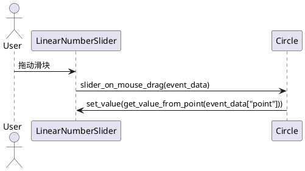
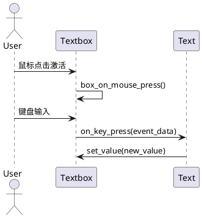
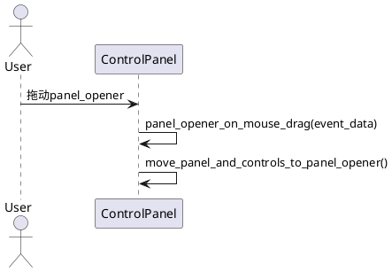

# manimlib/mobject/interactive.py 类与用法详解

---

## 1. 类结构与关键属性（PlantUML类图）



### 关键属性说明
- **MotionMobject**
  - `mobject`: 被包裹的可拖拽对象。
- **Button**
  - `mobject`: 按钮显示对象。
  - `on_click`: 点击回调。
- **ControlMobject**
  - 继承自ValueTracker，支持数值追踪和动画。
- **EnableDisableButton/Checkbox**
  - `box`: 显示的矩形框。
  - `enable_color/disable_color`: 启用/禁用颜色。
  - `box_content`: 勾选/叉号内容。
- **LinearNumberSlider**
  - `bar`: 滑动条背景。
  - `slider`: 滑块。
  - `slider_axis`: 滑块运动轴。
- **ColorSliders**
  - `r_slider/g_slider/b_slider/a_slider`: RGBA滑块。
  - `selected_color_box`: 当前颜色预览。
- **Textbox**
  - `box`: 输入框。
  - `text`: 当前文本。
  - `isActive`: 是否激活。
- **ControlPanel**
  - `panel`: 控制面板背景。
  - `panel_opener`: 面板开关。
  - `controls`: 控件集合。

---

## 2. 关键实现方法与算法（PlantUML时序图）

### 2.1 MotionMobject 拖拽流程


### 2.2 Button 点击流程


### 2.3 LinearNumberSlider 拖动滑块


### 2.4 Textbox 输入流程


### 2.5 ControlPanel 面板开关与拖动


---

## 3. 类的使用方法与代码示例

### 3.1 拖拽对象
```python
from manimlib import *

class DragDemo(Scene):
    def construct(self):
        dot = Dot()
        motion_dot = MotionMobject(dot)
        self.add(motion_dot)
```

### 3.2 按钮与回调
```python
from manimlib import *

class ButtonDemo(Scene):
    def construct(self):
        def on_click(mob):
            mob.set_color(RED)
        rect = Square()
        button = Button(rect, on_click=on_click)
        self.add(button)
```

### 3.3 控件面板
```python
from manimlib import *

class ControlPanelDemo(Scene):
    def construct(self):
        slider = LinearNumberSlider(value=5, min_value=0, max_value=10, step=0.1)
        checkbox = Checkbox(value=True)
        textbox = Textbox(value="Hello")
        panel = ControlPanel(slider, checkbox, textbox)
        self.add(panel)
```

### 3.4 颜色选择器
```python
from manimlib import *

class ColorPickerDemo(Scene):
    def construct(self):
        color_sliders = ColorSliders()
        self.add(color_sliders)
```

---

## 4. 总结与建议

### 使用场景
- **MotionMobject**：用于需要用户交互拖拽的对象。
- **Button**：用于触发事件的交互按钮。
- **ControlMobject/Slider/Checkbox/Textbox**：用于参数调节、表单输入等场景。
- **ColorSliders**：用于颜色选择。
- **ControlPanel**：用于集中管理多个控件，适合复杂交互场景。

### 特性与注意事项
- 所有控件均支持鼠标/键盘事件，需在支持交互的Manim环境下使用。
- 控件的回调函数需保证幂等性和高效性，避免阻塞主线程。
- 控件布局可通过Group/VGroup灵活组合。
- 控件动画与Manim动画兼容，可与Scene动画无缝结合。
- 注意控件的初始值、边界值设置，避免越界或类型错误。

---

