# Mobject模块深度解析

Mobject（Mathematical Object）是Manim库的核心模块，负责创建、管理和操作所有可视化对象。本文档深入解析Mobject模块的架构设计、实现原理和核心算法。

## 1. 逻辑架构

Mobject模块采用面向对象的设计模式，通过类继承和组合构建复杂的对象层次结构。

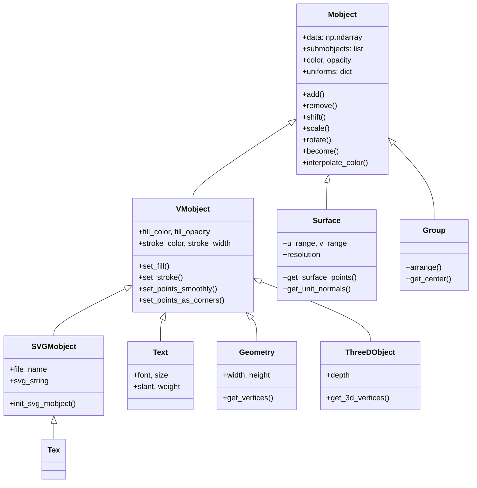

## 2. 运行架构

Mobject对象的生命周期和运行流程如下：

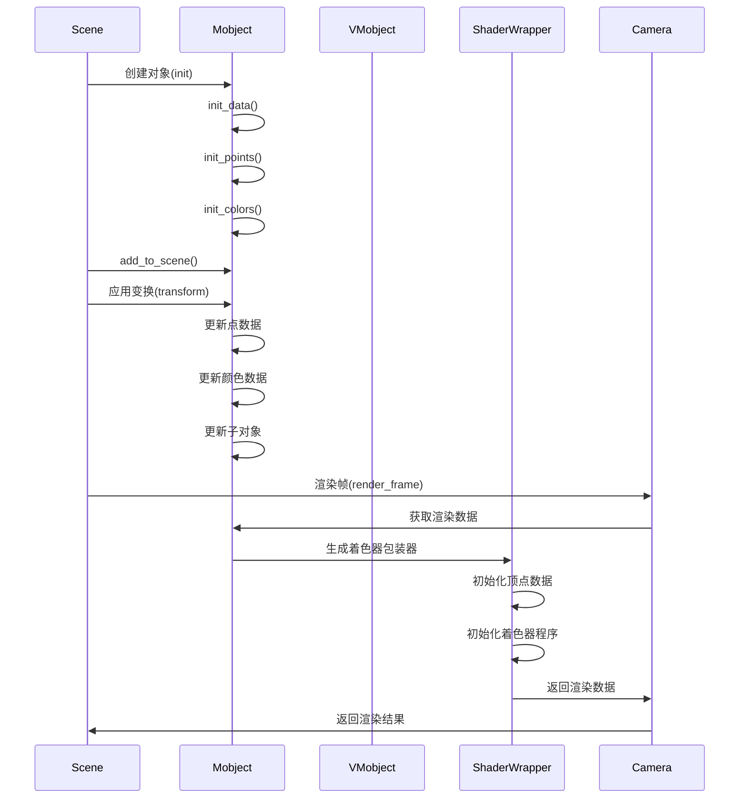

## 3. 数据架构

Mobject模块使用NumPy数组存储和处理数据，采用结构化数据类型。

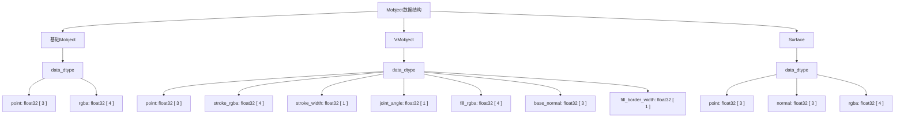

### 3.1 数据流转图

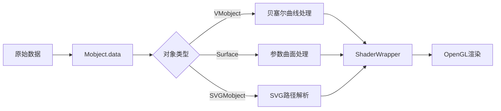

## 4. 实现原理

### 4.1 Mobject基类

Mobject是所有数学对象的基类，提供了以下核心功能：

1. **数据管理**：使用NumPy结构化数组存储点、颜色等数据
2. **层次结构**：通过submobjects列表管理子对象
3. **变换操作**：提供shift、scale、rotate等变换方法
4. **插值功能**：支持对象之间的平滑过渡
5. **着色器集成**：通过ShaderWrapper与OpenGL渲染系统集成

### 4.2 VMobject（矢量对象）

VMobject扩展了Mobject，专门用于处理基于贝塞尔曲线的矢量图形：

1. **贝塞尔曲线**：使用二次和三次贝塞尔曲线表示平滑路径
2. **描边和填充**：支持独立的描边和填充属性
3. **路径操作**：提供路径连接、闭合、细分等操作

### 4.3 渲染管线

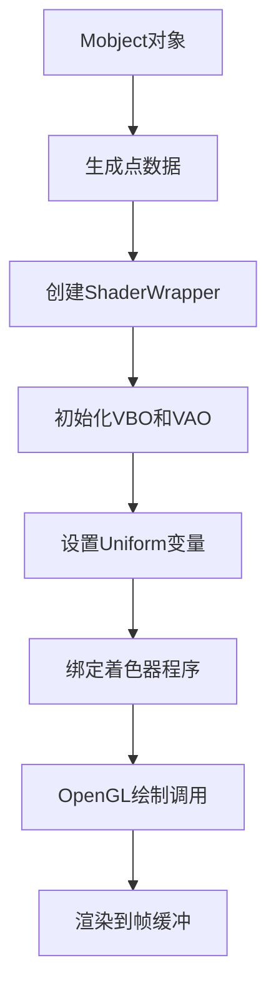

## 5. 核心算法实现

### 5.1 贝塞尔曲线算法

贝塞尔曲线是VMobject的核心，用于生成平滑的曲线：

```python
def bezier(points):
    n = len(points) - 1
    return lambda t: sum(
        ((1 - t)**(n - k)) * (t**k) * choose(n, k) * point
        for k, point in enumerate(points)
    )
```

贝塞尔曲线的分段处理算法：

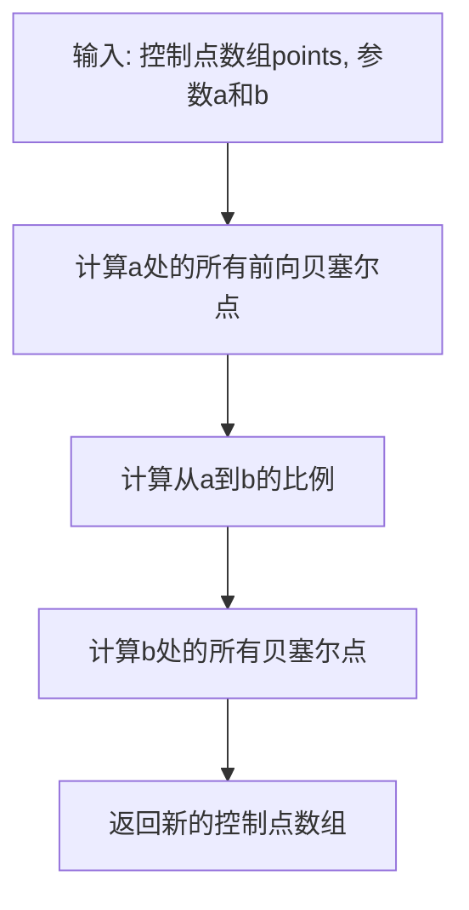

### 5.2 对象变换算法

Mobject支持各种变换操作，如平移、旋转和缩放：

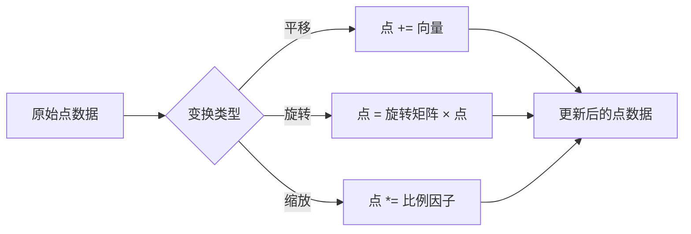

### 5.3 插值算法

对象之间的平滑过渡是动画的基础：

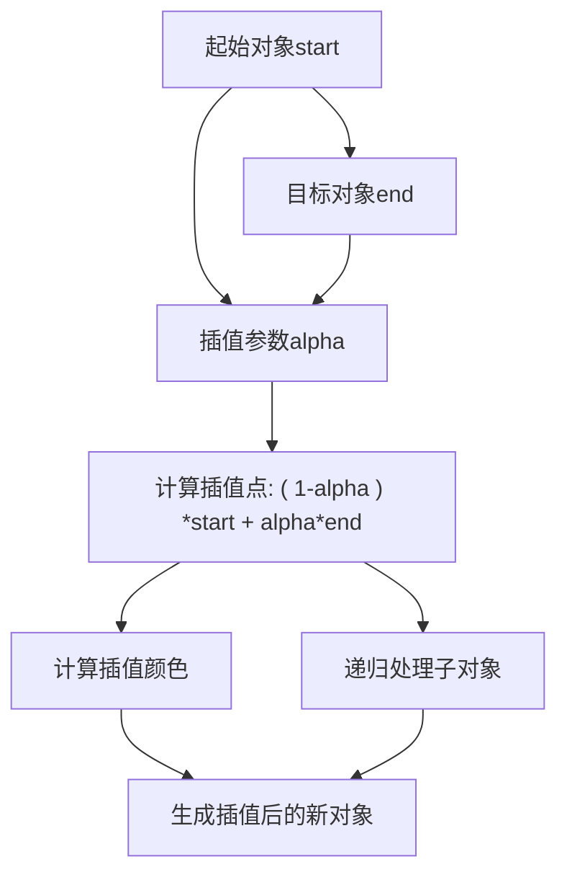

### 5.4 SVG解析算法

SVGMobject通过解析SVG路径命令将矢量图形转换为VMobject：

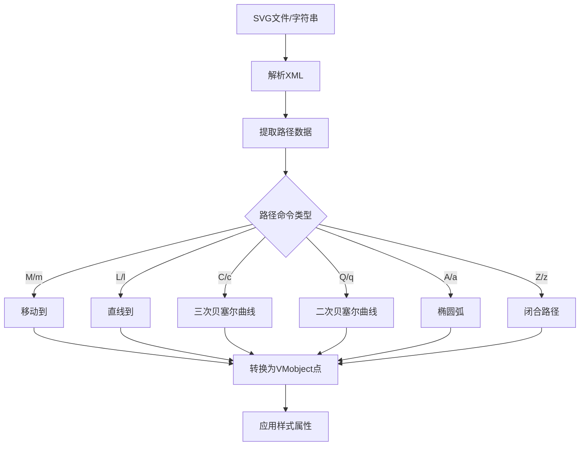

## 6. 对象创建流程

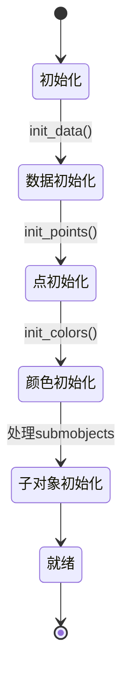

## 7. 渲染优化技术

Mobject模块采用多种优化技术提高渲染性能：

1. **数据缓存**：缓存计算结果避免重复计算
2. **批处理渲染**：将相似对象批量提交给GPU
3. **层次细节**：根据视距调整对象复杂度
4. **着色器优化**：使用高效的GPU着色器程序
5. **惰性更新**：仅在必要时更新数据

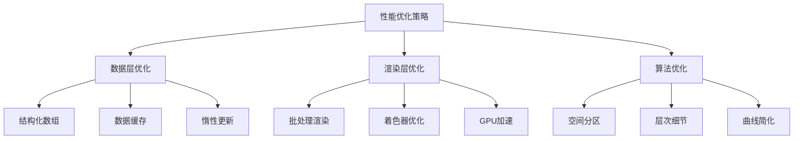

## 8. 模块依赖关系

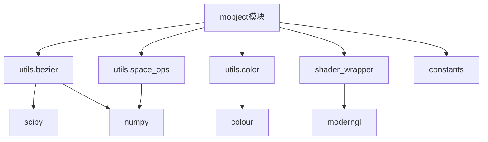

## 9. 总结

Mobject模块是Manim的核心组件，通过精心设计的对象层次结构和高效的数据处理算法，为数学动画提供了强大的表现力。其核心特点包括：

1. 灵活的对象模型，支持复杂的组合和嵌套
2. 高效的数据结构，优化内存使用和计算性能
3. 强大的变换系统，支持各种空间变换和插值
4. 与现代GPU渲染技术的无缝集成
5. 丰富的预定义对象库，满足各种数学可视化需求

通过深入理解Mobject模块的设计和实现，可以更有效地利用Manim创建复杂、精美的数学动画。


---

## 10. Mobject 的基本使用方法

### 1. 基本用法

Mobject 是所有可视化对象的基类，通常通过其子类（如 Dot、Circle、Square、VMobject 等）进行实例化和使用。

#### 示例：创建和添加对象

````python
from manimlib.imports import *

class MobjectBasicDemo(Scene):
def construct(self):
dot = Dot([0, 0, 0], color=YELLOW)
circle = Circle(radius=1, color=BLUE)
square = Square(side_length=2, color=GREEN)
self.add(dot, circle, square)
self.wait(1)
````

### 2. 常用方法

- `shift(vector)`：平移对象
- `scale(factor)`：缩放对象
- `rotate(angle, axis=OUT)`：绕指定轴旋转对象
- `set_color(color)`：设置颜色
- `set_opacity(opacity)`：设置透明度
- `move_to(point)`：移动到指定位置
- `add(*mobjects)`：将子对象添加到当前对象
- `remove(*mobjects)`：移除子对象

#### 示例：对象变换

````python
class MobjectTransformDemo(Scene):
def construct(self):
square = Square()
self.add(square)
self.play(square.animate.shift(RIGHT).scale(1.5).set_color(RED))
self.wait(1)
````

### 3. 组合与分组

可以将多个 Mobject 组合成一个整体，便于统一操作。

````python
class MobjectGroupDemo(Scene):
def construct(self):
dot = Dot(LEFT)
circle = Circle().shift(RIGHT)
group = VGroup(dot, circle)
group.set_color(PURPLE)
group.scale(1.2)
self.add(group)
self.wait(1)
````

### 4. 动画与插值

Mobject 支持与 Manim 动画系统结合，实现平移、缩放、变色等动画。

````python
class MobjectAnimationDemo(Scene):
def construct(self):
square = Square()
circle = Circle()
self.add(square)
self.wait(0.5)
self.play(Transform(square, circle))
self.wait(1)
````

---

通过上述方法，Mobject 及其子类可以灵活地实现对象的创建、变换、组合和动画，满足各种数学动画和可视化需求。