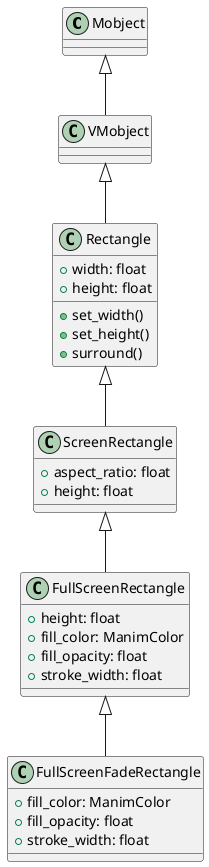
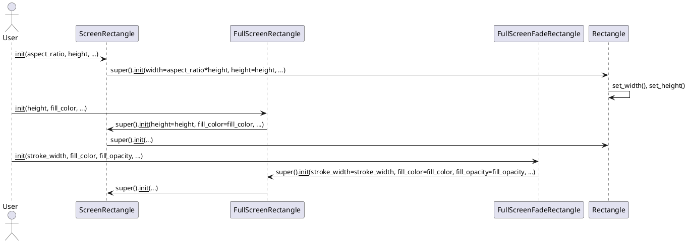

# manimlib/mobject/frame.py 类与用法详解

---

## 1. 类结构与关键属性（PlantUML类图）



### 关键属性说明
- **Rectangle**
  - `width`: 矩形宽度。
  - `height`: 矩形高度。
- **ScreenRectangle**
  - `aspect_ratio`: 屏幕宽高比，默认16:9。
  - `height`: 屏幕矩形高度，默认4。
- **FullScreenRectangle**
  - `height`: 全屏高度，默认FRAME_HEIGHT。
  - `fill_color`: 填充颜色，默认GREY_E。
  - `fill_opacity`: 填充透明度，默认1。
  - `stroke_width`: 描边宽度，默认0。
- **FullScreenFadeRectangle**
  - `fill_color`: 填充颜色，默认BLACK。
  - `fill_opacity`: 填充透明度，默认0.7。
  - `stroke_width`: 描边宽度，默认0。

---

## 2. 关键实现方法与算法（PlantUML时序图）

### 2.1 ScreenRectangle/FullScreenRectangle/FullScreenFadeRectangle 的初始化流程



#### 关键步骤说明
- **ScreenRectangle**：根据给定宽高比和高度，自动计算宽度，调用父类Rectangle初始化。
- **FullScreenRectangle**：默认高度为FRAME_HEIGHT，填充色GREY_E，透明度1，描边宽度0。
- **FullScreenFadeRectangle**：默认填充色BLACK，透明度0.7，描边宽度0，适合用作全屏遮罩。

---

## 3. 用法与高质量代码示例

### 3.1 ScreenRectangle 用法
```python
from manimlib import *

class ScreenRectDemo(Scene):
    def construct(self):
        screen_rect = ScreenRectangle(height=3)
        screen_rect.set_stroke(RED, 4)
        self.add(screen_rect)
        self.wait()
```

### 3.2 FullScreenRectangle 用法
```python
from manimlib import *

class FullScreenRectDemo(Scene):
    def construct(self):
        fs_rect = FullScreenRectangle(fill_color=BLUE, fill_opacity=0.5)
        self.add(fs_rect)
        self.wait()
```

### 3.3 FullScreenFadeRectangle 用法
```python
from manimlib import *

class FullScreenFadeDemo(Scene):
    def construct(self):
        fade_rect = FullScreenFadeRectangle()
        self.add(fade_rect)
        self.wait()
```

### 3.4 典型场景遮罩与聚焦
```python
from manimlib import *

class FocusDemo(Scene):
    def construct(self):
        # 背景内容
        text = Text("聚焦演示", font_size=48)
        self.add(text)
        # 添加全屏半透明遮罩
        fade_rect = FullScreenFadeRectangle()
        self.add(fade_rect)
        # 屏幕聚焦区域
        focus = ScreenRectangle(height=2).set_stroke(YELLOW, 6)
        self.add(focus)
        self.wait()
```

---

## 4. 总结
- 本文件提供了屏幕矩形、全屏矩形及全屏遮罩等常用可视化对象，适用于场景聚焦、遮罩、截图等用途。
- 类的设计充分利用继承，参数灵活，便于自定义样式。
- 推荐与Scene配合，用于高亮、聚焦、遮罩等动画场景。
