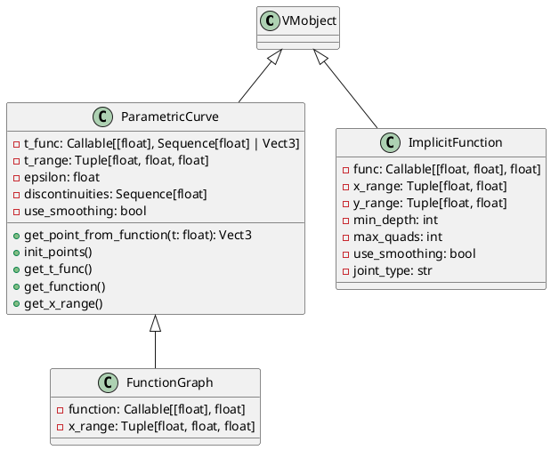
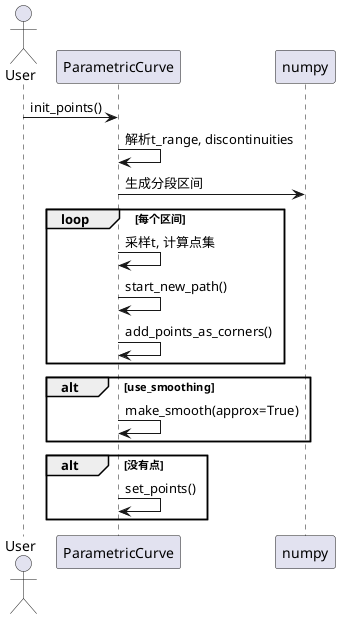
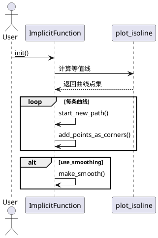

# manimlib/mobject/functions.py 详解

## 1. 类结构与关键属性（PlantUML类图）



### 关键属性说明
- `t_func`：参数方程，输入t返回空间点（支持2D/3D）。
- `t_range`：参数t的取值范围与步长。
- `epsilon`：处理不连续点时的微小偏移。
- `discontinuities`：参数区间内的断点集合。
- `use_smoothing`：是否对曲线进行平滑处理。
- `function`：一元函数，FunctionGraph专用。
- `x_range`：FunctionGraph的自变量范围。
- `func`：隐式函数，ImplicitFunction专用。
- `x_range, y_range`：隐式函数的自变量范围。
- `min_depth, max_quads`：等值线绘制的递归深度与最大分块数。
- `joint_type`：曲线连接方式。

## 2. 关键方法与算法（PlantUML时序图）

### 2.1 ParametricCurve.init_points()



#### 关键算法说明
- 断点处理：将参数区间按discontinuities分段，避免在不连续点处连线。
- 采样：对每个分段区间，按步长采样，生成点集。
- 平滑：可选，对采样点做平滑处理。

### 2.2 ImplicitFunction.__init__



#### 关键算法说明
- plot_isoline：对隐式函数f(x, y)=0进行等值线追踪，返回曲线点集。
- 曲线拼接：每条等值线作为一条路径加入VMobject。

## 3. 使用方法与示例

### 3.1 ParametricCurve 示例
```python
from manimlib.mobject.functions import ParametricCurve
import numpy as np

# 绘制螺旋线
curve = ParametricCurve(
    t_func=lambda t: [np.cos(t), np.sin(t), t/10],
    t_range=(0, 4 * np.pi, 0.05),
    color="BLUE"
)
```

### 3.2 FunctionGraph 示例
```python
from manimlib.mobject.functions import FunctionGraph

# 绘制y=sin(x)曲线
graph = FunctionGraph(
    function=lambda x: np.sin(x),
    x_range=(-3.14, 3.14, 0.05),
    color="YELLOW"
)
```

### 3.3 ImplicitFunction 示例
```python
from manimlib.mobject.functions import ImplicitFunction

# 绘制单位圆x^2 + y^2 = 1
implicit = ImplicitFunction(
    func=lambda x, y: x**2 + y**2 - 1,
    x_range=(-2, 2),
    y_range=(-2, 2),
    color="GREEN"
)
```

## 4. 总结
- `ParametricCurve`适合任意参数曲线，支持断点与平滑。
- `FunctionGraph`专为y=f(x)设计，简化常见函数曲线绘制。
- `ImplicitFunction`可绘制任意隐式曲线，适合复杂边界。
- 三者均继承自`VMobject`，可与manim动画系统无缝集成。
