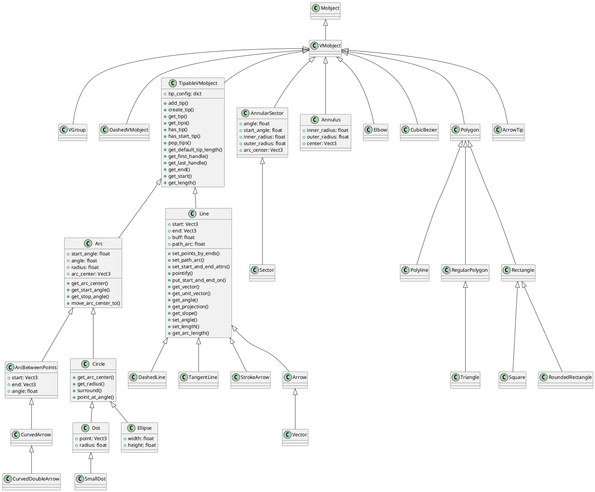
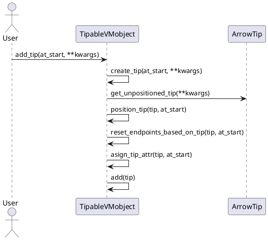
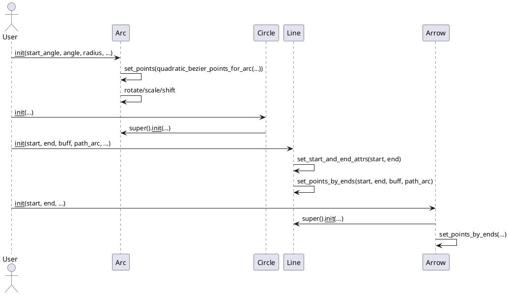
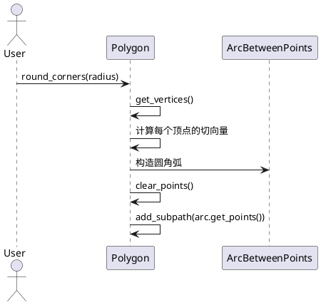

# manimlib/mobject/geometry.py 详解

---

## 1. 类结构与关键属性（PlantUML类图）



### 关键属性说明
- **TipableVMobject**
  - `tip_config`: 箭头/线段端点样式配置。
- **Arc/Circle/Ellipse/AnnularSector/Sector/Annulus**
  - `start_angle/angle/radius/arc_center/width/height/inner_radius/outer_radius`：定义圆弧、圆、椭圆、环形等的几何参数。
- **Line/Arrow/StrokeArrow/DashedLine**
  - `start/end/buff/path_arc`：线段起止点、缓冲区、弧度。
- **Polygon/Rectangle/Square/RoundedRectangle**
  - `vertices/width/height/corner_radius`：多边形顶点、矩形宽高、圆角半径。
- **Dot/SmallDot**
  - `point/radius`：点的位置和半径。

---

## 2. 关键实现方法与算法（PlantUML时序图）

### 2.1 TipableVMobject 添加箭头流程


### 2.2 Arc/Circle/Line/Arrow 的几何构造流程


### 2.3 Polygon 圆角处理流程


---

## 3. 典型用法示例

```python
from manimlib import *

class GeometryDemo(Scene):
    def construct(self):
        # 线段
        line = Line(LEFT, RIGHT, color=BLUE)
        # 箭头
        arrow = Arrow(LEFT, RIGHT, color=RED)
        # 圆
        circle = Circle(radius=1, color=GREEN)
        # 椭圆
        ellipse = Ellipse(width=2, height=1, color=YELLOW)
        # 多边形
        polygon = Polygon(LEFT, UP, RIGHT, DOWN, color=PURPLE)
        # 圆角矩形
        rrect = RoundedRectangle(width=3, height=1.5, corner_radius=0.3, color=ORANGE)
        # 点
        dot = Dot(ORIGIN, color=WHITE)
        # 虚线
        dline = DashedLine(LEFT, RIGHT, color=GREY)
        # 环形
        annulus = Annulus(inner_radius=0.5, outer_radius=1, color=TEAL)
        # 添加到场景
        self.add(line, arrow, circle, ellipse, polygon, rrect, dot, dline, annulus)
        self.wait()
```

---

## 4. 总结与建议

### 使用场景
- **TipableVMobject/Line/Arrow**：用于绘制带箭头的线段、向量、曲线等，适合数学、物理等方向性表达。
- **Arc/Circle/Ellipse/AnnularSector/Sector/Annulus**：用于绘制圆、弧、环、扇形等，适合几何、概率、统计等场景。
- **Polygon/Rectangle/Square/RoundedRectangle**：用于多边形、矩形、圆角矩形等，适合结构、框选、背景等。
- **Dot/SmallDot**：用于标记点、节点、交点等。
- **DashedLine/StrokeArrow**：用于强调、虚线、特殊箭头等。

### 特性与注意事项
- 所有几何对象均支持平移、缩放、旋转、变形等操作，便于动画制作。
- 箭头、线段等支持自定义端点、缓冲区、弧度、粗细、样式等，灵活性高。
- 多边形支持圆角处理，提升美观性。
- 组合使用可实现复杂几何结构。
- 注意：部分对象如Annulus、Sector等需合理设置半径、角度，避免渲染异常。
- 虚线、箭头等对象在缩放时需注意dash/tip参数，防止显示不自然。

---

如需更深入的算法细节或扩展用法，请查阅源码或联系维护者。
