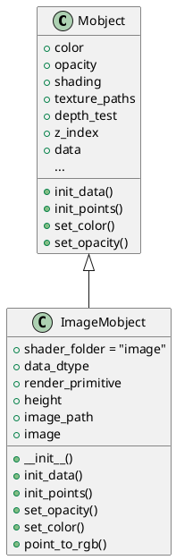
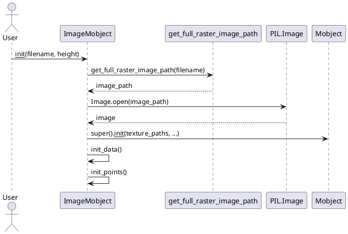
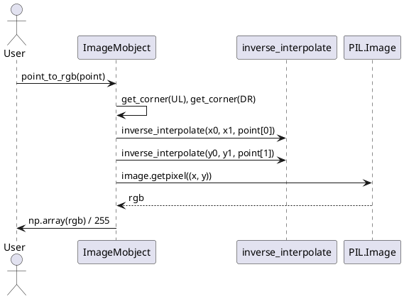

# ImageMobject 类详解

## 1. 类结构与关键属性（PlantUML类图）

### 类说明

- **ImageMobject**：继承自`Mobject`，用于在Manim中加载和显示图片。支持图片的缩放、透明度调整、像素采样等功能。

#### 关键属性说明

- `shader_folder: str = "image"`  
  指定着色器文件夹，渲染时使用的shader类型。
- `data_dtype`  
  定义了mobject数据的结构，包括点坐标、图片坐标、透明度。
- `render_primitive`  
  指定OpenGL渲染的基本图元类型（此处为三角形）。
- `height: float`  
  图片显示的高度，初始化时可指定。
- `image_path: str`  
  图片文件的完整路径。
- `image: PIL.Image`  
  加载的图片对象。

#### 类图（PlantUML）



---

## 2. 关键方法与算法（含时序图）

### 关键方法说明

- `__init__(filename, height=4.0, **kwargs)`  
  通过图片文件名加载图片，设置高度，初始化父类。
- `init_data()`  
  初始化顶点数据，包括六个顶点的坐标、图片坐标和透明度。
- `init_points()`  
  根据图片尺寸设置mobject的宽高。
- `set_opacity(opacity, recurse=True)`  
  支持批量或单独设置透明度，自动插值到所有顶点。
- `set_color(color, opacity=None, recurse=None)`  
  对图片mobject无实际作用（图片本身颜色不可直接更改）。
- `point_to_rgb(point)`  
  根据mobject坐标采样图片像素，返回归一化RGB值。

### 关键方法时序图

#### 1. 创建ImageMobject对象



#### 2. 采样像素颜色



---

## 3. 使用方法与示例代码

### 基本用法

```python
from manimlib.mobject.types.image_mobject import ImageMobject
from manimlib.scene.scene import Scene

class ImageExample(Scene):
    def construct(self):
        # 加载图片，设置高度为3
        img = ImageMobject("example.png", height=3)
        img.move_to([0, 0, 0])  # 居中
        img.set_opacity(0.8)    # 设置整体透明度
        self.add(img)
        self.wait(2)

        # 采样图片某点的颜色
        point = [0, 0, 0]
        rgb = img.point_to_rgb(point)
        print("中心点颜色:", rgb)
```

### 特性说明

- 支持图片的缩放、移动、透明度调整。
- 可通过`point_to_rgb`方法采样任意mobject内点的像素颜色。
- 透明度支持批量设置，自动插值到所有顶点。
- 继承自`Mobject`，可与Manim动画系统无缝集成。
