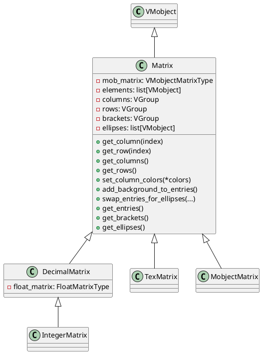
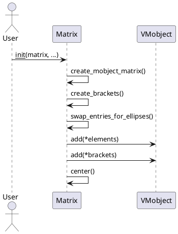
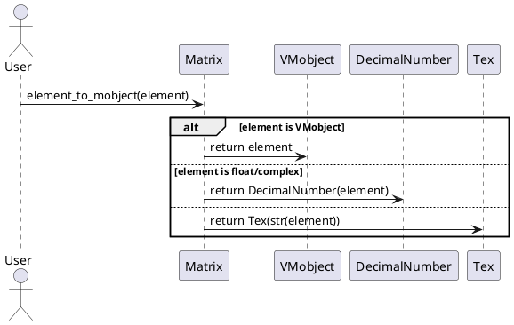

# manimlib.mobject.matrix 源码详解

## 1. 类及关键属性介绍（PlantUML类图）

本文件主要包含如下类：

- `Matrix`
- `DecimalMatrix`
- `IntegerMatrix`
- `TexMatrix`
- `MobjectMatrix`

### 主要类关系与属性说明



#### 关键属性说明
- `mob_matrix`：二维VMobject对象矩阵，表示每个元素的底层渲染对象。
- `elements`：所有矩阵元素的线性列表，便于统一操作。
- `columns`/`rows`：分别为所有列/行的VGroup分组，便于整体操作。
- `brackets`：矩阵左右括号的VGroup。
- `ellipses`：用于省略号（如大矩阵中间的...、⋮等）的对象列表。
- `float_matrix`（DecimalMatrix）：原始浮点数矩阵。

## 2. 关键方法与算法实现（PlantUML时序图）

### 2.1 Matrix 初始化与渲染流程



#### 关键步骤说明
- `create_mobject_matrix`：将输入的原始数据（数字、字符串、VMobject等）转换为VMobject对象矩阵，并自动排布。
- `create_brackets`：生成矩阵的左右括号。
- `swap_entries_for_ellipses`：根据参数决定是否在某行/列插入省略号（如大矩阵的中间行/列）。
- `add`：将所有元素和括号添加到自身。
- `center`：整体居中。

### 2.2 元素类型适配



## 3. 用法示例

### 3.1 基本用法
```python
from manimlib.mobject.matrix import Matrix, DecimalMatrix, IntegerMatrix, TexMatrix, MobjectMatrix
from manimlib.mobject.types.vectorized_mobject import VGroup
from manimlib.mobject.svg.tex_mobject import Tex

# 普通数字矩阵
matrix = Matrix([[1, 2], [3, 4]])

# 浮点数矩阵，保留两位小数
decimal_matrix = DecimalMatrix([[1.23, 4.56], [7.89, 0.12]], num_decimal_places=2)

# 整数矩阵
int_matrix = IntegerMatrix([[1, 2], [3, 4]])

# LaTeX字符串矩阵
tex_matrix = TexMatrix([["a_{11}", "a_{12}"], ["a_{21}", "a_{22}"]])

# VMobject对象矩阵
objs = VGroup(Tex("x"), Tex("y"), Tex("z"), Tex("w"))
mob_matrix = MobjectMatrix(objs, n_rows=2, n_cols=2)
```

### 3.2 进阶用法
```python
# 设置列颜色
matrix.set_column_colors("#FF0000", "#00FF00")

# 给所有元素加背景
matrix.add_background_to_entries()

# 插入省略号
matrix = Matrix([[1,2,3],[4,5,6],[7,8,9]], ellipses_row=1, ellipses_col=1)
```

## 4. 各类使用场景、特性与建议

### Matrix
- 适用于任意类型（数字、字符串、VMobject等）元素的矩阵展示。
- 支持自动排布、括号、行列分组、插入省略号等。
- 支持自定义元素渲染参数（如对齐、间距、对齐角等）。

### DecimalMatrix/IntegerMatrix
- 适用于需要精确控制数字格式（小数位数、整数等）的矩阵。
- `DecimalMatrix`可自定义小数位数，`IntegerMatrix`专为整数。

### TexMatrix
- 适用于需要LaTeX公式渲染的矩阵。
- 支持自定义TeX渲染参数。

### MobjectMatrix
- 适用于元素为任意VMobject对象的矩阵（如图形、公式混排）。
- 需保证输入VGroup数量与行列数匹配。

### 建议与注意事项
- 大型矩阵建议使用`ellipses_row`/`ellipses_col`插入省略号，提升可读性。
- `MobjectMatrix`需确保元素数量充足，否则会抛出异常。
- 所有矩阵均支持`set_column_colors`、`add_background_to_entries`等通用方法。
- 若需自定义元素渲染，建议通过`element_config`/`tex_config`/`decimal_config`等参数传递。

---

> 文档风格参考brace.md、VMobject.md，内容涵盖类结构、关键方法、用法示例及最佳实践建议。
