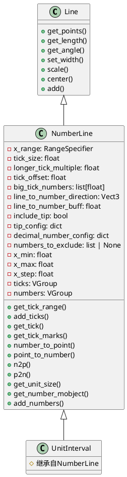
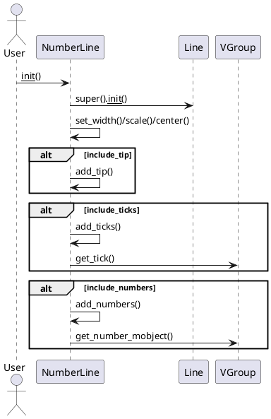

# manimlib/mobject/number_line.py 详解

## 1. 类结构与关键属性（PlantUML 类图）



### 关键属性说明
- `x_range`: 数轴的范围与步长，格式为(start, end, step)。
- `tick_size`: 刻度线的长度。
- `longer_tick_multiple`: 主刻度线长度倍数。
- `tick_offset`: 刻度线偏移。
- `big_tick_numbers`: 主刻度线对应的数值列表。
- `line_to_number_direction`: 数字显示的方向（如DOWN）。
- `line_to_number_buff`: 数字与数轴的间距。
- `include_tip`: 是否包含箭头。
- `tip_config`: 箭头配置。
- `decimal_number_config`: 数字显示配置。
- `numbers_to_exclude`: 不显示的数字列表。
- `x_min`, `x_max`, `x_step`: 数轴起止与步长。
- `ticks`, `numbers`: 刻度与数字的VGroup容器。

## 2. 关键方法与算法（PlantUML 时序图）

### 2.1 NumberLine 初始化与刻度、数字添加



#### 关键方法说明
- `get_tick_range()`: 计算所有刻度线的数值位置。
- `add_ticks()`: 根据tick_range添加刻度线，主刻度加长。
- `get_tick(x, size)`: 生成指定位置和长度的刻度线。
- `number_to_point(number)`: 数值映射到数轴上的点。
- `point_to_number(point)`: 点映射回数值。
- `get_number_mobject(x, ...)`: 生成数字对象并放置到合适位置。
- `add_numbers(...)`: 添加所有数字对象。

### 2.2 UnitInterval
- 继承自NumberLine，默认区间为[0,1]，步长0.1，主刻度为0和1。

## 3. 使用方法与示例

```python
from manimlib.mobject.number_line import NumberLine, UnitInterval
from manimlib import Scene

class NumberLineDemo(Scene):
    def construct(self):
        # 创建一个标准数轴
        number_line = NumberLine(
            x_range=(-5, 5, 1),
            include_numbers=True,
            include_tip=True,
            big_tick_spacing=1,
            decimal_number_config={"num_decimal_places": 0, "font_size": 24}
        )
        self.add(number_line)
        self.wait(1)

        # 创建一个单位区间
        unit_interval = UnitInterval()
        unit_interval.next_to(number_line, direction=DOWN, buff=1)
        self.add(unit_interval)
        self.wait(1)
```

## 4. 总结与建议

### 使用场景
- 需要展示数轴、区间、刻度、数字的数学动画场景。
- 可用于函数图像、坐标轴、概率区间等可视化。

### 特性与注意事项
- 支持自定义范围、步长、主刻度、数字显示、箭头等。
- `UnitInterval`适合概率、归一化区间等场景。
- `numbers_to_exclude`可灵活排除不需要显示的数字。
- `decimal_number_config`可定制数字精度与样式。
- 若自定义宽度需用`set_width`，否则用`unit_size`缩放。
- 刻度与数字均为`VGroup`，可单独操作。
- 箭头样式可通过`tip_config`调整。

### 建议
- 若需高亮某些刻度或数字，可遍历`number_line.numbers`或`number_line.ticks`单独设置样式。
- 复杂坐标轴可继承`NumberLine`扩展。
- 注意`x_range`的步长与主刻度间的关系，避免主刻度不在刻度点上。
