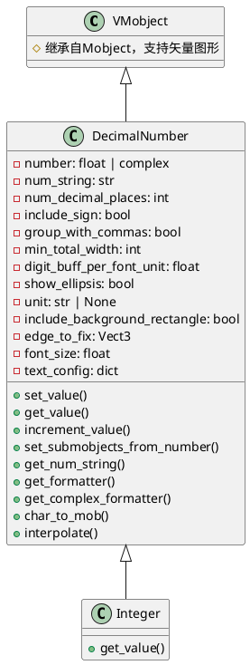
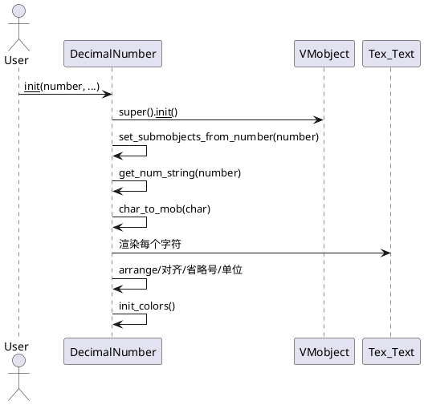
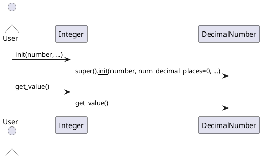

# manimlib/mobject/numbers.py 详解

## 1. 类结构与关键属性（PlantUML 类图）



### 关键属性说明
- `number`: 当前显示的数值，支持float或complex。
- `num_string`: 格式化后的数字字符串。
- `num_decimal_places`: 小数点后保留位数。
- `include_sign`: 是否强制显示正负号。
- `group_with_commas`: 是否用逗号分组显示千位。
- `min_total_width`: 最小总宽度（位数，不足补零）。
- `digit_buff_per_font_unit`: 字符间距与字号的比例。
- `show_ellipsis`: 是否在数字后显示省略号（...）。
- `unit`: 单位字符串，可选，支持上标（以^开头）。
- `include_background_rectangle`: 是否添加背景矩形。
- `edge_to_fix`: 对齐边缘（如LEFT）。
- `font_size`: 字号。
- `text_config`: 传递给Text/Tex的额外配置。

## 2. 关键方法与算法（PlantUML 时序图）

### 2.1 DecimalNumber 数字渲染与更新



#### 关键方法说明
- `set_submobjects_from_number(number)`: 解析数字为字符，生成对应的Text/Tex子对象，处理省略号、单位、对齐等。
- `get_num_string(number)`: 根据配置格式化数字字符串，支持复数、千分位、符号、宽度等。
- `char_to_mob(char)`: 用缓存机制将字符转为Text或Tex对象。
- `set_value(number)`: 更新数值并重建子对象，保持位置和样式。
- `get_value()`: 获取当前数值。
- `increment_value(delta_t)`: 数值增量更新。
- `get_formatter()/get_complex_formatter()`: 返回格式化字符串模板。
- `interpolate(mobject1, mobject2, alpha, ...)`: 支持动画插值，字号等属性平滑过渡。

### 2.2 Integer



## 3. 使用方法与示例

```python
from manimlib.mobject.numbers import DecimalNumber, Integer
from manimlib import Scene

class DecimalNumberDemo(Scene):
    def construct(self):
        # 基本用法：显示浮点数
        num = DecimalNumber(3.14159, num_decimal_places=3, font_size=60, color=BLUE)
        self.add(num)
        self.wait(1)
        # 动态更新
        num.set_value(2.71828)
        self.wait(1)
        # 显示单位和省略号
        num2 = DecimalNumber(12345.678, unit="m/s", show_ellipsis=True, font_size=48, group_with_commas=True)
        num2.next_to(num, direction=DOWN, buff=0.5)
        self.add(num2)
        self.wait(1)
        # 整数用法
        int_num = Integer(42, font_size=48, color=GREEN)
        int_num.next_to(num2, direction=DOWN, buff=0.5)
        self.add(int_num)
        self.wait(1)
```

## 4. 总结与建议

### 使用场景
- 需要在动画中精确、灵活地显示数字、计数、动态数值变化等。
- 适用于计分板、实时数值展示、科学计量单位、动画插值等场景。

### 特性与注意事项
- 支持浮点、复数、整数，格式化灵活。
- 支持单位、千分位、符号、宽度、字号、背景等多种定制。
- 动态更新数值时建议用`set_value`，可保持动画平滑。
- `Integer`适合只需整数显示的场景。
- 若需高性能批量渲染，注意字符缓存机制（lru_cache）。
- 单位以^开头时会自动上标对齐。
- 省略号适合表示未完数字或动态变化。
- 若需自定义字符样式，可通过`text_config`传递参数。

### 建议
- 动画插值时，字号等属性可平滑过渡，适合数值动画。
- 若需高亮或特殊样式，可遍历子mobject单独设置。
- 复杂数字排版可继承`DecimalNumber`扩展。
