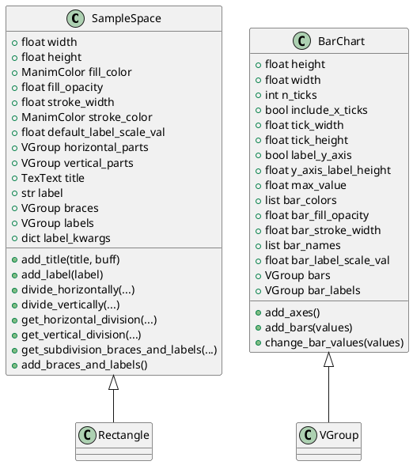
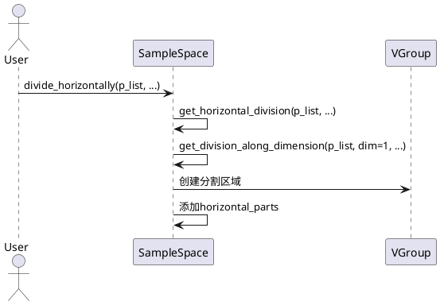
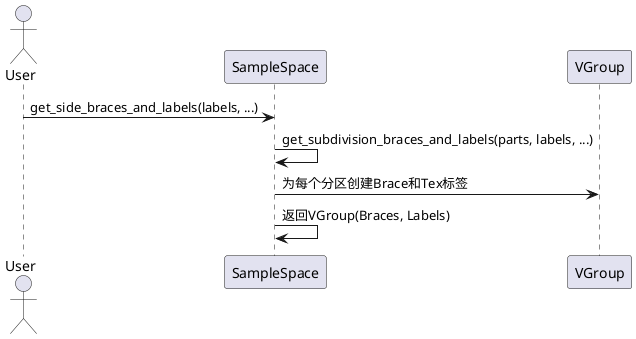
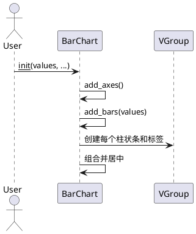

# manimlib.mobject.probability 源码解析

## 1. 类结构与关键属性（PlantUML 类图）



### 关键属性说明
- `SampleSpace`
  - `width`, `height`：样本空间矩形的宽高。
  - `fill_color`, `fill_opacity`：填充色及透明度。
  - `stroke_width`, `stroke_color`：边框宽度与颜色。
  - `default_label_scale_val`：标签缩放比例。
  - `horizontal_parts`, `vertical_parts`：水平/垂直分割后的子区域（VGroup）。
  - `title`, `label`：标题与标签。
  - `braces`, `labels`, `label_kwargs`：分割后括号与标签及其参数。

- `BarChart`
  - `height`, `width`：图表整体高宽。
  - `n_ticks`：y轴刻度数。
  - `include_x_ticks`：是否包含x轴刻度。
  - `tick_width`, `tick_height`：刻度线宽高。
  - `label_y_axis`：是否显示y轴标签。
  - `y_axis_label_height`：y轴标签高度。
  - `max_value`：y轴最大值。
  - `bar_colors`：柱状条颜色列表。
  - `bar_fill_opacity`：柱状条填充透明度。
  - `bar_stroke_width`：柱状条边框宽度。
  - `bar_names`：每个柱状条的名称。
  - `bar_label_scale_val`：柱状条标签缩放比例。
  - `bars`, `bar_labels`：柱状条及其标签（VGroup）。


## 2. 关键方法与算法实现（PlantUML 时序图）

### 2.1 SampleSpace 分割与标注

#### 水平/垂直分割


#### 添加分割括号与标签


### 2.2 BarChart 柱状图生成




## 3. 用法示例

### 3.1 SampleSpace 示例
```python
from manimlib.mobject.probability import SampleSpace
from manimlib.constants import GREEN_E, BLUE_E

# 创建样本空间
ss = SampleSpace(width=4, height=2)
ss.add_title("样本空间示例")
ss.divide_horizontally([0.3, 0.7], colors=[GREEN_E, BLUE_E])
ss.get_side_braces_and_labels(["A", "B"])
ss.add_braces_and_labels()
```

### 3.2 BarChart 示例
```python
from manimlib.mobject.probability import BarChart

values = [0.2, 0.5, 0.3]
names = ["A", "B", "C"]
chart = BarChart(values, bar_names=names, bar_colors=["#3498db", "#e67e22", "#2ecc71"])
```


## 4. 总结与建议

### SampleSpace
- **使用场景**：概率论、统计学动画中用于展示样本空间及其分割、标注。
- **特性**：支持灵活的水平/垂直分割，自动补全概率分布，支持分区括号与标签。
- **建议**：
  - 分割比例之和不为1时会自动补全，注意概率分布的合理性。
  - 分割后可通过`get_side_braces_and_labels`等方法添加分区说明。
  - 适合与动画结合，展示事件、条件概率等。

### BarChart
- **使用场景**：用于概率分布、频率分布等柱状图可视化。
- **特性**：支持自定义颜色、标签、y轴刻度，动态调整柱状条高度。
- **建议**：
  - `bar_names`与`values`长度需一致。
  - 可通过`change_bar_values`动态更新数据。
  - 适合用于概率、统计、数据可视化等场景。

---

> 本文档由AI自动生成，建议结合实际代码进一步理解和扩展。
