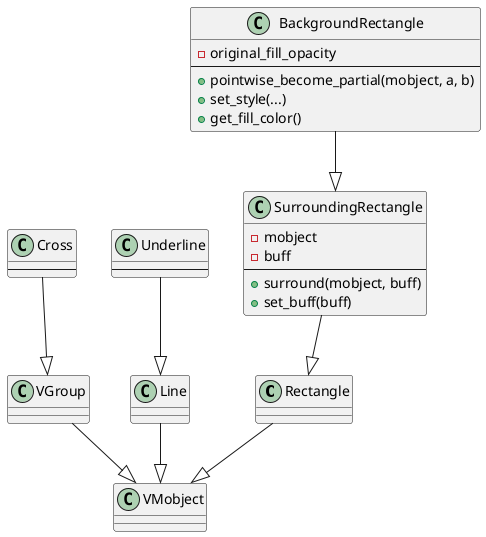
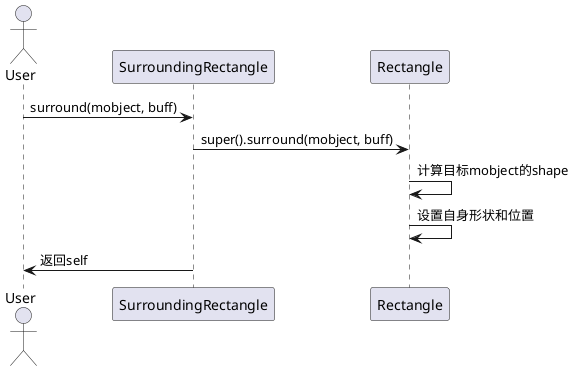
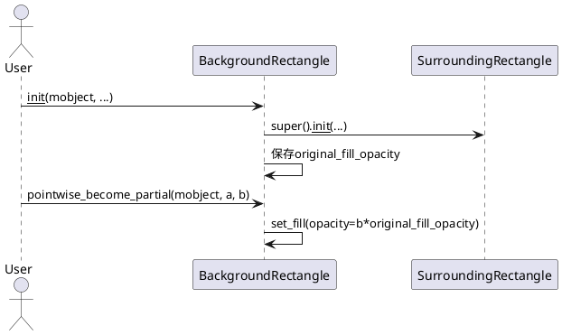
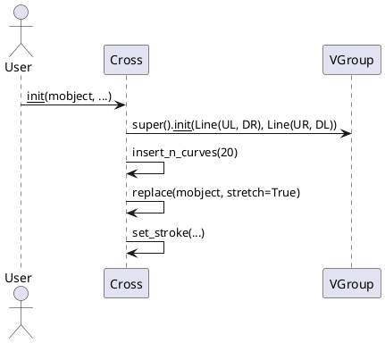
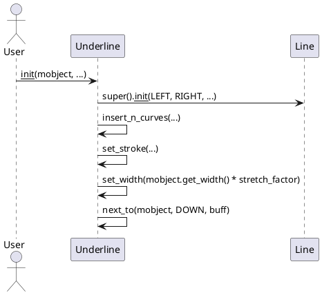

# manimlib/mobject/shape_matchers.py 详解

## 1. 类结构与关键属性（PlantUML 类图）



### 关键属性说明
- `SurroundingRectangle`
  - `mobject`：被包围的目标对象。
  - `buff`：包围的间距。
- `BackgroundRectangle`
  - `original_fill_opacity`：初始填充透明度。
- `Cross`：无额外属性，主要通过组合两条对角线实现。
- `Underline`
  - `buff`：下划线与目标对象的间距。
  - `stroke_color`/`stroke_width`/`stretch_factor`：下划线样式参数。


## 2. 关键方法与算法（PlantUML 时序图）

### SurroundingRectangle.surround 方法


### BackgroundRectangle.__init__ 及 pointwise_become_partial


### Cross.__init__


### Underline.__init__



## 3. 用法示例

```python
from manimlib import *

class ShapeMatchersDemo(Scene):
    def construct(self):
        # 1. SurroundingRectangle
        text = Text("Hello Manim")
        rect = SurroundingRectangle(text, buff=0.2, color=YELLOW)
        self.add(text, rect)

        # 2. BackgroundRectangle
        bg_rect = BackgroundRectangle(text, fill_opacity=0.5)
        self.add(bg_rect)

        # 3. Cross
        cross = Cross(text, stroke_color=RED)
        self.add(cross)

        # 4. Underline
        underline = Underline(text, buff=0.1, stroke_color=WHITE)
        self.add(underline)

        self.wait(2)
```


## 4. 总结与建议

### 使用场景
- `SurroundingRectangle`：用于高亮、包围、强调某个mobject，常用于文本、公式、图形的视觉突出。
- `BackgroundRectangle`：为mobject添加背景色块，常用于提升可读性或突出显示。
- `Cross`：用于打叉、否定、错误标记等场景。
- `Underline`：为文本、公式等添加下划线，常用于强调。

### 特性与注意事项
- 这些类均依赖于mobject的几何属性，适用于所有支持get_shape/get_width等方法的mobject。
- `buff`参数控制间距，合理调整可获得更美观的效果。
- `BackgroundRectangle`的样式不可更改（除透明度），适合做纯色背景。
- `Cross`和`Underline`会自动适配目标对象的尺寸和位置。
- 组合使用时注意z序（添加顺序），避免遮挡。

### 建议
- 推荐在需要视觉高亮、分组、强调时优先考虑这些工具类。
- 若需自定义样式，可继承这些类并重写相关方法。
- 注意动画时的同步（如目标对象变形时，需同步更新包围框等）。

---

> 本文档自动生成，供manim开发者参考。
