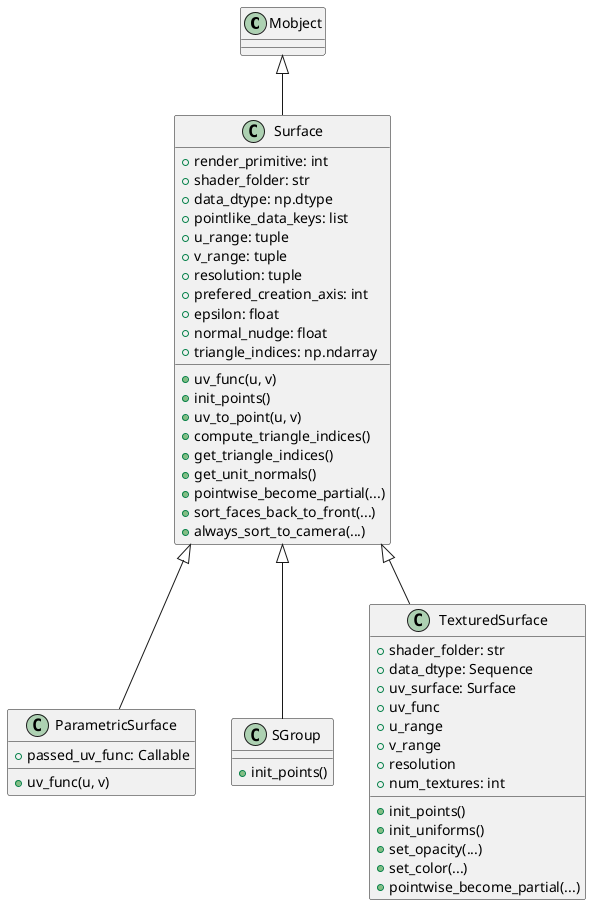
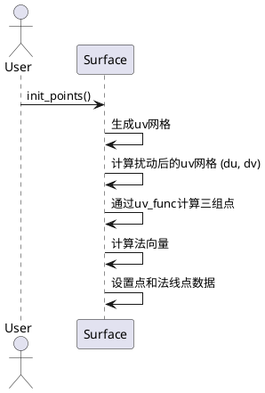
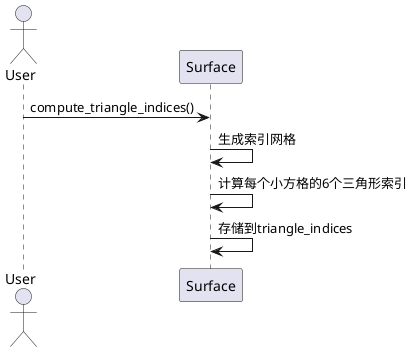
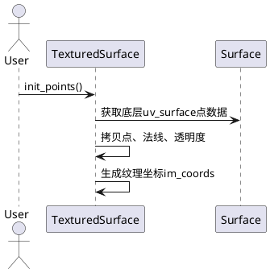

# Surface 相关类详解

---

## 1. 类结构与关键属性（PlantUML类图）



### 关键属性说明
- **render_primitive**: OpenGL绘制类型，默认为TRIANGLES。
- **shader_folder**: 着色器文件夹名。
- **data_dtype**: 点数据结构，包含点、法线点、颜色等。
- **pointlike_data_keys**: 点相关数据的key。
- **u_range/v_range**: 参数空间范围。
- **resolution**: 采样分辨率，决定网格精细度。
- **prefered_creation_axis**: 默认动画展开轴。
- **epsilon/normal_nudge**: 用于法线计算的微小扰动。
- **triangle_indices**: 三角面片索引数组。
- **uv_func**: 参数(u,v)到三维点的映射函数。
- **uv_surface**: TexturedSurface的底层Surface对象。
- **num_textures**: 纹理数量。

---

## 2. 关键方法与算法（PlantUML时序图）

### 2.1 Surface.init_points 算法流程



#### 关键步骤说明
1. 生成参数空间(u, v)的网格。
2. 对u和v分别加上微小扰动，得到用于法线估算的点集。
3. 通过`uv_func`将参数映射到三维空间，得到三组点。
4. 用叉积计算法向量，并归一化。
5. 设置点数据和法线点数据。

---

### 2.2 Surface.compute_triangle_indices 算法流程



#### 关键步骤说明
1. 生成二维索引网格。
2. 每个小方格分成两个三角形，依次填充索引。
3. 存储到`triangle_indices`属性。

---

### 2.3 TexturedSurface.init_points 算法流程



#### 关键步骤说明
1. 获取底层uv_surface的点、法线、透明度。
2. 生成纹理坐标，y方向反转。

---

## 3. 使用方法与示例

### 3.1 ParametricSurface 示例
```python
from manimlib.mobject.types.surface import ParametricSurface
import numpy as np

# 定义一个球面参数方程
def sphere_uv(u, v):
    theta = u * np.pi
    phi = v * 2 * np.pi
    x = np.sin(theta) * np.cos(phi)
    y = np.sin(theta) * np.sin(phi)
    z = np.cos(theta)
    return np.array([x, y, z])

surface = ParametricSurface(
    uv_func=sphere_uv,
    u_range=(0, 1),
    v_range=(0, 1),
    resolution=(50, 50),
    color='#00FFAA',
)
```

### 3.2 TexturedSurface 示例
```python
from manimlib.mobject.types.surface import TexturedSurface, ParametricSurface

# 先定义底层参数曲面
uv_surface = ParametricSurface(
    uv_func=sphere_uv,
    u_range=(0, 1),
    v_range=(0, 1),
    resolution=(50, 50),
)

# 创建带纹理的曲面
textured_surface = TexturedSurface(
    uv_surface=uv_surface,
    image_file='earth_texture.jpg',
)
```

### 3.3 SGroup 示例
```python
from manimlib.mobject.types.surface import SGroup, ParametricSurface

surface1 = ParametricSurface(...)
surface2 = ParametricSurface(...)
group = SGroup(surface1, surface2)
```

---

## 4. 总结
- Surface及其子类为Manim三维参数曲面、纹理曲面、曲面组合等提供了强大支持。
- 通过灵活的uv_func和分辨率设置，可以实现任意复杂的三维曲面。
- TexturedSurface支持贴图，适合地球、球体等可视化。
- SGroup可组合多个曲面，便于复杂结构建模。
