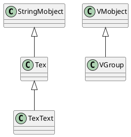
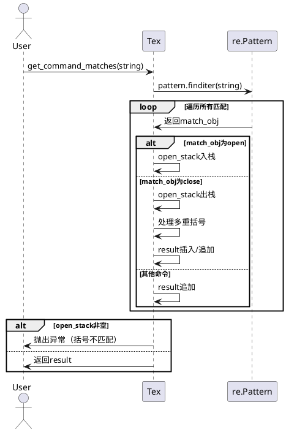

# TexMobject 深度解析

## 1. 类继承关系（PlantUML 类图）



- Tex 继承自 StringMobject
- TexText 继承自 Tex
- VGroup 继承自 VMobject

---

## 2. Tex 类核心算法与解析流程

### 2.1 主要职责
- 负责将 TeX 字符串渲染为 SVG 并进行分割、着色等处理。
- 支持对 TeX 字符串的分割、命令匹配、颜色映射、数字替换等高级操作。

### 2.2 TeX 匹配与解析流程

#### 主要方法
- `get_command_matches(string: str)`：解析 TeX 字符串，识别命令、花括号等，返回匹配对象列表。
- `get_command_flag(match_obj: re.Match)`：判断匹配对象是开括号、闭括号还是命令。
- `get_attr_dict_from_command_pair(open_command, close_command)`：判断一对命令是否为多重花括号。
- `get_configured_items()`：根据 tex_to_color_map 生成需要着色的 span 区间。
- `get_color_command(rgb_hex: str)`：生成 TeX 颜色命令。
- `get_content_prefix_and_suffix(is_labelled: bool)`：生成 TeX 环境的前后缀。
- `make_number_changeable(...)`：将 TeX 字符串中的数字替换为可变数字对象。

#### 解析流程时序图

以 `get_command_matches` 为例，展示 TeX 字符串的命令与括号匹配流程：



#### 伪代码简述
- 使用正则表达式匹配 TeX 字符串中的命令、左花括号、右花括号。
- 用栈结构追踪花括号的配对，支持多重嵌套。
- 对于每个命令或括号，生成匹配对象列表，供后续分割、着色等操作使用。
- 若括号不匹配，则抛出异常。

---

## 3. 核心解析流程说明

1. **初始化**  
   - 传入多个 TeX 字符串时，自动将其加入 isolate，用于后续分割。
   - 生成最终的 TeX 字符串，防止空字符串。

2. **命令与括号匹配**  
   - `get_command_matches` 负责将 TeX 字符串分割为命令、左括号、右括号三类。
   - 通过栈结构追踪括号配对，支持多重嵌套。
   - 结果用于后续的分割、着色、替换等操作。

3. **着色与分割**  
   - `get_configured_items` 根据 tex_to_color_map 生成需要着色的 span 区间。
   - `get_color_command` 生成 RGB 颜色命令，插入到 TeX 字符串中。

4. **数字替换**  
   - `make_number_changeable` 支持将 TeX 字符串中的数字替换为可变数字对象，便于动画演示。

---

## 4. 总结

- Tex 类是 Manim 渲染 TeX 公式的核心，负责字符串解析、命令匹配、分割、着色等。
- 其核心算法是基于正则表达式和栈结构的命令与括号匹配，保证 TeX 语法的正确分割和处理。
- 通过 PlantUML 类图和时序图，可以清晰地看到类的继承关系和 TeX 解析的主要流程。

如需进一步分析某个方法的实现细节或流程，请查阅源码或联系开发者。


---

## 5. Tex 的使用方法

### 5.1 基本用法

````python
from manimlib.imports import *

class TexDemo(Scene):
def construct(self):
tex = Tex(r"e^{i\pi} + 1 = 0")
self.add(tex)
self.wait(1)
````

- 直接传入 TeX 字符串即可渲染公式。
- 支持所有 LaTeX 数学语法。

### 5.2 常用参数

- `color`：设置整体颜色
- `tex_to_color_map`：为指定子串着色
- `isolate`：指定需要单独分割的子串
- `font_size`：字体大小

#### 示例：着色与分割

````python
class TexColorDemo(Scene):
def construct(self):
tex = Tex(
r"E = mc^2",
tex_to_color_map={"E": YELLOW, "m": GREEN, "c": BLUE}
)
self.add(tex)
self.wait(1)
````

#### 示例：分割子串

````python
class TexIsolateDemo(Scene):
def construct(self):
tex = Tex(
r"a^2 + b^2 = c^2",
isolate=["a", "b", "c"]
)
tex.set_color_by_tex("a", RED)
tex.set_color_by_tex("b", GREEN)
tex.set_color_by_tex("c", BLUE)
self.add(tex)
self.wait(1)
````

### 5.3 动画与变换

Tex 支持与 Manim 的动画系统无缝结合，可以对公式进行移动、变色、变形等动画。

````python
class TexAnimationDemo(Scene):
def construct(self):
tex1 = Tex(r"x^2")
tex2 = Tex(r"x^3")
self.add(tex1)
self.wait(0.5)
self.play(Transform(tex1, tex2))
self.wait(1)
````

### 5.4 多行公式与对齐

````python
class TexAlignDemo(Scene):
def construct(self):
tex = Tex(r"""
\begin{align*}
a^2 + b^2 &= c^2 \\
e^{i\pi} + 1 &= 0
\end{align*}
""")
self.add(tex)
self.wait(1)
````

---

通过上述方法，Tex 可以灵活地用于数学公式的渲染、分割、着色和动画演示，满足绝大多数数学动画场景需求。