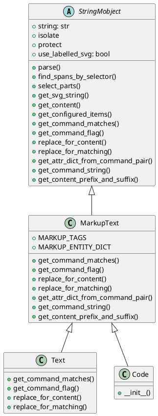
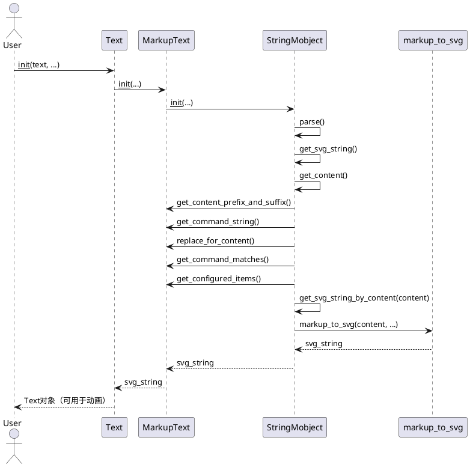

## 1. 类图


## 2. 核心逻辑实现简述
StringMobject

- 作用：抽象基类，负责字符串的分割、标签、选择、子对象（submobject）管理。

- 核心方法：
  - parse()：根据 isolate/protect/命令等分割字符串，生成标签和插入点，支持子字符串的高亮、选择等。
  - find_spans_by_selector()：根据 selector（字符串、正则、区间等）查找 span。
  - select_parts()：根据 selector 返回对应的 VGroup。
  - get_svg_string()：生成 SVG 字符串，支持是否带标签。
  - get_content()：重构字符串，插入标签、属性等。

MarkupText
- 作用：实现 Pango Markup 语法的文本渲染，支持富文本属性（如粗体、斜体、颜色等）。
- 核心方法：
  - get_command_matches()：正则匹配所有 Pango Markup 标签、实体、特殊字符。
  - replace_for_content()：用于内容生成时的替换逻辑（如转义特殊字符）。
  - replace_for_matching()：用于 span 匹配时的替换逻辑（如解码实体）。
  - get_attr_dict_from_command_pair()：解析标签属性，返回属性字典。
  - get_command_string()：生成 <span ...> 或 字符串，插入属性。
  - get_content_prefix_and_suffix()：生成全局属性的前后缀。

Text
- 作用：普通文本，简化命令匹配，仅处理 <>&"' 等特殊字符。
- 核心方法：重载 get_command_matches、replace_for_content 等，简化为普通文本处理。

Code
- 作用：高亮代码，集成 pygments，生成带 Pango Markup 的高亮文本。
- 核心方法：构造时用 pygments 生成 markup，再交给 MarkupText 处理。

## 3. 核心流程

## 4. 总结
- 继承结构：StringMobject（抽象基类）→ MarkupText（富文本）→ Text/Code（具体实现）
- 核心机制：字符串分割、span 匹配、属性插入、SVG 生成、子对象管理
- 渲染流程：构造 → 解析 → 生成内容 → 生成 SVG → 生成 VMobject


---

## 5. Text/MarkupText/Code 的使用方法

### 1. 基本用法

Text、MarkupText 和 Code 用于在 Manim 中渲染普通文本、富文本和高亮代码。

#### 示例：普通文本

````python
from manimlib.imports import *

class TextDemo(Scene):
def construct(self):
text = Text("Hello, Manim!", font_size=48, color=BLUE)
self.add(text)
self.wait(1)
````

#### 示例：富文本（MarkupText）

````python
class MarkupTextDemo(Scene):
def construct(self):
markup = MarkupText(
'<span foreground="red" size="x-large">Red</span> <b>Bold</b> <i>Italic</i>',
font_size=48
)
self.add(markup)
self.wait(1)
````

#### 示例：高亮代码（Code）

````python
class CodeDemo(Scene):
def construct(self):
code = Code(
"def hello():\n    print('Hello, world!')",
language="python",
font_size=36
)
self.add(code)
self.wait(1)
````

### 2. 常用参数

- `font_size`：字体大小
- `color`：整体颜色
- `font`：字体名称
- `slant`：斜体（"NORMAL"/"ITALIC"）
- `weight`：粗体（"NORMAL"/"BOLD"）
- `line_spacing`：行间距
- `t2c`：为指定子串着色（Text/MarkupText）
- `t2s`：为指定子串设置样式（MarkupText）
- `tab_width`：制表符宽度（Code）
- `language`：代码语言（Code）

### 3. 富文本与高亮

- MarkupText 支持 Pango Markup 语法，可用 HTML-like 标签设置颜色、粗体、斜体、下划线等。
- Code 支持多种编程语言的语法高亮。

#### 示例：为子串着色/加粗

````python
class TextColorDemo(Scene):
def construct(self):
text = Text(
"Manim is fun!",
t2c={"Manim": YELLOW, "fun": RED},
font_size=48
)
self.add(text)
self.wait(1)
````

#### 示例：富文本多样式

````python
class MarkupTextStyleDemo(Scene):
def construct(self):
markup = MarkupText(
'<span foreground="blue">Blue</span> <span background="yellow">BG</span> <u>Underline</u>',
font_size=48
)
self.add(markup)
self.wait(1)
````

### 4. 动画与变换

Text/MarkupText/Code 支持与 Manim 动画系统结合，实现移动、变色、变形等动画。

````python
class TextAnimationDemo(Scene):
def construct(self):
text1 = Text("Hello")
text2 = Text("World")
self.add(text1)
self.wait(0.5)
self.play(Transform(text1, text2))
self.wait(1)
````

---

通过上述方法，Text、MarkupText 和 Code 可以灵活地实现普通文本、富文本和高亮代码的渲染、样式设置和动画，满足各种文本可视化需求。