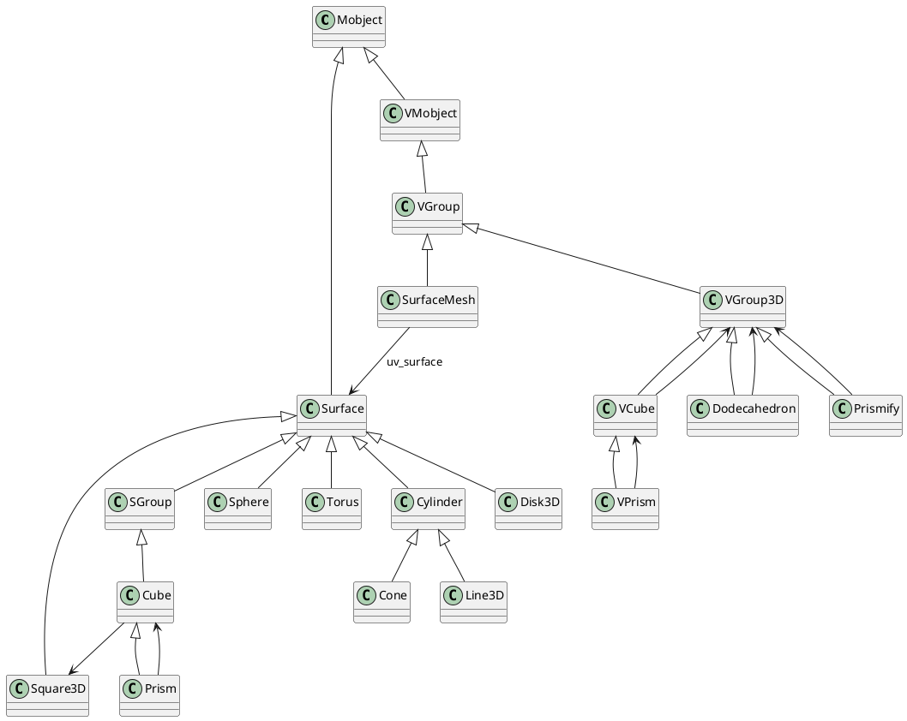
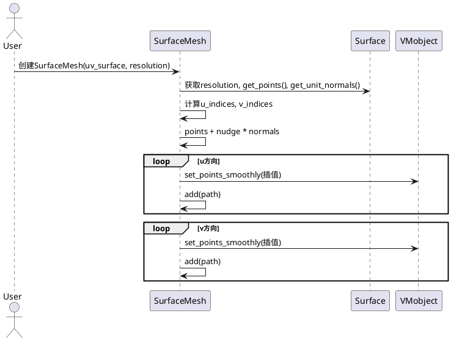
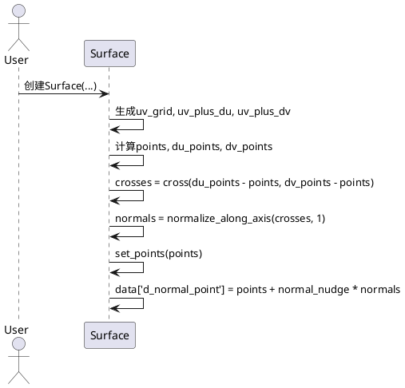

# manimlib.mobject.three_dimensions 三维体类详解

## 1. 类及关键属性介绍（PlantUML类图）

### 主要类结构
- SurfaceMesh
- Sphere, Torus, Cylinder, Cone, Line3D, Disk3D, Square3D
- Cube, Prism, VCube, VPrism, Dodecahedron, Prismify
- 依赖基类：Surface, SGroup, VGroup, VMobject, Mobject

### 关键属性说明
- **SurfaceMesh**
  - `uv_surface`: 目标Surface对象
  - `resolution`: 网格分辨率
  - `normal_nudge`: 法线微调量
- **Surface**（基类）
  - `u_range`, `v_range`: 参数区间
  - `resolution`: 采样分辨率
  - `normal_nudge`: 法线微调
- **Sphere, Torus, Cylinder, Cone, Disk3D, Square3D**
  - 各自的几何参数（如半径、长宽高、轴向等）
- **Cube, Prism, VCube, VPrism, Dodecahedron**
  - 颜色、透明度、分辨率、边长等
- **Prismify**
  - `vmobject`: 被拉伸的2D对象
  - `depth`, `direction`: 拉伸深度与方向

### PlantUML类图


---

## 2. 关键方法与算法说明（含时序图）

### 以`SurfaceMesh.init_points`为例
- 作用：根据uv参数网格，生成Surface的网格线（线框模型）
- 关键步骤：
  1. 计算uv索引的采样点
  2. 获取Surface的点和法线
  3. 沿法线微调点坐标
  4. 沿u、v方向分别插值生成线条
  5. 添加到自身submobjects



### 以`Surface.init_points`为例
- 作用：根据uv参数化函数生成三维点和法线
- 关键步骤：
  1. 生成uv网格
  2. 计算主点、du微扰点、dv微扰点
  3. 通过叉积获得法线
  4. 存储点和法线数据



---

## 3. 典型用法与高质量代码示例

### 3.1 绘制球体与网格
```python
from manimlib import *

class SphereWithMeshScene(ThreeDScene):
    def construct(self):
        sphere = Sphere(radius=2, color=BLUE_D, resolution=(50, 25))
        mesh = SurfaceMesh(sphere, resolution=(20, 10), stroke_color=WHITE, stroke_width=0.5)
        self.add(sphere, mesh)
        self.set_camera_orientation(phi=60 * DEGREES, theta=30 * DEGREES)
        self.wait(2)
```

### 3.2 拉伸2D对象为3D棱柱
```python
from manimlib import *

class PrismifyExample(ThreeDScene):
    def construct(self):
        square = Square(side_length=2, color=YELLOW)
        prism = Prismify(square, depth=1.5, direction=OUT, fill_color=GREEN, fill_opacity=0.7)
        self.add(prism)
        self.set_camera_orientation(phi=75 * DEGREES, theta=45 * DEGREES)
        self.wait(2)
```

### 3.3 组合多种三维体
```python
from manimlib import *

class MultiShapeScene(ThreeDScene):
    def construct(self):
        cube = Cube(side_length=2, color=BLUE)
        sphere = Sphere(radius=1, color=RED).shift(LEFT * 3)
        torus = Torus(r1=2, r2=0.5, color=GREEN).shift(RIGHT * 3)
        self.add(cube, sphere, torus)
        self.set_camera_orientation(phi=60 * DEGREES, theta=45 * DEGREES)
        self.wait(2)
```

---

## 4. 使用场景、特性、建议与注意事项

### 使用场景
- 三维几何体可视化、数学建模、动画演示
- 复杂三维网格、表面、线框结构的展示
- 2D图形拉伸为3D体（Prismify）

### 特性
- 参数化定义，支持任意分辨率和自定义uv映射
- 支持法线微调，适合高质量渲染
- 结构清晰，易于扩展和组合
- 支持多种着色、透明度、线框等视觉属性

### 建议与注意事项
- 分辨率过高时渲染开销大，需权衡性能与精度
- Prismify仅适用于边界为直线的2D对象
- 组合多种三维体时注意坐标系和缩放一致性
- 使用SurfaceMesh时，normal_nudge参数可避免网格与表面重合导致的Z-fighting
- 继承Surface自定义uv_func可实现任意参数曲面
