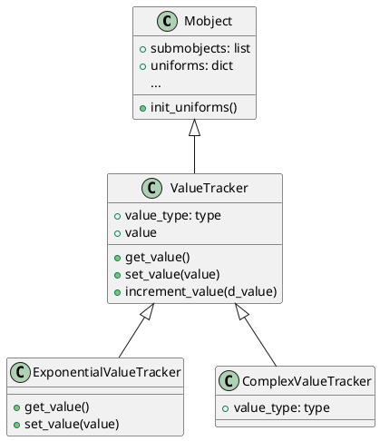
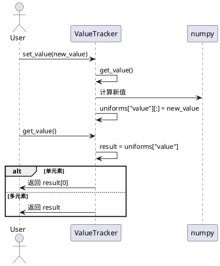
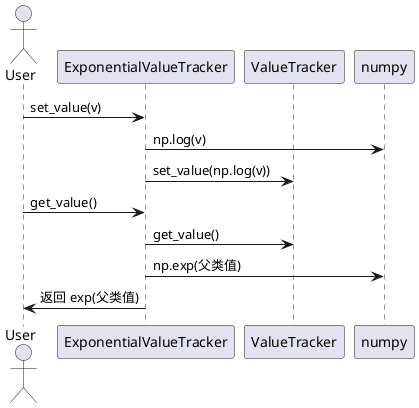

# ValueTracker 及其子类详解

## 1. 类及其关键属性介绍（含 PlantUML 类图）

### 1.1 ValueTracker
- **继承自**：`Mobject`
- **关键属性**：
  - `value_type`: 存储数值的类型，默认为 `np.float64`
  - `value`: 初始值，float/complex/ndarray
  - `uniforms["value"]`: 用于动画系统的底层数值存储

### 1.2 ExponentialValueTracker
- **继承自**：`ValueTracker`
- **关键属性**：
  - 继承自 `ValueTracker`
- **特性**：
  - 存储的是对数值的指数映射，插值时表现为指数变化

### 1.3 ComplexValueTracker
- **继承自**：`ValueTracker`
- **关键属性**：
  - `value_type`: 存储为 `np.complex128`
- **特性**：
  - 适用于复数动画场景

### 1.4 相关依赖类
- **Mobject**：Manim 所有可动画对象的基类，提供动画、uniforms、事件等基础设施。

#### PlantUML 类图


---

## 2. 关键实现方法与算法（含 PlantUML 时序图）

### 2.1 ValueTracker
- **init_uniforms**：初始化 uniform，核心是将 value 转为 numpy 数组存入 uniforms["value"]。
- **get_value**：从 uniforms["value"] 取值，若为单元素数组则返回标量，否则返回数组。
- **set_value**：直接修改 uniforms["value"]，支持链式调用。
- **increment_value**：在当前值基础上递增。

#### 时序图：set_value 与 get_value


### 2.2 ExponentialValueTracker
- **get_value**：返回 `exp(父类.get_value())`
- **set_value**：存储 `log(value)` 到父类

#### 时序图：ExponentialValueTracker 的 set/get


---

## 3. 使用方法与高质量代码示例

### 3.1 ValueTracker 基本用法
```python
from manimlib.mobject.value_tracker import ValueTracker

# 创建一个可动画的数值追踪器
vt = ValueTracker(2.0)

# 获取当前值
print(vt.get_value())  # 输出: 2.0

# 设置新值
vt.set_value(5.0)
print(vt.get_value())  # 输出: 5.0

# 增量更新
vt.increment_value(1.5)
print(vt.get_value())  # 输出: 6.5
```

### 3.2 ExponentialValueTracker 用法
```python
from manimlib.mobject.value_tracker import ExponentialValueTracker

evt = ExponentialValueTracker(1.0)
evt.set_value(10.0)
print(evt.get_value())  # 输出: 10.0
evt.increment_value(1.0)  # 实际上是指数空间的变化
print(evt.get_value())  # 输出: 约27.18
```

### 3.3 ComplexValueTracker 用法
```python
from manimlib.mobject.value_tracker import ComplexValueTracker

cvt = ComplexValueTracker(1+2j)
print(cvt.get_value())  # 输出: (1+2j)
cvt.set_value(3+4j)
print(cvt.get_value())  # 输出: (3+4j)
```

---

## 4. 各类使用场景、特性与建议

### ValueTracker
- **场景**：需要随时间变化的数值驱动动画（如动态坐标、参数、透明度等）。
- **特性**：可与 Manim 的动画系统无缝集成，支持链式操作。
- **建议**：适合标量、向量、数组等多种数值类型。

### ExponentialValueTracker
- **场景**：需要指数插值的动画（如缩放、指数增长/衰减等）。
- **特性**：插值为指数变化，动画更自然。
- **建议**：避免传入非正数，否则 log 计算会报错。

### ComplexValueTracker
- **场景**：需要复数参数驱动的动画（如复平面变换、信号处理等）。
- **特性**：底层类型为 complex128，支持复数动画。
- **建议**：仅在确实需要复数插值时使用。

---

## 5. 注意事项与总结
- 这些 Tracker 类本身不会显示在画面上，需配合 updaters 或动画方法使用。
- `ValueTracker` 适合绝大多数数值动画场景，`ExponentialValueTracker` 适合对数/指数变化，`ComplexValueTracker` 适合复数场景。
- 使用时注意类型匹配，避免类型不一致导致的 numpy 错误。
- 建议在动画场景中通过 `add_updater` 或 `always` 机制将 Tracker 的值与其他 mobject 属性绑定，实现动态效果。
