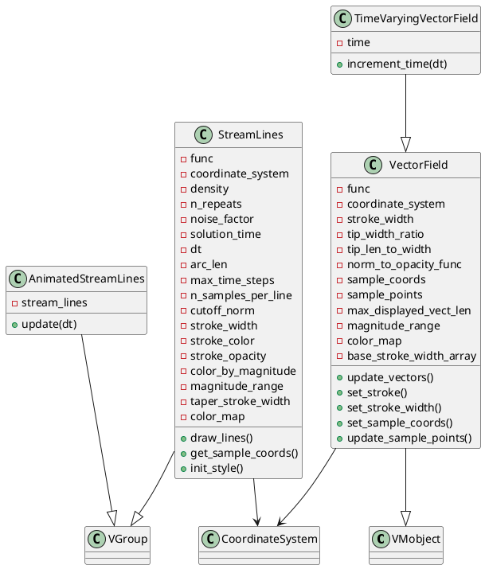
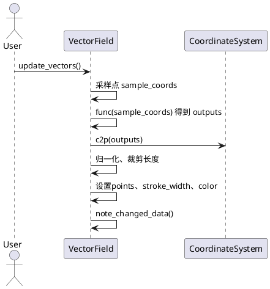
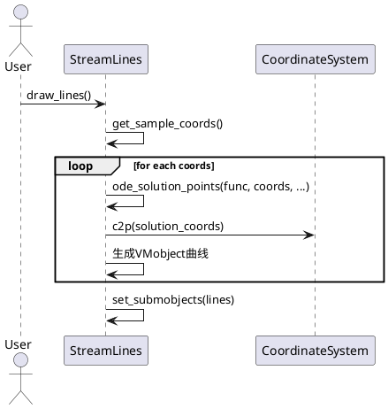

# vector_field.py 类与用法详解

## 1. 类及关键属性介绍（含PlantUML类图）

### 主要类

- `VectorField`
- `TimeVaryingVectorField`
- `StreamLines`
- `AnimatedStreamLines`

#### 继承关系与依赖

- `VectorField` 继承自 `VMobject`
- `TimeVaryingVectorField` 继承自 `VectorField`
- `StreamLines` 继承自 `VGroup`
- `AnimatedStreamLines` 继承自 `VGroup`
- `VMobject`、`VGroup` 均为Manim的基础矢量对象容器
- 依赖 `CoordinateSystem` 进行坐标变换

#### PlantUML类图



---

## 2. 关键实现方法与算法（含PlantUML时序图）

### VectorField

- `update_vectors()`
  - 计算每个采样点的矢量，决定箭头的长度、方向、颜色、透明度等。
  - 算法核心：对每个采样点，调用`func`获得矢量，归一化后映射到全局坐标，依据最大长度和tanh函数进行裁剪，设置箭头头部、尾部、宽度、颜色等。

#### update_vectors 时序图



### StreamLines

- `draw_lines()`
  - 对每个采样点，使用常微分方程求解器（`ode_solution_points`）生成流线轨迹，构造VMobject曲线。
- `init_style()`
  - 根据流线上的矢量模长，设置颜色渐变和宽度渐变。

#### draw_lines 时序图



### AnimatedStreamLines

- `update(dt)`
  - 控制每条流线动画的进度，实现流线“流动”效果。

---

## 3. 使用方法与代码示例

```python
from manimlib import *

class VectorFieldExample(Scene):
    def construct(self):
        # 定义一个简单的向量场函数
        def func(coords):
            x, y = coords.T
            return np.array([-y, x]).T  # 旋转场

        # 创建坐标系
        axes = NumberPlane()

        # 创建向量场
        vector_field = VectorField(
            func=func,
            coordinate_system=axes,
            density=1.5,
            color_map_name="viridis"
        )

        # 创建流线
        stream_lines = StreamLines(
            func=func,
            coordinate_system=axes,
            density=1.0,
            color_by_magnitude=True
        )

        # 创建流线动画
        animated_stream_lines = AnimatedStreamLines(stream_lines)

        self.add(axes, vector_field, animated_stream_lines)
        self.wait(4)
```

---

## 4. 各类使用场景、特性与建议

### VectorField
- **场景**：用于展示静态的二维/三维向量场，适合物理、电场、流体等可视化。
- **特性**：支持自定义采样密度、箭头样式、颜色映射、透明度映射等。
- **建议**：采样密度不宜过高，避免性能瓶颈；自定义`func`时需保证输入输出shape一致。

### TimeVaryingVectorField
- **场景**：用于动态变化的向量场（如随时间变化的流体场）。
- **特性**：自动更新时间参数，支持动画。
- **建议**：`time_func`需支持时间参数，动画时注意性能。

### StreamLines
- **场景**：用于展示流体、场线等随场流动的轨迹。
- **特性**：支持多次采样、噪声扰动、颜色/宽度渐变。
- **建议**：`func`应为矢量场，`density`和`n_repeats`影响流线数量和分布。

### AnimatedStreamLines
- **场景**：用于动态展示流线随时间推进的动画效果。
- **特性**：可自定义动画速率、延迟、流线样式。
- **建议**：适合与`StreamLines`配合使用，动画参数可调节流动感。

---

## 5. 注意事项与总结

- 向量场和流线的可视化高度依赖于`CoordinateSystem`的实现，建议优先使用`NumberPlane`、`Axes`等标准坐标系。
- 箭头/流线的颜色映射、宽度渐变等参数需结合实际场景调整，避免视觉混乱。
- 动画类（如`AnimatedStreamLines`）对性能有一定要求，复杂场景下建议降低采样密度或动画速率。
- 所有类均可与Manim的`Scene`体系无缝集成，支持与其他Mobject叠加展示。
