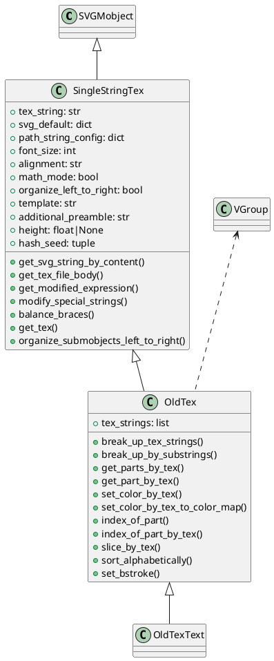
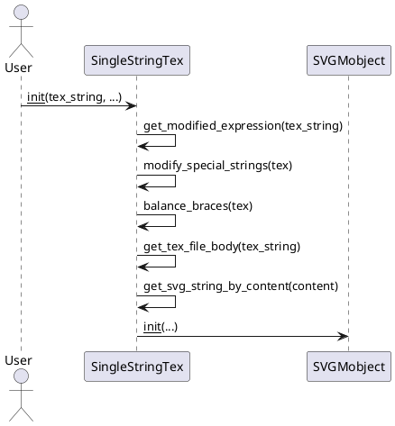
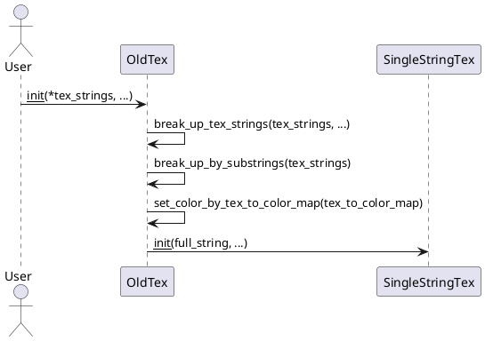

# old_tex_mobject 深度解析

## 1. 类及其关键属性（PlantUML 类图）



### 关键属性说明

- `tex_string`: TeX字符串内容。
- `svg_default`: SVG渲染的默认参数。
- `path_string_config`: 路径字符串配置。
- `font_size`: 字体大小。
- `alignment`: LaTeX对齐方式。
- `math_mode`: 是否数学模式。
- `organize_left_to_right`: 是否按从左到右组织子对象。
- `template`: LaTeX模板。
- `additional_preamble`: LaTeX额外前导内容。
- `height`: 渲染高度。
- `tex_strings`: 拆分后的TeX字符串列表（OldTex）。
- 其余属性见类定义。

---

## 2. 关键实现方法与算法（PlantUML 时序图）

### 2.1 SingleStringTex 渲染流程



#### 说明
- `modify_special_strings`：处理特殊TeX命令（如`\over`、`\sqrt`等），自动补全必要内容，保证渲染不出错。
- `balance_braces`：自动补全未闭合的大括号，防止LaTeX语法错误。
- `get_tex_file_body`：生成完整的LaTeX文档体，自动加上对齐和数学环境。
- `get_svg_string_by_content`：调用`latex_to_svg`将LaTeX转为SVG。

---

### 2.2 OldTex 拆分与着色流程



#### 说明
- `break_up_tex_strings`：根据isolate和tex_to_color_map参数，将TeX字符串拆分为多个部分，便于后续分组和着色。
- `break_up_by_substrings`：根据拆分结果，重新组织submobjects，实现分组。
- `set_color_by_tex_to_color_map`：根据映射表，对指定TeX片段着色。

---

## 3. 类的使用方法（高质量代码示例）

```python
from manimlib.mobject.svg.old_tex_mobject import OldTex, OldTexText
from manimlib.constants import RED, BLUE

# 示例1：基本TeX公式渲染
tex = OldTex(r"E=mc^2")
tex.set_color_by_tex("E", RED)
tex.set_color_by_tex("mc^2", BLUE)

# 示例2：分割与着色
tex2 = OldTex(
    r"\int_a^b f(x) dx = F(b) - F(a)",
    isolate=["a", "b", "F"],
    tex_to_color_map={"a": RED, "b": BLUE, "F": "#00FF00"}
)

# 示例3：文本模式
text = OldTexText("Hello, Manim!", math_mode=False)

# 示例4：切片与排序
part = tex2.get_part_by_tex("F")
slice_group = tex2.slice_by_tex("a", "F")
tex2.sort_alphabetically()
```

---

## 4. 总结

- `SingleStringTex`负责单个TeX字符串的SVG渲染与特殊处理。
- `OldTex`支持TeX字符串的分割、分组、着色等高级操作，适合复杂公式动画。
- `OldTexText`用于非数学模式的文本渲染。
- 这些类为Manim的老版TeX渲染提供了强大灵活的底层支持。
