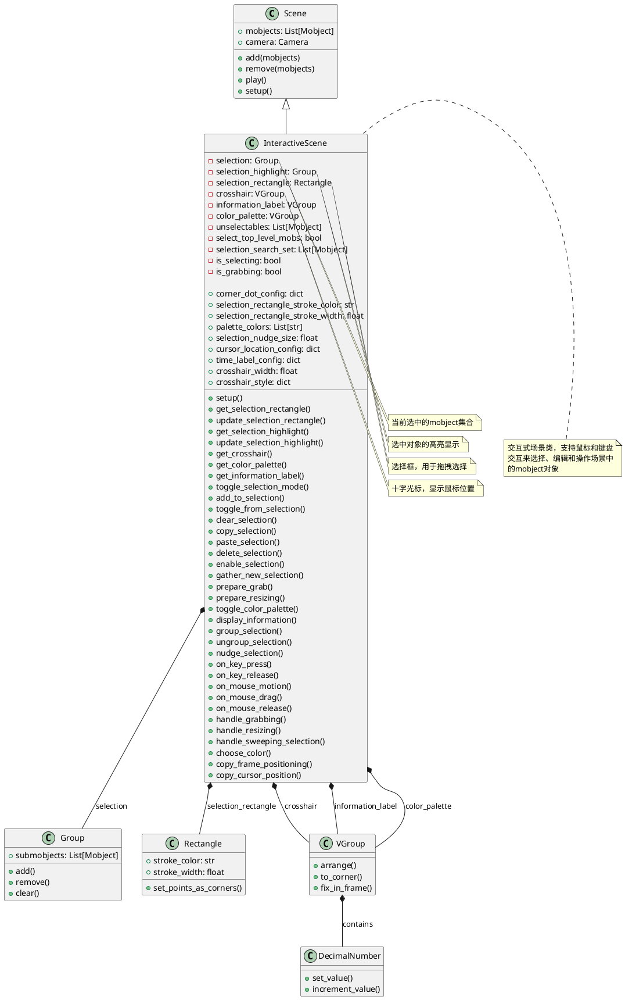
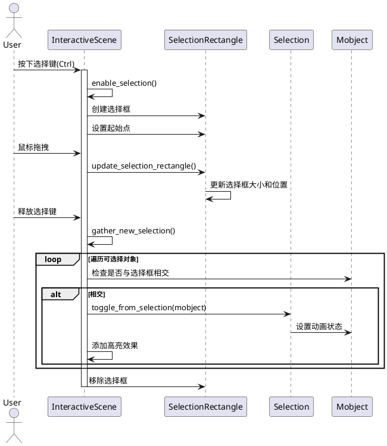
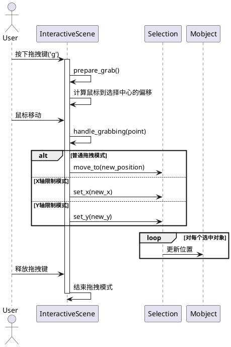
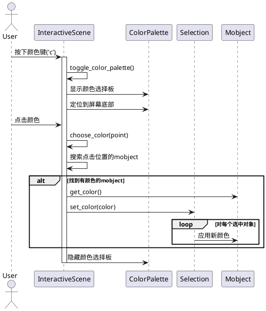

# InteractiveScene 交互式场景类分析

## 1. 类结构分析

### 1.1 类图展示



### 1.2 关键属性说明

| 属性名 | 类型 | 说明 |
|--------|------|------|
| `selection` | Group | 当前选中的mobject集合，支持多选 |
| `selection_highlight` | Group | 选中对象的高亮显示效果 |
| `selection_rectangle` | Rectangle | 鼠标拖拽时的选择框 |
| `crosshair` | VGroup | 十字光标，显示鼠标位置 |
| `information_label` | VGroup | 信息标签，显示鼠标坐标和时间 |
| `color_palette` | VGroup | 颜色选择板 |
| `unselectables` | List[Mobject] | 不可选择的mobject列表 |
| `select_top_level_mobs` | bool | 是否选择顶级mobject（true）或子组件（false） |
| `selection_search_set` | List[Mobject] | 可供选择的mobject搜索集合 |
| `is_selecting` | bool | 是否处于选择模式 |
| `is_grabbing` | bool | 是否处于拖拽模式 |

## 2. 关键实现方法及算法

### 2.1 选择机制时序图



### 2.2 拖拽操作时序图



### 2.3 颜色选择时序图



## 3. 使用方法示例

### 3.1 基础交互场景

```python
from manimlib import *

class BasicInteractiveExample(InteractiveScene):
    def construct(self):
        # 创建一些基本图形
        circle = Circle(radius=1, color=BLUE)
        square = Square(side_length=2, color=RED)
        triangle = Triangle()
        
        # 添加到场景
        self.add(circle, square, triangle)
        
        # 设置位置
        circle.to_corner(UL)
        square.to_corner(UR) 
        triangle.to_corner(DL)
        
        # 添加文本说明
        instructions = Text(
            "使用 Ctrl+鼠标 选择对象\n"
            "按 'g' 拖拽对象\n"
            "按 'c' 更改颜色\n"
            "按 't' 切换选择模式",
            font_size=24
        )
        instructions.to_corner(DR)
        self.add(instructions)
        
        # 等待交互
        self.wait()
```

### 3.2 高级交互功能

```python
class AdvancedInteractiveExample(InteractiveScene):
    def construct(self):
        # 创建复杂的mobject层次结构
        main_group = VGroup()
        
        # 创建多个子图形
        for i in range(5):
            sub_group = VGroup()
            for j in range(3):
                dot = Dot(
                    point=[i*0.5, j*0.5, 0],
                    color=random_color()
                )
                sub_group.add(dot)
            main_group.add(sub_group)
        
        main_group.center()
        self.add(main_group)
        
        # 添加自定义快捷键处理
        self.add_custom_key_bindings()
        
        # 设置一些对象为不可选择
        title = Text("高级交互示例", font_size=36)
        title.to_edge(UP)
        self.add(title)
        self.disable_interaction(title)
        
        self.wait()
    
    def add_custom_key_bindings(self):
        """添加自定义按键绑定"""
        original_on_key_press = self.on_key_press
        
        def custom_on_key_press(symbol, modifiers):
            char = chr(symbol)
            
            # 自定义功能：按 'r' 随机化选中对象的颜色
            if char == 'r' and len(self.selection) > 0:
                for mob in self.selection:
                    mob.set_color(random_color())
            
            # 自定义功能：按 'f' 将选中对象淡入淡出
            elif char == 'f' and len(self.selection) > 0:
                self.play(*[
                    FadeOut(mob, run_time=0.5)
                    for mob in self.selection
                ])
                self.play(*[
                    FadeIn(mob, run_time=0.5)
                    for mob in self.selection
                ])
            
            # 调用原始处理函数
            original_on_key_press(symbol, modifiers)
        
        self.on_key_press = custom_on_key_press
```

### 3.3 复制粘贴功能示例

```python
class CopyPasteExample(InteractiveScene):
    def construct(self):
        # 创建一些图形供复制
        original_shapes = VGroup(
            Circle(color=BLUE, radius=0.5),
            Square(color=RED, side_length=1),
            Triangle(color=GREEN)
        )
        original_shapes.arrange(RIGHT, buff=1)
        original_shapes.to_edge(LEFT)
        
        self.add(original_shapes)
        
        # 使用说明
        instructions = Text(
            "选择对象后：\n"
            "Cmd+C 复制\n"
            "Cmd+V 粘贴\n"
            "Cmd+X 剪切\n"
            "也可以复制LaTeX或文本",
            font_size=20
        )
        instructions.to_corner(UR)
        self.add(instructions)
        
        # 添加一些LaTeX示例
        latex_example = Tex(r"\int_0^\infty e^{-x^2} dx = \frac{\sqrt{\pi}}{2}")
        latex_example.to_edge(DOWN)
        self.add(latex_example)
        
        self.wait()
```

### 3.4 自定义选择高亮

```python
class CustomHighlightExample(InteractiveScene):
    def __init__(self, **kwargs):
        # 自定义高亮样式
        self.corner_dot_config = dict(
            color=YELLOW,
            radius=0.1,
            glow_factor=3.0,
        )
        self.selection_rectangle_stroke_color = YELLOW
        self.selection_rectangle_stroke_width = 3.0
        
        super().__init__(**kwargs)
    
    def get_highlight(self, mobject):
        """自定义高亮效果"""
        if isinstance(mobject, VMobject) and mobject.has_points():
            # 创建发光效果
            highlight = mobject.copy()
            highlight.set_stroke(YELLOW, width=5, opacity=0.8)
            highlight.set_fill(opacity=0)
            return highlight
        else:
            return super().get_highlight(mobject)
    
    def construct(self):
        # 创建各种图形测试自定义高亮
        shapes = VGroup(
            Circle(color=BLUE),
            Square(color=RED),
            RegularPolygon(6, color=GREEN),
            Star(color=PURPLE, outer_radius=1)
        )
        shapes.arrange_in_grid(2, 2, buff=1)
        self.add(shapes)
        
        title = Text("自定义高亮效果", font_size=32)
        title.to_edge(UP)
        self.add(title)
        
        self.wait()
```

## 4. 类的总体分析

### 4.1 定义与作用

`InteractiveScene` 是 Manim 库的一个核心交互类，继承自 `Scene` 类。它提供了一个完整的交互式环境，允许用户通过鼠标和键盘直接操作场景中的 mobject 对象，实现可视化编程和实时编辑功能。

### 4.2 主要特性

1. **多模式选择**：支持单点选择、矩形框选择、顶级/子级对象选择模式
2. **实时拖拽**：支持自由拖拽、轴向限制拖拽、缩放操作
3. **颜色编辑**：提供颜色选择板，支持实时颜色修改
4. **复制粘贴**：支持 mobject、LaTeX、文本的复制粘贴操作
5. **键盘快捷键**：丰富的快捷键支持，提升操作效率
6. **可视化反馈**：十字光标、选择高亮、信息显示等

### 4.3 使用场景

1. **教学演示**：实时调整图形位置、颜色、大小进行教学
2. **原型设计**：快速构建和调整动画原型
3. **调试开发**：在开发过程中实时测试和调整 mobject
4. **交互式展示**：创建可交互的数学或科学演示
5. **可视化编辑器**：作为 Manim 的可视化前端工具

### 4.4 技术特性

1. **事件驱动架构**：基于键盘和鼠标事件的响应机制
2. **状态管理**：维护选择状态、操作模式等复杂状态
3. **实时更新**：使用 updater 机制保持 UI 元素的实时更新
4. **层次化搜索**：支持不同层级的 mobject 选择和操作
5. **剪贴板集成**：与系统剪贴板交互，支持跨应用复制粘贴

### 4.5 建议与注意事项

#### 建议

1. **性能优化**：
   - 对于复杂场景，考虑限制 `selection_search_set` 的大小
   - 使用 `disable_interaction()` 排除不需要交互的对象

2. **用户体验**：
   - 提供清晰的操作指南和快捷键说明
   - 自定义高亮效果以适应不同的视觉需求
   - 合理使用 `unselectables` 避免误操作

3. **扩展开发**：
   - 重写 `get_highlight()` 方法自定义选择效果
   - 扩展 `on_key_press()` 添加自定义快捷键
   - 利用 `copy_selection()` 和 `paste_selection()` 实现特殊的复制粘贴逻辑

#### 注意事项

1. **内存管理**：
   - 及时清理不需要的选择高亮对象
   - 注意 `selection_search_set` 的更新时机

2. **事件冲突**：
   - 自定义按键绑定时避免与系统快捷键冲突
   - 注意键盘事件的处理顺序和优先级

3. **兼容性**：
   - 部分功能可能依赖特定的操作系统或窗口管理器
   - 剪贴板操作需要相应的系统权限

4. **调试困难**：
   - 交互过程中的状态变化难以追踪
   - 建议添加日志记录关键操作

5. **学习曲线**：
   - 需要熟悉大量快捷键和操作模式
   - 建议提供交互式教程或帮助系统

### 4.6 最佳实践

1. 在 `construct()` 方法中添加操作说明文本
2. 合理设置 `unselectables` 列表，避免干扰操作
3. 自定义高亮样式以提供更好的视觉反馈
4. 使用 `save_state()` 机制支持撤销操作
5. 为复杂场景提供分组和ungrouping功能
6. 考虑添加自定义的上下文菜单或工具栏

`InteractiveScene` 代表了 Manim 在交互性方面的重要发展，它将静态的数学动画制作工具转变为动态的交互式创作环境，极大地提升了用户的创作效率和体验。