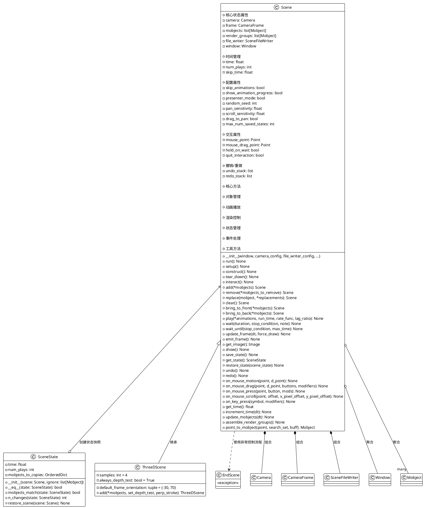
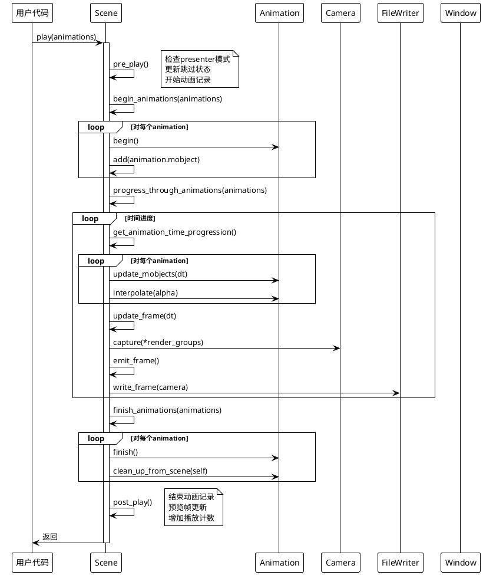
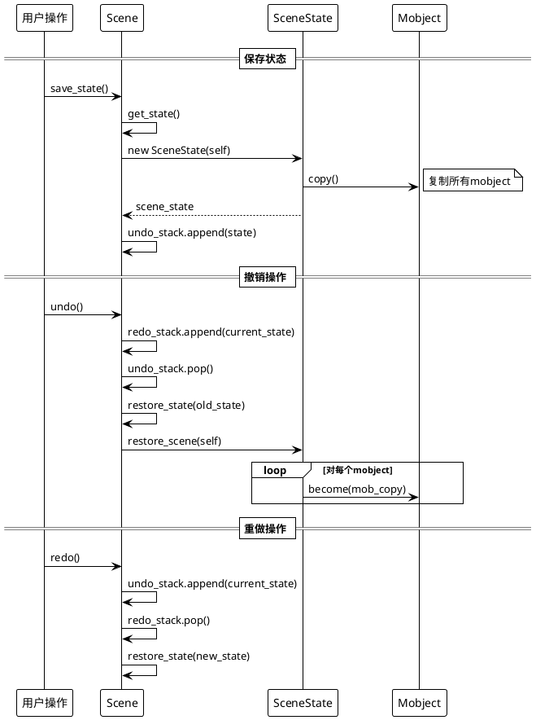
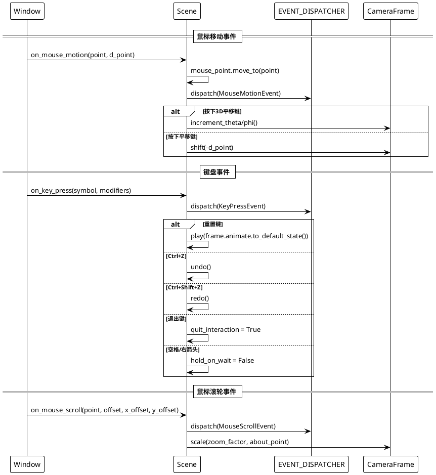

# Scene.py 详细分析文档

## 概述

`scene.py` 是 ManimGL 框架的核心文件之一，定义了场景管理的基础架构。该文件包含了三个主要类：`Scene`、`SceneState` 和 `ThreeDScene`，以及一个异常类 `EndScene`。这些类协同工作，提供了完整的动画场景管理功能。

## 1. 类结构分析及PlantUML类图

### 1.1 类及其关键属性

#### Scene 类
- **核心属性**：
  - `camera`: Camera - 场景摄像机，负责渲染
  - `frame`: CameraFrame - 摄像机框架，控制视角
  - `mobjects`: list[Mobject] - 场景中的数学对象列表
  - `file_writer`: SceneFileWriter - 文件输出管理器
  - `window`: Window - 交互窗口
  - `time`: float - 当前场景时间
  - `num_plays`: int - 播放计数器
  
- **配置属性**：
  - `skip_animations`: bool - 是否跳过动画
  - `show_animation_progress`: bool - 是否显示动画进度
  - `presenter_mode`: bool - 演示模式
  - `random_seed`: int - 随机种子

#### SceneState 类
- **状态属性**：
  - `time`: float - 场景时间快照
  - `num_plays`: int - 播放次数快照
  - `mobjects_to_copies`: OrderedDict - 对象及其副本的映射

#### ThreeDScene 类
- **3D特定属性**：
  - `samples`: int - 抗锯齿采样数
  - `default_frame_orientation`: tuple - 默认3D视角
  - `always_depth_test`: bool - 总是进行深度测试

### 1.2 PlantUML类图



## 2. 关键实现方法及算法分析

### 2.1 动画播放流程 (play方法)

`play` 方法是Scene类的核心，负责执行动画。其算法流程如下：

1. **预处理阶段**: 准备动画参数，更新跳过状态
2. **初始化阶段**: 开始动画，将动画对象添加到场景
3. **进度控制阶段**: 逐帧更新动画状态
4. **完成阶段**: 结束动画，清理资源

### 2.2 渲染优化算法 (assemble_render_groups)

该方法通过将相同类型的mobject分组来优化渲染性能：
1. 按对象类型、着色器ID和z_index进行分批
2. 创建渲染组以减少GPU状态切换
3. 提高渲染效率

### 2.3 PlantUML时序图

#### 动画播放时序图



#### 状态管理时序图



#### 事件处理时序图



## 3. 使用方法及代码示例

### 3.1 基础Scene使用

```python
from manimlib import Scene, Circle, FadeIn, Transform, Write, Text
import numpy as np

class BasicSceneExample(Scene):
    def construct(self):
        # 创建基本图形
        circle = Circle(radius=1, color="#FF6B6B")
        text = Text("Hello ManimGL!", font_size=48)
        
        # 添加到场景
        self.add(circle, text)
        
        # 基础动画
        self.play(FadeIn(circle))
        self.wait(1)
        
        # 变换动画
        square = Square(side_length=2, color="#4ECDC4")
        self.play(Transform(circle, square))
        self.wait(1)
        
        # 文字动画
        self.play(Write(text))
        self.wait(2)

class InteractiveSceneExample(Scene):
    def construct(self):
        # 创建可交互的对象
        dots = [
            Dot(np.array([x, y, 0])) 
            for x in range(-3, 4) 
            for y in range(-2, 3)
        ]
        
        # 批量添加
        self.add(*dots)
        
        # 保存状态用于撤销
        self.save_state()
        
        # 动态动画
        for i, dot in enumerate(dots):
            self.play(
                dot.animate.shift(np.random.rand(3) - 0.5),
                run_time=0.5,
                rate_func=lambda t: t**2
            )
        
        self.wait()
        
        # 演示撤销功能
        self.undo()  # 可通过Ctrl+Z触发
        self.wait()
```

### 3.2 高级功能示例

```python
class AdvancedSceneFeatures(Scene):
    def setup(self):
        """在construct之前的设置"""
        self.camera.frame.scale(0.8)  # 缩放视图
        
    def construct(self):
        # 使用临时配置
        with self.temp_config_change(skip=False, progress_bar=True):
            self.create_complex_animation()
        
        # 条件等待
        condition_met = False
        def check_condition():
            nonlocal condition_met
            # 模拟某种条件检查
            condition_met = np.random.random() > 0.7
            return condition_met
            
        self.wait_until(check_condition, max_time=5)
        
        # 添加音频
        self.add_sound("audio/background.wav", time_offset=1.0)
        
        # 演示批量对象管理
        mobjects = [Circle(radius=0.3).shift(i*RIGHT) for i in range(5)]
        self.add_mobjects_among(locals().values())  # 添加所有本地mobject
        
    def create_complex_animation(self):
        """复杂动画示例"""
        # 创建数学函数图像
        axes = Axes(x_range=[-3, 3], y_range=[-2, 2])
        func_graph = axes.get_graph(lambda x: np.sin(x), color=BLUE)
        
        # 分段动画
        animations = [
            FadeIn(axes),
            Create(func_graph),
        ]
        
        # 并行播放多个动画
        self.play(*animations, lag_ratio=0.3)
        
        # 使用自定义时间和速率函数
        self.play(
            func_graph.animate.scale(1.5),
            run_time=2,
            rate_func=lambda t: smooth(t)  # 平滑函数
        )

class SceneWithEventHandling(Scene):
    def __init__(self, **kwargs):
        super().__init__(**kwargs)
        self.interactive_objects = []
        
    def construct(self):
        # 创建可点击的对象
        buttons = VGroup(*[
            Rectangle(width=2, height=0.8).shift(i*DOWN)
            for i in range(3)
        ])
        
        labels = VGroup(*[
            Text(f"Button {i+1}").move_to(buttons[i])
            for i in range(3)
        ])
        
        self.interactive_objects = buttons
        self.add(buttons, labels)
        
        # 进入交互模式
        self.interact()
    
    def on_mouse_press(self, point, button, mods):
        """重写鼠标按下事件"""
        clicked_obj = self.point_to_mobject(point, self.interactive_objects)
        if clicked_obj:
            # 对点击的对象执行动画
            self.play(clicked_obj.animate.set_color(random_color()))
        
        # 调用父类方法保持原有功能
        super().on_mouse_press(point, button, mods)
    
    def on_key_press(self, symbol, modifiers):
        """自定义键盘处理"""
        try:
            char = chr(symbol)
            if char == 'r':  # 按R键重置
                for obj in self.interactive_objects:
                    obj.set_color(WHITE)
                self.update_frame(force_draw=True)
            elif char == 's':  # 按S键保存状态
                self.save_state()
        except:
            pass
        
        # 调用父类方法
        super().on_key_press(symbol, modifiers)
```

### 3.3 ThreeDScene使用示例

```python
from manimlib import ThreeDScene, Sphere, Cube, ParametricSurface
import numpy as np

class ThreeDSceneExample(ThreeDScene):
    def construct(self):
        # 设置3D地面平面
        self.set_floor_plane("xz")  # XZ平面作为地面
        
        # 创建3D对象
        sphere = Sphere(radius=1, color=RED)
        cube = Cube(side_length=1.5, color=BLUE)
        
        # 3D定位
        sphere.shift(2*LEFT + UP)
        cube.shift(2*RIGHT + UP)
        
        # 添加到场景（自动应用深度测试）
        self.add(sphere, cube)
        
        # 3D动画
        self.play(
            sphere.animate.shift(DOWN),
            cube.animate.rotate(PI/4, axis=UP),
            run_time=2
        )
        
        # 创建参数曲面
        surface = ParametricSurface(
            lambda u, v: np.array([
                u * np.cos(v),
                u * np.sin(v),
                u * 0.1
            ]),
            u_range=[-2, 2],
            v_range=[0, 2*PI],
            color=GREEN,
            fill_opacity=0.7
        )
        
        self.play(FadeIn(surface))
        
        # 相机动画（3D视角变化）
        self.play(
            self.frame.animate.reorient(-60, 30),  # 改变相机角度
            run_time=3
        )
        
        self.wait()
```

### 3.4 状态管理和撤销功能

```python
class StateManagementExample(Scene):
    def construct(self):
        # 创建初始状态
        circle = Circle()
        self.add(circle)
        self.save_state()  # 保存初始状态
        
        # 第一次变换
        self.play(circle.animate.shift(RIGHT).set_color(RED))
        self.save_state()  # 保存变换后状态
        
        # 第二次变换
        self.play(circle.animate.scale(2).set_color(BLUE))
        self.save_state()
        
        # 演示撤销功能
        self.wait(1)
        self.undo()  # 回到蓝色状态之前
        self.wait(1)
        self.undo()  # 回到初始状态
        self.wait(1)
        self.redo()  # 重做第一次变换
        
    # 也可以手动控制状态
    def demonstrate_manual_state_control(self):
        # 获取当前状态
        current_state = self.get_state()
        
        # 执行一些操作
        square = Square()
        self.add(square)
        self.play(square.animate.rotate(PI/4))
        
        # 恢复到之前的状态
        self.restore_state(current_state)
```

## 4. 类的定义、作用、使用场景总结

### 4.1 Scene类
- **定义**: 动画场景的核心管理类，负责对象管理、动画播放、渲染控制和用户交互
- **作用**: 
  - 管理场景中的所有数学对象(Mobject)
  - 控制动画的播放、暂停、跳过
  - 处理用户输入和交互事件
  - 管理摄像机和渲染过程
  - 提供状态保存和撤销功能
- **使用场景**:
  - 2D数学动画制作
  - 教育视频内容创建
  - 交互式数学演示
  - 算法可视化
- **使用特性**:
  - 支持自定义动画时长和速率函数
  - 提供完整的对象生命周期管理
  - 支持实时交互和事件处理
  - 内置撤销/重做机制

### 4.2 SceneState类
- **定义**: 场景状态的快照类，用于实现撤销/重做功能
- **作用**:
  - 保存场景的时间状态和对象状态
  - 支持状态比较和差异计算
  - 提供状态恢复功能
- **使用场景**:
  - 交互式编辑环境
  - 调试和测试
  - 用户误操作恢复
- **使用特性**:
  - 智能的对象复制策略（避免重复复制）
  - 高效的状态比较算法
  - 支持忽略特定对象

### 4.3 ThreeDScene类
- **定义**: 专门用于3D场景的Scene子类
- **作用**:
  - 提供3D渲染优化
  - 自动处理深度测试
  - 设置3D特定的默认参数
- **使用场景**:
  - 3D数学可视化
  - 立体几何演示
  - 3D算法展示
- **使用特性**:
  - 更高的抗锯齿采样
  - 自动深度测试
  - 3D默认视角设置

### 4.4 EndScene异常类
- **定义**: 用于控制场景结束的异常类
- **作用**: 提供优雅的场景退出机制
- **使用场景**: 程序化控制场景结束
- **使用特性**: 清晰的控制流，便于资源清理

## 5. 建议和注意事项

### 5.1 性能优化建议
1. **合理使用render groups**: `assemble_render_groups()`会自动优化，但避免频繁修改对象类型
2. **控制对象数量**: 大量对象时考虑使用VGroup进行批量管理
3. **适当设置采样率**: ThreeDScene的samples参数影响性能和质量
4. **跳过动画模式**: 开发时使用skip_animations=True加速测试

### 5.2 内存管理注意事项
1. **状态栈管理**: 注意max_num_saved_states限制，避免内存溢出
2. **对象引用**: 及时清理不需要的mobject引用
3. **大型场景**: 考虑分段渲染或使用temp_config_change

### 5.3 交互开发建议
1. **使用embed()**: 在construct()中调用embed()进入交互模式调试
2. **事件处理**: 重写事件处理方法时记得调用super()
3. **状态保存**: 在关键点手动save_state()便于调试

### 5.4 跨平台兼容性
1. **键盘映射**: 注意不同平台的键盘映射差异
2. **音频格式**: 确保音频文件格式的跨平台兼容性
3. **文件路径**: 使用相对路径和pathlib处理文件

### 5.5 自定义扩展建议
1. **继承Scene**: 创建专用Scene子类封装常用功能
2. **装饰器使用**: 利用@affects_mobject_list确保渲染组同步
3. **配置管理**: 合理使用default_camera_config和default_file_writer_config
4. **错误处理**: 在自定义事件处理中添加适当的异常处理

这个文档提供了Scene系统的完整分析，帮助开发者深入理解ManimGL的核心架构，并能够有效地创建和管理动画场景。