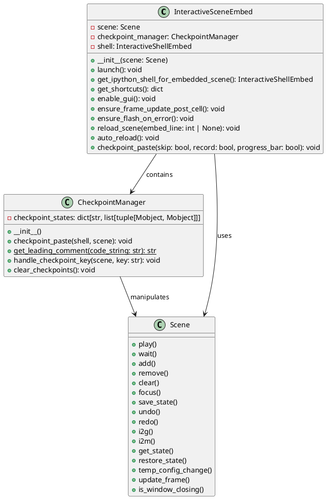
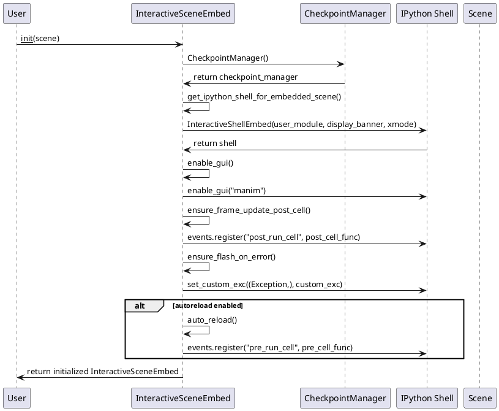
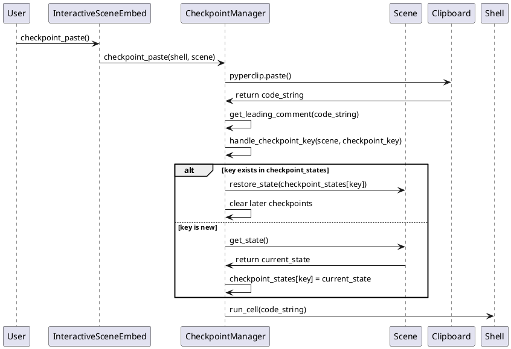
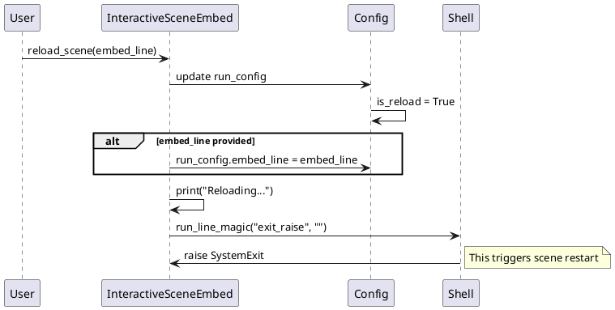

# Scene Embed 模块分析

## 文件概述

`scene_embed.py` 文件是 Manim 库中用于提供交互式场景开发能力的核心模块。它允许开发者在场景执行过程中启动一个嵌入式 IPython shell，从而实现动态调试和交互式开发。

## 类架构分析

### 1. 类图



### 2. 类的关键属性说明

#### InteractiveSceneEmbed 类
- **scene**: Scene对象，表示当前正在操作的场景实例
- **checkpoint_manager**: CheckpointManager实例，用于管理场景状态的检查点
- **shell**: InteractiveShellEmbed实例，嵌入式IPython终端

#### CheckpointManager 类
- **checkpoint_states**: 字典类型，键为注释字符串，值为场景状态的列表，用于存储不同检查点的场景状态

## 关键实现方法及算法分析

### 1. 初始化流程时序图



### 2. Checkpoint管理流程时序图



### 3. 场景重载流程时序图



## 使用方法及代码示例

### 基础使用示例

```python
from manimlib import *

class MyScene(Scene):
    def construct(self):
        # 创建一些对象
        circle = Circle(color=BLUE)
        square = Square(color=RED)
        
        self.add(circle, square)
        self.play(circle.animate.shift(LEFT))
        
        # 启动交互式环境
        self.embed()
        
        # 在交互式环境中，可以使用以下快捷命令：
        # play - 播放动画
        # add - 添加对象
        # remove - 移除对象
        # wait - 等待
        # checkpoint_paste - 从剪贴板执行代码并管理检查点
```

### 检查点功能使用示例

```python
from manimlib import *

class CheckpointScene(Scene):
    def construct(self):
        # 创建初始对象
        circle = Circle()
        self.add(circle)
        
        # 启动交互式环境
        self.embed()
        
        # 在IPython中，复制以下代码到剪贴板并执行 checkpoint_paste():
        
        # # Checkpoint 1: 移动圆形
        # self.play(circle.animate.shift(UP))
        
        # # Checkpoint 2: 改变颜色
        # circle.set_color(RED)
        # self.play(circle.animate.scale(2))
        
        # # Checkpoint 3: 添加方形
        # square = Square(color=BLUE)
        # self.add(square)
        # self.play(square.animate.shift(DOWN))
```

### 高级配置示例

```python
from manimlib import *
from manimlib.scene.scene_embed import InteractiveSceneEmbed

class AdvancedEmbedScene(Scene):
    def construct(self):
        # 自定义嵌入配置
        self.camera.background_color = BLACK
        
        # 创建复杂的场景
        text = Text("Interactive Manim", font_size=48)
        self.add(text)
        
        # 创建自定义的交互式嵌入
        embed = InteractiveSceneEmbed(self)
        
        # 启动嵌入环境
        embed.launch()
        
    def custom_function(self):
        """自定义函数可以在嵌入环境中调用"""
        return "This is a custom function"
```

### 实际开发工作流示例

```python
from manimlib import *

class DevelopmentWorkflow(Scene):
    def construct(self):
        """演示实际开发中的工作流程"""
        
        # 步骤1: 创建基础元素
        title = Text("My Animation", font_size=60)
        self.add(title)
        self.play(Write(title))
        
        # 步骤2: 进入交互式模式进行迭代开发
        self.embed()
        
        # 在交互式环境中可以进行以下操作:
        # 1. 使用 checkpoint_paste() 快速测试代码片段
        # 2. 使用 reload() 重新加载整个场景
        # 3. 使用 save_state() / undo() / redo() 进行状态管理
        # 4. 实时调整对象属性和动画参数
        
    def add_geometric_shapes(self):
        """在交互式环境中可以调用的辅助方法"""
        shapes = VGroup(
            Circle(color=RED),
            Square(color=GREEN),
            Triangle(color=BLUE)
        ).arrange(RIGHT)
        
        self.add(shapes)
        self.play(FadeIn(shapes))
        return shapes
```

## 核心算法详解

### 1. IPython Shell 集成算法

`get_ipython_shell_for_embedded_scene()` 方法实现了将当前场景上下文注入到 IPython shell 的核心算法：

```python
def get_ipython_shell_for_embedded_scene(self) -> InteractiveShellEmbed:
    # 通过帧回溯获取调用者上下文
    caller_frame = inspect.currentframe().f_back.f_back.f_back
    
    # 更新模块命名空间
    module = ModuleLoader.get_module(caller_frame.f_globals["__file__"])
    module.__dict__.update(caller_frame.f_locals)  # 局部变量
    module.__dict__.update(self.get_shortcuts())   # 快捷方法
    
    # 创建嵌入式shell
    return InteractiveShellEmbed(user_module=module, ...)
```

### 2. 检查点状态管理算法

`handle_checkpoint_key()` 方法实现了智能的状态管理：

```python
def handle_checkpoint_key(self, scene, key: str):
    if key in self.checkpoint_states:
        # 恢复到检查点状态
        scene.restore_state(self.checkpoint_states[key])
        
        # 清理后续检查点（时间线分支处理）
        all_keys = list(self.checkpoint_states.keys())
        index = all_keys.index(key)
        for later_key in all_keys[index + 1:]:
            self.checkpoint_states.pop(later_key)
    else:
        # 创建新检查点
        self.checkpoint_states[key] = scene.get_state()
```

### 3. GUI 事件循环集成算法

`enable_gui()` 方法将 Manim 的渲染循环与 IPython 的事件循环集成：

```python
def inputhook(context):
    while not context.input_is_ready():
        if not self.scene.is_window_closing():
            self.scene.update_frame(dt=0)  # 持续更新渲染
    if self.scene.is_window_closing():
        self.shell.ask_exit()  # 窗口关闭时退出shell
```

## 总结

### 类的定义与作用

1. **InteractiveSceneEmbed**: 主要的交互式嵌入类
   - **定义**: 为 Manim 场景提供交互式 IPython 环境的核心类
   - **作用**: 集成 IPython shell、管理 GUI 事件循环、提供快捷命令
   - **使用场景**: 场景开发、调试、实时动画调整

2. **CheckpointManager**: 检查点管理器
   - **定义**: 管理场景状态检查点的辅助类
   - **作用**: 实现代码片段的快速迭代和状态回滚
   - **使用场景**: 迭代开发、实验性修改、多版本比较

### 使用特性

1. **实时交互性**: 可以在动画运行时修改场景
2. **状态管理**: 支持保存、恢复和撤销操作
3. **快捷命令**: 提供简化的场景操作接口
4. **热重载**: 支持不重启的情况下重新加载场景
5. **错误处理**: 可视化错误提示和异常处理

### 使用建议

1. **开发阶段使用**: 主要在开发和调试阶段使用，生产环境应移除 embed 调用
2. **合理使用检查点**: 在重要的状态节点设置检查点注释
3. **关注性能**: 交互式模式会影响性能，适合小规模场景测试
4. **备份重要状态**: 使用 `save_state()` 保存重要的中间状态

### 注意事项

1. **内存管理**: 检查点会占用内存，定期使用 `clear_checkpoints()` 清理
2. **线程安全**: 确保在主线程中使用，避免多线程冲突
3. **依赖性**: 需要 IPython 和 pyperclip 库支持
4. **平台兼容性**: GUI 集成在不同平台上可能有差异
5. **调试信息**: 错误时会有红色边框闪烁，注意视觉影响

### 最佳实践

1. 使用有意义的检查点注释来标识不同的开发阶段
2. 在复杂动画开发中频繁保存状态
3. 利用热重载功能快速迭代
4. 结合 Manim 的其他调试工具使用
5. 在提交代码前移除所有 embed 调用