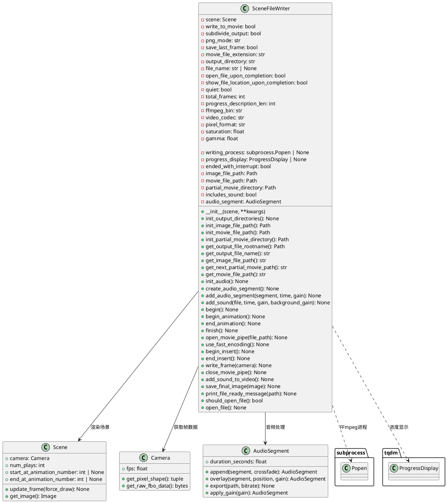
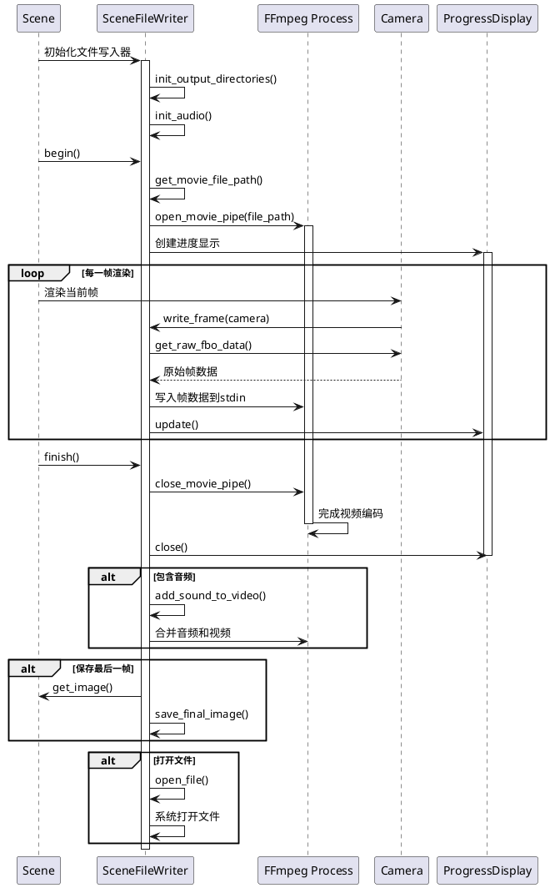
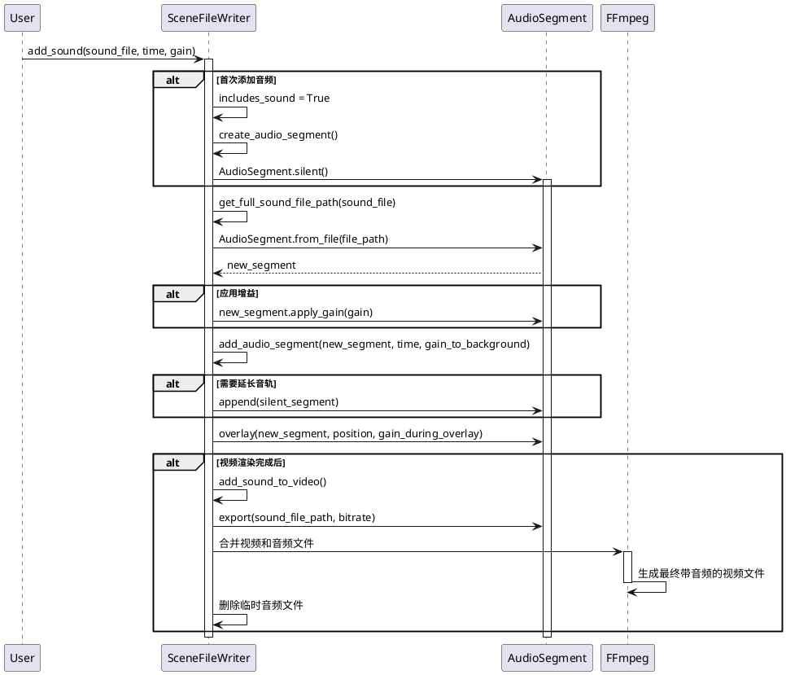

# SceneFileWriter 类详细分析

## 概览

`SceneFileWriter` 是 Manim 的核心文件输出管理类，负责将动画场景渲染输出为视频文件、图像文件，并处理音频的整合。该类封装了与 FFmpeg 交互、文件管理、进度显示等复杂的底层操作，为用户提供了简洁的文件输出接口。

## 1. 类结构与关键属性

### PlantUML 类图



### 关键属性说明

#### 控制属性
- `scene`: 要渲染的动画场景对象，包含所有动画内容
- `write_to_movie`: 是否输出视频文件，控制视频渲染流程
- `subdivide_output`: 是否将每个动画单独输出为文件，用于调试
- `save_last_frame`: 是否保存最后一帧为PNG图像
- `quiet`: 静默模式，控制是否显示进度和日志信息

#### 文件输出属性
- `output_directory`: 输出文件的目标目录
- `file_name`: 自定义输出文件名，为None时使用场景名
- `movie_file_extension`: 视频文件扩展名，默认为".mp4"
- `png_mode`: PNG图像的颜色模式，默认为"RGBA"

#### FFmpeg配置属性
- `ffmpeg_bin`: FFmpeg二进制文件路径，默认为"ffmpeg"
- `video_codec`: 视频编码器，默认为"libx264"
- `pixel_format`: 像素格式，默认为"yuv420p"
- `saturation`: 饱和度调整参数
- `gamma`: 伽马校正参数

#### 运行时状态属性
- `writing_process`: FFmpeg子进程对象，处理视频编码
- `progress_display`: 进度条显示对象
- `ended_with_interrupt`: 标记是否被用户中断
- `includes_sound`: 是否包含音频内容
- `audio_segment`: 音频片段对象，储存所有音频数据

## 2. 关键实现方法与算法

### 视频渲染流程时序图



### 音频处理流程时序图



### 核心算法详解

#### 1. FFmpeg管道通信算法
```python
def open_movie_pipe(self, file_path: str) -> None:
    # 构建FFmpeg命令
    command = [
        self.ffmpeg_bin,
        '-y',  # 覆盖输出文件
        '-f', 'rawvideo',  # 输入格式为原始视频
        '-s', f'{width}x{height}',  # 帧尺寸
        '-pix_fmt', 'rgba',  # 像素格式
        '-r', str(fps),  # 帧率
        '-i', '-',  # 从stdin读取数据
        '-vf', vf_arg,  # 视频滤镜（垂直翻转+色彩调整）
        '-an',  # 无音频
        self.temp_file_path
    ]
    # 创建子进程，建立管道通信
    self.writing_process = sp.Popen(command, stdin=sp.PIPE)
```

这个算法的关键在于：
- **管道通信**: 通过stdin管道实时传输帧数据给FFmpeg
- **流式处理**: 避免将所有帧数据储存在内存中
- **实时编码**: 边渲染边编码，提高效率

#### 2. 音频时间轴管理算法
```python
def add_audio_segment(self, new_segment, time=None, gain_to_background=None):
    segment = self.audio_segment
    curr_end = segment.duration_seconds
    
    if time is None:
        time = curr_end  # 追加到末尾
    
    new_end = time + new_segment.duration_seconds
    diff = new_end - curr_end
    
    # 如果新音频超出当前时长，需要填充静音
    if diff > 0:
        segment = segment.append(AudioSegment.silent(int(np.ceil(diff * 1000))))
    
    # 在指定时间位置覆盖音频
    self.audio_segment = segment.overlay(
        new_segment,
        position=int(1000 * time),
        gain_during_overlay=gain_to_background
    )
```

这个算法实现了：
- **时间轴管理**: 支持在任意时间点添加音频
- **自动填充**: 自动填充空白时间为静音
- **音频叠加**: 支持多音轨叠加和背景音量控制

#### 3. 动态文件名生成算法
```python
def get_output_file_name(self) -> str:
    if self.file_name:
        return self.file_name
    
    # 使用场景名和动画范围生成文件名
    name = str(self.scene)
    if self.scene.start_at_animation_number is not None:
        name += f"_{self.scene.start_at_animation_number}"
    if self.scene.end_at_animation_number is not None:
        name += f"_{self.scene.end_at_animation_number}"
    return name
```

这个算法支持：
- **自定义命名**: 优先使用用户指定的文件名
- **智能命名**: 基于场景名和动画范围自动生成
- **范围标识**: 自动添加动画范围后缀

## 3. 使用方法与代码示例

### 基本使用示例

```python
from manimlib import Scene, Circle, FadeIn
from manimlib.scene.scene_file_writer import SceneFileWriter

class MyScene(Scene):
    def construct(self):
        # 创建一个简单的圆形动画
        circle = Circle()
        self.play(FadeIn(circle))
        self.wait(1)

# 基本配置的文件写入器
def basic_usage_example():
    """基本使用示例：渲染简单的MP4文件"""
    scene = MyScene()
    
    # 创建文件写入器，基本配置
    file_writer = SceneFileWriter(
        scene=scene,
        write_to_movie=True,
        save_last_frame=True,
        output_directory="./output",
        file_name="my_animation",
        movie_file_extension=".mp4",
        total_frames=60  # 假设60帧
    )
    
    # 渲染流程
    file_writer.begin()
    
    # 模拟渲染每一帧
    for frame_num in range(60):
        scene.update_frame()
        file_writer.write_frame(scene.camera)
    
    file_writer.finish()
    print("渲染完成！")

# 高质量渲染配置
def high_quality_render_example():
    """高质量渲染示例：4K分辨率，高码率"""
    scene = MyScene()
    
    file_writer = SceneFileWriter(
        scene=scene,
        write_to_movie=True,
        save_last_frame=True,
        output_directory="./output/4k",
        file_name="high_quality_animation",
        # 高质量配置
        video_codec="libx264",
        pixel_format="yuv420p",
        movie_file_extension=".mp4",
        # 色彩调整
        saturation=1.1,  # 稍微提高饱和度
        gamma=0.95,      # 稍微调暗
        # UI配置
        quiet=False,
        progress_description_len=50,
        total_frames=120
    )
    
    # 渲染
    file_writer.begin()
    for frame_num in range(120):
        scene.update_frame()
        file_writer.write_frame(scene.camera)
    file_writer.finish()

# 带音频的渲染示例
def audio_enabled_example():
    """带音频渲染示例：添加背景音乐和音效"""
    scene = MyScene()
    
    file_writer = SceneFileWriter(
        scene=scene,
        write_to_movie=True,
        output_directory="./output/audio",
        file_name="audio_animation",
        total_frames=90
    )
    
    # 添加背景音乐（从第0秒开始）
    file_writer.add_sound(
        sound_file="background_music.mp3",
        time=0.0,
        gain=-10,  # 降低10dB音量
        gain_to_background=None
    )
    
    # 添加音效（在第2秒时）
    file_writer.add_sound(
        sound_file="effect.wav",
        time=2.0,
        gain=5,  # 提高5dB音量
        gain_to_background=-20  # 音效播放时背景音乐降低20dB
    )
    
    # 渲染
    file_writer.begin()
    for frame_num in range(90):
        scene.update_frame()
        file_writer.write_frame(scene.camera)
    file_writer.finish()

# 分割输出示例
def subdivided_output_example():
    """分割输出示例：每个动画单独保存为文件"""
    scene = MyScene()
    
    file_writer = SceneFileWriter(
        scene=scene,
        write_to_movie=True,
        subdivide_output=True,  # 启用分割输出
        output_directory="./output/subdivided",
        file_name="subdivided_animation",
        total_frames=30
    )
    
    # 第一个动画
    file_writer.begin_animation()
    for frame_num in range(15):
        scene.update_frame()
        file_writer.write_frame(scene.camera)
    file_writer.end_animation()
    
    # 第二个动画
    scene.num_plays += 1  # 更新播放计数
    file_writer.begin_animation()
    for frame_num in range(15):
        scene.update_frame()
        file_writer.write_frame(scene.camera)
    file_writer.end_animation()
    
    file_writer.finish()

# 快速编码示例
def fast_encoding_example():
    """快速编码示例：用于预览和调试"""
    scene = MyScene()
    
    file_writer = SceneFileWriter(
        scene=scene,
        write_to_movie=True,
        output_directory="./output/preview",
        file_name="preview",
        total_frames=60
    )
    
    # 使用快速编码设置
    file_writer.use_fast_encoding()  # 设置为libx264rgb和rgb32
    
    file_writer.begin()
    for frame_num in range(60):
        scene.update_frame()
        file_writer.write_frame(scene.camera)
    file_writer.finish()

# 插入式渲染示例
def insert_rendering_example():
    """插入式渲染示例：在现有项目中插入新内容"""
    scene = MyScene()
    
    file_writer = SceneFileWriter(
        scene=scene,
        write_to_movie=False,  # 初始不渲染
        output_directory="./output",
        file_name="main_animation"
    )
    
    # 开始插入渲染
    file_writer.begin_insert()
    
    # 渲染插入的内容
    for frame_num in range(30):
        scene.update_frame()
        file_writer.write_frame(scene.camera)
    
    file_writer.end_insert()
    print(f"插入文件已保存到: {file_writer.inserted_file_path}")

# 完整的渲染管道示例
class AdvancedRenderPipeline:
    """高级渲染管道示例"""
    
    def __init__(self, scene: Scene):
        self.scene = scene
        self.file_writer = None
    
    def setup_file_writer(self, config: dict):
        """根据配置设置文件写入器"""
        self.file_writer = SceneFileWriter(
            scene=self.scene,
            **config
        )
        
        # 如果需要音频，添加背景音乐
        if config.get("background_music"):
            self.file_writer.add_sound(
                config["background_music"],
                time=0.0,
                gain=config.get("music_gain", -15)
            )
    
    def render_with_progress_callback(self, progress_callback=None):
        """带进度回调的渲染"""
        if not self.file_writer:
            raise ValueError("文件写入器未初始化")
        
        self.file_writer.begin()
        
        for frame_num in range(self.file_writer.total_frames):
            # 更新场景
            self.scene.update_frame()
            
            # 写入帧
            self.file_writer.write_frame(self.scene.camera)
            
            # 进度回调
            if progress_callback:
                progress_callback(frame_num + 1, self.file_writer.total_frames)
        
        self.file_writer.finish()
    
    def add_sound_at_frame(self, sound_file: str, frame_number: int, **kwargs):
        """在指定帧添加音效"""
        fps = self.scene.camera.fps
        time_seconds = frame_number / fps
        self.file_writer.add_sound(sound_file, time=time_seconds, **kwargs)

# 使用示例
def advanced_pipeline_example():
    """高级渲染管道使用示例"""
    scene = MyScene()
    pipeline = AdvancedRenderPipeline(scene)
    
    # 配置
    config = {
        "write_to_movie": True,
        "save_last_frame": True,
        "output_directory": "./output/advanced",
        "file_name": "advanced_animation",
        "video_codec": "libx264",
        "saturation": 1.05,
        "total_frames": 120,
        "background_music": "ambient.mp3",
        "music_gain": -10
    }
    
    pipeline.setup_file_writer(config)
    
    # 在不同帧添加音效
    pipeline.add_sound_at_frame("click.wav", frame_number=30, gain=0)
    pipeline.add_sound_at_frame("whoosh.wav", frame_number=60, gain=2)
    
    # 渲染带进度显示
    def progress_callback(current, total):
        percentage = (current / total) * 100
        print(f"\r渲染进度: {percentage:.1f}% ({current}/{total})", end="")
    
    pipeline.render_with_progress_callback(progress_callback)
    print("\n渲染完成！")

if __name__ == "__main__":
    # 运行示例
    basic_usage_example()
    high_quality_render_example()
    audio_enabled_example()
    subdivided_output_example()
    fast_encoding_example()
    insert_rendering_example()
    advanced_pipeline_example()
```

## 4. 类总结与使用建议

### 类定义与作用

`SceneFileWriter` 是 Manim 框架中的文件输出核心类，主要作用包括：

1. **视频渲染**: 将动画场景实时编码为MP4等视频格式
2. **音频集成**: 支持多音轨混合和时间轴精确控制
3. **文件管理**: 自动化处理文件路径、命名和目录创建
4. **进度跟踪**: 提供实时渲染进度显示
5. **跨平台支持**: 兼容Windows、macOS、Linux等操作系统

### 使用场景

#### 1. 教育内容制作
- **数学动画**: 制作数学概念可视化视频
- **物理演示**: 创建物理现象动画演示
- **编程教学**: 可视化算法和数据结构

#### 2. 专业视频制作
- **科学可视化**: 科研成果展示动画
- **技术演示**: 产品功能演示视频
- **营销动画**: 企业宣传和产品介绍

#### 3. 开发调试
- **动画预览**: 快速渲染预览版本
- **分段测试**: 分割输出各个动画片段
- **效果调试**: 音视频同步测试

### 使用特性

#### 优势特性
1. **流式处理**: 内存使用效率高，支持长时间动画
2. **实时编码**: 边渲染边编码，节约存储空间
3. **灵活配置**: 支持多种视频格式和编码参数
4. **音频支持**: 完整的多轨音频处理能力
5. **进度可视**: 友好的用户交互界面

#### 性能特性
1. **FFmpeg集成**: 利用工业级编码器保证质量
2. **并行处理**: 支持GPU加速渲染
3. **格式丰富**: 支持MP4、AVI、MOV等多种格式
4. **质量可控**: 精确控制编码质量和文件大小

### 建议与注意事项

#### 使用建议

1. **内存管理**
   ```python
   # 对于长动画，建议启用分段输出
   file_writer = SceneFileWriter(
       subdivide_output=True,  # 减少内存使用
       total_frames=1000
   )
   ```

2. **质量配置**
   ```python
   # 根据用途选择合适的编码配置
   # 高质量用于最终输出
   file_writer.video_codec = "libx264"
   file_writer.pixel_format = "yuv420p"
   
   # 快速编码用于预览
   file_writer.use_fast_encoding()
   ```

3. **音频处理**
   ```python
   # 避免音频时间重叠导致的音量问题
   file_writer.add_sound("bg.mp3", time=0, gain=-15)
   file_writer.add_sound("sfx.wav", time=2, gain_to_background=-10)
   ```

#### 注意事项

1. **FFmpeg依赖**
   - 确保系统已安装FFmpeg
   - 验证FFmpeg路径可访问性
   - 检查编码器支持情况

2. **文件路径**
   ```python
   # 使用绝对路径避免路径问题
   file_writer = SceneFileWriter(
       output_directory=os.path.abspath("./output"),
       file_name="my_animation"
   )
   ```

3. **资源清理**
   ```python
   try:
       file_writer.begin()
       # 渲染代码...
   finally:
       file_writer.finish()  # 确保资源正确释放
   ```

4. **错误处理**
   ```python
   # 监控FFmpeg进程状态
   if file_writer.writing_process and file_writer.writing_process.poll() is not None:
       print("FFmpeg进程异常结束")
       # 处理错误...
   ```

5. **性能优化**
   ```python
   # 对于实时预览，降低质量提高速度
   file_writer.video_codec = "libx264rgb"
   file_writer.pixel_format = "rgb32"
   
   # 对于最终输出，使用高质量设置
   file_writer.video_codec = "libx264"
   file_writer.pixel_format = "yuv420p"
   ```

6. **跨平台兼容性**
   ```python
   # 根据操作系统选择合适的FFmpeg路径
   import platform
   if platform.system() == "Windows":
       file_writer.ffmpeg_bin = "ffmpeg.exe"
   else:
       file_writer.ffmpeg_bin = "ffmpeg"
   ```

`SceneFileWriter` 类是 Manim 生态系统中不可或缺的组件，通过其强大的文件输出管理能力，用户可以轻松创建高质量的动画视频内容。掌握其使用方法和最佳实践，是高效使用 Manim 框架的关键。