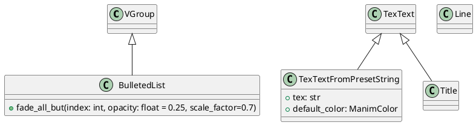
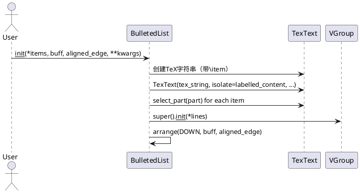
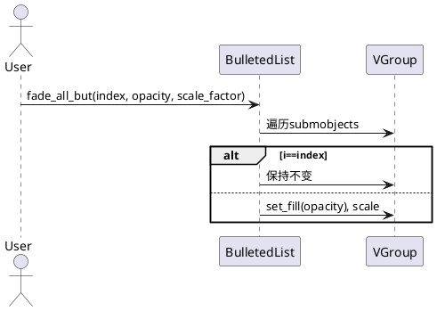
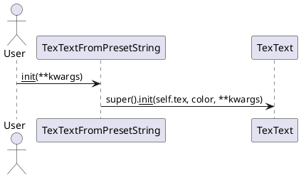
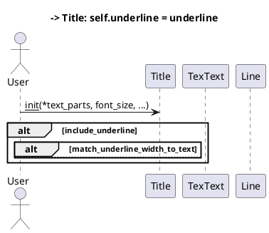

# manimlib.mobject.svg.special_tex 源码详解

## 1. 类及关键属性介绍（PlantUML类图）

本文件主要包含以下类：
- `BulletedList`
- `TexTextFromPresetString`
- `Title`

### 主要类关系与属性说明



#### 关键属性说明
- `BulletedList` 继承自 `VGroup`，用于生成带有项目符号的列表。
  - `submobjects`：每个条目对应的TeX对象。
- `TexTextFromPresetString` 继承自 `TexText`，用于从预设字符串生成TeX对象。
  - `tex`：预设的TeX字符串。
  - `default_color`：默认颜色。
- `Title` 继承自 `TexText`，用于生成带下划线的标题。
  - `underline`：下划线对象（`Line`）。

---

## 2. 关键实现方法及背后算法（PlantUML时序图）

### 2.1 BulletedList 构造与淡化流程



#### fade_all_but 方法



### 2.2 TexTextFromPresetString 构造流程



### 2.3 Title 构造与下划线流程



---

## 3. 类的使用方法（高质量代码示例）

### 3.1 BulletedList 用法
```python
from manimlib.imports import *

class BulletListDemo(Scene):
    def construct(self):
        blist = BulletedList(
            "第一条内容", "第二条内容", "第三条内容",
            buff=0.5, aligned_edge=LEFT
        )
        self.add(blist)
        self.wait(1)
        # 高亮第二项
        blist.fade_all_but(1)
        self.wait(1)
```

### 3.2 TexTextFromPresetString 用法
```python
from manimlib.mobject.svg.special_tex import TexTextFromPresetString

class MyPresetText(TexTextFromPresetString):
    tex = r"\LaTeX~is~awesome!"
    default_color = YELLOW

class PresetTextDemo(Scene):
    def construct(self):
        text = MyPresetText()
        self.add(text)
        self.wait(1)
```

### 3.3 Title 用法
```python
from manimlib.mobject.svg.special_tex import Title

class TitleDemo(Scene):
    def construct(self):
        title = Title("章节标题", font_size=80, include_underline=True)
        self.add(title)
        self.wait(1)
```

---

## 4. 总结
- `BulletedList` 适合制作带动画的项目符号列表，支持高亮与淡化。
- `TexTextFromPresetString` 便于自定义预设TeX文本类。
- `Title` 适合制作带下划线的章节标题，支持宽度自适应。
