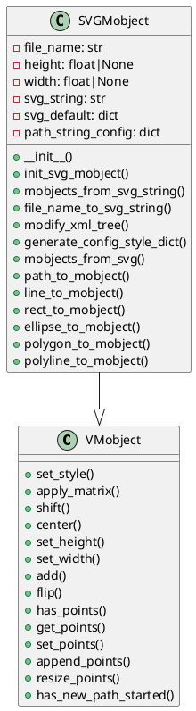
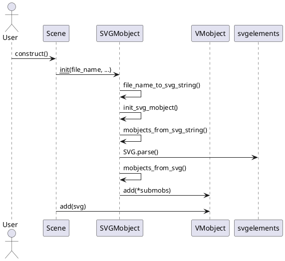

# SVGMobject 深度解析

## 1. 类说明及继承关系

SVGMobject 是 Manim 中用于将 SVG 文件解析为动画对象的核心类，继承自 VMobject。它能够将 SVG 文件中的各种图形元素（如 Path、Line、Rect、Circle、Ellipse、Polygon、Polyline 等）自动转换为 Manim 的 VMobject 子类，并支持样式、变换、缓存等机制。

### 1.1 继承关系

- SVGMobject 继承自 VMobject
- VMobject 是 Manim 中所有“可矢量化对象”的基类
- 相关的辅助类有：VMobjectFromSVGPath（SVG 路径转 VMobject）、Line、Rectangle、Circle 等

#### PlantUML 类图



---

## 2. 关键属性

- file_name: SVG 文件名
- svg_string: SVG 文件内容字符串
- height, width: 渲染时的高度和宽度
- svg_default: 默认样式配置（颜色、透明度等）
- path_string_config: 路径字符串的额外配置
- SVG_HASH_TO_MOB_MAP: SVG 哈希到子 mobject 的缓存
- PATH_TO_POINTS: 路径字符串到点集的缓存

---

## 3. 核心逻辑与方法

### 3.1 初始化流程

1. 读取 SVG 文件内容（或直接传入字符串）
2. 解析 SVG，生成 XML 树
3. 通过 svgelements 解析 SVG 元素
4. 将 SVG 元素转换为 Manim 的 VMobject 子类
5. 应用样式、变换等
6. 组合所有子 mobject，形成完整的 SVGMobject

### 3.2 核心方法

#### 1. __init__
负责 SVG 文件/字符串的读取、样式参数的处理、初始化 SVG mobject。

#### 2. init_svg_mobject
通过哈希缓存机制，避免重复解析同一 SVG。解析 SVG 字符串，生成子 mobject 并添加到自身。

#### 3. mobjects_from_svg_string
解析 SVG 字符串为 XML 树，可对 XML 树做样式修改。用 svgelements 解析为 SVG 对象，调用 mobjects_from_svg 生成 mobject 列表。

#### 4. mobjects_from_svg
遍历 SVG 元素，根据类型分别转为 Manim 的 VMobject 子类。支持 Path、Line、Rect、Circle、Ellipse、Polygon、Polyline 等。应用样式、变换。

#### 5. path_to_mobject 等
各种 SVG 元素到 VMobject 的转换。

#### 6. apply_style_to_mobject
将 SVG 元素的样式应用到 VMobject。

---

## 4. 核心方法实现算法

### 4.1 init_svg_mobject 算法

1. 计算当前 SVG 的哈希值
2. 如果缓存中有，直接复制缓存的子 mobject
3. 否则，解析 SVG 字符串，生成子 mobject，并缓存
4. 添加所有子 mobject 到自身
5. 翻转 y 轴（SVG 坐标系与 Manim 不同）

### 4.2 mobjects_from_svg_string 算法

1. 用 ElementTree 解析 SVG 字符串为 XML 树
2. 可对 XML 树做样式修改
3. 将 XML 树写入内存流
4. 用 svgelements 解析 SVG
5. 调用 mobjects_from_svg 生成 mobject 列表

### 4.3 mobjects_from_svg 算法

1. 遍历 SVG 的所有元素
2. 根据元素类型，调用不同的转换方法
3. 对于 Path，调用 path_to_mobject
4. 对于 Line、Rect、Circle、Ellipse、Polygon、Polyline，分别调用对应方法
5. 应用样式、变换
6. 返回所有生成的 mobject

---

## 5. 使用实例

```python
from manimlib.imports import *

class SVGExample(Scene):
    def construct(self):
        svg = SVGMobject("example.svg", color=BLUE, height=3)
        self.add(svg)
        self.wait(1)
```

- 只需传入 SVG 文件名（或 svg_string），即可自动解析并渲染
- 可通过 color、height、width 等参数控制样式和尺寸

---

## 6. 核心流程时序图（PlantUML）



---

## 总结

- SVGMobject 是 Manim 中用于将 SVG 文件解析为动画对象的核心类
- 支持多种 SVG 元素类型，自动转换为 Manim 的 VMobject 子类
- 支持样式、变换、缓存等机制
- 用法简单，适合直接加载 SVG 矢量图形到动画场景中


---

## 附录：SVG 文件类型说明

SVG（Scalable Vector Graphics，可缩放矢量图形）是一种基于 XML 的文本文件格式，用于描述二维矢量图形。其主要特点如下：

- **文件扩展名**：`.svg`
- **MIME 类型**：`image/svg+xml`
- **内容格式**：纯文本，采用 XML 语法描述图形（如线条、曲线、多边形、文本等）
- **可编辑性**：可以用文本编辑器直接打开和编辑，也可以用矢量图形软件（如 Inkscape、Adobe Illustrator）编辑
- **可缩放性**：无论放大还是缩小都不会失真，适合高分辨率显示和打印
- **Web 支持**：现代浏览器原生支持 SVG，可以直接在网页中嵌入和渲染

**示例：一个简单的 SVG 文件内容**

```xml
<svg width="100" height="100" xmlns="http://www.w3.org/2000/svg">
<circle cx="50" cy="50" r="40" stroke="green" fill="yellow" stroke-width="4"/>
</svg>
```

**总结**：
SVG 文件类型是“基于 XML 的矢量图形文件”，属于文本文件，扩展名为 `.svg`，MIME 类型为 `image/svg+xml`。